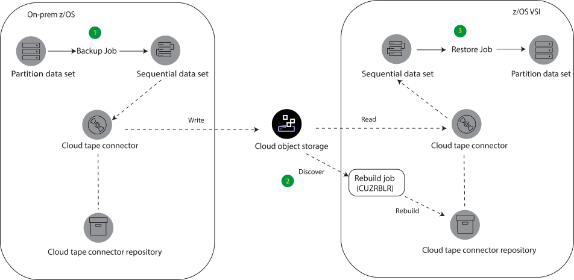

---

copyright:
  years: 2021，2021
lastupdated: "2021-09-24"

keywords: CTC，cloud tape connector, Cloud Object Storage

subcollection: hs-crypto

---

{:shortdesc: .shortdesc}
{:codeblock: .codeblock}
{:screen: .screen}
{:new_window: target="_blank"}
{:pre: .pre}
{:tip: .tip}
{:note: .note}
{:important: .important}
{:deprecated: .deprecated}
{:external: target="_blank" .external}
{:experimental: .experimental}
{:table: .aria-labeledby="caption"}
{:ui: .ph data-hd-interface='ui'}
{:cli: .ph data-hd-interface='cli'}
{:api: .ph data-hd-interface='api'}

# Bringing your own data to the z/OS virtual server instance in the cloud - Draft
{: #vsi-is-ctc}

You can back up data sets from on-prem z/OS operating system by using cloud tape connector, and then restore your data to the z/OS virtual server instance in the cloud.
{: shortdesc}

The following diagram gives you an overview of steps you need to take to bring the data set from z/OS on-prem to z/OS virtual server instance.

Working with z/OS virtual server instances on VPC is currently an experimental feature. To get access, contact your IBM Sales representative if you're interested in getting access.
{: experimental}

{: caption="Figure 1. BYOD to z/OS virtual server instance" caption-side="bottom"}

 The whole process contains the following high-level steps:
  1. Back up partition data set to the cloud tape connector on the on-prem z/OS .
  2. Synchronize cloud tape connector repositories through the Rebuild Job (CUZJRBLR). This rebuild job discovers the metadata on the Cloud Object Storage and then rebuilds the data set to the z/OS virtual server instance repository.
  3. Restore the data set on the z/OS virtual server instance.

  The following sections provide detailed instructions.

## Before you begin

Before you back up your data set, make sure to complete the following steps:

1. Create a z/OS virtual server instance in the Virtual Private Cloud (VPC) environment. Check and make sure that you can access and the instance through the 3270 connection. For more information, see [Creating virtual server instances](docs/vpc?topic=vpc-creating-virtual-servers) and [Connecting to z/OS instances](/docs/vpc?topic=vpc-vsi_is_connecting_zos).

2. Create the Cloud Object Storage. For more information, see [Creating Cloud Object Storage](/docs/cloud-object-storage?topic=cloud-object-storage-getting-started-cloud-object-storage).

3. Create the bucket to store your data sets. For more information, see [Creating buckets in Cloud Object Storage](/docs/cloud-object-storage?topic=cloud-object-storage-getting-started-cloud-object-storage#gs-create-buckets).

4. Check and make sure that you have access to the bucket level and service credential. For more information, see [Manage access](/docs/cloud-object-storage?topic=cloud-object-storage-administrators#administrators-manage-access).

5. Obtain the IP address of the Cloud Object Storage public endpoint via ping. For more information, see [Allowing public access](/docs/cloud-object-storage?topic=cloud-object-storage-iam-public-access).
[To do: What would be the correct IP address access reference]
[To do: which cloud server type to use and need confirmation: Which cloud server type to use and need confirmation https://www.ibm.com/docs/en/cloud-tape-connector/2.1?topic=options-create-cloud-server-definition]


## Step1: Back up your data sets to Cloud Object Storage

 Complete the following steps to back up your data set from z/OS to the Cloud Object Storage bucket.

1. Install the Cloud tape connector on the on-prem z/OS instance. For more information, see [Configuration Cloud tape connector](https://www.ibm.com/docs/en/cloud-tape-connector/2.1?topic=connector-configuration-summary). [To do: Whether there is any z/OS on-prem specific configurations need to notice here]

2. Prepare the partiton data set that you want to back up. For example, the partition data set name is `IBMCTCTEST.JCL`.


3. Back up z/OS on-prem data sets to Cloud Object Storage through the cloud tape connector interface by following these steps:
   1. Enter the `%CUZVP11` command to open the cloud tape connector Interactive System Productivity Facility (ISPF) interface.

   2. Select `3. Cloud datasets` and find the partition data set that you want to back up. You can also enter `b` command to browse your current data set.

   3. Update your JCL to include the following statements. This process will dump the partition data sets into sequential data sets and pack the data sets to the z/OS cloud tape connector with specified destination name. [To do: Not sure whether the DUMPTRS.JCL is the only solution https://www.ibm.com/docs/en/cloud-tape-connector/2.1?topic=interface-staging-options Here is the link for CTC menu ]

    ```
    // DUMP DATASET(INCLUDE(IBMCTCTEST.JCL))
    ...
    // TERSE EXEC PGM=TRSMAIN.PARM='PACK',COND = (0.NE)
    ...
    // SYSUT2 DO DSN=IBMCTCTEST.JCL.TERSE,
    ...
    ```
    {: screen}

    where:
    * `IBMCTCTEST.JCL`: The partition data set you selected to dump.
    * `IBMCTCTEST.JCL.TERSE` The destination data set name of the Cloud Object Storage.


   4. To submit the back up job, enter the `SUBMIT` command.

   5. Verify that the sequential data set has been created via the ISPF (3.4). If you enter `IBMCTCTEST.JCL` next to the Dsname Level, the target data set `IBMCTCTEST.JCL.TERSE` is also available.

4. Verify the data set in the Cloud Object Storage in either of the following approaches:

   * On ISPF: enter the `%CUZVP11` command to open the cloud tape connector interface and select `3. Cloud Datasets`, the data set is backed up in the cloud tape connector. The cloud data set name is the same as in the Cloud Object Storage.
   The following example shows the display on the screen. The data set `IBMCTCTEST.JCL.TERSE` is copied to the Cloud Object Storage with the staging alias `CUZSTAGE.DUMPTRS.JOBXXXX.SYSUT2.XXXXXXXX`.
    ```
    Dataset Name                 Backup Timestamp        Cloud Dataset name
    IBMCTCTEST.JCL.TERSE         XXXXX              CUZSTAGE.DUMPTRS.JOBXXXX.SYSUT2.XXXXXXXX
    ```
    {: screen}

   * On the object storage resource instance, enter the bucket and you will find repository records of the data set. For more information, see [Repository records](https://www.ibm.com/docs/en/cloud-tape-connector/2.1?topic=repository-records).


## Step2: Synchronize cloud tape connector repositories

You need to run the Rebuild job (CUZJRBLR) on the z/OS VSI, so that the cloud tape connector on the z/OS VSI can discover data sets in Cloud Object Storage backed up from the previous step.
1. Connect the Cloud Object Storage to the z/OS virtual server instance. Check the cloud server status on ISPF (2) and confirm the same repository.

2. Discover the Rebuild Job through ISPF. On the ISPF, enter `IBMUSER.JCL` on the Dsname level line to discover the data sets and enter `b` to browse the `CUZJRBLR` rebuild job. To submit the job, enter the `SUBMIT` command in the command line.


## Step3: Restore data to the z/OS virtual server instance

Complete the following steps to restore your data set in the z/OS virtual server instance.

1.  In the cloud tape connector interface, select the ISPF `3. Cloud datasets` and find the sequential data set `IBMCTCTEST.JCL.TERSE`. Then, enter `R` command to restore the data sets.

2.  Delete the bucket name from the `Restore to Alias` line, and change `Restore Dataset` to be `Y`.

3.  Update the data set you want to restore in the `IBMUSER.JCL` with the following statement. This process unpacks the sequential data set and restore it to the z/OS virtual server instance.
    ```
    ...
    //UNTERSE EXEC PGM = TRSMAIN,PARM='UNPACK'
    //INFILE DD DISP=SHR,DSN=IBMCTCTEST.JCL.TERSE
    ...
    //RESTORE EXEC PGM=ADRDSSU,COND = (0,NE)
    ```
    {: screen}

    In the statement, `IBMCTCTEST.JCL.TERSE` is the destination data set name to the z/OS virtual server instances.

4. To submit the restoring job, enter the `SUBMIT` command.

5. To Verify the partition data set in the  z/OS virtual server instance, open the cloud tape connector interface and enter the `IBMCTCTEST.JCL` command on the Dsname level. Then you can find both sequential data set (`IBMCTCTEST.JCL.TERSE`) and partition data set (`IBMCTCTEST.JCL`) in the virtual server instance.

You have successfully moved your own data from the on-prem z/OS operating system to the z/OS virtual server instance in the cloud.
