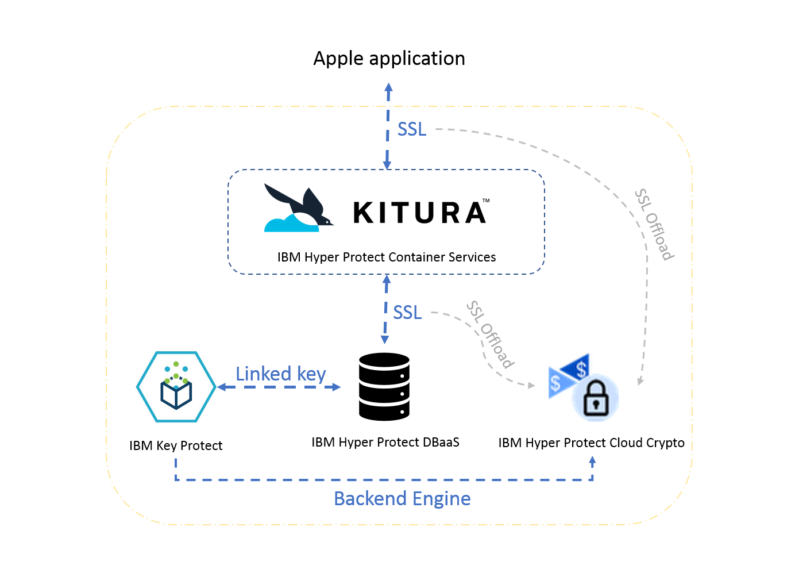

---

copyright:
  years: 2018
lastupdated: "2018-03-16"

---

{:new_window: target="_blank"}
{:shortdesc: .shortdesc}
{:screen: .screen}
{:codeblock: .codeblock}
{:pre: .pre}

# Protecting your Apple application

***Need to verify whether this is still a validate topic***

> _**Disclaimer: At the current stage, {{site.data.keyword.hscrypto}} provides only self-signed certificates.**_

You can use {{site.data.keyword.cloud_notm}} {{site.data.keyword.hscrypto}} to protect your Apple applications.
{:shortdesc}

{{site.data.keyword.cloud_notm}} {{site.data.keyword.hsplatform}} offers Apple development starter kits, which integrate {{site.data.keyword.hscrypto}}, as well as {{site.data.keyword.keymanagementservicefull_notm}}, {{site.data.keyword.cloud_notm}} {{site.data.keyword.hscontainers}}, and {{site.data.keyword.cloud_notm}} Hyper Protect DBaaS. The starter kits provide you the Swift development language, the Kitura framework, and the Mobile Backend as a Service (MBaaS) and ackend for frontend (BFF) architecture pattern. For more information about the starter kits, see [Getting started with {{site.data.keyword.cloud_notm}} {{site.data.keyword.hsplatform}} ](https://console.bluemix.net/docs/services/hypersecure-platform/index.html){:new_window}.

*Figure 1. Protecting data in Apple applications*
