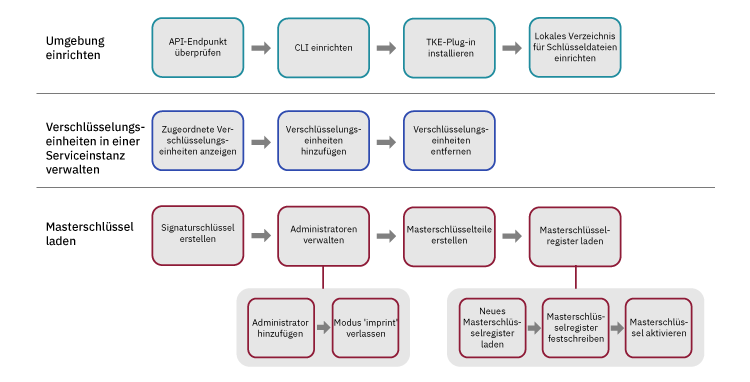

---

copyright:
  years: 2018, 2019
lastupdated: "2019-03-21"

Keywords: key storage, HSM, hardware security module

subcollection: hs-crypto

---

{:new_window: target="_blank"}
{:shortdesc: .shortdesc}
{:screen: .screen}
{:codeblock: .codeblock}
{:pre: .pre}
{:important: .important}
{:tip: .tip}

# Serviceinstanzen initialisieren
{: #initialize-hsm}

Vor der Verwendung der {{site.data.keyword.hscrypto}}-Instanz (kurz: Serviceinstanz) müssen Sie mithilfe des Plug-ins "Trusted Key Entry" Masterschlüsselregister laden.
{:shortdesc}

Zum Initialisieren von Serviceinstanzen müssen Sie den Masterschlüssel mit dem Plug-in "Trusted Key Entry" in Ihren Schlüsselspeicher und die Serviceinstanz laden. Mit dem Plug-in "Trusted Key Entry" können Sie die Masterschlüsselwerte laden. 

Eine Einführung in die Initialisierung der Serviceinstanz und andere Konzepte finden Sie unter [Einführung in die Initialisierung der Serviceinstanz](/docs/services/hs-crypto/service_instance_concepts.html#introduce-service). 

Das folgende Diagramm enthält eine Übersicht über die Schritte, die Sie ausführen müssen, um die Serviceinstanz zu initialisieren. Klicken Sie auf jeden Schritt im Diagramm, um detaillierte Anweisungen zu erhalten. 


<map name="home_map1" id="home_map1">
<area href="/docs/services/hs-crypto?topic=hs-crypto-initialize-hsm#initialize-crypto-prerequisites" alt="API-Endpunkt überprüfen" title="API-Endpunkt überprüfen" shape="rect" coords="151, 20, 241, 78" />
<area href="/docs/services/hs-crypto?topic=hs-crypto-initialize-hsm#initialize-crypto-prerequisites" alt="CLI einrichten" title="CLI einrichten" shape="rect" coords="276, 20, 365, 78" />
<area href="/docs/services/hs-crypto?topic=hs-crypto-initialize-hsm#initialize-crypto-prerequisites4" alt="TKE-Plug-in installieren" title="TKE-Plug-in installieren" shape="rect" coords="401, 20, 493, 78" />
<area href="/docs/services/hs-crypto?topic=hs-crypto-initialize-hsm#initialize-crypto-prerequisites4" alt="Lokales Verzeichnis für Schlüsseldateien einrichten" title="Lokales Verzeichnis für Schlüsseldateien einrichten" shape="rect" coords="528, 20, 619, 78" />

<area href="/docs/services/hs-crypto?topic=hs-crypto-initialize-hsm#Identify_crypto_units" alt="Zugeordnete Verschlüsselungseinheiten anzeigen" title="Zugeordnete Verschlüsselungseinheiten anzeigen" shape="rect" coords="148, 111, 241, 171" />
<area href="/docs/services/hs-crypto?topic=hs-crypto-initialize-hsm#Identify_crypto_units1" alt="Verschlüsselungseinheiten hinzufügen" title="Verschlüsselungseinheiten hinzufügen" shape="rect" coords="276, 111, 366, 171" />
<area href="/docs/services/hs-crypto?topic=hs-crypto-initialize-hsm#Identify_crypto_units2" alt="Verschlüsselungseinheiten entfernen" title="Verschlüsselungseinheiten entfernen" shape="rect" coords="402, 111, 493, 171" />

<area href="/docs/services/hs-crypto?topic=hs-crypto-initialize-hsm#step1-create-signature-keys" alt="Mindestens einen Signaturschlüssel erstellen" title="Signaturschlüssel erstellen" shape="rect" coords="149, 206, 242, 264" />
<area href="/docs/services/hs-crypto?topic=hs-crypto-initialize-hsm#step2-load-admin" alt="Administratoren für Verschlüsselungseinheiten verwalten" title="Administratoren für Verschlüsselungseinheiten verwalten" shape="rect" coords="281, 206, 366, 264" />
<area href="/docs/services/hs-crypto?topic=hs-crypto-initialize-hsm#step2-load-admin" alt="Mindestens einen Administrator der Zielverschlüsselungseinheit hinzufügen" title="Administratoren für Verschlüsselungseinheiten hinzufügen" shape="rect" coords="242, 296, 312, 358" />
<area href="/docs/services/hs-crypto?topic=hs-crypto-initialize-hsm#step3-exit-imprint-mode" alt="Modus 'imprint' auf der Zielverschlüsselungseinheit verlassen" title="Modus 'imprint' verlassen" shape="rect" coords="328, 301, 396, 359" />
<area href="/docs/services/hs-crypto?topic=hs-crypto-initialize-hsm#step4-create-master-key" alt="Gruppe von zu verwendenden Masterschlüsselteilen erstellen" title="Masterschlüsselteile erstellen" shape="rect" coords="401, 208, 493, 266" />
<area href="/docs/services/hs-crypto?topic=hs-crypto-initialize-hsm#step5-load-master-key" alt="Masterschlüsselregister laden" title="Masterschlüsselregister laden" shape="rect" coords="525, 207, 620, 264" />
<area href="/docs/services/hs-crypto?topic=hs-crypto-initialize-hsm#step5-load-master-key" alt="Neue Masterschlüsselregister laden" title="Neues Masterschlüsselregister laden" shape="rect" coords="455, 297, 525, 358" />
<area href="/docs/services/hs-crypto?topic=hs-crypto-initialize-hsm#step6-commit-master-key" alt="Neues Masterschlüsselregister festschreiben" title="Neues Masterschlüsselregister festschreiben" shape="rect" coords="539, 297, 610, 358" />
<area href="/docs/services/hs-crypto?topic=hs-crypto-initialize-hsm#step7-activate-master-key" alt="Masterschlüssel aktivieren" title="Masterschlüsselregister aktivieren" shape="rect" coords="619, 297, 689, 358" />
</map>

*Abbildung 1. Aufgabenablauf bei der Serviceinstanzinitialisierung*

Es kann 20 bis 30 Minuten dauern, bis Sie diese Task abgeschlossen haben.

## Vorbereitungen
{: #initialize-crypto-prerequisites}

1. Führen Sie den folgenden Befehl aus, um sicherzustellen, dass Sie beim korrekten API-Endpunkt angemeldet sind: 

  ```
  ibmcloud api https://api.ng.bluemix.net
  ```
  {: pre}

2. installieren Sie das {{site.data.keyword.keymanagementservicefull}}-Plug-in. Eine ausführliche Beschreibung der Schritte finden Sie unter [CLI einrichten](/docs/services/hs-crypto/set-up-cli.html). Wenn Sie sich bei der [{{site.data.keyword.cloud_notm}}-CLI](/docs/cli/index.html#overview) anmelden, werden Sie bei Verfügbarkeit von Aktualisierungen benachrichtigt. Stellen Sie sicher, dass sich das {{site.data.keyword.keymanagementservicefull}}-Plug-in stets auf dem neuesten Stand befindet, damit Sie die Befehle und Flags nutzen können, die für das CLI-Plug-in "Trusted Key Entry" verfügbar sind.
{: #initialize-crypto-prerequisites2}

3. Installieren Sie mit dem folgenden Befehl die neueste Version des Plug-ins "Trusted Key Entry":
{: #initialize-crypto-prerequisites3}

  ```
  ibmcloud plugin install tke
  ```
  {: pre}

  **Wichtig:** Wenn Sie die Betainstanz von {{site.data.keyword.hscrypto}} verwenden, führen Sie den Befehl 'ibmcloud plugin install tke -v 0.0.4' aus, um die neueste Betaversion des Plug-ins "Trusted Key Entry" zu erhalten. Installieren Sie keine späteren Versionen des Plug-ins "Trusted Key Entry". 

4. Definieren Sie die Umgebungsvariable CLOUDTKEFILES auf Ihrer Workstation. Geben Sie ein Verzeichnis an, in dem Masterschlüsselteildateien und Signaturschlüsselteildateien erstellt und gespeichert werden sollen. Erstellen Sie das Verzeichnis, falls es noch nicht vorhanden ist.
{: #initialize-crypto-prerequisites4}

  * Unter Linux oder MacOS fügen Sie der Datei `.bash_profile` die folgende Zeile hinzu:
     ```
     export CLOUDTKEFILES=<Pfad>
     ```
     {: pre}
     Für *Pfad* können Sie beispielsweise `/Users/tke-files` angeben. 
  * Unter Windows geben Sie in der **Systemsteuerung** in das Suchfeld `Umgebungsvariable` ein, um das Fenster für Umgebungsvariablen zu finden. Erstellen Sie eine Umgebungsvariable CLOUDTKEFILES und setzen Sie den Wert auf den Pfad zu den Schlüsseldateien. Beispiel: `C:\users\tke-files`. 

## Einem Benutzerkonto zugeordnete Verschlüsselungseinheiten hinzufügen oder entfernen
{: #Identify_crypto_units}

Einem {{site.data.keyword.cloud_notm}}-Benutzerkonto zugeordnete Verschlüsselungseinheiten befinden sich in einer Gruppe, die als *Serviceinstanz* bezeichnet wird. Eine Serviceinstanz kann bis zu sechs Verschlüsselungseinheiten haben. Alle Verschlüsselungseinheiten in einer Serviceinstanz sollten gleich konfiguriert sein. Wenn auf einen Teil der {{site.data.keyword.cloud_notm}} nicht zugegriffen werden kann, können die Verschlüsselungseinheiten in einer Serviceinstanz für den Lastausgleich und die Verfügbarkeit austauschbar verwendet werden. 

Die einem {{site.data.keyword.cloud_notm}}-Benutzer zugeordneten Verschlüsselungseinheiten befinden sich zu Anfang in einem bereinigten Status, der als *Modus 'imprint'* bezeichnet wird. 

Die Masterschlüsselregister in allen Verschlüsselungseinheiten in einer einzigen Serviceinstanz müssen die gleichen Einstellungen haben. Die gleiche Gruppe von Administratoren muss allen Verschlüsselungseinheiten hinzugefügt werden und alle Verschlüsselungseinheiten müssen den Modus 'imprint' gleichzeitig verlassen. 

* Verwenden Sie den folgenden Befehl, um die Serviceinstanzen und Verschlüsselungseinheiten anzuzeigen, die einem Benutzerkonto zugeordnet sind:
  {: #Identify_crypto_units1}
  ```
  ibmcloud tke cryptounits
  ```
  {: pre}

  Im Folgenden sehen Sie eine Beispiel für die Ausgabe, die angezeigt wird. In der Spalte SELECTED in der Ausgabetabelle sind die Verschlüsselungseinheiten angegeben, die das Ziel von nachfolgenden, über das Plug-in "Trusted Key Entry" ausgegebenen Verwaltungsbefehlen sind. 

  ```
  SERVICE INSTANCE: 482cf2ce-a06c-4265-9819-0b4acf54f2ba
  CRYPTO UNIT NUM   SELECTED   LOCATION
  1                 true       [us-south].[AZ3-CS3].[02].[03]
  2                 true       [us-south].[AZ2-CS2].[02].[03]

  SERVICE INSTANCE: 96fe3f8d-9792-45bc-a9fb-2594222deaf2
  CRYPTO UNIT NUM   SELECTED   LOCATION
  3                 true       [us-south].[AZ1-CS4].[00].[03]
  4                 true       [us-south].[AZ2-CS5].[03].[03]
  ```
  {: screen}

* Verwenden Sie den folgenden Befehl, um der Liste der ausgewählten Verschlüsselungseinheiten weitere Verschlüsselungseinheiten hinzuzufügen:
  {: #Identify_crypto_units2}
  ```
  ibmcloud tke cryptounit-add
  ```
  {: pre}

  Es wird eine Liste der Verschlüsselungseinheiten angezeigt, die dem aktuellen Benutzerkonto zugeordnet sind. Geben Sie bei entsprechender Aufforderung eine Liste der Verschlüsselungseinheitennummern ein, die der Liste der ausgewählten Verschlüsselungseinheiten hinzugefügt werden sollen. 

* Verwenden Sie den folgenden Befehl, um Verschlüsselungseinheiten aus der Liste der ausgewählten Verschlüsselungseinheiten zu entfernen:
  {: #Identify_crypto_units3}
  ```
  ibmcloud tke cryptounit-rm
  ```
  {: pre}

  Es wird eine Liste der Verschlüsselungseinheiten angezeigt, die dem aktuellen Benutzerkonto zugeordnet sind. Geben Sie bei entsprechender Aufforderung eine Liste der Verschlüsselungseinheitennummern ein, die aus der Liste der ausgewählten Verschlüsselungseinheiten entfernt werden sollen. 

  **Tipp:** Im Allgemeinen werden entweder alle Verschlüsselungseinheiten oder keine der Verschlüsselungseinheiten in einer Serviceinstanz ausgewählt. Dadurch werden durch nachfolgende Verwaltungsbefehle alle Verschlüsselungseinheiten einer Serviceinstanz konsistent aktualisiert. Wenn die Verschlüsselungseinheiten einer Serviceinstanz jedoch eine unterschiedliche Konfiguration aufweisen, müssen Sie die Verschlüsselungseinheiten einzeln auswählen und bearbeiten, um eine konsistente Konfiguration für alle Verschlüsselungseinheiten in einer Serviceinstanz wiederherzustellen. 

  Mit dem folgenden Befehl können Sie die Konfigurationseinstellungen der ausgewählten Verschlüsselungseinheiten vergleichen: 
  ```
  ibmcloud tke cryptounit-compare
  ```
  {: pre}

## Masterschlüssel laden
{: #load-master-keys}

<!-- A service instance is implemented as one or more crypto units on IBM cryptographic coprocessors. -->

Bevor das neue Masterschlüsselregister geladen werden kann, müssen Sie den Zielverschlüsselungseinheiten mindestens einen Administrator hinzufügen und den Modus 'imprint' verlassen. 

Führen Sie die folgenden Tasks mit dem {{site.data.keyword.cloud_notm}}-CLI-Plug-in aus, um das neue Masterschlüsselregister zu laden:

### Schritt 1: Mindestens einen Signaturschlüssel generieren
{: #step1-create-signature-keys}

Zum Laden des neuen Masterschlüsselregisters muss ein Administrator für Verschlüsselungseinheiten den Befehl mit einem eindeutigen Signaturschlüssel signieren. Der erste Schritt besteht in der Erstellung mindestens einer Signaturschlüsseldatei, die auf Ihrer Workstation Signaturschlüssel enthält. <!-- The private part of the signature key file is used to create signatures. The public part is placed in a certificate that is installed in a target crypto unit to define a crypto unit administrator. -->

**Wichtig**: Aus Sicherheitsgründen kann der Signaturschlüsseleigner eine andere Person sein als die Eigner der Masterschlüsselteile. Der Signaturschlüsseleigner sollte die einzige Person sein, die das Kennwort kennt, das der Signaturschlüsseldatei zugeordnet ist.

* Verwenden Sie den folgenden Befehl, um die auf der Workstation vorhandenen Signaturschlüssel anzuzeigen: 
  ```
  ibmcloud tke sigkeys
  ```
  {: pre}

* Verwenden Sie den folgenden Befehl, um einen neuen Signaturschlüssel auf der Workstation zu erstellen und zu speichern: 
  ```
  ibmcloud tke sigkey-add
  ```
  {: pre}

  Geben Sie bei entsprechender Aufforderung einen Administratornamen und ein Kennwort zum Schutz der Signaturschlüsseldatei ein. Das Kennwort müssen Sie sich merken. Wenn das Kennwort verloren geht, kann der Signaturschlüssel nicht verwendet werden.

* Verwenden Sie den folgenden Befehl, um den Administrator auszuwählen, der künftige Befehle signiert: 
  ```
  ibmcloud tke sigkey-sel
  ```
  {: pre}

  Es wird eine Liste der Signaturschlüsseldateien angezeigt, die auf der Workstation gefunden wurden. Geben Sie bei entsprechender Aufforderung die Schlüsselnummer der Signaturschlüsseldatei ein, die für das Signieren von nachfolgenden Verwaltungsbefehlen ausgewählt werden soll. <!--If a signature key file is already selected for signing administrative commands, this is indicated when the list of signature key files is displayed. -->

  <!-- **Tip**: Before you run the `cryptounit-exit-impr` command to exit imprint mode, the command needs to be signed by a crypto unit administrator using the signature key. After the crypto unit exits imprint mode, all commands to the crypto unit must be signed. -->

### Schritt 2: Mindestens einen Administrator der Zielverschlüsselungseinheit hinzufügen
{: #step2-load-admin}

<!-- After a crypto unit exits imprint mode, all administrative commands sent to the crypto unit must be signed by an administrator that is added to the crypto unit. -->

* Verwenden Sie den folgenden Befehl, um die vorhandenen Administratoren für eine Verschlüsselungseinheit anzuzeigen: 
  ```
  ibmcloud tke cryptounit-admins
  ```
  {: pre}

* Verwenden Sie den folgenden Befehl, um einen neuen Administrator hinzuzufügen: 
  ```
  ibmcloud tke cryptounit-admin-add
  ```
  {: pre}

  Es wird eine Liste der Signaturschlüsseldateien angezeigt, die auf der Workstation gefunden wurden. 

  Wählen Sie bei entsprechender Aufforderung die Signaturschlüsseldatei aus, die dem hinzuzufügenden Administrator für Verschlüsselungseinheiten zugeordnet ist. Geben Sie anschließend das Kennwort für die ausgewählte Signaturschlüsseldatei ein.

  Sie können den Befehl bei Bedarf wiederholen, um weitere Administratoren für Verschlüsselungseinheiten hinzuzufügen. Jeder Administrator kann Befehle in der Verschlüsselungseinheit unabhängig ausführen. 

  Im Modus 'imprint' muss der Befehl zum Hinzufügen eines Administrators für Verschlüsselungseinheiten nicht signiert werden. Nach dem Verlassen des Modus 'imprint' muss der Befehl zum Hinzufügen von Administratoren für Verschlüsselungseinheiten von einem Administrator für Verschlüsselungseinheiten signiert werden, der der Verschlüsselungseinheit bereits hinzugefügt wurde. 

### Schritt 3: Modus 'imprint' für die Zielverschlüsselungseinheit verlassen
{: #step3-exit-imprint-mode}

Eine Verschlüsselungseinheit im Modus 'imprint' wird als nicht sicher angesehen. Die meisten Verwaltungsbefehle, wie z. B. das Laden des neuen Masterschlüsselregisters, können nicht im Modus 'imprint' ausgeführt werden.

Verwenden Sie den folgenden Befehl, um den Modus 'imprint' zu verlassen, nachdem Sie mindestens einen Administrator für Verschlüsselungseinheiten hinzugefügt haben: 

  ```
  ibmcloud tke cryptounit-exit-impr
  ```
  {: pre}

  ** Wichtig:** Der Befehl zum Verlassen des Modus 'imprint' muss von einem der hinzugefügten Administratoren für Verschlüsselungseinheiten mit dem Signaturschlüssel signiert sein. Nachdem die Verschlüsselungseinheit den Modus 'imprint' verlassen hat, müssen alle an die Verschlüsselungseinheit ausgegebenen Befehle signiert werden. 

### Schritt 4: Gruppe von zu verwendenden Masterschlüsselteilen erstellen
{: #step4-create-master-key}

Jeder Masterschlüsselteil wird in einer kennwortgeschützten Datei auf der Workstation gespeichert. 

**Wichtig**: Sie müssen mindestens zwei Masterschlüsselteile erstellen. Aus Sicherheitsgründen können drei Masterschlüsselteile verwendet werden und jeder Schlüsselteil kann eine andere Person zum Eigner haben. Der Eigner des Schlüsselteils sollte die einzige Person sein, die das Kennwort kennt, das der Schlüsselteildatei zugeordnet ist.

* Verwenden Sie den folgenden Befehl, um die auf der Workstation vorhandenen Masterschlüsselteile anzuzeigen: 
  ```
  ibmcloud tke mks
  ```
  {: pre}

* Verwenden Sie den folgenden Befehl, um einen zufälligen Masterschlüsselteil auf der Workstation zu erstellen und zu speichern: 
  ```
  ibmcloud tke mk-add --random
  ```
  {: pre}

  Geben Sie bei entsprechender Aufforderung eine Beschreibung für den Schlüsselteil und ein Kennwort zum Schutz der Schlüsselteildatei ein. Das Kennwort müssen Sie sich merken. Wenn das Kennwort verloren geht, können Sie den Schlüsselteil nicht verwenden.

* Verwenden Sie den folgenden Befehl, um einen bekannten Wert für den Schlüsselteil einzugeben und in einer Datei auf der Workstation zu speichern: 
  ```
  ibmcloud tke mk-add --value
  ```
  {: pre}

  Geben Sie bei entsprechender Aufforderung den Wert für den Schlüsselteil als hexadezimale Zeichenfolge für den 32-Byte-Schlüsselteil ein. Geben Sie anschließend eine Beschreibung für den Schlüsselteil und ein Kennwort zum Schutz der Schlüsselteildatei ein.

### Schritt 5: Neues Masterschlüsselregister laden
{: #step5-load-master-key}

**Wichtig**: Zum Laden eines Masterschlüsselregisters müssen alle Masterschlüsselteildateien und die Signaturschlüsseldatei auf derselben Workstation vorhanden sein. Wenn die Dateien auf separaten Workstations erstellt wurden, müssen Sie sicherstellen, dass die Dateinamen unterschiedlich sind, um Kollisionen zu vermeiden. Die Eigner der Masterschlüsselteildateien und der Eigner der Signaturschlüsseldatei müssen die Kennwörter für die Dateien eingeben, wenn das Masterschlüsselregister auf der gemeinsamen Workstation geladen wird. 

Informationen zum Laden des Masterschlüssels finden Sie in den detaillierten Abbildungen unter [Masterschlüsselregister](/docs/services/hs-crypto/service_instance_concepts.html#introduce-key-registers). 

Laden Sie das neue Masterschlüsselregister mit dem folgenden Befehl:
```
ibmcloud tke cryptounit-mk-load
```
{: pre}

Es wird eine Liste der Masterschlüsselteile angezeigt, die auf der Workstation gefunden wurden. 

Geben Sie bei entsprechender Aufforderung die Schlüsselteile ein, die in das neue Masterschlüsselregister geladen werden sollen. Geben Sie anschließend das Kennwort für jede ausgewählte Schlüsselteildatei ein.

### Schritt 6: Neues Masterschlüsselregister festschreiben
{: #step6-commit-master-key}

Durch das Laden des neuen Masterschlüsselregisters wird das neue Masterschlüsselregister in den Status 'voll, nicht festgeschrieben' versetzt. Bevor Sie das neue Masterschlüsselregister verwenden können, um den Schlüsselspeicher zu initialisieren oder erneut zu verschlüsseln, versetzen Sie das neue Masterschlüsselregister in den Status 'festgeschrieben'. Informationen zum Laden des Masterschlüssels finden Sie in den detaillierten Abbildungen unter [Masterschlüsselregister](/docs/services/hs-crypto/service_instance_concepts.html#introduce-key-registers). 

Schreiben Sie das neue Masterschlüsselregister mit dem folgenden Befehl fest:
```
ibmcloud tke cryptounit-mk-commit
```
{: pre}

### Schritt 7: Masterschlüssel aktivieren
{: #step7-activate-master-key}

Aktivieren Sie den Masterschlüssel durch Verschieben des Masterschlüssels in das aktuelle Masterschlüsselregister mit dem folgenden Befehl:

```
ibmcloud tke cryptounit-mk-setimm
```
{: pre}

## Weitere Schritte
{: #initialize-crypto-next}

Rufen Sie die Registerkarte **Verwalten** Ihres verwalteten {{site.data.keyword.hscrypto}}-Dashboards auf, um Rootschlüssel und Standardschlüssel zu verwalten. 

Führen Sie den folgenden Befehl in der CLI aus, um weitere Informationen zu anderen Optionen der Befehle des Plug-ins "Trusted Key Entry" aufzurufen: 

```
ibmcloud tke help
```
{: pre}

<!--
## Reference: Other Trusted Key Entry plug-in commands
{: #initialize-crypto-reference}

The following list describes the remaining commands implemented by the plug-in and discusses when they would be used.

* **ibmcloud tke mk-rm**

  This command removes a file that contains a master key part from the workstation.

  After you enter the command, a list of master key parts that are found on the workstation is displayed. When prompted, enter the key number of the key part that is to be removed.

  After a key part is removed from the local workstation, it can no longer be used.

* **ibmcloud tke sigkey-rm**

  This command removes a file that contains a signature key from the workstation.

  After you enter the command, a list of signature keys found on the workstation is displayed. When prompted, enter the key number of the signature key file that is to be removed.

  Be cautious of removing a signature key from the workstation. If any crypto units that are assigned to the user account exit imprint mode, and if the signature key being removed from the workstation is the only added administrator for the crypto unit, executing new administrative functions in the crypto unit is not possible after you remove the signature key. If no backup of the signature key file exists, the only way for recovery is to contact {{site.data.keyword.cloud_notm}} support to clear the crypto unit and place it in imprint mode.

* **ibmcloud tke cryptounit-admin-rm**

  This command removes an administrator from the selected crypto units.

  When this command is issued for a crypto unit in imprint mode, this command does not need to be signed. After the crypto unit exits imprint mode, this command must be signed by an existing crypto unit administrator.

  For a crypto unit not in imprint mode, the command fails if the administrator being removed is the last administrator defined for the crypto unit.


* **ibmcloud tke cryptounit-zeroize**

  This command clears the selected crypto units and places them back in imprint mode.  All crypto unit administrators are removed, and the new and current master key registers are cleared.

  When this command is issued for a crypto unit in imprint mode, this command does not need to be signed. After the crypto unit exits imprint mode, this command must be signed by an existing crypto unit administrator.

  When this command is issued to a group of crypto units, the current signature key must be recognized as a crypto unit administrator by all crypto units not in imprint mode in order for the command to be accepted.


* **ibmcloud tke cryptounit-mk**

  This command displays the status and verification pattern for the new and current master key registers for the selected crypto units.

* **ibmcloud tke cryptounit-mk-clrcur**

  This command clears the current master key register in the selected crypto units.

  This command cannot be executed in imprint mode.

  Clearing the current master key register makes any key storage protected by the current master key unusable.

* **ibmcloud tke cryptounit-mk-clrnew**

  This command clears the new master key register in the selected crypto units.

  This command cannot be executed in imprint mode.

* **ibmcloud tke cryptounit-mk-setimm**

  This command moves the value of the new master key register to the current master key register, and clears the new master key register in the selected crypto units.

  This command cannot be executed in imprint mode.

  This command does not initialize or re-encipher key storage and should be used only when key storage in the target LPARs is prepared to accept the new master key value. If in doubt, do not use this command, because it can cause keys in existing key storage to become unusable.

The following is a full list of plug-in commands. You can also find the commands by using the plug-in help function:
```
NAME:
   ibmcloud tke - A CLI plug-in to manage crypto module cryptounits in the IBM Cloud
USAGE:
   ibmcloud tke command [arguments...] [command options]

COMMANDS:
   mks                Lists master key parts stored on this workstation.
   mk-add             Creates and saves a new master key part.
   mk-rm              Removes a master key part from this workstation.
   sigkeys            Lists the signature keys stored on this workstation.
   sigkey-add         Generates and saves a new signature key.
   sigkey-rm          Removes a signature key from this workstation.
   sigkey-sel         Selects the signature key to use to sign commands.
   cryptounits            Displays the cryptounits for the current resource group.
   cryptounit-add         Adds cryptounits to the set of cryptounits to work with.
   cryptounit-rm          Removes cryptounits from the set of cryptounits to work with.
   cryptounit-admins      Lists administrators added in the selected cryptounits.
   cryptounit-admin-add   Add a cryptounit administrator to the selected cryptounits.
   cryptounit-admin-rm    Removes a cryptounit administrator from the selected cryptounits.
   cryptounit-compare     Compares configuration settings of the selected cryptounits.
   cryptounit-exit-impr   Exits imprint mode in the selected cryptounits.
   cryptounit-zeroize     Zeroizes the selected cryptounits.
   cryptounit-mk          Displays master key registers for the selected cryptounits.
   cryptounit-mk-clrcur   Clears the current master key register.
   cryptounit-mk-clrnew   Clears the new master key register.
   cryptounit-mk-commit   Commits the new master key register.
   cryptounit-mk-setimm   Does set immediate on the master key registers.
   cryptounit-mk-load     Loads the new master key register.
   help, h            Show help
   ```
-->
