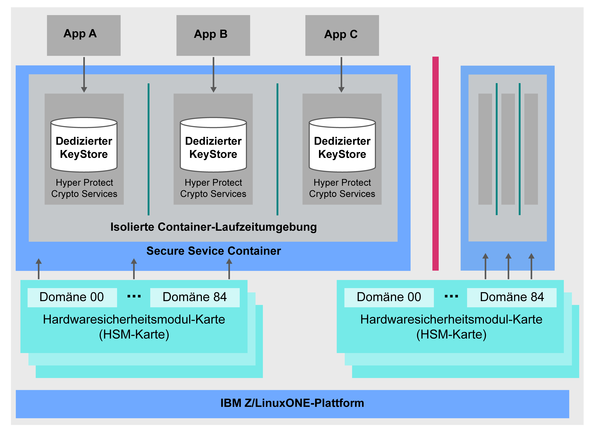

---

copyright:
  years: 2018, 2019
lastupdated: "2019-02-05"

Keywords: IBM Key, data security, Hyper Protect Crypto Services, HSM

subcollection: hs-crypto

---

{:new_window: target="_blank"}
{:shortdesc: .shortdesc}
{:screen: .screen}
{:codeblock: .codeblock}
{:pre: .pre}
{:important: .important}

# {{site.data.keyword.cloud_notm}} {{site.data.keyword.hscrypto}} - Übersicht
{: #overview}

Daten- und Informationssicherheit ist für IT-Umgebungen von entscheidender Bedeutung und unerlässlich. Angesichts immer größerer Datenverschiebungen in die Cloud gestaltet sich der Schutz der Daten als komplexe Herausforderung.  {{site.data.keyword.cloud}} {{site.data.keyword.hscrypto}} bietet Verschlüsselung mit einer Technologie, die Ihren Daten das höchste Sicherheitsniveau der Branche bietet.
{: shortdesc}

## Warum {{site.data.keyword.cloud_notm}} {{site.data.keyword.hscrypto}}?

{{site.data.keyword.hscrypto}} basiert auf der IBM LinuxONE-Technologie und hilft Ihnen sicherzustellen, dass nur Sie Zugriff auf Ihre Schlüssel haben. Mit einem Single-Tenant-Service für Schlüsselverwaltung einschließlich Schlüsselaufbewahrung in dedizierten, vom Kunden gesteuerten HSMs können Sie auf einfache Weise Verschlüsselungsschlüssel erstellen. Alternativ können Sie eigene Verschlüsselungsschlüssel verwalten. Das verwaltete Cloud-HSM unterstützt Branchenstandards, <!-- such as PKCS #11,--> sodass Ihre Anwendungen Verschlüsselungsoperationen wie digitale Unterzeichnung und Validierung enthalten können. 

<!-- via PKCS#11 application programming interfaces (APIs). You can access {{site.data.keyword.hscrypto}} with several popular programming languages such as Java, JavaScript, and Swift. -->

{{site.data.keyword.hscrypto}} ist die Verschlüsselung, mit der {{site.data.keyword.blockchainfull_notm}} Platform aufgebaut ist. Dieser Verschlüsselungsmechanismus stellt sicher, dass das Blockchain-Netz in einer stark geschützten und isolierten Umgebung ausgeführt wird, und beschleunigt Hashing, Signier-/Verifizier-Operationen und die Knoten-zu-Knoten-Kommunikation im Netz. Der Erfolg von {{site.data.keyword.blockchainfull_notm}} Platform belegt die Funktionalität und den Wert von {{site.data.keyword.hscrypto}}.

## Wie funktioniert {{site.data.keyword.hscrypto}}?
{: #architecture}

Das folgende Architekturdiagramm zeigt die Funktionsweise von {{site.data.keyword.hscrypto}}.

*Abbildung 1. {{site.data.keyword.hscrypto}}-Architektur*  

Nachstehend einige besondere Merkmale der {{site.data.keyword.hscrypto}}-Architektur:

<!-- * Applications connect to {{site.data.keyword.hscrypto}} through PKCS#11 APIs. -->

- Dedizierter KeyStore in {{site.data.keyword.hscrypto}} wird bereitgestellt, um Datenisolation und Sicherheit zu gewährleisten. Privilegierte Benutzer sind zum Schutz vor missbräuchlicher Verwendung der Systemadministrator- oder Root-Benutzerberechtigungsnachweise gesperrt.  
- Secure Service Container (SSC) bietet die auf Unternehmen abgestimmte Sicherheit und Widerstandsfähigkeit, die Unternehmenskunden mittlerweile von der IBM z-Technologie erwarten.  
- Ein FIPS 140-2 Stufe 4-konformes Cloud-HSM ist für höchsten physischen Schutz von geheimen Schlüsseln aktiviert.  

## Hauptmerkmale
{: #key-features}

Folgendes sind die Hauptmerkmale von {{site.data.keyword.hscrypto}}:

### Schutz von {{site.data.keyword.cloud_notm}}-Datenservices mithilfe von Verschlüsselungsschlüsseln mit kundengesteuerten Cloud-HSMs
{: #key-feature-1}

{{site.data.keyword.hscrypto}} unterstützt Keep Your Own Keys (KYOK), sodass Sie mithilfe von Verschlüsselungsschlüsseln, die Sie beibehalten, steuern und verwalten können, mehr Kontrolle und Berechtigungen für Ihre Daten behalten. Die verfügbare Unterstützung für kundengesteuerte Cloud-Hardwaresicherheitsmodule (HSM) ermöglicht den Schutz digitaler Schlüssel gemäß den Branchenvorschriften in {{site.data.keyword.cloud_notm}} und den Zugriff nur durch den Kunden.  <! -- Das HSM stellt PKCS#11-APIs zur Verfügung, wodurch  {{site.data.keyword.hscrypto}}  auf mehrere gängige Programmiersprachen wie Java, JavaScript und Swift zugegriffen werden kann. -- > 

### FIPS 140-2 Stufe 4-zertifizierte Technologie bereitgestellt
{: #key-feature-2}

{{site.data.keyword.hscrypto}} bietet Zugriff auf die FIPS 140-2 Stufe 4-zertifizierte Technologie, das höchstmögliche Sicherheitsniveau für Verschlüsselungshardware. <!-- Industries, such as financial sector services, require this level of security to protect their data.--> Auf dieser Sicherheitsstufe stellen die physischen Sicherheitsmechanismen eine vollständige Schutzhülle um das Verschlüsselungsmodul bereit, mit der alle unbefugten Versuche des physischen Zugriffs erkannt und beantwortet werden können.

### Kein Zugriff privilegierter Benutzer auf Ihre Schlüssel und Daten
{: #key-feature-3}

{{site.data.keyword.hscrypto}} bringt einzigartige Datenschutzfunktionalität von IBM z nach {{site.data.keyword.cloud_notm}}. {{site.data.keyword.hscrypto}} bietet die auf Unternehmen abgestimmte Sicherheit und Widerstandsfähigkeit, die Unternehmenskunden mittlerweile von der IBM z-Technologie erwarten. Hardwarevirtualisierung wird verwendet, um Ihre Daten in einer isolierten Umgebung zu schützen. Auf diese Weise wird dedizierter Service für jede Serviceinstanz einzeln bereitgestellt, sodass kein externer Zugriff, auch nicht von privilegierten Benutzern wie z. B. Cloud-Administratoren, auf Ihre Daten zulässig ist. Somit wird das Risiko einer Datenbedrohung durch Insider reduziert.

### {{site.data.keyword.keymanagementservicefull_notm}}-Integration zur Sicherung von {{site.data.keyword.cloud_notm}}-Daten und -Speicherservices
{: #key-feature-4}

{{site.data.keyword.keymanagementservicefull_notm}}-APIs sind zwecks Schlüsselerstellung und -schutz in {{site.data.keyword.hscrypto}} integriert. {{site.data.keyword.hscrypto}} schützt diese Schlüssel und speichert sie in einer hoch geschützten und isolierten Umgebung in IBM z, das Ihre Daten mit einer Technologie schützt, die mit der höchsten Sicherheitsstufe der Branche zertifiziert ist.

<!-- {{site.data.keyword.hscrypto}} also leverages the **IBM Advanced Crypto Service Provider (ACSP)** solution that enables remote access to the IBM’s cryptographic coprocessors. ACSP allows for utilization of strong hardware-based cryptography as a service in distributed environments where data security cannot be guaranteed. {{site.data.keyword.hscrypto}} utilizes ACSP as a *network hardware security module (NetHSM)* that provides access to HSM via PKCS#11 standard APIs.-->

<!-- With {{site.data.keyword.hscrypto}}, your **SSL keys are offloaded** to a {{site.data.keyword.hscrypto}} to ensure security and protection of those sensitive keys.  Besides, the certificate lifecycle management gets common approach to manage certificates and offers the visibility to certificate expiration.-->

## Rollen und Zuständigkeiten
{: #roles-responsibilities}

In der folgenden Tabelle sind die Rollen aufgeführt, die von {{site.data.keyword.hscrypto}} unterstützt werden.

<table>
  <tr>
    <th>Rollen</th>
    <th>Zuständigkeiten</th>
  </tr>
  <tr>
    <td>Administrator für Verschlüsselungseinheiten</td>
    <td>
Signiert Verwaltungsbefehle, z. B. Befehle zur Installation eines weiteren Administrators für Verschlüsselungseinheiten, und stellt Signaturschlüssel bereit.
    </td>
  </tr>
  <tr>
    <td>Schlüsseleigner</td>
    <td>Stellt Masterschlüsselteile zum Initialisieren einer Serviceinstanz bereit. </td>
  </tr>
  <tr>
    <td>Servicebenutzer</td>
    <td>Speichern, Abrufen und Generieren von Rootschlüsseln und Standardschlüsseln über die Benutzerschnittstelle und die APIs.</td>
  </tr>
  <caption style="caption-side:bottom;">Tabelle 1. Rollen und Zuständigkeiten</caption>
</table>
