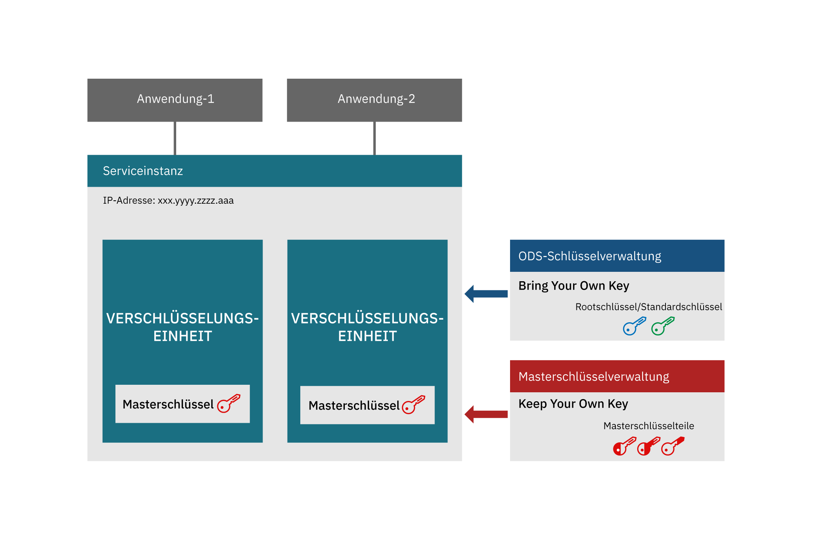
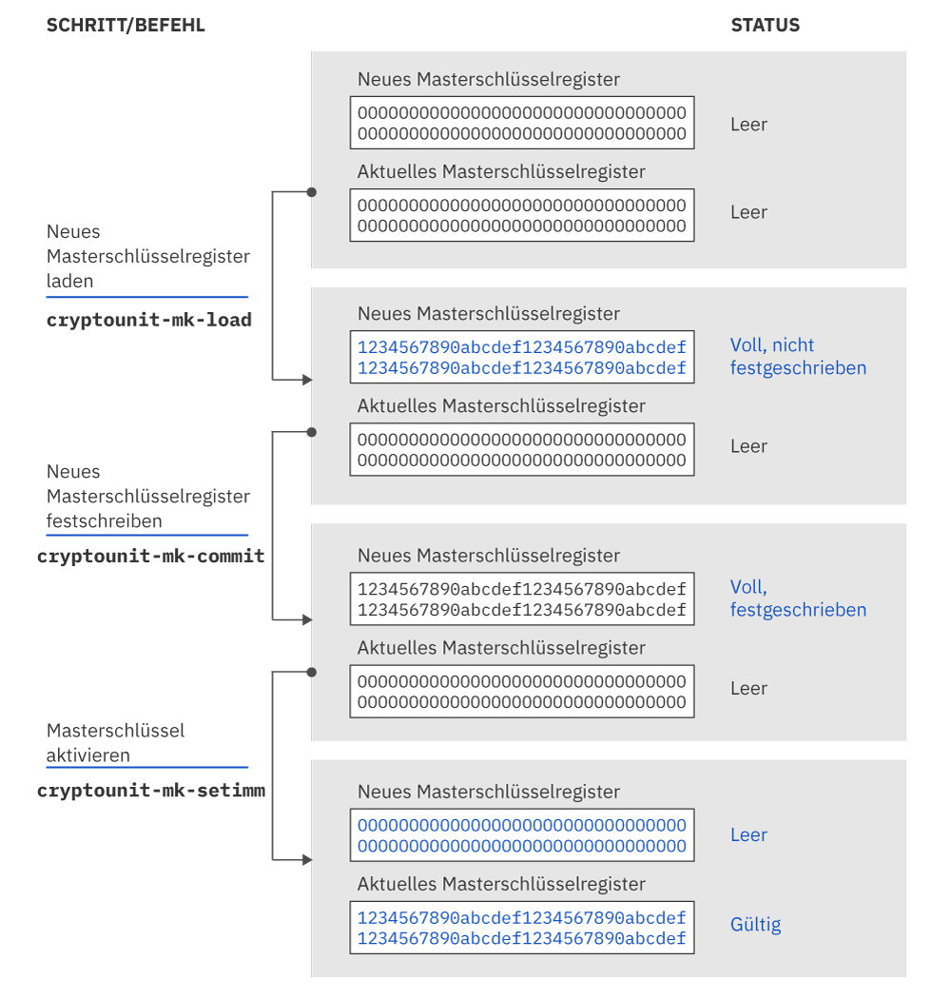

---

copyright:
  years: 2018, 2019
lastupdated: "2019-03-21"

Keywords: hsm, Trusted Key Entry plug-in, service instance, imprint mode

subcollection: hs-crypto

---

{:new_window: target="_blank"}
{:shortdesc: .shortdesc}
{:screen: .screen}
{:codeblock: .codeblock}
{:pre: .pre}
{:important: .important}

# Einführung in die Initialisierung der Serviceinstanz
{: #introduce-service}

Bevor Sie die Serviceinstanz von {{site.data.keyword.hscrypto}} initialisieren, empfiehlt es sich, dass Sie sich zunächst mit den grundlegenden Konzepten und der Prozesslogik vertraut machen.   
{:shortdesc}

Eine {{site.data.keyword.hscrypto}}-Instanz (kurz: Serviceinstanz) ist eine Gruppe von Verschlüsselungseinheiten, die einem IBM Cloud-Benutzerkonto zugeordnet sind. Eine Serviceinstanz kann bis zu sechs Verschlüsselungseinheiten haben. Wenn Sie eine Produktionsumgebung einrichten, empfehlen wir, für hohe Verfügbarkeit mindestens zwei Verschlüsselungseinheiten pro Serviceinstanz zuzuordnen. Die Verschlüsselungseinheiten sollten sich auf verschiedenen physischen Hardwaresicherheitsmodulen (HSMs) befinden. Alle Verschlüsselungseinheiten in einer Serviceinstanz sollten gleich konfiguriert sein. Wenn auf einen Teil der IBM Cloud nicht zugegriffen werden kann, können die Verschlüsselungseinheiten in einer Serviceinstanz austauschbar verwendet werden. Verschlüsselungseinheiten enthalten Masterschlüssel, mit denen der Inhalt eines Schlüsselspeichers verschlüsselt wird. Mit der Technologie "Keep You Own Keys" sind die Serviceinstanzadministratoren die einzigen Personen, die auf den Masterschlüssel zugreifen können. 

Das folgende Diagramm zeigt eine Serviceinstanz mit zwei Verschlüsselungseinheiten. 

*Abbildung 1. Serviceinstanzkomponenten*

## Hardwaresicherheitsmodul
{: #introduce-HSM}

Das Hardwaresicherheitsmodul (HSM) ist eine physische Einheit, die digitale Schlüssel für starke Authentifizierung schützt und verwaltet und die Verschlüsselungsverarbeitung bereitstellt. HSMs von {{site.data.keyword.cloud_notm}} {{site.data.keyword.hscrypto}} sind mit FIPS 140-2 Level 4 zertifiziert. Dies ist das höchstmögliche Sicherheitsniveau für Verschlüsselungshardware. Auf dieser Sicherheitsstufe stellen die physischen Sicherheitsmechanismen eine vollständige Schutzhülle um das Verschlüsselungsmodul bereit, mit der alle unbefugten Versuche des physischen Zugriffs erkannt und beantwortet werden können.

## Verschlüsselungseinheit
{: #introduce-crypto-unit}

Eine Verschlüsselungseinheit ist eine einzelne Einheit, die ein HSM und den entsprechenden für das HSM dedizierten Software-Stack darstellt. Jede Verschlüsselungseinheit kann bis zu 5000 digitale Schlüssel verwalten. Eine Serviceinstanz kann bis zu sechs Verschlüsselungseinheiten haben. Wenn Sie eine Produktionsumgebung einrichten, empfehlen wir, für hohe Verfügbarkeit mindestens zwei Verschlüsselungseinheiten pro Serviceinstanz zuzuordnen. Alle Verschlüsselungseinheiten in einer Serviceinstanz sollten gleich konfiguriert sein. Wenn auf einen Teil der IBM Cloud nicht zugegriffen werden kann, können die Verschlüsselungseinheiten in einer Serviceinstanz austauschbar verwendet werden. 

## Plug-in "Trusted Key Entry"
{: #introduce-TKE}

Mit dem Plug-in "Trusted Key Entry" können Sie die Masterschlüsselregister der Serviceinstanzen mit Werten in Ihr {{site.data.keyword.cloud}}-Benutzerkonto laden, die Sie auswählen und steuern. Das Plug-in "Trusted Key Entry" stellt eine Reihe von Funktionen für die Verwaltung von Verschlüsselungseinheiten zur Verfügung, die einem {{site.data.keyword.cloud_notm}}-Benutzerkonto zugeordnet sind. Das Plug-in ermöglicht Ihnen das Laden Ihrer Masterschlüsselwerte.

## Administratoren
{: #introduce-administrators}

Administratoren können den Zielverschlüsselungseinheiten für die Ausgabe von Befehlen an die Verschlüsselungseinheiten hinzugefügt werden. Ein Administrator verfügt über einen privaten Signaturschlüssel. Nachdem die Signaturschlüssel generiert wurden, müssen Sie die Administratoren mit den Signaturschlüsseln den Zielverschlüsselungseinheiten hinzufügen. 

## Signaturschlüssel
{: #introduce-signature-keys}

Ein Administrator muss alle an die Verschlüsselungseinheit ausgegebenen Befehle mit einer Signatur signieren. Der private Teil der Signaturschlüsseldatei wird verwendet, um Signaturen zu erstellen. Der öffentliche Teil wird in ein Zertifikat gestellt, das in einer Zielverschlüsselungseinheit installiert ist, um einen  Administrator für Verschlüsselungseinheiten zu definieren. Befehle, die im Modus 'imprint' ausgegeben werden, müssen nicht signiert werden. 

## Modus 'imprint'
{: #introduce-imprint-mode}

Die einem IBM Cloud-Benutzer zugeordneten Verschlüsselungseinheiten befinden sich zu Anfang in einem bereinigten Status, der als Modus 'imprint' bezeichnet wird. Eine Verschlüsselungseinheit im Modus 'imprint' ist nicht sicher. Im Modus 'imprint' können nicht die Masterschlüsselregister geladen werden. Im Modus 'imprint' können nur Administratoren für Verschlüsselungseinheiten eingerichtet und die Verschlüsselungseinheit bereinigt werden. Befehle an eine Verschlüsselungseinheit, die im Modus 'imprint' ausgegeben werden, müssen nicht signiert werden. Der Befehl zum Verlassen des Modus 'imprint' muss jedoch von einem der hinzugefügten Administratoren für Verschlüsselungseinheiten mit dem Signaturschlüssel signiert sein. 

## Masterschlüssel
{: #introduce-master-key}

Masterschlüssel werden verwendet, um die Serviceinstanz für den Schlüsselspeicher zu verschlüsseln. Mit dem Masterschlüssel besitzen Sie die Vertrauens-Root, mit der die gesamte Kette der Schlüssel verschlüsselt wird, einschließlich Rootschlüsseln und Standardschlüsseln. IBM sichert den Masterschlüssel nicht, greift nicht auf ihn zu und hat keine Möglichkeit, diesen zu kopieren oder auf einer anderen Maschine oder in einem anderen Rechenzentrum wiederherzustellen. Eine Serviceinstanz kann nur einen einzigen Masterschlüssel haben. Das Löschen des Masterschlüssels der Serviceinstanz ist ein wirksames Verfahren, um alle Daten unbrauchbar zu machen, die mit den in dem Service verwalteten Schlüsseln verschlüsselt wurden. 

Weitere Informationen zu den Schlüsseltypen, die mit {{site.data.keyword.hscrypto}} verwaltet werden, finden Sie unter [Einführung in Schlüssel](/docs/services/hs-crypto/keys_intro.html#introduce-keys). 

## Masterschlüsselteile
{: #introduce-key-parts}

Das neue Masterschlüsselregister wird unter Verwendung mehrerer Masterschlüsselteile geladen. Im Plug-in "Trusted Key Entry" wird jeder Masterschlüsselteil in einer Masterschlüsselteildatei gespeichert. Es können zwei oder drei Masterschlüsselteile verwendet werden, um das neue Masterschlüsselregister zu laden. Aus Sicherheitsgründen kann jeder Schlüsselteil eine andere Person zum Eigner haben. Der Eigner des Schlüsselteils sollte die einzige Person sein, die das Kennwort kennt, das der Schlüsselteildatei zugeordnet ist.

## Masterschlüsselregister
{: #introduce-key-registers}

Jede Verschlüsselungseinheit verfügt über zwei Masterschlüsselregister: ein neues Masterschlüsselregister und ein aktuelles Masterschlüsselregister. Der Wert im aktuellen Masterschlüsselregister verschlüsselt den Inhalt des Schlüsselspeichers des Benutzers. Das neue Masterschlüsselregister wird verwendet, um den Wert im aktuellen Masterschlüsselregister zu ändern. Wird der Wert im aktuellen Masterschlüsselregister geändert, muss der Inhalt des Schlüsselspeichers mit dem neuen Masterschlüsselwert erneut verschlüsselt werden. Dazu sind sowohl der aktuelle Masterschlüsselwert als auch der neue Masterschlüsselwert erforderlich. Die Schlüsselwerte im Schlüsselspeicher werden mit dem Wert im aktuellen Masterschlüsselregister entschlüsselt und anschließend mit dem Wert im neuen Masterschlüsselregister erneut verschlüsselt. Die erneute Verschlüsselung findet innerhalb des HSM statt, d. h., sie ist sicher. Nachdem der gesamte Inhalt des Schlüsselspeichers erneut verschlüsselt wurde, kann der Wert im neuen Masterschlüsselregister in das aktuelle Masterschlüsselregister verschoben werden. 

Das folgende Diagramm zeigt, wie sich der Status des Masterschlüsselregisters ändert und wie der Masterschlüssel geladen wird. 

*Abbildung 1. Masterschlüssel laden*  
