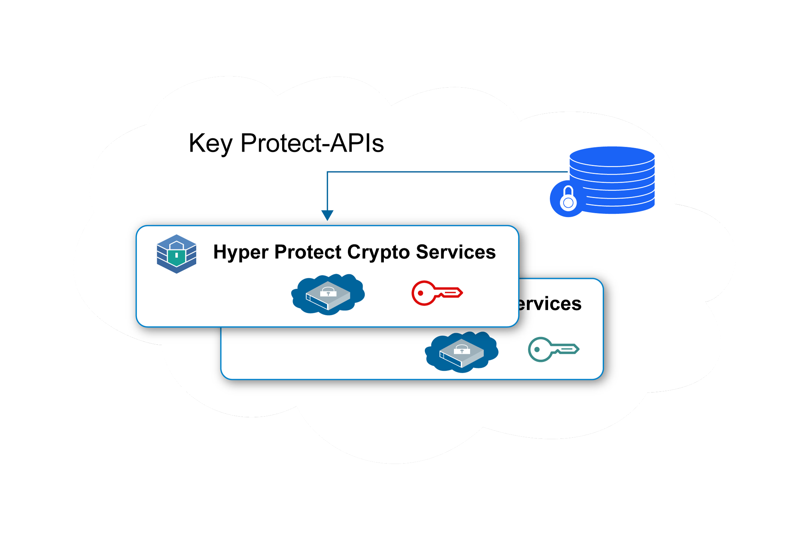
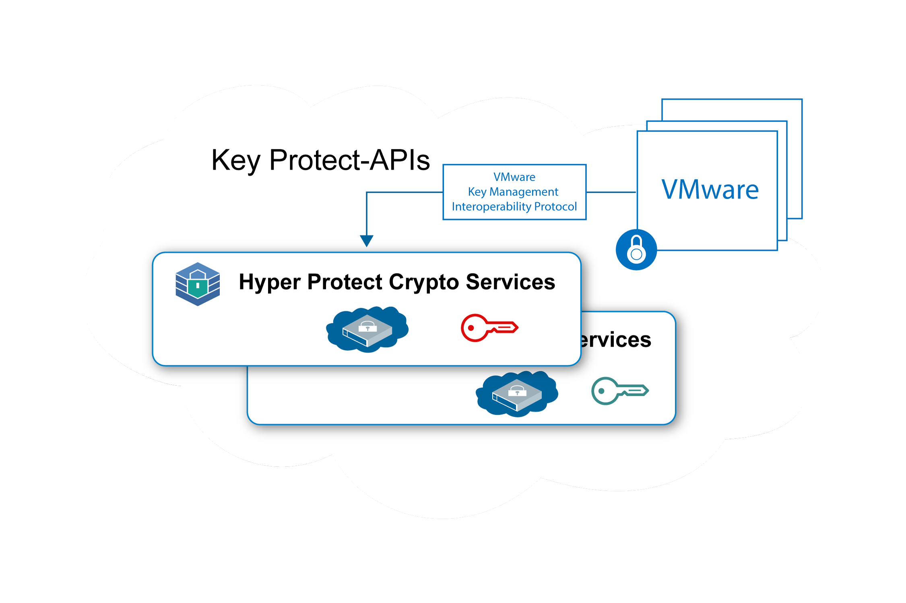

---

copyright:
  years: 2018, 2019
lastupdated: "2019-01-15"

Keywords: Hyper Protect Crypto Services, Keep Your Own Keys, VMware

subcollection: hs-crypto

---

{:new_window: target="_blank"}
{:shortdesc: .shortdesc}
{:screen: .screen}
{:codeblock: .codeblock}
{:pre: .pre}

# {{site.data.keyword.hscrypto}}-Anwendungsfälle
{: #use-cases}

Diese Seite beschreibt die Anwendungsfälle, die derzeit in {{site.data.keyword.hscrypto}} enthalten sind. Diese Anwendungsfälle werden in höheren Releases kontinuierlich weiterentwickelt.
{:shortdesc}

## Verschlüsselung ruhender Daten mit "Keep Your Own Keys" (KYOK)

Mit {{site.data.keyword.hscrypto}} können Sie Ihre Daten in der höchsten Sicherheitsstufe mit eigenen Schlüsseln verschlüsseln. {{site.data.keyword.hscrypto}} stellt die Schlüsselverwaltungsfunktionen bereit, mit denen Sie Ihre Schlüssel über {{site.data.keyword.keymanagementservicefull_notm}}-APIs generieren und verwalten können.

Nachstehend einige besondere Merkmale der Verwendung von {{site.data.keyword.hscrypto}} zum Schutz ruhender Daten:

 * {{site.data.keyword.hscrypto}} ermöglicht die Verschlüsselung ruhender Daten für Clouddaten und Speicherservices.
 * {{site.data.keyword.hscrypto}} unterstützt "Keep Your Own Keys" (KYOK), sodass Sie mithilfe von Verschlüsselungsschlüsseln, die Sie beibehalten, steuern und verwalten können, mehr Kontrolle und Berechtigungen für Ihre Daten behalten.
 * {{site.data.keyword.keymanagementservicefull_notm}}-APIs sind zwecks Schlüsselerstellung und -schutz integriert.
 * Ihre Schlüssel sind mit dem höchsten Sicherheitsniveau, einer FIPS 140-2 Stufe 4-zertifizierten Technologie, geschützt.
 * Die Schlüssel werden durch vom Kunden verwaltete dedizierte HSMs geschützt, d.h. nur Sie haben Zugriff auf Ihre Daten.

*Abbildung 1. Verschlüsselung ruhender Daten mit KYOK*

## Schutz von VMware-Images mit "Keep Your Own Keys" (KYOK)

Ähnlich wie beim Schutz ruhender Daten kann {{site.data.keyword.hscrypto}} auch ruhende VMware-Images für Verschlüsselung und Entschlüsselung über das Key Management Interoperability Protocol schützen.

Als Single-Tenant-Service bietet {{site.data.keyword.hscrypto}} die dedizierte Steuerung des Hardwaresicherheitsmoduls für VMware-Images nach Kunden an. {{site.data.keyword.hscrypto}} erweitert die Familie der Schlüsselverwaltungsservices in {{site.data.keyword.cloud_notm}} auf Single-Tenant-Instanzen mit dedizierter Steuerung von geheimen Schlüsseln für die Hardware.

*Abbildung 2. VMware-Image-Schutz mit KYOK*
