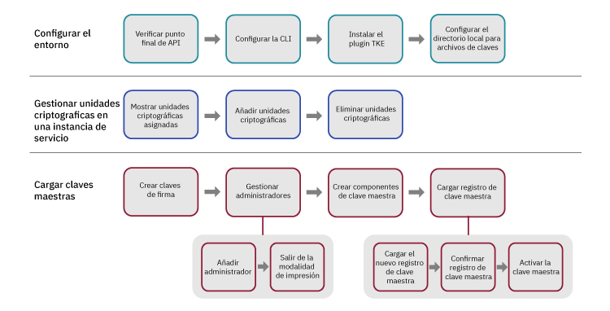

---

copyright:
  years: 2018, 2019
lastupdated: "2019-03-21"

Keywords: key storage, HSM, hardware security module

subcollection: hs-crypto

---

{:new_window: target="_blank"}
{:shortdesc: .shortdesc}
{:screen: .screen}
{:codeblock: .codeblock}
{:pre: .pre}
{:important: .important}
{:tip: .tip}

# Inicialización de instancias de servicio
{: #initialize-hsm}

Antes de utilizar la instancia de {{site.data.keyword.hscrypto}} (instancia de servicio para abreviar), necesita cargar registros de clave maestra utilizando el plugin Trusted Key Entry.
{:shortdesc}

Para inicializar instancias de servicio, necesita cargar la clave maestra con el plugin Trusted Key Entry en el almacén de claves, cargando la instancia de servicio en primer lugar. El plugin Trusted Key Entry le permite cargar sus valores de clave maestra.

Para ver una introducción a la inicialización de instancias de servicio y otros conceptos, consulte [Introducción a la inicialización de instancias de servicio](/docs/services/hs-crypto/service_instance_concepts.html#introduce-service).

El diagrama siguiente le ofrece una visión general de los pasos que debe realizar para inicializar la instancia de servicio. Pulse sobre cada paso del diagrama para ver instrucciones detalladas.


<map name="home_map1" id="home_map1">
<area href="/docs/services/hs-crypto?topic=hs-crypto-initialize-hsm#initialize-crypto-prerequisites" alt="Verificar punto final de API" title="Verificar punto final de API" shape="rect" coords="151, 20, 241, 78" />
<area href="/docs/services/hs-crypto?topic=hs-crypto-initialize-hsm#initialize-crypto-prerequisites" alt="Configurar la CLI" title="Configurar la CLI" shape="rect" coords="276, 20, 365, 78" />
<area href="/docs/services/hs-crypto?topic=hs-crypto-initialize-hsm#initialize-crypto-prerequisites4" alt="Instalar el plugin TKE" title="Instalar el plugin TKE" shape="rect" coords="401, 20, 493, 78" />
<area href="/docs/services/hs-crypto?topic=hs-crypto-initialize-hsm#initialize-crypto-prerequisites4" alt="Configurar el directorio local para archivos de claves" title="Configurar el directorio local para archivos de claves" shape="rect" coords="528, 20, 619, 78" />

<area href="/docs/services/hs-crypto?topic=hs-crypto-initialize-hsm#Identify_crypto_units" alt="Mostrar unidades criptográficas asignadas" title="Mostrar unidades criptográficas asignadas" shape="rect" coords="148, 111, 241, 171" />
<area href="/docs/services/hs-crypto?topic=hs-crypto-initialize-hsm#Identify_crypto_units1" alt="Añadir unidades criptográficas" title="Añadir unidades criptográficas" shape="rect" coords="276, 111, 366, 171" />
<area href="/docs/services/hs-crypto?topic=hs-crypto-initialize-hsm#Identify_crypto_units2" alt="Eliminar unidades criptográficas" title="Eliminar unidades criptográficas" shape="rect" coords="402, 111, 493, 171" />

<area href="/docs/services/hs-crypto?topic=hs-crypto-initialize-hsm#step1-create-signature-keys" alt="Crear una o más claves de firma" title="Crear claves de firma" shape="rect" coords="149, 206, 242, 264" />
<area href="/docs/services/hs-crypto?topic=hs-crypto-initialize-hsm#step2-load-admin" alt="Gestionar administradores de unidad criptográfica" title="Gestionar administradores de unidad criptográfica" shape="rect" coords="281, 206, 366, 264" />
<area href="/docs/services/hs-crypto?topic=hs-crypto-initialize-hsm#step2-load-admin" alt="Añadir uno o más administradores en la unidad criptográfica de destino" title="Añadir administradores de unidad criptográfica" shape="rect" coords="242, 296, 312, 358" />
<area href="/docs/services/hs-crypto?topic=hs-crypto-initialize-hsm#step3-exit-imprint-mode" alt="Salir de la modalidad de impresión en la unidad criptográfica de destino" title="Salir de la modalidad de impresión" shape="rect" coords="328, 301, 396, 359" />
<area href="/docs/services/hs-crypto?topic=hs-crypto-initialize-hsm#step4-create-master-key" alt="Crear un conjunto de componentes de clave maestra a utilizar" title="Crear componentes de clave maestra" shape="rect" coords="401, 208, 493, 266" />
<area href="/docs/services/hs-crypto?topic=hs-crypto-initialize-hsm#step5-load-master-key" alt="Cargar registros de clave maestra" title="Cargar registro de clave maestra" shape="rect" coords="525, 207, 620, 264" />
<area href="/docs/services/hs-crypto?topic=hs-crypto-initialize-hsm#step5-load-master-key" alt="Cargar nuevos registros de clave maestra" title="Cargar nuevo registro de clave maestra" shape="rect" coords="455, 297, 525, 358" />
<area href="/docs/services/hs-crypto?topic=hs-crypto-initialize-hsm#step6-commit-master-key" alt="Confirmar el nuevo registro de clave maestra" title="Confirmar el nuevo registro de clave maestra" shape="rect" coords="539, 297, 610, 358" />
<area href="/docs/services/hs-crypto?topic=hs-crypto-initialize-hsm#step7-activate-master-key" alt="Activar la clave maestra" title="Activar la clave maestra" shape="rect" coords="619, 297, 689, 358" />
</map>

*Figura 1. Flujo de tareas de inicialización de la instancia de servicio*

Es posible que tarde entre 20 y 30 minutos en completar esta tarea.

## Antes de empezar
{: #initialize-crypto-prerequisites}

1. Ejecute el mandato siguiente para asegurarse de que ha iniciado sesión en el punto final de API correcto:

  ```
  ibmcloud api https://api.ng.bluemix.net
  ```
  {: pre}

2. Instale el plugin de {{site.data.keyword.keymanagementservicefull}}. Para ver los pasos detallados, consulte [Configuración de la CLI](/docs/services/hs-crypto/set-up-cli.html). Cuando inicie sesión en la [CLI de {{site.data.keyword.cloud_notm}}](/docs/cli/index.html#overview), se le notificará cuando haya actualizaciones disponibles. Asegúrese de mantener el plugin de {{site.data.keyword.keymanagementservicefull}} al día para que pueda utilizar los mandatos y las señales disponibles para el plugin de la CLI Trusted Key Entry.
{: #initialize-crypto-prerequisites2}

3. Instale el plugin Trusted Key Entry más reciente con el mandato siguiente:
{: #initialize-crypto-prerequisites3}

  ```
  ibmcloud plugin install tke
  ```
  {: pre}

  **Importante:** si utiliza la instancia beta de {{site.data.keyword.hscrypto}}, ejecute 'ibmcloud plugin install tke -v 0.0.4' para obtener la versión beta más reciente del plugin Trusted Key Entry. No instale versiones posteriores del plugin Trusted Key Entry.

4. Establezca la variable de entorno CLOUDTKEFILES en la estación de trabajo. Especifique un directorio donde desee que se creen y se guarden los archivos de componente de clave maestra y los archivos de componente de clave de firma. Cree el directorio si todavía no existe.
{: #initialize-crypto-prerequisites4}

  * En Linux o MacOS, añada la línea siguiente al archivo `.bash_profile`:
     ```
     export CLOUDTKEFILES=<path>
     ```
     {: pre}
     Por ejemplo, puede especificar el *path* como `/Users/tke-files`.
  * En Windows, en el **Panel de Control**, escriba `variable de entorno` en el recuadro de búsqueda para localizar la ventana Variables de entorno. Cree una variable de entorno CLOUDTKEFILES y establezca el valor en la vía de acceso a los archivos de claves. Por ejemplo, `C:\users\tke-files`.

## Adición y eliminación de unidades criptográficas asignadas a una cuenta de usuario
{: #Identify_crypto_units}

Las unidades criptográficas asignadas a una cuenta de usuario de {{site.data.keyword.cloud_notm}} están en un grupo conocido como *instancia de servicio*. Una instancia de servicio puede tener hasta seis unidades criptográficas. Todas las unidades criptográficas de una instancia de servicio debe estar configuradas de la misma manera. Si no se puede acceder a un componente de {{site.data.keyword.cloud_notm}}, las unidades criptográficas de una instancia de servicio se pueden utilizar de forma intercambiable para el equilibrio de carga o para la disponibilidad.

Las unidades criptográficas asignadas a un usuario de {{site.data.keyword.cloud_notm}} comienzan en un estado revisado conocido como *modalidad de impresión*.

Los registros de clave maestra en todas las unidades criptográficas de una instancia de servicio individual deben establecerse de la misma manera. Debe añadirse el mismo conjunto de administradores en todas las unidades criptográficas, y todas las unidades criptográficas deben salir de la modalidad de impresión al mismo tiempo.

* Para mostrar las instancias de servicio y las unidades criptográficas asignadas a una cuenta de usuario, utilice el mandato siguiente:
  {: #Identify_crypto_units1}
  ```
  ibmcloud tke cryptounits
  ```
  {: pre}

  A continuación se muestra una salida de ejemplo. La columna SELECTED de la tabla de salida identifica las unidades criptográficas que serán el objetivo de los mandatos administrativos subsiguientes emitidos por el plugin Trusted Key Entry.

  ```
  SERVICE INSTANCE: 482cf2ce-a06c-4265-9819-0b4acf54f2ba
  CRYPTO UNIT NUM   SELECTED   LOCATION
  1                 true       [us-south].[AZ3-CS3].[02].[03]
  2                 true       [us-south].[AZ2-CS2].[02].[03]

  SERVICE INSTANCE: 96fe3f8d-9792-45bc-a9fb-2594222deaf2
  CRYPTO UNIT NUM   SELECTED   LOCATION
  3                 true       [us-south].[AZ1-CS4].[00].[03]
  4                 true       [us-south].[AZ2-CS5].[03].[03]
  ```
  {: screen}

* Para añadir unidades criptográficas a la lista de unidades criptográficas seleccionada, utilice el mandato siguiente:
  {: #Identify_crypto_units2}
  ```
  ibmcloud tke cryptounit-add
  ```
  {: pre}

  Aparecerá una lista de las unidades criptográficas asignadas a la cuenta de usuario actual. Cuando se le solicite, especifique una lista de números de unidad criptográfica a añadir a la lista de unidades criptográficas seleccionada.

* Para eliminar unidades criptográficas de la lista de unidades criptográficas seleccionada, utilice el mandato siguiente:
  {: #Identify_crypto_units3}
  ```
  ibmcloud tke cryptounit-rm
  ```
  {: pre}

  Aparecerá una lista de unidades criptográficas asignadas a la cuenta de usuario actual. Cuando se le solicite, especifique una lista de números de unidad criptográfica a eliminar de la lista de unidades criptográficas seleccionada.

  **Sugerencia:** en general, se seleccionan o bien todas las unidades criptográficas o ninguna unidad criptográfica de una instancia de servicio. Esto provoca que los mandatos administrativos subsiguientes actualicen todas las unidades criptográficas de una instancia de servicio de forma coherente. No obstante, si las unidades criptográficas de una instancia de servicio se configuran de una forma distinta, deberá seleccionar y trabajar con las unidades criptográficas individualmente para restaurar una configuración coherente en todas las unidades criptográficas de una instancia de servicio.

  Puede comparar los valores de configuración de las unidades criptográficas seleccionadas con el mandato siguiente:
  ```
  ibmcloud tke cryptounit-compare
  ```
  {: pre}

## Carga de claves maestras
{: #load-master-keys}

<!-- A service instance is implemented as one or more crypto units on IBM cryptographic coprocessors. -->

Para poder cargar el nuevo registro de clave maestra, añada uno o más administradores en las unidades criptográficas de destino y salga de la modalidad de impresión.

Para cargar el nuevo registro de clave maestra, realice las tareas siguientes utilizando el plugin de CLI de {{site.data.keyword.cloud_notm}}:

### Paso 1: Crear una o más claves de firma
{: #step1-create-signature-keys}

Para cargar el nuevo registro de clave maestra, un administrador de la unidad criptográfica debe firmar el mandato con una clave de firma única. El primer paso es crear uno o más archivos de claves de firma que contengan claves de firma en su estación de trabajo. <!-- The private part of the signature key file is used to create signatures. The public part is placed in a certificate that is installed in a target crypto unit to define a crypto unit administrator. -->

**Importante**: por motivos de seguridad, el propietario de la clave de firma puede ser una persona distinta a los propietarios de los componentes de la clave maestra. El propietario de la clave de firma debe ser la única persona que conozca la contraseña asociada con el archivo de claves de firma.

* Para mostrar las claves de firma existentes en la estación de trabajo, utilice el mandato siguiente:
  ```
  ibmcloud tke sigkeys
  ```
  {: pre}

* Para crear y guardar una nueva clave de firma en la estación de trabajo, utilice el mandato siguiente:
  ```
  ibmcloud tke sigkey-add
  ```
  {: pre}

  Cuando se le solicite, especifique un nombre del administrador y una contraseña para proteger el archivo de claves de firma. Debe recordar la contraseña. Si se pierde la contraseña, no se puede utilizar la clave de firma.

* Para seleccionar el administrador para firmar mandatos posteriores, utilice el mandato:
  ```
  ibmcloud tke sigkey-sel
  ```
  {: pre}

  Aparecerá una lista de archivos de claves de firma encontrados en la estación de trabajo. Cuando se le solicite, especifique el número de clave del archivo de claves de firma a seleccionar para firmar los mandatos administrativos subsiguientes. <!--If a signature key file is already selected for signing administrative commands, this is indicated when the list of signature key files is displayed. -->

  <!-- **Tip**: Before you run the `cryptounit-exit-impr` command to exit imprint mode, the command needs to be signed by a crypto unit administrator using the signature key. After the crypto unit exits imprint mode, all commands to the crypto unit must be signed. -->

### Paso 2: Añadir uno o más administradores en la unidad criptográfica de destino
{: #step2-load-admin}

<!-- After a crypto unit exits imprint mode, all administrative commands sent to the crypto unit must be signed by an administrator that is added to the crypto unit. -->

* Para mostrar los administradores existentes de una unidad criptográfica, utilice el mandato siguiente:
  ```
  ibmcloud tke cryptounit-admins
  ```
  {: pre}

* Para añadir un administrador nuevo, utilice el mandato siguiente:
  ```
  ibmcloud tke cryptounit-admin-add
  ```
  {: pre}

  Aparecerá una lista de los archivos de claves de firma que se encuentran en la estación de trabajo.

  Cuando se le solicite, seleccione el archivo de claves de firma asociado con el administrador de la unidad criptográfica que se debe añadir. A continuación, especifique la contraseña para el archivo de claves de firma seleccionado.

  Puede repetir el mandato para añadir más administradores de unidad criptográfica si es necesario. Cualquier administrador puede ejecutar mandatos en la unidad criptográfica de forma independiente.

  En la modalidad de impresión, no es necesario que se firme el mandato para añadir un administrador de unidad criptográfica. Después de salir de la modalidad de impresión, para añadir administradores de la unidad criptográfica, es necesario que un administrador de unidad criptográfica que ya se haya añadido a la unidad criptográfica firme el mandato que se va a utilizar.

### Paso 3: Salir de la modalidad de impresión en la unidad criptográfica de destino
{: #step3-exit-imprint-mode}

Una unidad criptográfica en modalidad de impresión no se considera segura. No puede ejecutar la mayoría de los mandatos administrativos, como la carga del nuevo registro de clave maestra, en modalidad de impresión.

Después de añadir uno o más administradores de unidad criptográfica, salga de la modalidad de impresión utilizando el mandato:

  ```
  ibmcloud tke cryptounit-exit-impr
  ```
  {: pre}

  **Importante:** el mandato para salir de la modalidad de impresión deberá firmarlo uno de los administradores de la unidad criptográfica añadidos utilizando la clave de firma. Después de que la unidad criptográfica salga de la modalidad de impresión, deberán firmarse todos los mandatos de la unidad criptográfica.

### Paso 4: Crear un conjunto de componentes de clave maestra a utilizar
{: #step4-create-master-key}

Cada componente de clave maestra se guarda en un archivo protegido por contraseña en la estación de trabajo.

**Importante**: debe crear al menos dos componentes de clave maestra. Por motivos de seguridad, se pueden utilizar tres componentes de clave maestra y cada componente de clave puede ser propiedad de una persona diferente. El propietario del componente de clave debe ser la única persona que conozca la contraseña asociada con el archivo de componente de clave.

* Para mostrar los componentes de clave maestra existentes en la estación de trabajo, utilice el mandato siguiente:
  ```
  ibmcloud tke mks
  ```
  {: pre}

* Para crear y guardar un componente de clave maestra aleatorio en la estación de trabajo, utilice el mandato siguiente:
  ```
  ibmcloud tke mk-add --random
  ```
  {: pre}

  Cuando se le solicite, especifique una descripción para el componente de clave y una contraseña para proteger el archivo de componente de clave. Debe recordar la contraseña. Si se pierde la contraseña, no podrá utilizar el componente de clave.

* Para especificar un valor de componente de clave conocido y guardarlo en un archivo en la estación de trabajo, utilice el mandato siguiente:
  ```
  ibmcloud tke mk-add --value
  ```
  {: pre}

  Cuando se le solicite, especifique el valor del componente clave como una serie hexadecimal para el componente de clave de 32 bytes. A continuación, especifique una descripción para el componente de clave y una contraseña para proteger el archivo.

### Paso 5: Cargar el nuevo registro de clave maestra
{: #step5-load-master-key}

**Importante**: para cargar un registro de clave maestra, todos los archivos de componentes de clave maestra y el archivo de claves de firma deben estar presentes en una estación de trabajo común. Si los archivos se crearon en estaciones de trabajo independientes, asegúrese de que los nombres de archivo sean distintos para evitar conflictos. Los propietarios de los archivos de componentes de clave maestra y el propietario del archivo de claves de firma deben especificar las contraseñas de archivo cuando se cargue el registro de clave maestra en la estación de trabajo común.

Para obtener información sobre cómo se carga la clave maestra, consulte las ilustraciones detalladas en [Registros de clave maestra](/docs/services/hs-crypto/service_instance_concepts.html#introduce-key-registers).

Para cargar el nuevo registro de clave maestra, utilice el mandato siguiente:
```
ibmcloud tke cryptounit-mk-load
```
{: pre}

Aparecerá una lista de los componentes de clave maestra que se encuentran en la estación de trabajo.

Cuando se le solicite, especifique los componentes de clave que se van a cargar en el nuevo registro de clave maestra. A continuación, especifique la contraseña para cada archivo de componente de clave seleccionado.

### Paso 6: Confirmar el nuevo registro de clave maestra
{: #step6-commit-master-key}

La carga del nuevo registro de clave maestra coloca el nuevo registro de clave maestra en el estado completamente sin confirmar. Para poder utilizar el nuevo registro de clave maestra para inicializar o volver a cifrar el almacén de claves, coloque el nuevo registro de clave maestra en el estado confirmado. Para obtener información sobre cómo se carga la clave maestra, consulte las ilustraciones detalladas en [Registros de clave maestra](/docs/services/hs-crypto/service_instance_concepts.html#introduce-key-registers).

Para confirmar el nuevo registro de clave maestra, utilice el mandato siguiente:
```
ibmcloud tke cryptounit-mk-commit
```
{: pre}

### Paso 7: Activar la clave maestra
{: #step7-activate-master-key}

Active la clave maestra moviendo la clave maestra al registro de clave maestra actual con el mandato siguiente:

```
ibmcloud tke cryptounit-mk-setimm
```
{: pre}

## Qué hacer a continuación
{: #initialize-crypto-next}

Vaya al separador **Gestionar** del panel de control del {{site.data.keyword.hscrypto}} gestionado para gestionar claves raíz y claves estándar.

Para obtener más detalles sobre otras opciones de los mandatos del plugin Trusted Key Entry, ejecute el mandato siguiente en la CLI:

```
ibmcloud tke help
```
{: pre}

<!--
## Reference: Other Trusted Key Entry plug-in commands
{: #initialize-crypto-reference}

The following list describes the remaining commands implemented by the plug-in and discusses when they would be used.

* **ibmcloud tke mk-rm**

  This command removes a file that contains a master key part from the workstation.

  After you enter the command, a list of master key parts that are found on the workstation is displayed. When prompted, enter the key number of the key part that is to be removed.

  After a key part is removed from the local workstation, it can no longer be used.

* **ibmcloud tke sigkey-rm**

  This command removes a file that contains a signature key from the workstation.

  After you enter the command, a list of signature keys found on the workstation is displayed. When prompted, enter the key number of the signature key file that is to be removed.

  Be cautious of removing a signature key from the workstation. If any crypto units that are assigned to the user account exit imprint mode, and if the signature key being removed from the workstation is the only added administrator for the crypto unit, executing new administrative functions in the crypto unit is not possible after you remove the signature key. If no backup of the signature key file exists, the only way for recovery is to contact {{site.data.keyword.cloud_notm}} support to clear the crypto unit and place it in imprint mode.

* **ibmcloud tke cryptounit-admin-rm**

  This command removes an administrator from the selected crypto units.

  When this command is issued for a crypto unit in imprint mode, this command does not need to be signed. After the crypto unit exits imprint mode, this command must be signed by an existing crypto unit administrator.

  For a crypto unit not in imprint mode, the command fails if the administrator being removed is the last administrator defined for the crypto unit.


* **ibmcloud tke cryptounit-zeroize**

  This command clears the selected crypto units and places them back in imprint mode.  All crypto unit administrators are removed, and the new and current master key registers are cleared.

  When this command is issued for a crypto unit in imprint mode, this command does not need to be signed. After the crypto unit exits imprint mode, this command must be signed by an existing crypto unit administrator.

  When this command is issued to a group of crypto units, the current signature key must be recognized as a crypto unit administrator by all crypto units not in imprint mode in order for the command to be accepted.


* **ibmcloud tke cryptounit-mk**

  This command displays the status and verification pattern for the new and current master key registers for the selected crypto units.

* **ibmcloud tke cryptounit-mk-clrcur**

  This command clears the current master key register in the selected crypto units.

  This command cannot be executed in imprint mode.

  Clearing the current master key register makes any key storage protected by the current master key unusable.

* **ibmcloud tke cryptounit-mk-clrnew**

  This command clears the new master key register in the selected crypto units.

  This command cannot be executed in imprint mode.

* **ibmcloud tke cryptounit-mk-setimm**

  This command moves the value of the new master key register to the current master key register, and clears the new master key register in the selected crypto units.

  This command cannot be executed in imprint mode.

  This command does not initialize or re-encipher key storage and should be used only when key storage in the target LPARs is prepared to accept the new master key value. If in doubt, do not use this command, because it can cause keys in existing key storage to become unusable.

The following is a full list of plug-in commands. You can also find the commands by using the plug-in help function:
```
NAME:
   ibmcloud tke - A CLI plug-in to manage crypto module cryptounits in the IBM Cloud
USAGE:
   ibmcloud tke command [arguments...] [command options]

COMMANDS:
   mks                Lists master key parts stored on this workstation.
   mk-add             Creates and saves a new master key part.
   mk-rm              Removes a master key part from this workstation.
   sigkeys            Lists the signature keys stored on this workstation.
   sigkey-add         Generates and saves a new signature key.
   sigkey-rm          Removes a signature key from this workstation.
   sigkey-sel         Selects the signature key to use to sign commands.
   cryptounits            Displays the cryptounits for the current resource group.
   cryptounit-add         Adds cryptounits to the set of cryptounits to work with.
   cryptounit-rm          Removes cryptounits from the set of cryptounits to work with.
   cryptounit-admins      Lists administrators added in the selected cryptounits.
   cryptounit-admin-add   Add a cryptounit administrator to the selected cryptounits.
   cryptounit-admin-rm    Removes a cryptounit administrator from the selected cryptounits.
   cryptounit-compare     Compares configuration settings of the selected cryptounits.
   cryptounit-exit-impr   Exits imprint mode in the selected cryptounits.
   cryptounit-zeroize     Zeroizes the selected cryptounits.
   cryptounit-mk          Displays master key registers for the selected cryptounits.
   cryptounit-mk-clrcur   Clears the current master key register.
   cryptounit-mk-clrnew   Clears the new master key register.
   cryptounit-mk-commit   Commits the new master key register.
   cryptounit-mk-setimm   Does set immediate on the master key registers.
   cryptounit-mk-load     Loads the new master key register.
   help, h            Show help
   ```
-->
