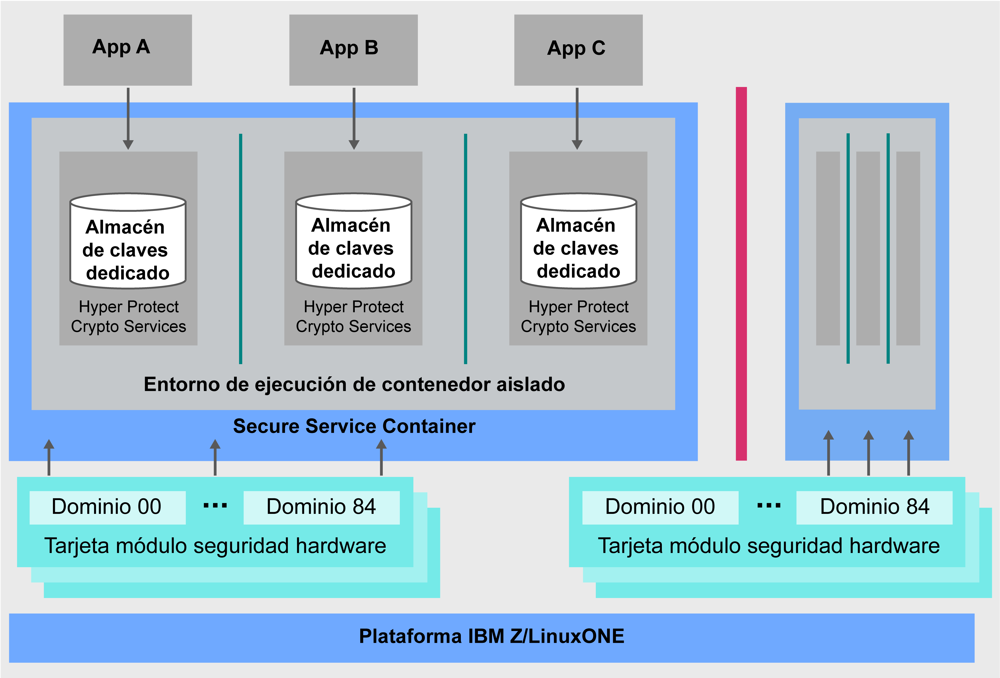

---

copyright:
  years: 2018, 2019
lastupdated: "2019-02-05"

Keywords: IBM Key, data security, Hyper Protect Crypto Services, HSM

subcollection: hs-crypto
---

{:new_window: target="_blank"}
{:shortdesc: .shortdesc}
{:screen: .screen}
{:codeblock: .codeblock}
{:pre: .pre}
{:important: .important}

# Visión general de {{site.data.keyword.cloud_notm}} {{site.data.keyword.hscrypto}}
{: #overview}

<!-- {{site.data.keyword.cloud}} {{site.data.keyword.hscrypto}} is in the BETA phase and is for tryout and test purpose only. To prevent data loss, use only test data in the current service. This restriction also applies to using {{site.data.keyword.hscrypto}} with other  {{site.data.keyword.cloud_notm}} services.
{:important} -->

La seguridad de los datos y de la información es crucial y esencial para los entornos de TI. A medida que se mueven más y más datos a la nube, mantener los datos protegidos pasa a ser un reto no trivial.  {{site.data.keyword.cloud}} {{site.data.keyword.hscrypto}} ofrece criptografía con tecnología que ha alcanzado el nivel de seguridad más alto del sector para proteger sus datos.
{: shortdesc}

## ¿Por qué {{site.data.keyword.cloud_notm}} {{site.data.keyword.hscrypto}}?

{{site.data.keyword.hscrypto}} ofrece la seguridad e integridad de IBM Z en la nube. Ahora se ofrece a los usuarios de nube la misma tecnología criptográfica avanzada en la que se basan los bancos y servicios financieros a través de {{site.data.keyword.cloud_notm}}. <!-- With {{site.data.keyword.hscrypto}}, you can protect your data at rest, in use, and in transit.--> {{site.data.keyword.hscrypto}} también se integra con las API de {{site.data.keyword.keymanagementservicefull_notm}} para proteger sus claves en un entorno hiperprotegido en IBM Z.

Detrás de la nube, {{site.data.keyword.hscrypto}} ofrece módulos de seguridad de hardware (HSM) de nube para proporcionar criptografía.<!-- via PKCS#11 application programming interfaces (APIs). You can access {{site.data.keyword.hscrypto}} with several popular programming languages such as Java, JavaScript, and Swift. -->

{{site.data.keyword.hscrypto}} es la criptografía con la que se construye la plataforma {{site.data.keyword.blockchainfull_notm}}. Este mecanismo de criptografía garantiza que la red blockchain se ejecuta en un entorno altamente protegido y aislado, y acelera las operaciones hash, las operaciones de firma y verificación y las comunicaciones de nodo a nodo en la red. El éxito de la plataforma
{{site.data.keyword.blockchainfull_notm}} prueba la capacidad y el valor de {{site.data.keyword.hscrypto}}

## ¿Cómo funciona {{site.data.keyword.hscrypto}}?

El diagrama arquitectónico siguiente muestra cómo funciona {{site.data.keyword.hscrypto}}.

*Figura 1. Arquitectura de {{site.data.keyword.hscrypto}}*  

A continuación se muestran algunos aspectos destacados de la arquitectura de
{{site.data.keyword.hscrypto}}:

<!-- * Applications connect to {{site.data.keyword.hscrypto}} through PKCS#11 APIs. -->

- Se proporciona un almacén de claves dedicado en {{site.data.keyword.hscrypto}} para garantizar la seguridad y el aislamiento de los datos. Los usuarios con privilegios se bloquean para protegerlos del uso abusivo de credenciales de usuario root o de administrador del sistema.  
- Secure Service Container (SSC) proporciona el nivel empresarial de seguridad e impregnabilidad que los clientes de empresa pueden esperar de la tecnología de IBM Z.  
- Se habilita un HSM de nube compatible con FIPS 140-2 Nivel 4 para la máxima protección física de los secretos.  

## Características clave  

A continuación se muestran las características clave de {{site.data.keyword.hscrypto}}:

### Protección de servicios de datos de {{site.data.keyword.cloud_notm}} utilizando claves de cifrado con HSM de nube controlados por el cliente

{{site.data.keyword.hscrypto}} admite Keep Your Own Keys (KYOK), de manera que tiene más control y autoridad sobre los datos con claves de cifrado que puede mantener, controlar y gestionar. El soporte disponible para módulos de seguridad de hardware (HSM) de nube controlados por el cliente permite que se puedan proteger las claves digitales según la normativa del sector en {{site.data.keyword.cloud_notm}} y que únicamente el cliente pueda acceder a ellas.<!-- The HSM provides PKCS#11 APIs, which makes {{site.data.keyword.hscrypto}} accessible by several popular programming languages such as Java, JavaScript, and Swift.-->

### Tecnología certificada FIPS 140-2 Nivel 4 proporcionada

{{site.data.keyword.hscrypto}} proporciona acceso a la tecnología certificada FIPS 140-2 Nivel 4, el nivel más alto posible de seguridad para el hardware criptográfico. <!-- Industries, such as financial sector services, require this level of security to protect their data.--> A este nivel de seguridad, los mecanismos de seguridad física proporcionan un envoltorio completo de protección alrededor del módulo criptográfico con la intención de detectar y responder a todos los intentos no autorizados de acceso físico.

### No hay acceso de usuario privilegiado a sus claves y datos

{{site.data.keyword.hscrypto}} ofrece las características únicas de protección de datos de IBM Z en {{site.data.keyword.cloud_notm}}. {{site.data.keyword.hscrypto}} protege sus datos en SSC, que proporciona el nivel empresarial de seguridad e impregnabilidad que los clientes de empresa pueden esperar de la tecnología de IBM Z. Se utiliza virtualización de hardware para proteger los datos en un entorno aislado. De esta manera, se proporciona un servicio dedicado por cada instancia criptográfica, por lo que no se permite el acceso externo, incluyendo usuarios con privilegios como administradores de nube, a sus datos. Por lo tanto, se reduce el riesgo de que se comprometan los datos por amenazas de personas con información privilegiada.

### Integración con {{site.data.keyword.keymanagementservicefull_notm}} para proteger datos y servicios de almacenamiento de
{{site.data.keyword.cloud_notm}}

Se integran API de {{site.data.keyword.keymanagementservicefull_notm}} en {{site.data.keyword.hscrypto}} para generar y proteger claves. {{site.data.keyword.hscrypto}} protege estas claves y las almacena en un entorno altamente protegido y aislado en IBM Z, que protege los datos con tecnología certificada al más alto nivel de seguridad del sector.

<!-- {{site.data.keyword.hscrypto}} also leverages the **IBM Advanced Crypto Service Provider (ACSP)** solution that enables remote access to the IBM’s cryptographic coprocessors. ACSP allows for utilization of strong hardware-based cryptography as a service in distributed environments where data security cannot be guaranteed. {{site.data.keyword.hscrypto}} utilizes ACSP as a *network hardware security module (NetHSM)* that provides access to HSM via PKCS#11 standard APIs.-->

<!-- With {{site.data.keyword.hscrypto}}, your **SSL keys are offloaded** to a {{site.data.keyword.hscrypto}} to ensure security and protection of those sensitive keys.  Besides, the certificate lifecycle management gets common approach to manage certificates and offers the visibility to certificate expiration.-->

## Roles y responsabilidades

En la tabla siguiente se muestran los roles que admite {{site.data.keyword.hscrypto}}.

<table>
  <tr>
    <th>Roles</th>
    <th>Responsabilidades</th>
  </tr>
  <tr>
    <td>Administrador de HSM (dominio)</td>
    <td>
      Firma mandatos administrativos como la instalación de otro administrador de dominio, y proporciona claves de firma.
    </td>
  </tr>
  <tr>
    <td>Propietario de claves</td>
    <td>Proporciona fragmentos de clave maestra para inicializar una instancia criptográfica.</td>
  </tr>
  <tr>
    <td>Usuario de servicio</td>
    <td>Almacena, recupera y genera claves raíz y claves estándar a través de la interfaz de usuario y de las API.</td>
  </tr>
  <caption style="caption-side:bottom;">Tabla 1. Roles y responsabilidades</caption>
</table>
