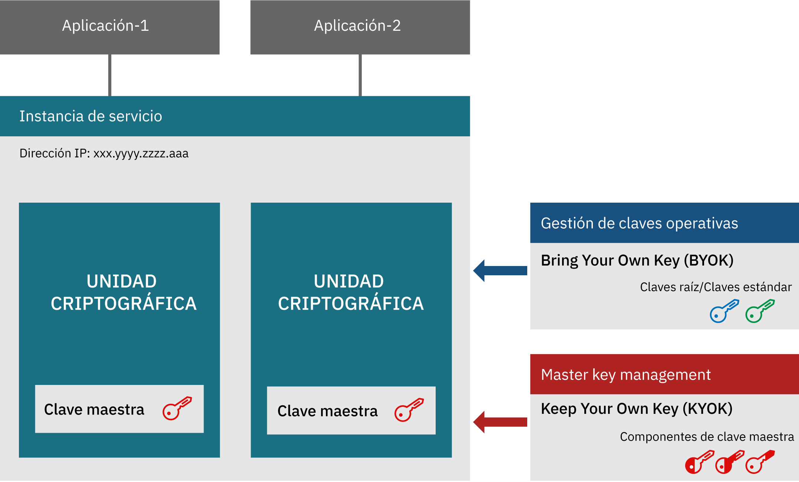
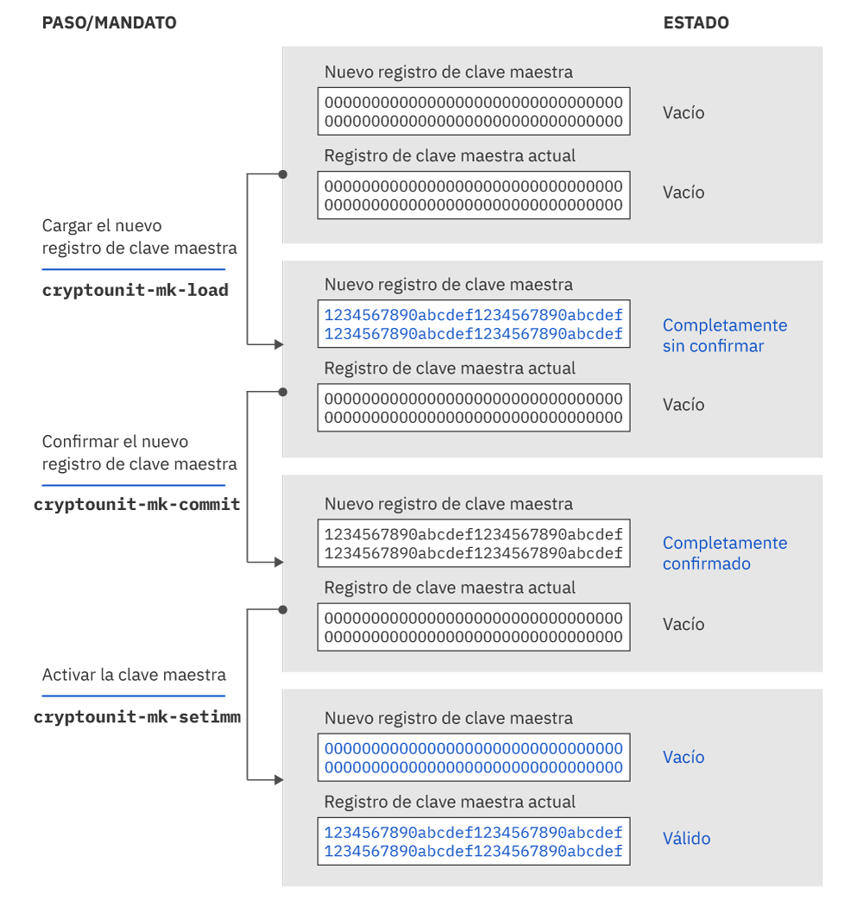

---

copyright:
  years: 2018, 2019
lastupdated: "2019-03-21"

Keywords: hsm, Trusted Key Entry plug-in, service instance, imprint mode

subcollection: hs-crypto

---

{:new_window: target="_blank"}
{:shortdesc: .shortdesc}
{:screen: .screen}
{:codeblock: .codeblock}
{:pre: .pre}
{:important: .important}

# Introducción a la inicialización de instancias de servicio
{: #introduce-service}

Antes de empezar a inicializar la instancia de servicio de {{site.data.keyword.hscrypto}}, es posible que desee entender primero los conceptos básicos y la lógica del proceso.  
{:shortdesc}

Una instancia de {{site.data.keyword.hscrypto}} (instancia de servicio para abreviar) es un grupo de unidades criptográficas asignadas a una cuenta de usuario de IBM Cloud. Una instancia de servicio puede tener hasta seis unidades criptográficas. Si va a configurar un entorno de producción, se recomienda que asigne al menos dos unidades criptográficas por instancia de servicio para obtener alta disponibilidad. Las unidades criptográficas deben estar en módulos de seguridad de hardware (HSM) físicos distintos. Todas las unidades criptográficas de una instancia de servicio debe estar configuradas de la misma manera. Si no se puede acceder a una parte de IBM Cloud, las unidades criptográficas de una instancia de servicio se pueden utilizar de forma intercambiable. Las unidades criptográficas contienen claves maestras que cifran el contenido del almacén de claves. Con la tecnología Keep Your Own Keys, los administradores de la instancia de servicio son los únicos que pueden acceder a la clave maestra.

El diagrama siguiente ilustra una instancia de servicio con dos unidades criptográficas.

*Figura 1. Componentes de la instancia de servicio*

## Módulo de seguridad de hardware
{: #introduce-HSM}

Un módulo de seguridad de hardware (HSM) es un dispositivo físico que protege y gestiona claves digitales para obtener una autenticación robusta, y proporciona un proceso criptográfico. Los HSM de {{site.data.keyword.cloud_notm}} {{site.data.keyword.hscrypto}} tienen el certificado FIPS 140-2 Nivel 4, que es el nivel más alto de seguridad para el hardware criptográfico. A este nivel de seguridad, los mecanismos de seguridad física proporcionan un envoltorio completo de protección alrededor del módulo criptográfico con la intención de detectar y responder a todos los intentos no autorizados de acceso físico.

## Unidad criptográfica
{: #introduce-crypto-unit}

Una unidad criptográfica es la unidad individual que representa un HSM y la pila de software correspondiente dedicada para el HSM. Cada unidad criptográfica puede gestionar hasta 5000 claves digitales. Una instancia de servicio puede tener hasta seis unidades criptográficas. Si va a configurar un entorno de producción, se recomienda que asigne al menos dos unidades criptográficas por instancia de servicio para obtener alta disponibilidad. Todas las unidades criptográficas de una instancia de servicio debe estar configuradas de la misma manera. Si no se puede acceder a una parte de IBM Cloud, las unidades criptográficas de una instancia de servicio se pueden utilizar de forma intercambiable.

## Plugin Trusted Key Entry
{: #introduce-TKE}

Utilizando el plugin Trusted Key Entry, puede cargar los registros de clave maestra de instancias de servicio en su cuenta de usuario de {{site.data.keyword.cloud}} con valores que puede elegir y controlar. El plugin Trusted Key Entry proporciona un conjunto de funciones para gestionar unidades criptográficas asignadas a una cuenta de usuario de
{{site.data.keyword.cloud_notm}}. El plugin le permite cargar sus valores de clave maestra.

## Administradores
{: #introduce-administrators}

Se pueden añadir administradores a las unidades criptográficas de destino para emitir mandatos en las unidades criptográficas. Un administrador es propietario de una clave de firma privada. Después de que se generen las claves de firma, deberá añadir los administradores con las claves de firma en la unidad criptográfica de destino.

## Claves de firma
{: #introduce-signature-keys}

Un administrador debe firmar los mandatos emitidos en la unidad criptográfica con una firma. La parte privada del archivo de clave de firma se utiliza para crear firmas. El componente público se coloca en un certificado que se instala en una unidad criptográfica de destino para definir un administrador de unidad criptográfica. No es necesario firmar los mandatos emitidos en modalidad de impresión.

## Modalidad de impresión
{: #introduce-imprint-mode}

Las unidades criptográficas asignadas a un usuario de IBM Cloud comienzan en un estado revisado conocido como modalidad de impresión. Una unidad criptográfica en modalidad de impresión no es segura. No es posible cargar los registros de clave maestra en modalidad de impresión. Solo puede configurar administradores de unidad criptográfica y borrar la unidad criptográfica en la modalidad de impresión. No es necesario firmar los mandatos emitidos a una unidad criptográfica en modalidad de impresión. No obstante, el mandato para salir de la modalidad de impresión deberá firmarlo uno de los administradores de la unidad criptográfica añadidos utilizando la clave de firma.

## Claves maestras
{: #introduce-master-key}

Las claves maestras se utilizan para cifrar la instancia de servicio para el almacén de claves. Con la clave maestra, es propietario de la raíz de confianza que cifra toda la cadena de claves, incluyendo las claves raíz y las claves estándar. IBM no realiza copias de seguridad ni toca la clave maestra, y no tiene ninguna manera de copiarla ni restaurarla en una máquina o centro de datos diferente. Una instancia de servicio solo puede tener una clave maestra. Si suprime la clave maestra de la instancia de
servicio, puede destruir criptográficamente de forma efectiva todos los datos que se han cifrado con las claves gestionadas en el servicio.

Para obtener más información sobre los tipos de claves que gestiona {{site.data.keyword.hscrypto}}, consulte
[Introducción a las claves](/docs/services/hs-crypto/keys_intro.html#introduce-keys).

## Componentes de clave maestra
{: #introduce-key-parts}

El nuevo registro de clave maestra se carga utilizando varios componentes de clave maestra. En el plugin Trusted Key Entry, cada componente de clave se almacena en un archivo de componente de clave maestra. Se pueden utilizar dos o tres componentes de clave maestra para cargar el nuevo registro de clave maestra. Por motivos de seguridad, cada componente de clave puede ser propiedad de una persona diferente. El propietario del componente de clave debe ser la única persona que conozca la contraseña asociada con el archivo de componente de clave.

## Registros de clave maestra
{: #introduce-key-registers}

Cada unidad criptográfica tiene dos registros de clave maestra: un registro de clave maestra nuevo y un registro de clave maestra actual. El valor del registro de clave maestra actual cifra el contenido del almacén de claves del usuario. El nuevo registro de clave maestra se utiliza para cambiar el valor del registro de clave maestra actual. Cuando se cambia el valor del registro de clave maestra actual, es necesario volver a cifrar el contenido del almacén de claves con el nuevo valor de clave maestra. Esto es necesario tanto para el valor de clave maestra actual como para el nuevo valor de clave maestra. Los valores de clave del almacén de claves se descifran utilizando el valor del registro de clave maestra actual y, a continuación, se vuelven a cifrar utilizando el valor del nuevo registro de clave maestra. El proceso de volver a cifrar se lleva a cabo dentro del HSM, por lo que es seguro. Una vez que se haya cifrado de nuevo todo el contenido del almacén de claves, el valor del nuevo registro de clave maestra se puede mover al registro de clave maestra actual.

El diagrama siguiente ilustra cómo cambia el estado del registro de clave maestra y cómo se carga la clave maestra.

*Figura 1. Carga de claves maestras*  
