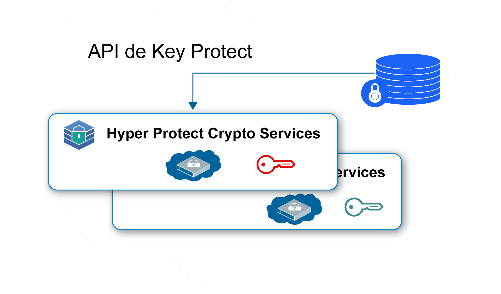
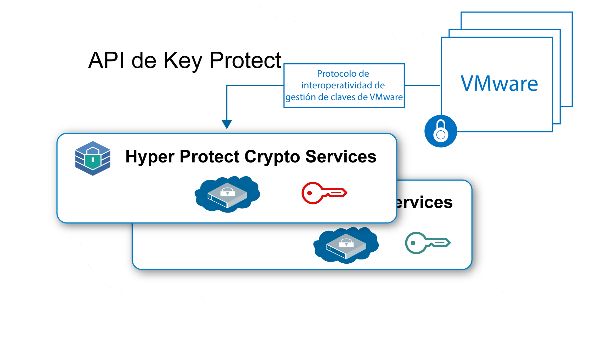

---

copyright:
  years: 2018, 2019
lastupdated: "2019-01-15"

Keywords: Hyper Protect Crypto Services, Keep Your Own Keys, VMware

subcollection: hs-crypto

---

{:new_window: target="_blank"}
{:shortdesc: .shortdesc}
{:screen: .screen}
{:codeblock: .codeblock}
{:pre: .pre}

# Casos de uso de {{site.data.keyword.hscrypto}}
{: #use-cases}

En esta página se incluyen los casos de uso que contiene actualmente {{site.data.keyword.hscrypto}}. Estos casos de uso se desarrollarán de forma continua en releases posteriores.
{:shortdesc}

## Cifrado de datos en reposo con Keep Your Own Keys
{: #data-at-rest-encryption}

Puede utilizar {{site.data.keyword.hscrypto}} para cifrar los datos en reposo en el nivel de seguridad más alto con sus propias claves. {{site.data.keyword.hscrypto}} proporciona las funciones de gestión de claves para generar y gestionar sus claves utilizando API de
{{site.data.keyword.keymanagementservicefull_notm}}.

A continuación se muestran algunas de las principales características del uso de
{{site.data.keyword.hscrypto}} para proteger datos en reposo:

 * {{site.data.keyword.hscrypto}} permite el cifrado de datos en reposo para datos de nube y servicios de almacenamiento.
 * {{site.data.keyword.hscrypto}} admite Keep Your Own Keys (KYOK), de manera que tiene más control y autoridad sobre los datos con claves de cifrado que puede aportar, controlar y gestionar.
 * Se integran API de {{site.data.keyword.keymanagementservicefull_notm}} para la protección y generación de claves.
 * Las claves están protegidas en la seguridad más alta, la tecnología certificada FIPS 140-2 Nivel 4.
 * Las claves se protegen mediante HSM dedicados gestionados por el cliente, lo que implica que solo usted tendrá acceso a sus datos.

*Figura 1. Cifrado de datos en reposo con KYOK*

## Protección de imagen de VMware con Keep Your Own Keys
{: #vmware-image-protection}

De forma similar a la protección de datos en reposo, {{site.data.keyword.hscrypto}} también puede proteger la imagen VMware en reposo del cifrado y el descifrado a través del Protocolo de interoperatividad de gestión de claves de VMware.

Como servicio de un único arrendatario, {{site.data.keyword.hscrypto}} ofrece un control dedicado del módulo de seguridad de hardware para imágenes VMware por cliente. {{site.data.keyword.hscrypto}} amplía la familia de servicios de gestión de claves en
{{site.data.keyword.cloud_notm}} hacia instancias de un único arrendatario con un control de secretos de hardware dedicado.

*Figura 2. Protección de imagen VMware con KYOK*
