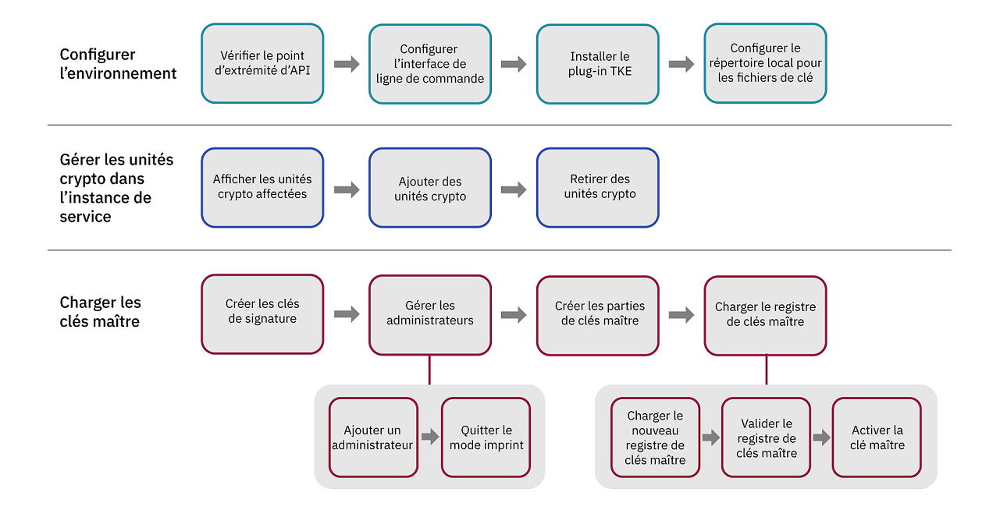

---

copyright:
  years: 2018, 2019
lastupdated: "2019-03-21"

Keywords: key storage, HSM, hardware security module

subcollection: hs-crypto

---

{:new_window: target="_blank"}
{:shortdesc: .shortdesc}
{:screen: .screen}
{:codeblock: .codeblock}
{:pre: .pre}
{:important: .important}
{:tip: .tip}

# Initialisation des instances de service
{: #initialize-hsm}

Avant d'utiliser l'instance {{site.data.keyword.hscrypto}} (ou instance de service, en abrégé). vous devez charger les registres de clé maître en utilisant le plug-in Trusted Key Entry.
{:shortdesc}

Pour initialiser les instances, vous devez charger la clé maître avec le plug-in Trusted Key Entry dans votre stockage de clés. Le plug-in Trusted Key Entry vous permet de charger vos valeurs de clés maître. 

Pour une introduction à l'initialisation d'une instance de service et d'autres concepts, voir [Introduction à l'initialisation d'une instance de service](/docs/services/hs-crypto/service_instance_concepts.html#introduce-service).

Le diagramme suivant vous présente la procédure à mettre en oeuvre pour initialiser l'instance de service. Cliquez sur chaque étape de cette procédure pour obtenir des instructions détaillées.


<map name="home_map1" id="home_map1">
<area href="/docs/services/hs-crypto?topic=hs-crypto-initialize-hsm#initialize-crypto-prerequisites" alt="Vérifier point extrémité API" title="Vérifier point extrémité API" shape="rect" coords="151, 20, 241, 78" />
<area href="/docs/services/hs-crypto?topic=hs-crypto-initialize-hsm#initialize-crypto-prerequisites" alt="Configurer interface ligne commande" title="Configurer interface ligne de commande" shape="rect" coords="276, 20, 365, 78" />
<area href="/docs/services/hs-crypto?topic=hs-crypto-initialize-hsm#initialize-crypto-prerequisites4" alt="Installer plug-in TKE" title="Installer plug-in TKE" shape="rect" coords="401, 20, 493, 78" />
<area href="/docs/services/hs-crypto?topic=hs-crypto-initialize-hsm#initialize-crypto-prerequisites4" alt="Configurer répertoire local pour fichiers de clé" title="Configurer répertoire local pour fichiers de clé" shape="rect" coords="528, 20, 619, 78" />
<area href="/docs/services/hs-crypto?topic=hs-crypto-initialize-hsm#Identify_crypto_units" alt="Afficher unités crypto affectées" title="Afficher unités crypto affectées" shape="rect" coords="148, 111, 241, 171" />
<area href="/docs/services/hs-crypto?topic=hs-crypto-initialize-hsm#Identify_crypto_units1" alt="Ajouter unités crypto" title="Ajouter unités crypto" shape="rect" coords="276, 111, 366, 171" />
<area href="/docs/services/hs-crypto?topic=hs-crypto-initialize-hsm#Identify_crypto_units2" alt="Retirer unités crypto" title="Retirer unités crypto" shape="rect" coords="402, 111, 493, 171" />
<area href="/docs/services/hs-crypto?topic=hs-crypto-initialize-hsm#step1-create-signature-keys" alt="Créer clés signature" title="Créer clés signature" shape="rect" coords="149, 206, 242, 264" />
<area href="/docs/services/hs-crypto?topic=hs-crypto-initialize-hsm#step2-load-admin" alt="Gérer administrateurs unité crypto" title="Gérer administrateurs unité crypto" shape="rect" coords="281, 206, 366, 264" />
<area href="/docs/services/hs-crypto?topic=hs-crypto-initialize-hsm#step2-load-admin" alt="Ajouter administrateurs unité crypto" title="Ajouter administrateurs unité crypto" shape="rect" coords="242, 296, 312, 358" />
<area href="/docs/services/hs-crypto?topic=hs-crypto-initialize-hsm#step3-exit-imprint-mode" alt="Quitter mode imprint" title="Quitter mode imprint" shape="rect" coords="328, 301, 396, 359" />
<area href="/docs/services/hs-crypto?topic=hs-crypto-initialize-hsm#step4-create-master-key" alt="Créer parties de clés maître" title="Créer parties de clés maître" shape="rect" coords="401, 208, 493, 266" />
<area href="/docs/services/hs-crypto?topic=hs-crypto-initialize-hsm#step5-load-master-key" alt="Charger registre clé maître" title="Charger registre clé maître" shape="rect" coords="525, 207, 620, 264" />
<area href="/docs/services/hs-crypto?topic=hs-crypto-initialize-hsm#step5-load-master-key" alt="Charger nouveau registre clé maître" title="Charger nouveau registre clé maître" shape="rect" coords="455, 297, 525, 358" />
<area href="/docs/services/hs-crypto?topic=hs-crypto-initialize-hsm#step6-commit-master-key" alt="Valider registre clé maître" title="Valider registre clé maître" shape="rect" coords="539, 297, 610, 358" />
<area href="/docs/services/hs-crypto?topic=hs-crypto-initialize-hsm#step7-activate-master-key" alt="Activer clé maître" title="Activer clé maître" shape="rect" coords="619, 297, 689, 358" />
</map>

*Figure 1. Flux des tâches de l'initialisation d'une instance de service*

Comptez 20 à 30 minutes pour exécuter cette tâche.

## Avant de commencer
{: #initialize-crypto-prerequisites}

1. Exécutez la commande suivante pour vous assurer que vous êtes connecté au noeud final d'API correct :

  ```
  ibmcloud api https://api.ng.bluemix.net
  ```
  {: pre}

2. Installez le plug-in {{site.data.keyword.keymanagementservicefull}}. Pour une procédure détaillée, voir [Configuration de l'interface de ligne de commande](/docs/services/hs-crypto/set-up-cli.html). Lorsque vous vous connectez à l'[interface de ligne de commande d'{{site.data.keyword.cloud_notm}}](/docs/cli/index.html#overview), vous êtes averti quand des mises à jour sont disponibles. Veillez à tenir à jour votre plug-in {{site.data.keyword.keymanagementservicefull}} de façon à pouvoir utiliser les commandes et options disponibles pour le plug-in d'interface de ligne de commande Trusted Key Entry.
{: #initialize-crypto-prerequisites2}

3. Installez la dernière version du plug-in Trusted Key Entry avec la commande suivante :
{: #initialize-crypto-prerequisites3}

  ```
  ibmcloud plugin install tke
  ```
  {: pre}

  **Important :** si vous utilisez l'instance bêta d'{{site.data.keyword.hscrypto}}, exécutez "ibmcloud plugin install tke -v 0.0.4" pour obtenir la version bêta la plus récente du plug-in Trusted Key Entry. N'installez pas de versions ultérieures du plug-in Trusted Key Entry.

4. Définissez la variable d'environnement CLOUDTKEFILES sur votre poste de travail. Spécifiez le répertoire dans lequel vous voulez que les fichiers de partie de clé maître et les fichiers de partie de clé de signature soient créés et sauvegardés. Créez le répertoire s'il n'existe pas déjà.
{: #initialize-crypto-prerequisites4}

  * Sous Linux ou MacOS, ajoutez la ligne suivante au fichier `.bash_profile` :
     ```
     export CLOUDTKEFILES=<path>
     ```
     {: pre}
     Ainsi, vous pouvez spécifier `/Users/tke-files` dans *path*.
  * Sous Windows, dans **Panneau de configuration**, tapez `environment variable` dans la zone Rechercher pour localiser la fenêtre Variables d'environnement. Créez une variable d'environnement CLOUDTKEFILES et définissez la valeur dans le chemin d'accès aux fichiers de clé. Exemple : `C:\users\tke-files`.

## Ajout ou retrait d'unités crypto qui sont affectées à un compte utilisateur
{: #Identify_crypto_units}

Les unités crypto qui sont affectées à un compte utilisateur {{site.data.keyword.cloud_notm}} se trouvent dans un groupe appelé *instance de service*. Une instance de service peut avoir jusqu'à six unités crypto. Toutes les unités crypto d'une instance de service doivent être configurées de la même façon. Si l'une partie d'{{site.data.keyword.cloud_notm}} n'est pas accessible, les autres unités crypto de la même instance de service peuvent être utilisées de façon interchangeable pour l'équilibrage de charge ou la disponibilité.

Les unités crypto qui sont affectées à un utilisateur {{site.data.keyword.cloud_notm}} démarrent dans un état effacé qui porte le nom de *mode imprint*.

Les registres de clé maître de toutes les unités crypto d'une même instance de service doivent être identiques. Le même ensemble d'administrateurs doit être ajouté dans toutes les unités crypto, et toutes les unités crypto doivent quitter le mode imprint en même temps.

* Pour afficher les instances de service et les unités crypto affectées à un compte utilisateur, utilisez la commande suivante :{: #Identify_crypto_units1}
  ```
  ibmcloud tke cryptounits
  ```
  {: pre}

  Une sortie exemple est présentée ci-dessous. La colonne SELECTED de la table résultante identifie les unités crypto qui sont ciblées par d'autres commandes d'administration émises par le plug-in Trusted Key Entry.

  ```
  SERVICE INSTANCE: 482cf2ce-a06c-4265-9819-0b4acf54f2ba
  CRYPTO UNIT NUM   SELECTED   LOCATION
  1                 true       [us-south].[AZ3-CS3].[02].[03]
  2                 true       [us-south].[AZ2-CS2].[02].[03]

  SERVICE INSTANCE: 96fe3f8d-9792-45bc-a9fb-2594222deaf2
  CRYPTO UNIT NUM   SELECTED   LOCATION
  3                 true       [us-south].[AZ1-CS4].[00].[03]
  4                 true       [us-south].[AZ2-CS5].[03].[03]
  ```
  {: screen}

* Pour ajouter d'autres unités crypto à la liste des unités crypto sélectionnées, utilisez la commande suivante :{: #Identify_crypto_units2}
  ```
  ibmcloud tke cryptounit-add
  ```
  {: pre}

  Une liste des unités crypto qui sont affectées au compte utilisateur actuel s'affiche. Lorsque vous y êtes invité, entrez la liste des numéros d'unités crypto à ajouter à la liste des unités crypto sélectionnées.

* Pour retirer des unités crypto de la liste des unités crypto sélectionnée, utilisez la commande suivante :{: #Identify_crypto_units3}
  ```
  ibmcloud tke cryptounit-rm
  ```
  {: pre}

  Une liste des unités crypto qui sont affectées au compte utilisateur actuel s'affiche. Lorsque vous y êtes invité, entrez la liste des numéros d'unités crypto à retirer de la liste des unités crypto sélectionnées.

  **Astuce :** en général, toutes les unités crypto d'une instance de service - ou bien aucune d'entre elles, sont sélectionnées, ce qui engendre l'exécution d'autres commandes d'administration pour mettre à jour de façon cohérente toutes les unités crypto d'une instance de service. Toutefois, si les unités crypto d'une instance de service viennent à être configurées différemment, vous devez sélectionner et utiliser les unités crypto individuellement pour restaurer une configuration cohérente dans toutes les unités crypto d'une instance de service.

  Vous pouvez comparer les paramètres de configuration des unités crypto sélectionnées avec la commande suivante :
  ```
  ibmcloud tke cryptounit-compare
  ```
  {: pre}

## Chargement des clés maître
{: #load-master-keys}

<!-- A service instance is implemented as one or more crypto units on IBM cryptographic coprocessors. -->

Pour que le nouveau registre de clé maître puisse être chargé, ajoutez un ou plusieurs administrateurs dans les unités crypto cible et quittez le mode imprint.

Pour charger le nouveau registre de clé maître, effectuez les tâches suivantes à l'aide du plug-in de l'interface de ligne de commande d'{{site.data.keyword.cloud_notm}} :

### Etape 1 : Créez une ou plusieurs clés de signature
{: #step1-create-signature-keys}

Pour charger le nouveau registre de clé maître, un administrateur d'unité crypto doit signer la commande avec une clé de signature unique. La première étape consiste à créer un ou plusieurs fichiers de clé de signature contenant des clés de signature sur votre poste de travail. <!-- The private part of the signature key file is used to create signatures. The public part is placed in a certificate that is installed in a target crypto unit to define a crypto unit administrator. -->

**Important** : pour des raisons de sécurité, le propriétaire de la clé de signature peut être une personne différente des propriétaires des parties de clé maître. Cette personne doit être la seule à connaître le mot de passe associé au fichier de clé de signature.

* Pour afficher les clés de signature existantes sur le poste de travail, utilisez la commande suivante :
  ```
  ibmcloud tke sigkeys
  ```
  {: pre}

* Pour créer et enregistrer une nouvelle clé de signature sur le poste de travail, utilisez la commande suivante :
  ```
  ibmcloud tke sigkey-add
  ```
  {: pre}

  Lorsque vous y êtes invité, entrez un nom d'administrateur et un mot de passe pour protéger le fichier de clé de signature. Vous devez mémoriser le mot de passe. Si vous le perdez ou l'oubliez, la clé de signature sera inutilisable.

* Pour sélectionner l'administrateur pour signer de futures commandes, utilisez la commande :
  ```
  ibmcloud tke sigkey-sel
  ```
  {: pre}

  La liste des fichiers de clé de signature trouvés sur le poste de travail s'affiche. Lorsque vous y êtes invité, entrez le numéro de clé du fichier de signature pour signer les commandes d'administration suivantes. <!--If a signature key file is already selected for signing administrative commands, this is indicated when the list of signature key files is displayed. -->

  <!-- **Tip**: Before you run the `cryptounit-exit-impr` command to exit imprint mode, the command needs to be signed by a crypto unit administrator using the signature key. After the crypto unit exits imprint mode, all commands to the crypto unit must be signed. -->

### Etape 2 : Ajoutez un ou plusieurs administrateurs à l'unité crypto cible
{: #step2-load-admin}

<!-- After a crypto unit exits imprint mode, all administrative commands sent to the crypto unit must be signed by an administrator that is added to the crypto unit. -->

* Pour afficher les administrateurs existants pour une unité crypto, utilisez la commande suivante :
  ```
  ibmcloud tke cryptounit-admins
  ```
  {: pre}

* Pour ajouter un nouvel administrateur, utilisez la commande suivante :
  ```
  ibmcloud tke cryptounit-admin-add
  ```
  {: pre}

  La liste des fichiers de clé de signature trouvés sur le poste de travail s'affiche.

  Lorsque vous y êtes invité, sélectionnez le fichier de clé de signature qui est associé à l'administrateur d'unité crypto à ajouter. Entrez ensuite le mot de passe associé à ce fichier de clé de signature.

  Vous pouvez répétez la commande pour ajouter d'autres administrateurs d'unité crypto, si nécessaire. Tout administrateur peut exécuter de façon indépendante des commandes dans l'unité crypto.

  En mode imprint, la commande permettant d'ajouter un administrateur d'unité crypto n'a pas besoin d'être signée. Après avoir quitté le mode imprint, pour ajouter des administrateurs d'unité crypto, la commande à utiliser doit être signée par un administrateur d'unité qui est déjà ajouté dans l'unité crypto.

### Etape 3 : Quittez le mode imprint dans l'unité crypto cible
{: #step3-exit-imprint-mode}

Une unité crypto en mode imprint n'est pas considérée comme étant sécurisée. Dans ce mode, la plupart des commandes d'administration, notamment pour le chargement du nouveau registre de clé maître, vous sont interdites.

Une fois que vous avez ajouté un ou plusieurs administrateurs d'unité crypto, quittez le mode imprint en utilisant la commande :

  ```
  ibmcloud tke cryptounit-exit-impr
  ```
  {: pre}

  ** Important :** la commande permettant de quitter le mode imprint doit être signée par l'un des administrateurs d'unités crypto ajouté en utilisant la clé de signature. Une fois que l'unité crypto quitte le mode imprint, toutes les commandes exécutées dans l'unité crypto doivent être signée.

### Etape 4 : Créez un jeu de parties de clés maître à utiliser
{: #step4-create-master-key}

Chaque partie de la clé maître est sauvegardée, sur le poste de travail, dans un fichier protégé par mot de passe.

**Important** : vous devez créer au moins deux parties de clés maître. Pour des raisons de sécurité, trois clés maître peuvent être utilisées et une personne différente peut être propriétaire de chaque partie de clé. Le propriétaire d'une partie de clé doit être la seule personne à connaître le mot de passe associé au fichier de cette partie de clé.

* Pour afficher la liste des parties de clé maître existantes sur le poste de travail, utilisez la commande suivante :
  ```
  ibmcloud tke mks
  ```
  {: pre}

* Pour créer et sauvegarder une partie de clé maître aléatoire sur le poste de travail, utilisez la commande :
  ```
  ibmcloud tke mk-add --random
  ```
  {: pre}

  Lorsque vous y êtes invité, entrez une description pour la partie de clé et un mot de passe pour protéger le fichier de partie de clé. Vous devez mémoriser le mot de passe. Si vous le perdez ou l'oubliez, la partie de clé sera inutilisable.

* Pour entrer une valeur de partie de clé connue et la sauvegarder dans un fichier sur le poste de travail, utilisez la commande suivante :
  ```
  ibmcloud tke mk-add --value
  ```
  {: pre}

  Lorsque vous y êtes invité, entrez la valeur de la partie de clé à 32 octets sous forme de chaîne hexadécimale. Entrez ensuite une description pour la partie de clé et un mot de passe pour protéger son fichier.

### Etape 5 : Chargez le nouveau registre de clé maître
{: #step5-load-master-key}

**Important** : pour charger un registre de clé maître, tous les fichiers de partie de clé maître et le fichier de clé de signature doivent être présents sur le poste de travail commun. Si les fichiers ont été créés sur des postes de travail séparés, vérifiez que les noms de fichier sont différents pour éviter un conflit. Les propriétaires des fichiers de partie de clé maître et le propriétaire du fichier de clé de signature ont besoin d'entrer les mots de passe de fichier quand le registre de clé maître est chargé sur le poste de travail commun.

Pour plus d'informations sur la façon dont la clé maître est chargée, voir les illustrations détaillées sur [Registres de clé maître](/docs/services/hs-crypto/service_instance_concepts.html#introduce-key-registers).

Pour charger le nouveau registre de clé maître, utilisez la commande suivante :
```
ibmcloud tke cryptounit-mk-load
```
{: pre}

La liste des parties de clé maître trouvées sur le poste de travail s'affiche.

Lorsque vous y êtes invité, entrez les parties de clé à charger dans le nouveau registre de clé maître. Entrez également le mot de passe associé au fichier de chaque partie de clé sélectionnée.

### Etape 6 : Validez le nouveau registre de clé maître
{: #step6-commit-master-key}

Le chargement du nouveau registre de clé maître place celui-ci dans l'état non validé complet. Avant de pouvoir utiliser le nouveau registre de clé maître pour initialiser ou rechiffrer le stockage de clés, placez le nouveau registre de clé maître en état validé. Pour plus d'informations sur la façon dont la clé maître est chargée, voir les illustrations détaillées sur [Registres de clé maître](/docs/services/hs-crypto/service_instance_concepts.html#introduce-key-registers).

Pour valider le nouveau registre de clé maître, utilisez la commande suivante :
```
ibmcloud tke cryptounit-mk-commit
```
{: pre}

### Etape 7 : Activez la clé maître
{: #step7-activate-master-key}

Activez la clé maître en la transférant dans le registre de clé maître en vigueur, avec la commande suivante :

```
ibmcloud tke cryptounit-mk-setimm
```
{: pre}

## Etapes suivantes
{: #initialize-crypto-next}

Accédez à l'onglet **Gérer** sur le tableau de bord {{site.data.keyword.hscrypto}} pour gérer les clés racine et les clés standard.

Pour plus de détails sur les autres options de commandes du plug-in Trusted Key Entry, exécutez la commande suivante dans l'interface de ligne de commande :

```
ibmcloud tke help
```
{: pre}

<!--
## Reference: Other Trusted Key Entry plug-in commands
{: #initialize-crypto-reference}

The following list describes the remaining commands implemented by the plug-in and discusses when they would be used.

* **ibmcloud tke mk-rm**

  This command removes a file that contains a master key part from the workstation.

  After you enter the command, a list of master key parts that are found on the workstation is displayed. When prompted, enter the key number of the key part that is to be removed.

  After a key part is removed from the local workstation, it can no longer be used.

* **ibmcloud tke sigkey-rm**

  This command removes a file that contains a signature key from the workstation.

  After you enter the command, a list of signature keys found on the workstation is displayed. When prompted, enter the key number of the signature key file that is to be removed.

  Be cautious of removing a signature key from the workstation. If any crypto units that are assigned to the user account exit imprint mode, and if the signature key being removed from the workstation is the only added administrator for the crypto unit, executing new administrative functions in the crypto unit is not possible after you remove the signature key. If no backup of the signature key file exists, the only way for recovery is to contact {{site.data.keyword.cloud_notm}} support to clear the crypto unit and place it in imprint mode.

* **ibmcloud tke cryptounit-admin-rm**

  This command removes an administrator from the selected crypto units.

  When this command is issued for a crypto unit in imprint mode, this command does not need to be signed. After the crypto unit exits imprint mode, this command must be signed by an existing crypto unit administrator.

  For a crypto unit not in imprint mode, the command fails if the administrator being removed is the last administrator defined for the crypto unit.


* **ibmcloud tke cryptounit-zeroize**

  This command clears the selected crypto units and places them back in imprint mode.  All crypto unit administrators are removed, and the new and current master key registers are cleared.

  When this command is issued for a crypto unit in imprint mode, this command does not need to be signed. After the crypto unit exits imprint mode, this command must be signed by an existing crypto unit administrator.

  When this command is issued to a group of crypto units, the current signature key must be recognized as a crypto unit administrator by all crypto units not in imprint mode in order for the command to be accepted.


* **ibmcloud tke cryptounit-mk**

  This command displays the status and verification pattern for the new and current master key registers for the selected crypto units.

* **ibmcloud tke cryptounit-mk-clrcur**

  This command clears the current master key register in the selected crypto units.

  This command cannot be executed in imprint mode.

  Clearing the current master key register makes any key storage protected by the current master key unusable.

* **ibmcloud tke cryptounit-mk-clrnew**

  This command clears the new master key register in the selected crypto units.

  This command cannot be executed in imprint mode.

* **ibmcloud tke cryptounit-mk-setimm**

  This command moves the value of the new master key register to the current master key register, and clears the new master key register in the selected crypto units.

  This command cannot be executed in imprint mode.

  This command does not initialize or re-encipher key storage and should be used only when key storage in the target LPARs is prepared to accept the new master key value. If in doubt, do not use this command, because it can cause keys in existing key storage to become unusable.

The following is a full list of plug-in commands. You can also find the commands by using the plug-in help function:
```
NAME:
   ibmcloud tke - A CLI plug-in to manage crypto module cryptounits in the IBM Cloud
USAGE:
   ibmcloud tke command [arguments...] [command options]

COMMANDS:
   mks                Lists master key parts stored on this workstation.
   mk-add             Creates and saves a new master key part.
   mk-rm              Removes a master key part from this workstation.
   sigkeys            Lists the signature keys stored on this workstation.
   sigkey-add         Generates and saves a new signature key.
   sigkey-rm          Removes a signature key from this workstation.
   sigkey-sel         Selects the signature key to use to sign commands.
   cryptounits            Displays the cryptounits for the current resource group.
   cryptounit-add         Adds cryptounits to the set of cryptounits to work with.
   cryptounit-rm          Removes cryptounits from the set of cryptounits to work with.
   cryptounit-admins      Lists administrators added in the selected cryptounits.
   cryptounit-admin-add   Add a cryptounit administrator to the selected cryptounits.
   cryptounit-admin-rm    Removes a cryptounit administrator from the selected cryptounits.
   cryptounit-compare     Compares configuration settings of the selected cryptounits.
   cryptounit-exit-impr   Exits imprint mode in the selected cryptounits.
   cryptounit-zeroize     Zeroizes the selected cryptounits.
   cryptounit-mk          Displays master key registers for the selected cryptounits.
   cryptounit-mk-clrcur   Clears the current master key register.
   cryptounit-mk-clrnew   Clears the new master key register.
   cryptounit-mk-commit   Commits the new master key register.
   cryptounit-mk-setimm   Does set immediate on the master key registers.
   cryptounit-mk-load     Loads the new master key register.
   help, h            Show help
   ```
-->
