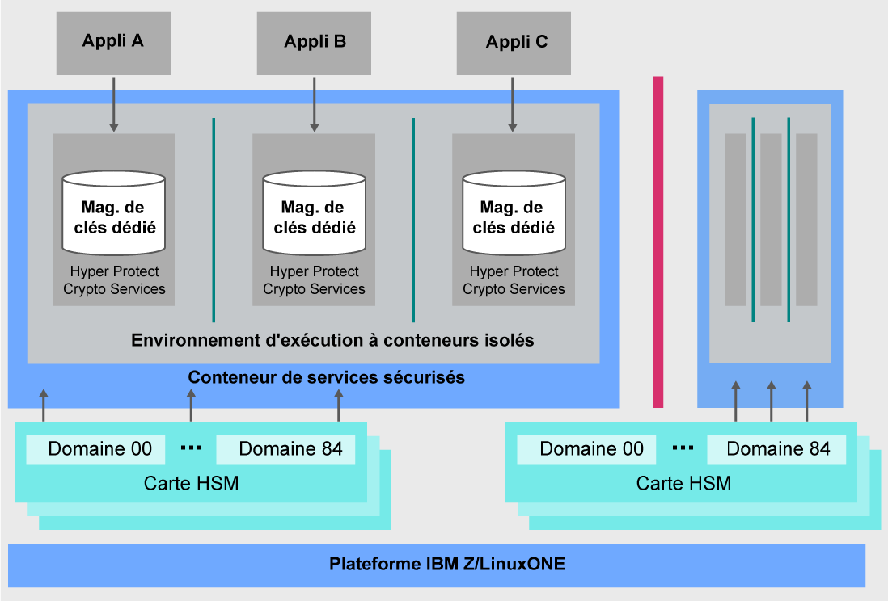

---

copyright:
  years: 2018, 2019
lastupdated: "2019-02-05"

Keywords: IBM Key, data security, Hyper Protect Crypto Services, HSM

subcollection: hs-crypto

---

{:new_window: target="_blank"}
{:shortdesc: .shortdesc}
{:screen: .screen}
{:codeblock: .codeblock}
{:pre: .pre}
{:important: .important}

# Présentation d'{{site.data.keyword.cloud_notm}} {{site.data.keyword.hscrypto}}
{: #overview}

La sécurité des données et des informations est vitale pour les environnements informatiques. De plus en plus de données étant déplacées vers le cloud, les protéger devient un véritable défi.  {{site.data.keyword.cloud}} {{site.data.keyword.hscrypto}} offre des services de cryptographie qui protègent vos données au moyen d'une technologie dont le niveau de sécurité est le plus élevé de l'industrie.
{: shortdesc}

## Pourquoi {{site.data.keyword.cloud_notm}} {{site.data.keyword.hscrypto}} ?

Reposant sur la technologie IBM LinuxONE, {{site.data.keyword.hscrypto}} permet de garantir qu'il n'y a que vous qui ayez accès à vos clés. Un service exclusif de gestion de clés, avec une fonction de mise en coffre des clés fournie par des modules HSM (Hardware Security Module) dédiés, vous facilite la création des clés de chiffrement. Sinon, vous pouvez aussi apporter vos propres clés de chiffrement à gérer. Le module HSM de cloud géré prenant en charge les standards de l'industrie, <!-- such as PKCS #11,--> vos applications peuvent intégrer des opérations cryptographiques comme la signature numérique et la validation.

<!-- via PKCS#11 application programming interfaces (APIs). You can access {{site.data.keyword.hscrypto}} with several popular programming languages such as Java, JavaScript, and Swift. -->

{{site.data.keyword.hscrypto}} est le mécanisme de cryptographie avec lequel est bâti {{site.data.keyword.blockchainfull_notm}} Platform. Ce mécanisme garantit que le réseau de blockchain fonctionne dans un environnement hautement protégé et isolé et accélère le hachage, les opérations de signature/vérification et les communications de noeud à noeud dans le réseau. Le succès rencontré par {{site.data.keyword.blockchainfull_notm}} Platform témoigne des capacités et de la valeur de {{site.data.keyword.hscrypto}}.

## Comment {{site.data.keyword.hscrypto}} fonctionne-t-il ?
{: #architecture}

Le diagramme suivant illustre le principe de fonctionnement de {{site.data.keyword.hscrypto}}.

*Figure 1. Architecture de {{site.data.keyword.hscrypto}}*  

Voici quelques-uns des points clés de l'architecture de {{site.data.keyword.hscrypto}} :

<!-- * Applications connect to {{site.data.keyword.hscrypto}} through PKCS#11 APIs. -->

- Un magasin de clés est fourni dans {{site.data.keyword.hscrypto}} pour assurer l'isolement et la sécurité des données. Pour prévenir toute utilisation abusive des pouvoirs que possèdent les administrateurs système et les utilisateurs root, l'accès aux données par les utilisateurs privilégiés est bloqué.  
- Secure Service Container (SSC) offre le niveau de sécurité et d'imprégnabilité que les entreprises clientes attendent de la technologie IBM Z.  
- Les modules HSM cloud conformes à la spécification FIPS 140-2 Level 4 assurent la protection des secrets avec le plus haut niveau de sécurité physique.  

## Fonctions principales
{: #key-features}

Voici la liste des caractéristiques et fonctionnalités majeures de {{site.data.keyword.hscrypto}} :

### Protection des services de données d'{{site.data.keyword.cloud_notm}} au moyen de clés de chiffrement, elles-mêmes protégées par des HSM cloud sous contrôle du client
{: #key-feature-1}

{{site.data.keyword.hscrypto}} supporte le mécanisme KYOK (Keep Your Own Keys). Les clés de chiffrement que vous utilisez et gérez sont les vôtres. Vous avez ainsi un meilleur contrôle et davantage de droits sur vos données. La disponibilité de modules matériels de sécurité (HSM) cloud contrôlés par le client permet à ce dernier de protéger ses clés numériques dans {{site.data.keyword.cloud_notm}} conformément aux normes de l'industrie les plus strictes et d'être le seul à pouvoir y accéder.<!-- The HSM provides PKCS#11 APIs, which makes {{site.data.keyword.hscrypto}} accessible by several popular programming languages such as Java, JavaScript, and Swift.-->

### Technologie certifiée FIPS 140-2 Level 4
{: #key-feature-2}

{{site.data.keyword.hscrypto}} vous fait profiter de la technologie certifiée FIPS 140-2 Level 4, c'est-à-dire le plus haut niveau de sécurité qui soit pour un matériel cryptographique. <!-- Industries, such as financial sector services, require this level of security to protect their data.--> A ce niveau de sécurité, ce sont des mécanismes physiques qui interviennent pour offrir une enveloppe de protection complète autour du module cryptographique, l'objectif étant de détecter toutes les tentatives d'accès physique non autorisé et d'y répondre.

### Aucun accès à vos clés et données par les utilisateurs privilégiés
{: #key-feature-3}

{{site.data.keyword.hscrypto}} fait profiter l'environnement {{site.data.keyword.cloud_notm}} des capacités uniques de protection des données caractéristiques d'IBM Z. {{site.data.keyword.hscrypto}} offre le niveau de sécurité et d'imprégnabilité que les entreprises clientes attendent de la technologie IBM Z. La virtualisation du matériel est utilisée pour protéger vos données dans un environnement isolé. De cette façon, une instance de service par service dédiée est fournie, ce qui fait qu'aucun accès externe vers vos données n'est autorisé, incluant celui d'utilisateurs privilégiés comme les administrateurs de cloud. Celles-ci sont donc moins exposées aux menaces de l'intérieur.

### Intégration d'{{site.data.keyword.keymanagementservicefull_notm}} pour sécuriser les données {{site.data.keyword.cloud_notm}} et les services de stockage
{: #key-feature-4}

Les API d'{{site.data.keyword.keymanagementservicefull_notm}} sont intégrées dans {{site.data.keyword.hscrypto}} pour assurer la génération et la protection des clés. {{site.data.keyword.hscrypto}} protège ces clés et les stocke dans un environnement hautement protégé et isolé sur IBM Z, système qui protège les données avec une technologie certifiée au plus haut niveau de sécurité de l'industrie.

<!-- {{site.data.keyword.hscrypto}} also leverages the **IBM Advanced Crypto Service Provider (ACSP)** solution that enables remote access to the IBM’s cryptographic coprocessors. ACSP allows for utilization of strong hardware-based cryptography as a service in distributed environments where data security cannot be guaranteed. {{site.data.keyword.hscrypto}} utilizes ACSP as a *network hardware security module (NetHSM)* that provides access to HSM via PKCS#11 standard APIs.-->

<!-- With {{site.data.keyword.hscrypto}}, your **SSL keys are offloaded** to a {{site.data.keyword.hscrypto}} to ensure security and protection of those sensitive keys.  Besides, the certificate lifecycle management gets common approach to manage certificates and offers the visibility to certificate expiration.-->

## Rôles et responsabilités
{: #roles-responsibilities}

Le tableau suivant décrit les rôles prévus par {{site.data.keyword.hscrypto}}.

<table>
  <tr>
    <th>Rôles</th>
    <th>Responsabilités</th>
  </tr>
  <tr>
    <td>Administrateur d'unité crypto</td>
    <td>
      Signe des commandes d'administration, comme celles permettant l'installation d'un autre administrateur d'unité crypto, et fournit des clés de signature.
    </td>
  </tr>
  <tr>
    <td>Propriétaire de clés</td>
    <td>Fournit des parties de clés maître pour l'initialisation d'une instance de service.</td>
  </tr>
  <tr>
    <td>Utilisateur du service</td>
    <td>Il stocke, récupère et génère des clés racine et des clés standard via l'interface utilisateur et les API.</td>
  </tr>
  <caption style="caption-side:bottom;">Tableau 1. Rôles et responsabilités</caption>
</table>
