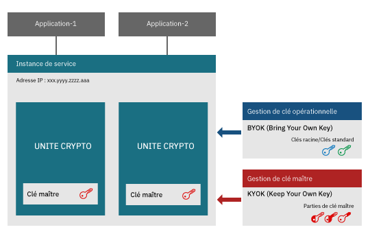
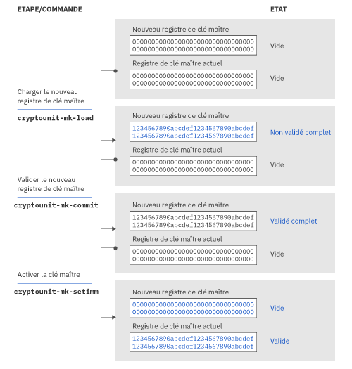

---

copyright:
  years: 2018, 2019
lastupdated: "2019-03-21"

Keywords: hsm, Trusted Key Entry plug-in, service instance, imprint mode

subcollection: hs-crypto

---

{:new_window: target="_blank"}
{:shortdesc: .shortdesc}
{:screen: .screen}
{:codeblock: .codeblock}
{:pre: .pre}
{:important: .important}

# Introduction à l'initialisation d'une instance de service
{: #introduce-service}

Avant de démarrer l'initialisation de l'instance de service d'{{site.data.keyword.hscrypto}}, prenez d'abord connaissance des concepts de base et de la logique du processus.  
{:shortdesc}

Une instance {{site.data.keyword.hscrypto}} (ou instance de service, en abrégé) est un groupe d'unités crypto qui sont affectées à un compte utilisateur IBM Cloud. Une instance de service peut avoir jusqu'à six unités crypto. Si vous configurez un environnement de production, il vous est conseillé d'affecter au moins deux unités crypto par instance de service pour la haute disponibilité. Les unités crypto doivent se trouver sur des modules HSM (Hardware Security Module) différents. Toutes les unités crypto d'une instance de service doivent être configurées de la même façon. Si l'une partie d'IBM Cloud n'est pas accessible, les autres unités crypto de la même instance de service peuvent être utilisées de façon interchangeable. Les unités crypto contiennent des clés maître qui chiffrent le contenu d'un stockage de clés. Avec la technologie Keep Your Own Keys, les administrateurs d'instance de service sont les seules personnes qui peuvent accéder à la clé maître.

Le diagramme suivant illustre une instance de service avec deux unités crypto.

*Figure 1. Composants d'une instance de service*

## Module HSM (Hardware Security Module)
{: #introduce-HSM}

Un module HSM (Hardware Security Module) est une unité physique qui protège et gère les clés numériques pour une authentification forte et fournit un traitement cryptographique. Les modules HSM d'{{site.data.keyword.cloud_notm}} {{site.data.keyword.hscrypto}} sont certifiés FIPS 140-2 Level 4, qui est le niveau de sécurité maximal pour un matériel cryptographique. A ce niveau de sécurité, ce sont des mécanismes physiques qui interviennent pour offrir une enveloppe de protection complète autour du module cryptographique, l'objectif étant de détecter toutes les tentatives d'accès physique non autorisé et d'y répondre.

## Unité crypto
{: #introduce-crypto-unit}

Une unité crypto est une unité unique qui représente un module HSM et la pile de logiciels correspondante, dédiée au module HSM. Chaque unité crypto peut gérer jusqu'à 5000 clés numériques. Une instance de service peut avoir jusqu'à six unités crypto. Si vous configurez un environnement de production, il vous est conseillé d'affecter au moins deux unités crypto par instance de service pour la haute disponibilité. Toutes les unités crypto d'une instance de service doivent être configurées de la même façon. Si l'une partie d'IBM Cloud n'est pas accessible, les autres unités crypto de la même instance de service peuvent être utilisées de façon interchangeable. 

## Plug-in Trusted Key Entry
{: #introduce-TKE}

En utilisant le plug-in Trusted Key Entry, vous pouvez charger les registres de clé maître dans votre compte utilisateur {{site.data.keyword.cloud}} avec des valeurs que vous choisissez et contrôler. Le plug-in Trusted Key Entry fournit un ensemble de fonctions permettant de gérer les unités crypto affectées à un compte utilisateur {{site.data.keyword.cloud_notm}}. Le plug-in vous permet de charger les valeurs de vos clés maître.

## Administrateurs
{: #introduce-administrators}

Les administrateurs peuvent être ajoutés aux unités crypto cible pour émettre des commandes dans les unités crypto. Un administrateur possède sa propre clé de signature privée. Une fois les clés de signature générées, vous devez ajouter à l'unité crypto cible les administrateurs, avec les clés de signature.

## Clés de signature
{: #introduce-signature-keys}

Un administrateur doit signer les commandes émises dans l'unité crypto, en y apposant une signature. La partie privée du fichier de clé de signature est utilisée pour créer des signatures. La partie publique est placée dans un certificat qui est installé dans une unité crypto cible pour définir un administrateur d'unité crypto. Les commandes émises en mode imprint n'ont pas besoin d'être signées.

## Mode imprint
{: #introduce-imprint-mode}

Les unités crypto qui sont affectées à un utilisateur IBM Cloud démarrent dans un état effacé qui porte le nom de mode imprint. Une unité crypto en mode imprint n'est pas sécurisée. Les registres de clé maître ne peuvent pas être chargés en mode imprint. Vous pouvez uniquement configurer des administrateurs d'unités crypto et effacer une unité crypto, en mode imprint. Les commandes émises dans une unité crypto en mode imprint n'ont pas besoin d'être signées. Toutefois, la commande permettant de quitter le mode imprint doit être signée par l'un des administrateurs d'unités crypto ajouté en utilisant la clé de signature. 

## Clés maître
{: #introduce-master-key}

Les clés maître sont utilisées pour chiffrer l'instance de service pour le stockage de clés. Avec la clé maître, vous détenez la racine de confiance qui chiffre la chaîne complète de clés comprenant les clés racine et les clés standard. IBM ne sauvegarde pas et ne gère pas la clé maître et n'a donc aucun moyen de la copier ou de la restaurer sur une autre machine ou dans un autre centre de données. Une instance de service ne peut avoir qu'une seule clé maître. Si vous supprimez la clé maître de l'instance de service, vous pouvez efficacement détruire par crypto-broyage toutes les données qui ont été chiffrées avec les clés gérées dans le service.

Pour plus d'informations sur les types de clé qui gèrent {{site.data.keyword.hscrypto}}, voir [Introduction aux clés](/docs/services/hs-crypto/keys_intro.html#introduce-keys).

## Parties de clé maître
{: #introduce-key-parts}

Le nouveau registre de clé maître est chargé en utilisant des parties de clé maître multiples. Dans le plug-in Trusted Key Entry, chaque partie de clé maître est stockée dans un fichier de partie de clé maître. Deux ou trois parties de clé maître peuvent être utilisées pour charger le nouveau registre de clé maître. Pour des raisons de sécurité, une personne différente peut posséder chaque partie de clé. Le propriétaire d'une partie de clé doit être la seule personne à connaître le mot de passe associé au fichier de cette partie de clé.

## Registres de clé maître
{: #introduce-key-registers}

Chaque unité crypto dispose de deux registres de clé maître : un nouveau registre de clé maître et un registre de clé maître actuel. La valeur du registre de clé maître actuel chiffre le contenu de la clé de stockage de l'utilisateur. Le nouveau registre de clé maître est utilisé pour changer la valeur du registre de clé maître actuel. Lors de cette modification, le contenu du stockage de clés doit être rechiffré avec la valeur de la nouvelle clé maître. Cette opération doit porter sur les deux valeurs de clé, celle du registre de clé maître actuel et celle du nouveau registre de clé maître. Les valeurs de clé dans le stockage de clés sont déchiffrées en utilisant la valeur du registre de clé maître actuel puis rechiffrées en se servant de la valeur du nouveau registre de clé maître. Le rechiffrement, qui se produit dans le module HSM, est donc sécurisé. Une fois que tout le contenu du stockage de clés a été rechiffré, la valeur du nouveau registre de clé maître peut être déplacée dans le registre de clé maître actuel.

Le diagramme suivant illustre comment l'état du registre de clé maître change et comment la clé maître est chargée.

*Figure 1. Chargement des clés maître*  
