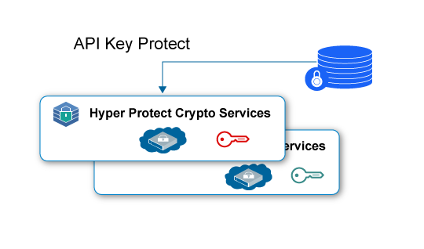
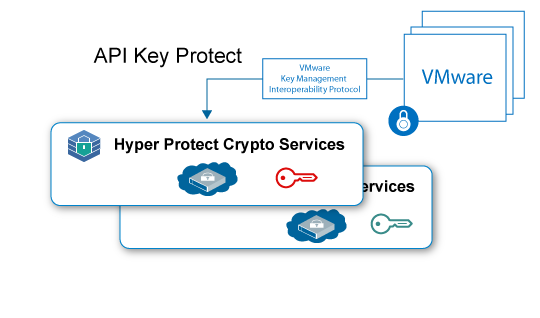

---

copyright:
  years: 2018, 2019
lastupdated: "2019-01-15"

Keywords: Hyper Protect Crypto Services, Keep Your Own Keys, VMware

subcollection: hs-crypto

---

{:new_window: target="_blank"}
{:shortdesc: .shortdesc}
{:screen: .screen}
{:codeblock: .codeblock}
{:pre: .pre}

# Cas d'utilisation {{site.data.keyword.hscrypto}}
{: #use-cases}

Cette page comprend les cas d'utilisation actuellement inclus dans {{site.data.keyword.hscrypto}}. Ces cas d'utilisation évolueront continuellement au fil des versions publiées.
{:shortdesc}

## Chiffrement des données au repos avec Keep Your Own Keys

Vous pouvez utiliser {{site.data.keyword.hscrypto}} pour chiffrer vos données au repos avec le plus haut niveau de sécurité et avec vos propres clés. {{site.data.keyword.hscrypto}} fournit des capacités de gestion de clés qui vous permettent de générer et de gérer vos clés en utilisant les API d'{{site.data.keyword.keymanagementservicefull_notm}}.

Voici quelques-uns des avantages que confère l'utilisation de {{site.data.keyword.hscrypto}} pour protéger vos données au repos :

 * {{site.data.keyword.hscrypto}} permet le chiffrement des données au repos (inactives), qu'il s'agisse de données cloud ou de données gérées par les services de stockage.
 * {{site.data.keyword.hscrypto}} prend en charge le mécanisme KYOK (Keep Your Own Keys). Les clés de chiffrement que vous utilisez et gérez sont les vôtres. Vous avez ainsi plus de contrôle et de droits sur vos données.
 * Les API d'{{site.data.keyword.keymanagementservicefull_notm}} sont intégrées pour la génération et la protection des clés.
 * Vos clés sont protégées avec le plus haut niveau de sécurité qui soit, la technologie certifiée FIPS 140-2 Level 4.
 * Les clés sont protégées par des HSM dédiés et gérés par le client. En tant que client, vous êtes donc le seul à avoir accès à vos données.

*Figure 1. Chiffrement des données au repos avec KYOK*

## Protection des images VMware avec Keep Your Own Keys

Comme pour les données au repos, {{site.data.keyword.hscrypto}} peut protéger les images VMware au repos et assurer leur chiffrement et leur déchiffrement via VMware Key Management Interoperability Protocol.

En tant que service exclusif, {{site.data.keyword.hscrypto}} offre un contrôle dédié du module matériel de sécurité (HSM) protégeant les images VMware de chaque client. {{site.data.keyword.hscrypto}} étend la famille de services de gestion de clés proposés dans l'{{site.data.keyword.cloud_notm}} aux instances à service exclusif dont le contrôle du secret est assuré par un matériel dédié.

*Figure 2. Protection des images VMware avec KYOK*
