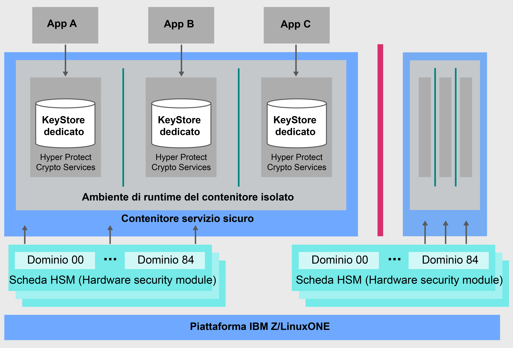

---

copyright:
  years: 2018, 2019
lastupdated: "2019-02-05"

Keywords: IBM Key, data security, Hyper Protect Crypto Services, HSM

subcollection: hs-crypto

---

{:new_window: target="_blank"}
{:shortdesc: .shortdesc}
{:screen: .screen}
{:codeblock: .codeblock}
{:pre: .pre}
{:important: .important}

# Panoramica di {{site.data.keyword.cloud_notm}} {{site.data.keyword.hscrypto}}
{: #overview}

La sicurezza dei dati e delle informazioni è fondamentale ed essenziale per gli ambienti IT. Man mano che sempre più dati passano al cloud, mantenere i dati protetti diventa una sfida significativa.  {{site.data.keyword.cloud}} {{site.data.keyword.hscrypto}} offre la crittografia con una tecnologia che ha raggiunto il più alto livello di sicurezza del settore per proteggere i tuoi dati.
{: shortdesc}

## Perché {{site.data.keyword.cloud_notm}} {{site.data.keyword.hscrypto}}?

Basato su tecnologia IBM LinuxONE, {{site.data.keyword.hscrypto}} garantisce che tu sia l'unico ad avere accesso alle tue chiavi. Un servizio di gestione della chiave a singolo tenant con un archivio di chiavi fornito da HSM controllati dal cliente dedicati, che ti aiuta a creare le chiavi di crittografia con facilità. In alternativa, puoi utilizzare le tue chiavi di crittografia per la gestione. L'HSM cloud gestito supporta gli standard del settore, <!-- such as PKCS #11,--> per cui le tue applicazioni possono integrare operazioni di crittografia come la convalida e la firma digitali.

<!-- via PKCS#11 application programming interfaces (APIs). You can access {{site.data.keyword.hscrypto}} with several popular programming languages such as Java, JavaScript, and Swift. -->

{{site.data.keyword.hscrypto}} è la crittografia con cui è stato creato {{site.data.keyword.blockchainfull_notm}} Platform. Questo meccanismo di crittografia garantisce che la rete blockchain sia in esecuzione in un ambiente altamente protetto e isolato e accelera l'hashing, le operazioni di firma/verifica e le comunicazioni da nodo a nodo nella rete. Il successo di {{site.data.keyword.blockchainfull_notm}} Platform dimostra la capacità e il valore di {{site.data.keyword.hscrypto}}

## Come funziona {{site.data.keyword.hscrypto}}?
{: #architecture}

Il seguente diagramma architettonico mostra come funziona {{site.data.keyword.hscrypto}}.

*Figura 1. Architettura di {{site.data.keyword.hscrypto}}*  

Di seguito sono riportati alcuni punti salienti dell'architettura {{site.data.keyword.hscrypto}}:

<!-- * Applications connect to {{site.data.keyword.hscrypto}} through PKCS#11 APIs. -->

- Viene fornito il KeyStore dedicato in {{site.data.keyword.hscrypto}} per garantire l'isolamento e la sicurezza dei dati. Gli utenti privilegiati sono bloccati per garantire la protezione contro l'uso abusivo di credenziali di amministratori di sistema o utenti root.  
- SSC (Secure Service Container) fornisce il livello enterprise di sicurezza e inaccessibilità che i clienti aziendali si aspettano dalla tecnologia IBM Z.  
- L'HMS su cloud conforme a FIPS 140-2 Level 4 è abilitato per la massima protezione fisica dei segreti.  

## Funzioni chiave
{: #key-features}

Di seguito sono riportate le funzioni chiave di {{site.data.keyword.hscrypto}}:

### Protezione dei servizi dati {{site.data.keyword.cloud_notm}} mediante chiavi di crittografia con HSM su cloud controllati dal cliente
{: #key-feature-1}

{{site.data.keyword.hscrypto}} supporta la funzione KYOK (Keep Your Own Keys) che ti permette di avere più controllo e autorità sui dati con le chiavi di crittografia che puoi conservare, controllare e gestire. Il supporto disponibile per gli HSM (Hardware Security Module) su cloud controllati dal cliente consente che le chiavi digitali siano protette in conformità con le normative del settore in {{site.data.keyword.cloud_notm}} e che siano accessibili solo al cliente.<!-- The HSM provides PKCS#11 APIs, which makes {{site.data.keyword.hscrypto}} accessible by several popular programming languages such as Java, JavaScript, and Swift.-->

### Tecnologia certificata da FIPS 140-2 Level 4 fornita
{: #key-feature-2}

{{site.data.keyword.hscrypto}} fornisce l'accesso alla tecnologia certificata da FIPS 140-2 Level 4, il massimo livello di sicurezza raggiungibile per l'hardware di crittografia. <!-- Industries, such as financial sector services, require this level of security to protect their data.--> A questo livello di sicurezza, i meccanismi di sicurezza fisica forniscono una protezione completa attorno al modulo di crittografia con l'intento di rilevare e rispondere a tutti i tentativi non autorizzati di accesso fisico.

### Nessun accesso di utente privilegiato alle tue chiavi e ai tuoi dati
{: #key-feature-3}

{{site.data.keyword.hscrypto}} porta le esclusive funzionalità di protezione dei dati da IBM Z a {{site.data.keyword.cloud_notm}}. {{site.data.keyword.hscrypto}} protegge i tuoi dati in SSC che fornisce il livello enterprise di sicurezza e inaccessibilità che i clienti aziendali si aspettano dalla tecnologia IBM Z. Viene utilizzata la virtualizzazione dell'hardware per proteggere i tuoi dati in un ambiente isolato. In questo modo viene fornito un servizio dedicato per istanza del servizio, per cui non è consentito alcun accesso esterno, incluso quello degli utenti privilegiati come gli amministratori cloud, ai tuoi dati. Pertanto, viene ridotto il rischio di compromissione dei dati contro le minacce interne.

### Integrazione di {{site.data.keyword.keymanagementservicefull_notm}} per proteggere i servizi di dati e archiviazione {{site.data.keyword.cloud_notm}}
{: #key-feature-4}

Le API {{site.data.keyword.keymanagementservicefull_notm}} sono integrate in {{site.data.keyword.hscrypto}} per generare e proteggere le chiavi. {{site.data.keyword.hscrypto}} protegge queste chiavi e le memorizza in un ambiente altamente protetto e isolato su IBM Z, che protegge i tuoi dati con la tecnologia certificata al più alto livello di sicurezza del settore.

<!-- {{site.data.keyword.hscrypto}} also leverages the **IBM Advanced Crypto Service Provider (ACSP)** solution that enables remote access to the IBM’s cryptographic coprocessors. ACSP allows for utilization of strong hardware-based cryptography as a service in distributed environments where data security cannot be guaranteed. {{site.data.keyword.hscrypto}} utilizes ACSP as a *network hardware security module (NetHSM)* that provides access to HSM via PKCS#11 standard APIs.-->

<!-- With {{site.data.keyword.hscrypto}}, your **SSL keys are offloaded** to a {{site.data.keyword.hscrypto}} to ensure security and protection of those sensitive keys.  Besides, the certificate lifecycle management gets common approach to manage certificates and offers the visibility to certificate expiration.-->

## Ruoli e responsabilità
{: #roles-responsibilities}

La seguente tabella mostra i ruoli supportati da {{site.data.keyword.hscrypto}}.

<table>
  <tr>
    <th>Ruoli</th>
    <th>Responsabilità</th>
  </tr>
  <tr>
    <td>Amministratore dell'unità di crittografia</td>
    <td>
      Firma i comandi di gestione, ad esempio quelli per l'installazione di un altro amministratore dell'unità di crittografia, e fornisce le chiavi di firma.
    </td>
  </tr>
  <tr>
    <td>Proprietario della chiave</td>
    <td>Fornisce le parti della chiave master per l'inizializzazione di un'istanza del servizio.</td>
  </tr>
  <tr>
    <td>Utente di servizio</td>
    <td>Memorizza, recupera e genera chiavi root e chiavi standard tramite l'interfaccia utente e le API.</td>
  </tr>
  <caption style="caption-side:bottom;">Tabella 1. Ruoli e responsabilità</caption>
</table>
