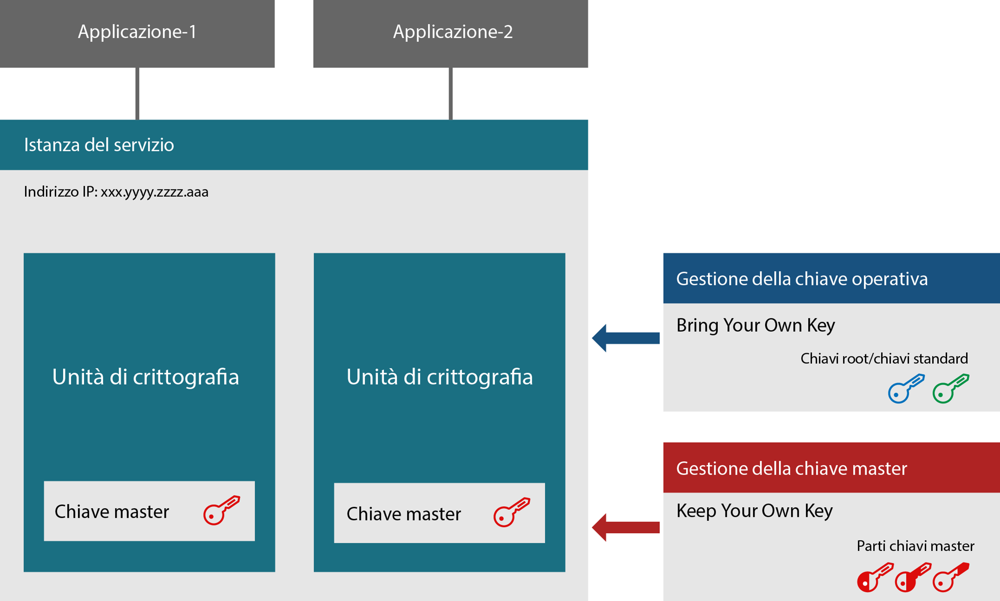
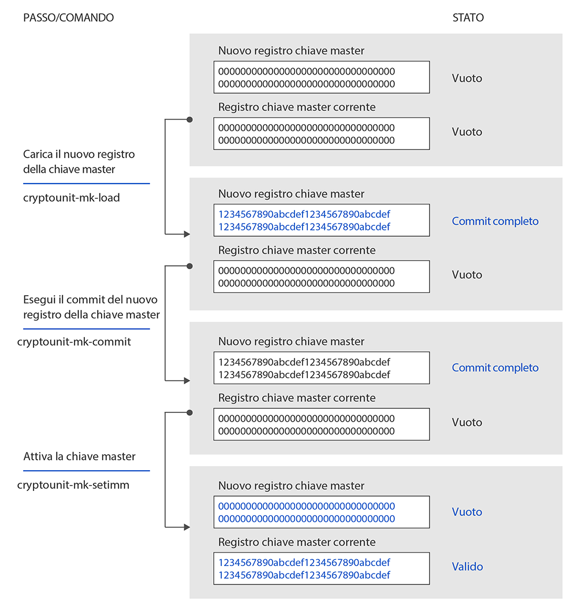

---

copyright:
  years: 2018, 2019
lastupdated: "2019-03-21"

Keywords: hsm, Trusted Key Entry plug-in, service instance, imprint mode

subcollection: hs-crypto

---

{:new_window: target="_blank"}
{:shortdesc: .shortdesc}
{:screen: .screen}
{:codeblock: .codeblock}
{:pre: .pre}
{:important: .important}

# Introduzione all'inizializzazione dell'istanza del servizio
{: #introduce-service}

Prima di avviare l'inizializzazione dell'istanza del servizio di {{site.data.keyword.hscrypto}}, potresti voler prima conoscere i concetti base e la logica del processo.  
{:shortdesc}

Un'istanza {{site.data.keyword.hscrypto}} (istanza del servizio in breve) è un gruppo di unità di crittografia assegnate a un account utente IBM Cloud. Un'istanza del servizio può avere fino a sei unità di crittografia. Se stai configurando un ambiente di produzione, ti consigliamo di assegnare almeno due unità di crittografia per istanza del servizio per l'elevata disponibilità. Le unità di crittografia dovrebbero trovarsi su HSM (Hardware security module) diversi. Tutte le unità di crittografia in un'istanza del servizio dovrebbero essere configurate allo stesso modo. Se non è possibile accedere a una parte di IBM Cloud, le unità di crittografia in un'istanza del servizio possono essere utilizzate in modo intercambiabile. Le unità di crittografia contengono le chiavi master che crittografano i contenuti dell'archivio di chiavi. Con la tecnologia KYOK (Keep You Own Keys), gli amministratori dell'istanza del servizio sono le uniche persone che possono accedere alla chiave master.

Il seguente diagramma illustra un'istanza di servizi con due unità di crittografia.

*Figura 1. Componenti dell'istanza del servizio*

## HSM (Hardware Security Module)
{: #introduce-HSM}

Un HSM è un dispositivo fisico che protegge e gestisce le chiavi digitali per un'autenticazione avanzata e fornisce un'elaborazione della crittografia. Gli HSM di {{site.data.keyword.cloud_notm}} {{site.data.keyword.hscrypto}} sono certificati da FIPS 140-2 Level 4, con il massimo livello di sicurezza per l'hardware di crittografia. A questo livello di sicurezza, i meccanismi di sicurezza fisica forniscono una protezione completa attorno al modulo di crittografia con l'intento di rilevare e rispondere a tutti i tentativi non autorizzati di accesso fisico.

## Unità di crittografia
{: #introduce-crypto-unit}

Un'unità di crittografia è una singola unità che rappresenta un HSM e lo stack software corrispondente dedicato a HSM. Ogni unità di crittografia può gestire fino a 5000 chiavi digitali. Un'istanza del servizio può avere fino a sei unità di crittografia. Se stai configurando un ambiente di produzione, ti consigliamo di assegnare almeno due unità di crittografia per istanza del servizio per l'elevata disponibilità. Tutte le unità di crittografia in un'istanza del servizio dovrebbero essere configurate allo stesso modo. Se non è possibile accedere a una parte di IBM Cloud, le unità di crittografia in un'istanza del servizio possono essere utilizzate in modo intercambiabile. 

## Plugin Trusted Key Entry
{: #introduce-TKE}

Utilizzando il plug-in Trusted Key Entry, puoi caricare i registri della chiave master delle istanze del servizio nel tuo account utente {{site.data.keyword.cloud}} con valori scelti e controllati da te.Il plug-in Trusted Key Entry fornisce una serie di funzioni per la gestione delle unità di crittografia assegnate a un account utente {{site.data.keyword.cloud_notm}}. Il plug-in ti consente di caricare i tuoi valori della chiave master.

## Amministratori
{: #introduce-administrators}

Possono essere aggiunti degli amministratori alle unità di crittografia di destinazione per l'emissione di comandi alle unità di crittografia. Un amministratore gestisce una chiave di firma privata. Dopo che sono state generate le chiavi di firma, devi aggiungere gli amministratori con le chiavi di firma all'unità di crittografia di destinazione.

## Chiavi di firma
{: #introduce-signature-keys}

Un amministratore deve firmare tutti i comandi emessi per l'unità di crittografia con una firma. La parte privata del file delle chiavi di firma viene utilizzata per creare le firme. La parte pubblica viene inserita in un certificato installato in un'unità di crittografia di destinazione per definire un amministratore dell'unità di crittografia. I comandi immessi nella modalità impronta non devono essere firmati.

## Modalità impronta
{: #introduce-imprint-mode}

Le unità di crittografia assegnate a un utente IBM Cloud iniziano in uno stato cancellato noto come modalità di impronta. Un'unità di crittografia in modalità di impronta non è sicura. I registri della chiave master non possono essere caricati nella modalità impronta. Nella modalità impronta puoi solo configurare gli amministratori dell'unità di crittografia e cancellare l'unità di crittografia. I comandi immessi per un'unità di crittografia nella modalità impronta non devono essere firmati. Tuttavia, il comando per uscire dalla modalità di impronta deve essere firmato da uno degli amministratori dell'unità di crittografia aggiunti utilizzando la chiave di firma. 

## Chiavi master
{: #introduce-master-key}

Le chiavi master vengono utilizzate per crittografare l'istanza del servizio per l'archiviazione delle chiavi. Con la chiave master, possiedi la radice di attendibilità che crittografa l'intera catena di chiavi, comprese le chiavi root e le chiavi standard. IBM non esegue il backup o manipola la chiave master e non ha modo di copiarla o ripristinarla su un altro computer o data center. Un'istanza del servizio può avere una sola chiave master. Se elimini la chiave master dell'istanza del servizio, puoi effettivamente eliminare a livello crittografico tutti i dati che erano stati crittografati con le chiavi gestite nel servizio.

Per ulteriori informazioni sui tipi di chiave gestiti da {{site.data.keyword.hscrypto}}, vedi [Introduzione alle chiavi](/docs/services/hs-crypto/keys_intro.html#introduce-keys).

## Parti della chiave master
{: #introduce-key-parts}

Il nuovo registro della chiave master viene caricato utilizzando più parti della chiave master. Nel plugin Trusted Key Entry, ogni parte della chiave master viene archiviata in un file della parte della chiave master. Due o tre parti della chiave master possono essere utilizzate per caricare il nuovo registro della chiave master. Per motivi di sicurezza, ogni parte della chiave può essere posseduta da una persona diversa. Il proprietario della parte della chiave deve essere l'unica persona a conoscere la password associata al file delle parti della chiave.

## Registri della chiave master
{: #introduce-key-registers}

Ogni unità di crittografia ha due registri della chiave master: un nuovo registro della chiave master e quello corrente. Il valore nel registro della chiave master corrente crittografa i contenuti dell'archivio di chiavi dell'utente. Il nuovo registro della chiave master viene utilizzato per modificare il valore in quello corrente. Quando modifichi il valore del registro della chiave master corrente, i contenuti dell'archivio di chiavi devono essere ricifrati con il nuovo valore dalla chiave master. Sia il valore della nuova chiave master che il valore di quella corrente sono necessari per questa operazione. I valori della chiave nell'archivio di chiavi vengono decifrati utilizzando il valore nel registro della chiave master corrente e poi ricifrati utilizzando il valore nel nuovo registro della chiave master. La ricifratura avviene all'interno dell'HSM, per cui è sicura. Dopo che l'intero contenuto dell'archivio di chiavi è stato ricifrato, il valore del nuovo registro della chiave master può essere spostato nel registro della chiave master corrente.

Il seguente diagramma illustra come lo stato del registro della chiave master viene modificato e come viene caricata la chiave master.

*Figura 1. Caricamento delle chiavi master*  
