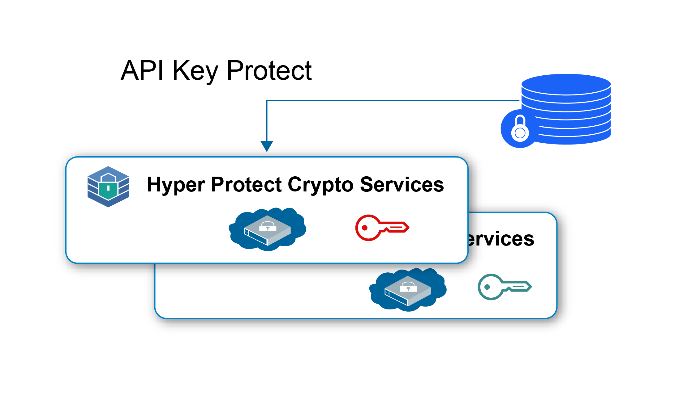
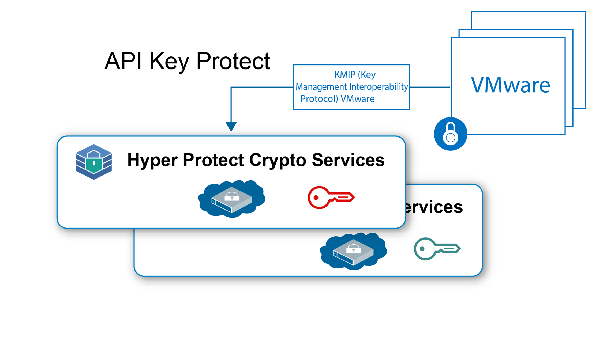

---

copyright:
  years: 2018, 2019
lastupdated: "2019-01-15"

Keywords: Hyper Protect Crypto Services, Keep Your Own Keys, VMware

subcollection: hs-crypto

---

{:new_window: target="_blank"}
{:shortdesc: .shortdesc}
{:screen: .screen}
{:codeblock: .codeblock}
{:pre: .pre}

# Casi di utilizzo di {{site.data.keyword.hscrypto}}
{: #use-cases}

Questa pagina descrive i casi di utilizzo attualmente inclusi in {{site.data.keyword.hscrypto}}. Questi casi di utilizzo saranno in continua evoluzione nelle release successive.
{:shortdesc}

## Crittografia dei dati inattivi con KYOK (Keep Your Own Keys)

Puoi utilizzare {{site.data.keyword.hscrypto}} per crittografare i tuoi dati inattivi nel più alto livello di sicurezza con le tue chiavi. {{site.data.keyword.hscrypto}} fornisce le funzionalità di gestione delle chiavi per generare e gestire le tue chiavi utilizzando le API {{site.data.keyword.keymanagementservicefull_notm}}.

Di seguito sono riportati alcuni punti salienti dell'utilizzo di {{site.data.keyword.hscrypto}} per proteggere i dati inattivi:

 * {{site.data.keyword.hscrypto}} abilita la crittografia dei dati inattivi per i servizi di dati e archiviazione su cloud.
 * {{site.data.keyword.hscrypto}} supporta la funzione KYOK (Keep Your Own Keys) che ti permette di avere più controllo e autorità sui dati con le chiavi di crittografia che puoi portare, controllare e gestire.
 * Le API {{site.data.keyword.keymanagementservicefull_notm}} vengono integrate per la generazione e la protezione delle chiavi.
 * Le tue chiavi sono protette con la massima sicurezza, la tecnologia certificata da FIPS 140-2 Level 4.
 * Le chiavi sono protette da HSM dedicati gestiti dal cliente, il che significa che solo tu hai accesso ai tuoi dati.

*Figura 1. Crittografia dei dati inattivi con KYOK*

## Protezione dell'immagine VMware con KYOK (Keep Your Own Keys)

Analogamente alla protezione dei dati inattivi, {{site.data.keyword.hscrypto}} può anche proteggere l'immagine VMware inattiva per la crittografia e la decrittografia tramite il protocollo KMIP (Key Management Interoperability Protocol) VMware.

Come servizio a singolo tenant, {{site.data.keyword.hscrypto}} offre un controllo dedicato dell'HSM (Hardware Security Module) per le immagini VMware per ciascun cliente. {{site.data.keyword.hscrypto}} estende la famiglia di servizi di gestione delle chiavi in {{site.data.keyword.cloud_notm}} verso le istanze a singolo tenant con il controllo segreto hardware dedicato.

*Figura 2. Protezione dell'immagine VMware con KYOK*
