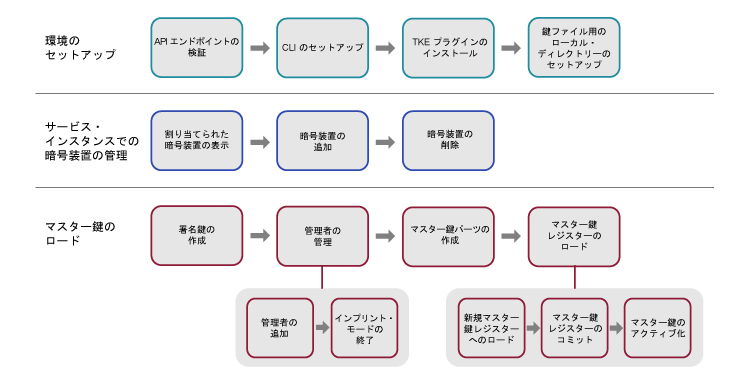

---

copyright:
  years: 2018, 2019
lastupdated: "2019-03-21"

Keywords: key storage, HSM, hardware security module

subcollection: hs-crypto

---

{:new_window: target="_blank"}
{:shortdesc: .shortdesc}
{:screen: .screen}
{:codeblock: .codeblock}
{:pre: .pre}
{:important: .important}
{:tip: .tip}

# サービス・インスタンスの初期化
{: #initialize-hsm}

{{site.data.keyword.hscrypto}} インスタンス (略してサービス・インスタンス) を使い始める前に、Trusted Key Entry プラグインを使用してマスター鍵レジスターをロードする必要があります。
{:shortdesc}

サービス・インスタンスを初期化するには、まず Trusted Key Entry プラグインを使用してマスター鍵をサービス・インスタンスの鍵ストレージにロードする必要があります。この Trusted Key Entry プラグインを使用してマスター鍵の値をロードすることができます。

サービス・インスタンスの初期化とその他の概念の概要については、[サービス・インスタンス初期化の概要](/docs/services/hs-crypto/service_instance_concepts.html#introduce-service)を参照してください。

次の図は、サービス・インスタンスを初期化するために必要な手順の概要を示しています。詳細な手順については、図の各手順をクリックしてください。


<map name="home_map1" id="home_map1">
<area href="/docs/services/hs-crypto?topic=hs-crypto-initialize-hsm#initialize-crypto-prerequisites" alt="API エンドポイントの検証" title="API エンドポイントの検証" shape="rect" coords="151, 20, 241, 78" />
<area href="/docs/services/hs-crypto?topic=hs-crypto-initialize-hsm#initialize-crypto-prerequisites" alt="CLI のセットアップ" title="CLI のセットアップ" shape="rect" coords="276, 20, 365, 78" />
<area href="/docs/services/hs-crypto?topic=hs-crypto-initialize-hsm#initialize-crypto-prerequisites4" alt="TKE プラグインのインストール" title="TKE プラグインのインストール" shape="rect" coords="401, 20, 493, 78" />
<area href="/docs/services/hs-crypto?topic=hs-crypto-initialize-hsm#initialize-crypto-prerequisites4" alt="鍵ファイル用のローカル・ディレクトリーのセットアップ" title="鍵ファイル用のローカル・ディレクトリーのセットアップ" shape="rect" coords="528, 20, 619, 78" />
<area href="/docs/services/hs-crypto?topic=hs-crypto-initialize-hsm#Identify_crypto_units" alt="割り当てられた暗号装置の表示" title="割り当てられた暗号装置の表示" shape="rect" coords="148, 111, 241, 171" />
<area href="/docs/services/hs-crypto?topic=hs-crypto-initialize-hsm#Identify_crypto_units1" alt="暗号装置の追加" title="暗号装置の追加" shape="rect" coords="276, 111, 366, 171" />
<area href="/docs/services/hs-crypto?topic=hs-crypto-initialize-hsm#Identify_crypto_units2" alt="暗号装置の削除" title="暗号装置の削除" shape="rect" coords="402, 111, 493, 171" />
<area href="/docs/services/hs-crypto?topic=hs-crypto-initialize-hsm#step1-create-signature-keys" alt="1 つ以上の署名鍵の作成" title="署名鍵の作成" shape="rect" coords="149, 206, 242, 264" />
<area href="/docs/services/hs-crypto?topic=hs-crypto-initialize-hsm#step2-load-admin" alt="暗号装置管理者の管理" title="暗号装置管理者の管理" shape="rect" coords="281, 206, 366, 264" />
<area href="/docs/services/hs-crypto?topic=hs-crypto-initialize-hsm#step2-load-admin" alt="ターゲット暗号装置での 1 人以上の管理者の追加" title="暗号装置管理者の追加" shape="rect" coords="242, 296, 312, 358" />
<area href="/docs/services/hs-crypto?topic=hs-crypto-initialize-hsm#step3-exit-imprint-mode" alt="ターゲット暗号装置でのインプリント・モードの終了" title="インプリント・モードの終了" shape="rect" coords="328, 301, 396, 359" />
<area href="/docs/services/hs-crypto?topic=hs-crypto-initialize-hsm#step4-create-master-key" alt="使用する一連のマスター鍵パーツの作成" title="マスター鍵パーツの作成" shape="rect" coords="401, 208, 493, 266" />
<area href="/docs/services/hs-crypto?topic=hs-crypto-initialize-hsm#step5-load-master-key" alt="マスター鍵レジスターのロード" title="マスター鍵レジスターのロード" shape="rect" coords="525, 207, 620, 264" />
<area href="/docs/services/hs-crypto?topic=hs-crypto-initialize-hsm#step5-load-master-key" alt="新規マスター鍵レジスターのロード" title="新規マスター鍵レジスターのロード" shape="rect" coords="455, 297, 525, 358" />
<area href="/docs/services/hs-crypto?topic=hs-crypto-initialize-hsm#step6-commit-master-key" alt="新規マスター鍵レジスターのコミット" title="新規マスター鍵レジスターのコミット" shape="rect" coords="539, 297, 610, 358" />
<area href="/docs/services/hs-crypto?topic=hs-crypto-initialize-hsm#step7-activate-master-key" alt="マスター鍵のアクティブ化" title="マスター鍵レジスターのアクティブ化" shape="rect" coords="619, 297, 689, 358" />
</map>

*図 1. サービス・インスタンスの初期化のタスク・フロー*

このタスクは完了までに 20 分から 30 分かかる可能性があります。

## 始めに
{: #initialize-crypto-prerequisites}

1. 以下のコマンドを実行して、正しい API エンドポイントにログインしていることを確認します。

  ```
  ibmcloud api https://api.ng.bluemix.net
  ```
  {: pre}

2. {{site.data.keyword.keymanagementservicefull}} プラグインをインストールします。詳細な手順については、[CLI のセットアップ](/docs/services/hs-crypto/set-up-cli.html)を参照してください。[{{site.data.keyword.cloud_notm}} CLI](/docs/cli/index.html#overview) にログインすると、更新が使用可能な場合は通知されます。 Trusted Key Entry CLI プラグインで使用可能なコマンドおよびフラグを使用できるように、{{site.data.keyword.keymanagementservicefull}} プラグインは必ず最新状態に保ってください。
{: #initialize-crypto-prerequisites2}

3. 次のコマンドを使用して、最新の Trusted Key Entry プラグインをインストールします。
{: #initialize-crypto-prerequisites3}

  ```
  ibmcloud plugin install tke
  ```
  {: pre}

  **重要:** {{site.data.keyword.hscrypto}} のベータ・インスタンスを使用している場合は、'ibmcloud plugin install tke -v 0.0.4' を実行して、Trusted Key Entry プラグインの最新のベータ版を入手してください。それ以降のバージョンの Trusted Key Entry プラグインをインストールしないでください。

4. ワークステーションで環境変数 CLOUDTKEFILES を設定します。マスター鍵パーツ・ファイルと署名鍵パーツ・ファイルを作成して保存するディレクトリーを指定します。ディレクトリーが存在しない場合は作成してください。
{: #initialize-crypto-prerequisites4}

  * Linux または MacOS の場合は、次の行を `.bash_profile` ファイルに追加します。
     ```
     export CLOUDTKEFILES=<path>
     ```
     {: pre}
     例えば、*path* を `/Users/tke-files` に指定することができます。
  * Windows の場合は、**コントロール パネル**で、検索ボックスに `environment variable` と入力して、「環境変数」ウィンドウを見つけます。CLOUDTKEFILES 環境変数を作成し、その値を鍵ファイルへのパスに設定します。例えば、`C:\users\tke-files` と指定します。

## ユーザー・アカウントに割り当てられている暗号装置の追加または削除
{: #Identify_crypto_units}

{{site.data.keyword.cloud_notm}} ユーザー・アカウントに割り当てられた暗号装置は、*サービス・インスタンス* というグループにあります。サービス・インスタンスには最大 6 つの暗号装置を設定できます。1 つのサービス・インスタンスに属するすべての暗号装置は、同じ構成内容にする必要があります。{{site.data.keyword.cloud_notm}} の 1 つの部分にアクセスできない場合、サービス・インスタンス内の暗号装置を代わりに使用できるので、ロード・バランシングや可用性の向上に役立ちます。

{{site.data.keyword.cloud_notm}} ユーザーに割り当てられた暗号装置は、*インプリント・モード* というクリアな状態で開始します。

単一のサービス・インスタンス内のすべての暗号装置のマスター鍵レジスターは、同じ設定内容にする必要があります。すべての暗号装置に同一セットの管理者を追加する必要があります。また、すべての暗号装置が同時にインプリント・モードを終了する必要があります。

* ユーザー・アカウントに割り当てられたサービス・インスタンスと暗号装置を表示するには、次のコマンドを使用します。
  {: #Identify_crypto_units1}
  ```
  ibmcloud tke cryptounits
  ```
  {: pre}

  表示される出力例を以下に示します。出力表の SELECTED 列は、Trusted Key Entry プラグインによって発行される後続の管理コマンドのターゲットとなる暗号装置を示します。

  ```
  SERVICE INSTANCE: 482cf2ce-a06c-4265-9819-0b4acf54f2ba
  CRYPTO UNIT NUM   SELECTED   LOCATION
  1                 true       [us-south].[AZ3-CS3].[02].[03]
  2                 true       [us-south].[AZ2-CS2].[02].[03]

  SERVICE INSTANCE: 96fe3f8d-9792-45bc-a9fb-2594222deaf2
  CRYPTO UNIT NUM   SELECTED   LOCATION
  3                 true       [us-south].[AZ1-CS4].[00].[03]
  4                 true       [us-south].[AZ2-CS5].[03].[03]
  ```
  {: screen}

* 選択した暗号装置リストに暗号装置を追加するには、次のコマンドを使用します。
  {: #Identify_crypto_units2}
  ```
  ibmcloud tke cryptounit-add
  ```
  {: pre}

  現在のユーザー・アカウントに割り当てられた暗号装置のリストが表示されます。 プロンプトが出されたら、選択した暗号装置リストに追加する暗号装置番号のリストを入力します。

* 選択した暗号装置リストから暗号装置を削除するには、次のコマンドを使用します。
  {: #Identify_crypto_units3}
  ```
  ibmcloud tke cryptounit-rm
  ```
  {: pre}

  現在のユーザー・アカウントに割り当てられた暗号装置のリストが表示されます。 プロンプトが出されたら、選択した暗号装置リストから削除する暗号装置番号のリストを入力します。

  **ヒント:** 一般に、サービス・インスタンス内のすべての暗号装置が選択されているか、まったく選択されていないかのどちらかです。このようにすると、後続の管理コマンドによってサービス・インスタンスのすべての暗号装置が更新されるときに一貫性が保たれます。 しかし、1 つのサービス・インスタンスに属する一部の暗号装置の構成内容が異なっている場合、そのサービス・インスタンスに属するすべての暗号装置の構成内容を一貫性のある状態に復元するために、暗号装置を個別に選択して操作する必要があります。

  次のコマンドを使用して、選択した暗号装置の構成設定を比較することができます。
  ```
  ibmcloud tke cryptounit-compare
  ```
  {: pre}

## マスター鍵のロード
{: #load-master-keys}

<!-- A service instance is implemented as one or more crypto units on IBM cryptographic coprocessors. -->

新しいマスター鍵レジスターにロードするには、その前にターゲット暗号装置に 1 つ以上の管理者を追加し、インプリント・モードを終了します。

新規マスター鍵レジスターにロードするには、{{site.data.keyword.cloud_notm}} CLI プラグインを使用して以下のタスクを実行します。

### ステップ 1: 1 つ以上の署名鍵の作成
{: #step1-create-signature-keys}

新規マスター鍵レジスターにロードするには、暗号装置管理者は固有の署名鍵でコマンドに署名する必要があります。最初のステップは、ワークステーション上に署名鍵を含む 1 つ以上の署名鍵ファイルを作成することです。<!-- The private part of the signature key file is used to create signatures. The public part is placed in a certificate that is installed in a target crypto unit to define a crypto unit administrator. -->

**重要**: セキュリティーを考慮して、署名鍵の所有者はマスター鍵パーツの所有者とは別の人にすることができます。署名鍵の所有者は、署名鍵ファイルに関連付けられたパスワードを知る唯一の人にする必要があります。

* ワークステーション上の既存の署名鍵を表示するには、次のコマンドを使用します。
  ```
  ibmcloud tke sigkeys
  ```
  {: pre}

* ワークステーション上で新規署名鍵を作成して保存するには、次のコマンドを使用します。
  ```
  ibmcloud tke sigkey-add
  ```
  {: pre}

  プロンプトが出されたら、管理者名と、署名鍵ファイルを保護するためのパスワードを入力します。 パスワードは忘れないようにしてください。 パスワードを失くした場合、署名鍵は使用できなくなります。

* 将来のコマンドに署名する管理者を選択するには、次のコマンドを使用します。
  ```
  ibmcloud tke sigkey-sel
  ```
  {: pre}

  ワークステーション上で検出された署名鍵ファイルのリストが表示されます。 プロンプトが出されたら、後続の管理コマンドに署名するために選択する署名鍵ファイルの鍵番号を入力します。 <!--If a signature key file is already selected for signing administrative commands, this is indicated when the list of signature key files is displayed. -->

  <!-- **Tip**: Before you run the `cryptounit-exit-impr` command to exit imprint mode, the command needs to be signed by a crypto unit administrator using the signature key. After the crypto unit exits imprint mode, all commands to the crypto unit must be signed. -->

### ステップ 2: ターゲット暗号装置の 1 つ以上の管理者の追加
{: #step2-load-admin}

<!-- After a crypto unit exits imprint mode, all administrative commands sent to the crypto unit must be signed by an administrator that is added to the crypto unit. -->

* 暗号装置の既存の管理者を表示するには、次のコマンドを使用します。
  ```
  ibmcloud tke cryptounit-admins
  ```
  {: pre}

* 新規管理者を追加するには、次のコマンドを使用します。
  ```
  ibmcloud tke cryptounit-admin-add
  ```
  {: pre}

  ワークステーション上で検出された署名鍵ファイルのリストが表示されます。

  プロンプトが出されたら、追加する暗号装置管理者と関連付けられている署名鍵ファイルを選択します。次に、選択した署名鍵ファイルのパスワードを入力します。

  必要であれば、コマンドを繰り返して追加の暗号装置管理者を追加します。 どの管理者も暗号装置内で独立してコマンドを実行できます。

  インプリント・モードでは、暗号装置管理者を追加するコマンドに署名する必要はありません。 インプリント・モードを離れた後に暗号装置管理者を追加するには、使用されるコマンドに、その暗号装置に既に追加されている暗号装置管理者が署名する必要があります。

### ステップ 3: ターゲット暗号装置のインプリント・モードの終了
{: #step3-exit-imprint-mode}

インプリント・モードの暗号装置はセキュアではないと見なされます。 インプリント・モードでは、新規マスター鍵レジスターへのロードなど、ほとんどの管理コマンドは実行できません。

1 つ以上の暗号装置管理者を追加した後、次のコマンドを使用してインプリント・モードを終了します。

  ```
  ibmcloud tke cryptounit-exit-impr
  ```
  {: pre}

  **重要:** インプリント・モードを終了するコマンドには、追加済みのいずれかの暗号装置管理者が署名鍵を使用して署名する必要があります。暗号装置でインプリント・モードを終了した後、その暗号装置に対するすべてのコマンドに署名が必要になります。

### ステップ 4: 使用する一連のマスター鍵パーツの作成
{: #step4-create-master-key}

各マスター鍵パーツは、ワークステーション上のパスワード保護されたファイルに保存されます。

**重要**: 少なくとも 2 つのマスター鍵パーツを作成する必要があります。 セキュリティーを考慮して、3 つのマスター鍵パーツを使用することが可能で、別々の人が各鍵パーツを所有することができます。鍵パーツの所有者は、鍵パーツ・ファイルに関連付けられたパスワードを知る唯一の人にする必要があります。

* ワークステーション上の既存のマスター鍵パーツを表示するには、次のコマンドを使用します。
  ```
  ibmcloud tke mks
  ```
  {: pre}

* ワークステーション上でランダムなマスター鍵パーツを作成して保存するには、次のコマンドを使用します。
  ```
  ibmcloud tke mk-add --random
  ```
  {: pre}

  プロンプトが出されたら、鍵パーツの説明と、鍵パーツ・ファイルを保護するためのパスワードを入力します。 パスワードは忘れないようにしてください。 パスワードを失くした場合、鍵パーツは使用できなくなります。

* 既知の鍵パーツ値を入力してそれをワークステーション上のファイルに保存するには、次のコマンドを使用します。
  ```
  ibmcloud tke mk-add --value
  ```
  {: pre}

  プロンプトが出されたら、32 バイトの鍵パーツの 16 進数ストリングとして鍵パーツ値を入力します。 次に、鍵パーツの説明と、鍵パーツ・ファイルを保護するためのパスワードを入力します。

### ステップ 5: 新規マスター鍵レジスターへのロード
{: #step5-load-master-key}

**重要**: マスター鍵レジスターにロードするには、すべてのマスター鍵パーツ・ファイルと署名鍵ファイルが共通のワークステーションに存在する必要があります。 ファイルが別々のワークステーションで作成された場合は、衝突を避けるためにファイル名にそれぞれ別の名前を付けてください。マスター鍵パーツ・ファイルの所有者と署名鍵ファイルの所有者は、マスター鍵レジスターが共通のワークステーションにロードされるときにファイル・パスワードを入力する必要があります。

マスター鍵のロード方法については、[マスター鍵レジスター](/docs/services/hs-crypto/service_instance_concepts.html#introduce-key-registers)の詳細図を参照してください。

新規マスター鍵レジスターにロードするには、次のコマンドを使用します。
```
ibmcloud tke cryptounit-mk-load
```
{: pre}

ワークステーションで検出されたマスター鍵パーツのリストが表示されます。

プロンプトが出されたら、新規マスター鍵レジスターにロードする鍵パーツを入力します。 次に、選択した各鍵パーツ・ファイルのパスワードを入力します。

### ステップ 6: 新規マスター鍵レジスターのコミット
{: #step6-commit-master-key}

新規マスター鍵レジスターにロードすると、新規マスター鍵レジスターが完全な非コミット状態になります。 新規マスター鍵レジスターを使用して鍵ストレージを初期化または再暗号化するには、その前に新規マスター鍵レジスターをコミット状態にします。 マスター鍵のロード方法については、[マスター鍵レジスター](/docs/services/hs-crypto/service_instance_concepts.html#introduce-key-registers)の詳細図を参照してください。

新規マスター鍵レジスターをコミットするには、次のコマンドを使用します。
```
ibmcloud tke cryptounit-mk-commit
```
{: pre}

### ステップ 7: マスター鍵のアクティブ化
{: #step7-activate-master-key}

次のコマンドでマスター鍵を現行のマスター鍵レジスターに移動することによって、マスター鍵をアクティブ化します。

```
ibmcloud tke cryptounit-mk-setimm
```
{: pre}

## 次に行うこと
{: #initialize-crypto-next}

管理対象の {{site.data.keyword.hscrypto}} ダッシュボードの**「管理」**タブに移動し、ルート鍵と標準鍵を管理します。

Trusted Key Entry プラグイン・コマンドの他のオプションについて詳しくは、CLI で次のコマンドを実行してください。

```
ibmcloud tke help
```
{: pre}

<!--
## Reference: Other Trusted Key Entry plug-in commands
{: #initialize-crypto-reference}

The following list describes the remaining commands implemented by the plug-in and discusses when they would be used.

* **ibmcloud tke mk-rm**

  This command removes a file that contains a master key part from the workstation.

  After you enter the command, a list of master key parts that are found on the workstation is displayed. When prompted, enter the key number of the key part that is to be removed.

  After a key part is removed from the local workstation, it can no longer be used.

* **ibmcloud tke sigkey-rm**

  This command removes a file that contains a signature key from the workstation.

  After you enter the command, a list of signature keys found on the workstation is displayed. When prompted, enter the key number of the signature key file that is to be removed.

  Be cautious of removing a signature key from the workstation. If any crypto units that are assigned to the user account exit imprint mode, and if the signature key being removed from the workstation is the only added administrator for the crypto unit, executing new administrative functions in the crypto unit is not possible after you remove the signature key. If no backup of the signature key file exists, the only way for recovery is to contact {{site.data.keyword.cloud_notm}} support to clear the crypto unit and place it in imprint mode.

* **ibmcloud tke cryptounit-admin-rm**

  This command removes an administrator from the selected crypto units.

  When this command is issued for a crypto unit in imprint mode, this command does not need to be signed. After the crypto unit exits imprint mode, this command must be signed by an existing crypto unit administrator.

  For a crypto unit not in imprint mode, the command fails if the administrator being removed is the last administrator defined for the crypto unit.


* **ibmcloud tke cryptounit-zeroize**

  This command clears the selected crypto units and places them back in imprint mode.  All crypto unit administrators are removed, and the new and current master key registers are cleared.

  When this command is issued for a crypto unit in imprint mode, this command does not need to be signed. After the crypto unit exits imprint mode, this command must be signed by an existing crypto unit administrator.

  When this command is issued to a group of crypto units, the current signature key must be recognized as a crypto unit administrator by all crypto units not in imprint mode in order for the command to be accepted.


* **ibmcloud tke cryptounit-mk**

  This command displays the status and verification pattern for the new and current master key registers for the selected crypto units.

* **ibmcloud tke cryptounit-mk-clrcur**

  This command clears the current master key register in the selected crypto units.

  This command cannot be executed in imprint mode.

  Clearing the current master key register makes any key storage protected by the current master key unusable.

* **ibmcloud tke cryptounit-mk-clrnew**

  This command clears the new master key register in the selected crypto units.

  This command cannot be executed in imprint mode.

* **ibmcloud tke cryptounit-mk-setimm**

  This command moves the value of the new master key register to the current master key register, and clears the new master key register in the selected crypto units.

  This command cannot be executed in imprint mode.

  This command does not initialize or re-encipher key storage and should be used only when key storage in the target LPARs is prepared to accept the new master key value. If in doubt, do not use this command, because it can cause keys in existing key storage to become unusable.

The following is a full list of plug-in commands. You can also find the commands by using the plug-in help function:
```
NAME:
   ibmcloud tke - A CLI plug-in to manage crypto module cryptounits in the IBM Cloud
USAGE:
   ibmcloud tke command [arguments...] [command options]

COMMANDS:
   mks                Lists master key parts stored on this workstation.
   mk-add             Creates and saves a new master key part.
   mk-rm              Removes a master key part from this workstation.
   sigkeys            Lists the signature keys stored on this workstation.
   sigkey-add         Generates and saves a new signature key.
   sigkey-rm          Removes a signature key from this workstation.
   sigkey-sel         Selects the signature key to use to sign commands.
   cryptounits            Displays the cryptounits for the current resource group.
   cryptounit-add         Adds cryptounits to the set of cryptounits to work with.
   cryptounit-rm          Removes cryptounits from the set of cryptounits to work with.
   cryptounit-admins      Lists administrators added in the selected cryptounits.
   cryptounit-admin-add   Add a cryptounit administrator to the selected cryptounits.
   cryptounit-admin-rm    Removes a cryptounit administrator from the selected cryptounits.
   cryptounit-compare     Compares configuration settings of the selected cryptounits.
   cryptounit-exit-impr   Exits imprint mode in the selected cryptounits.
   cryptounit-zeroize     Zeroizes the selected cryptounits.
   cryptounit-mk          Displays master key registers for the selected cryptounits.
   cryptounit-mk-clrcur   Clears the current master key register.
   cryptounit-mk-clrnew   Clears the new master key register.
   cryptounit-mk-commit   Commits the new master key register.
   cryptounit-mk-setimm   Does set immediate on the master key registers.
   cryptounit-mk-load     Loads the new master key register.
   help, h            Show help
   ```
-->
