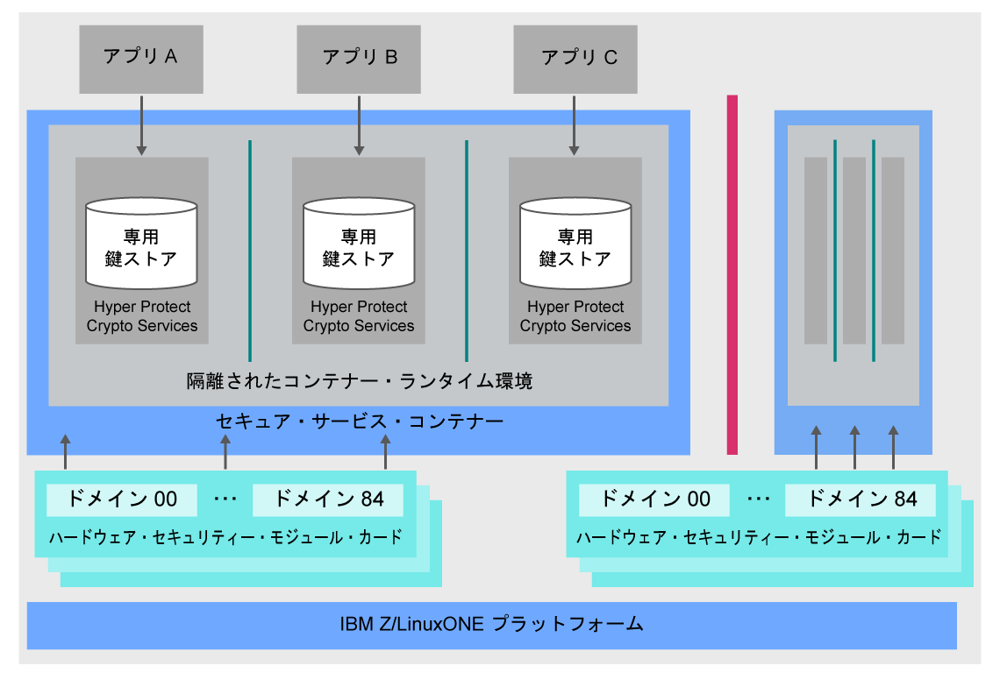

---

copyright:
  years: 2018, 2019
lastupdated: "2019-02-05"

Keywords: IBM Key, data security, Hyper Protect Crypto Services, HSM

subcollection: hs-crypto

---

{:new_window: target="_blank"}
{:shortdesc: .shortdesc}
{:screen: .screen}
{:codeblock: .codeblock}
{:pre: .pre}
{:important: .important}

# {{site.data.keyword.cloud_notm}} {{site.data.keyword.hscrypto}} の概要
{: #overview}

データおよび機密保護は、IT 環境にとって重要で不可欠な要素です。 ますます多くのデータがクラウドに移行するにつれて、データの保護は大きな課題となります。  {{site.data.keyword.cloud}} {{site.data.keyword.hscrypto}} は、データを保護するための業界最高のセキュリティー・レベルを実現したテクノロジーを使用して暗号化を行います。
{: shortdesc}

## {{site.data.keyword.cloud_notm}} {{site.data.keyword.hscrypto}} を使用するのはなぜですか?

IBM LinuxONE テクノロジーに基づいて構築された {{site.data.keyword.hscrypto}} を使用すると、自分の鍵に自分以外の人がアクセスしないようにするうえで助けになります。顧客管理の専用 HSM によって提供される鍵ボールトを備えたシングル・テナント鍵管理サービスを利用することで、暗号鍵の作成が簡単になります。別の方法として、管理用の独自の暗号化鍵を持ち込む (Bring Your Own Key) こともできます。管理型クラウドの HSM は業界標準をサポートしているため、アプリケーションでデジタル署名や検証などの暗号操作を統合できます。<!-- such as PKCS #11,-->

<!-- via PKCS#11 application programming interfaces (APIs). You can access {{site.data.keyword.hscrypto}} with several popular programming languages such as Java, JavaScript, and Swift. -->

{{site.data.keyword.hscrypto}} は、{{site.data.keyword.blockchainfull_notm}} Platform の構築に使用されている暗号方式です。 この暗号化メカニズムにより、高度に保護された隔離環境でブロックチェーン・ネットワークを稼働させて、ハッシュ処理、署名/検証操作、ノード間通信の機能をそのネットワーク内で高めることができます。 {{site.data.keyword.blockchainfull_notm}} Platform の成功は、{{site.data.keyword.hscrypto}} の機能と価値を証明するものとなっています。

## {{site.data.keyword.hscrypto}} はどのように機能しますか?
{: #architecture}

以下のアーキテクチャー図は、{{site.data.keyword.hscrypto}} の働きを示しています。

*図 1. {{site.data.keyword.hscrypto}} アーキテクチャー*  

{{site.data.keyword.hscrypto}} アーキテクチャーのいくつかの特長を以下に説明します。

<!-- * Applications connect to {{site.data.keyword.hscrypto}} through PKCS#11 APIs. -->

- {{site.data.keyword.hscrypto}} には、データを分離してセキュリティーを確保するための専用鍵ストアが用意されています。 特権ユーザーはロックアウトされて、システム管理者や root ユーザーの資格情報が悪用されないように保護されます。  
- セキュア・サービス・コンテナー (SSC) によって、企業のお客様が IBM Z テクノロジーに期待するエンタープライズ・レベルのセキュリティーと堅固さが提供されます。  
- FIPS 140-2 レベル 4 準拠のクラウド HSM では、最高度の物理的な秘密保護機能が有効になります。  

## 主な機能
{: #key-features}

{{site.data.keyword.hscrypto}} の主要機能は以下のとおりです。

### 暗号鍵をカスタマー制御のクラウド HSM と共に使用する {{site.data.keyword.cloud_notm}} データ・サービス保護
{: #key-feature-1}

{{site.data.keyword.hscrypto}} は Keep Your Own Keys (KYOK: 自分の鍵の保持) をサポートしているので、保持、制御、管理を行える暗号鍵を使用して、データに対する制御権と権限をさらに強化することができます。 カスタマー制御のクラウド・ハードウェア・セキュリティー・モジュール (HSM) で使用可能なサポートにより、業界での規定に従って {{site.data.keyword.cloud_notm}} でデジタル鍵を保護することが可能になり、お客様だけがアクセスすることができます。<!-- The HSM provides PKCS#11 APIs, which makes {{site.data.keyword.hscrypto}} accessible by several popular programming languages such as Java, JavaScript, and Swift.-->

### FIPS 140-2 レベル 4 認証のテクノロジーの提供
{: #key-feature-2}

{{site.data.keyword.hscrypto}} は、暗号化ハードウェアで到達可能なセキュリティーの最高レベルである FIPS 140-2 レベル 4 認証テクノロジーを利用できます。<!-- Industries, such as financial sector services, require this level of security to protect their data.--> このセキュリティー・レベルでは、すべての不正な物理アクセスの試行を検出して対応するという目的で、物理的セキュリティー・メカニズムにより暗号モジュールの周りに完全な保護エンベロープが提供されます。

### 鍵とデータに対する特権ユーザーによるアクセスの不許可
{: #key-feature-3}

{{site.data.keyword.hscrypto}} は、IBM Z で使用されている固有のデータ保護機能を {{site.data.keyword.cloud_notm}} で実現します。 {{site.data.keyword.hscrypto}} は、SSC でデータ保護します。SSC によって、企業のお客様が IBM Z テクノロジーに期待するエンタープライズ・レベルのセキュリティーと堅固さが提供されます。 隔離された環境でデータを保護するために、ハードウェア仮想化が使用されます。 この方法では、サービス・インスタンスごとに専用サービスが提供されるので、データに対する外部アクセス (クラウド管理者などの特権ユーザーによるアクセスを含む) は許可されません。 このようにして、内部からの脅威によるデータの漏えいリスクは軽減されます。

### {{site.data.keyword.cloud_notm}} のデータとストレージのサービスを保護するための {{site.data.keyword.keymanagementservicefull_notm}} 統合
{: #key-feature-4}

{{site.data.keyword.keymanagementservicefull_notm}} API は、鍵を生成して保護するために、{{site.data.keyword.hscrypto}} に統合されています。 {{site.data.keyword.hscrypto}} は、これらの鍵を保護し、IBM Z 上の高度に保護された隔離環境に保管します。その環境に置かれたユーザーのデータは、業界最高のセキュリティー・レベルで認証されているテクノロジーによって保護されます。

<!-- {{site.data.keyword.hscrypto}} also leverages the **IBM Advanced Crypto Service Provider (ACSP)** solution that enables remote access to the IBM’s cryptographic coprocessors. ACSP allows for utilization of strong hardware-based cryptography as a service in distributed environments where data security cannot be guaranteed. {{site.data.keyword.hscrypto}} utilizes ACSP as a *network hardware security module (NetHSM)* that provides access to HSM via PKCS#11 standard APIs.-->

<!-- With {{site.data.keyword.hscrypto}}, your **SSL keys are offloaded** to a {{site.data.keyword.hscrypto}} to ensure security and protection of those sensitive keys.  Besides, the certificate lifecycle management gets common approach to manage certificates and offers the visibility to certificate expiration.-->

## 役割と責任
{: #roles-responsibilities}

以下の表は、{{site.data.keyword.hscrypto}} がサポートする役割を示しています。

<table>
  <tr>
    <th>役割</th>
    <th>責任</th>
  </tr>
  <tr>
    <td>暗号装置管理者</td>
    <td>
      別の暗号装置管理者をインストールする際などに管理コマンドに署名して、署名鍵を提供します。
    </td>
  </tr>
  <tr>
    <td>キー所有者</td>
    <td>サービス・インスタンスを初期化するためのマスター鍵パーツを提供します。</td>
  </tr>
  <tr>
    <td>サービスのユーザー</td>
    <td>ユーザー・インターフェースと API により、ルート鍵と標準鍵を保管、取得、生成します。</td>
  </tr>
  <caption style="caption-side:bottom;">表 1. 役割と責任</caption>
</table>
