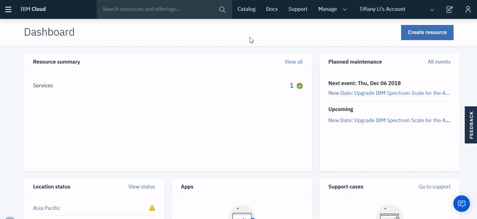

---

copyright:
  years: 2018, 2019
lastupdated: "2019-03-21"

Keywords: provision, instance of Hyper Protect Crypto Services

subcollection: hs-crypto

---

{:shortdesc: .shortdesc}
{:codeblock: .codeblock}
{:screen: .screen}
{:new_window: target="_blank"}
{:pre: .pre}
{:tip: .tip}
{:important: .important}
{:gif: data-image-type='gif'}

# サービスのプロビジョニング
{: #provision}

{{site.data.keyword.cloud_notm}} コンソールまたは {{site.data.keyword.cloud_notm}} CLI を使用して、{{site.data.keyword.cloud_notm}} {{site.data.keyword.hscrypto}} のインスタンスを作成できます。
{: shortdesc}

## {{site.data.keyword.cloud_notm}} コンソールからのプロビジョニング
{: #provision-gui}

{{site.data.keyword.cloud_notm}} コンソールから {{site.data.keyword.hscrypto}} のインスタンスをプロビジョンするには、以下の手順を実行します。

1. [{{site.data.keyword.cloud_notm}} アカウント  にログインします](https://cloud.ibm.com/){: new_window}。
2. **「カタログ」**をクリックして、{{site.data.keyword.cloud_notm}} 上で使用可能なサービスのリストを表示します。
3. 「すべてのカテゴリー」ナビゲーション・ペインで、**「セキュリティーおよび ID」**カテゴリーをクリックします。
4. サービスのリストで、**「{{site.data.keyword.hscrypto}}」**タイルをクリックします。
5. **オプション**:**「タグ」**フィールドに、リソースを編成するためのタグを追加します。タグが請求に関連している場合は、関連したタグのグループ化に役立つよう、`costctr:124` のように「キー:値」のペアとしてタグを記述することを検討してください。タグについて詳しくは、[タグの処理](/docs/resources?topic=resources-tag#tag)を参照してください。
6. **「暗号装置の数 (Number of crypto units)」**の下で、パフォーマンス・ニーズを満たす暗号装置の数を選択します。

  サービス・インスタンスでは最大 6 つの暗号装置がサポートされます。実稼働環境では、高可用性を実現にするために少なくとも 2 つの暗号装置を選択することをお勧めします。3 つ以上の暗号装置を選択した場合、それらの暗号装置は、選択した地域でサポートされている 3 つのアベイラビリティー・ゾーンに分散されます。
  {: important}
7. **「作成」**をクリックして、ログインしているアカウント、地域、およびリソース・グループ内の {{site.data.keyword.hscrypto}} のインスタンスをプロビジョンします。


{: gif}

*図 1. サービスのプロビジョニング*

<!-- ## Provisioning from the {{site.data.keyword.cloud_notm}} CLI
{: #provision-cli}

To provision an instance of {{site.data.keyword.hscrypto}} using the {{site.data.keyword.cloud_notm}} CLI, complete the following steps:

1. Download and install the [{{site.data.keyword.cloud_notm}} CLI](/docs/cli/index.html#overview){: new_window} with the following command:

    ```sh
    curl -sl https://ibm.biz/idt-installer | bash
    ```
    {: pre}

    **Notes:** For more information about the {{site.data.keyword.cloud_notm}} CLI, see [Getting started with the {{site.data.keyword.cloud_notm}} CLI](/docs/cli/index.html#overview){: new_window}.

2. Log in to {{site.data.keyword.cloud_notm}} through the {{site.data.keyword.cloud_notm}} CLI with the following command:

    ```sh
    ibmcloud login
    ```
    {: pre}

    **Notes:** If the login fails, run the `ibmcloud login --sso` command to try again. The `--sso` parameter is required when you log in with a federated ID. If this option is used, go to the link listed in the CLI output to generate a one-time passcode. -->

<!-- ### Creating a service instance within your account
{: #provision-acct-lvl}

To simplify access to your encryption keys with [{{site.data.keyword.iamlong}} roles](/docs/iam/users_roles.html#iamusermanrol), you can create one or more instances of the {{site.data.keyword.hscrypto}} service within an account, without needing to specify an org and space.

1. Log in to {{site.data.keyword.cloud_notm}} through the [{{site.data.keyword.cloud_notm}} CLI](/docs/cli/index.html#overview){: new_window}.

    ```sh
    ibmcloud login
    ```
    {: pre}
    **Notes:** If the login fails, run the `ibmcloud login --sso` command to try again. The `--sso` parameter is required when you log in with a federated ID. If this option is used, go to the link listed in the CLI output to generate a one-time passcode.

2. Select the account, region, and resource group where you would like to create a {{site.data.keyword.hscrypto}} service instance.

    You can use the following command to set your target region and resource group.

    ```sh
    ibmcloud target -r <region_name> -g <resource_group_name>
    ```
    {: pre}

3. Provision an instance of {{site.data.keyword.hscrypto}} within that account and resource group.

    ```sh
    ibmcloud resource service-instance-create <instance_name> kms tiered-pricing
    ```
    {: pre}

    Replace `<instance_name>` with a unique alias for your service instance.

4. Optional: Verify that the service instance was created successfully.

    ```sh
    ibmcloud resource service-instances
    ```
    {: pre}

### Creating a service instance within an org and space
{: #provision-space-lvl}

To manage access to your encryption keys with [Cloud Foundry roles](/docs/iam/cfaccess.html), you can create an instance of the {{site.data.keyword.hscrypto}} service within a specified organization and space.  

1. Log in to {{site.data.keyword.cloud_notm}} through the [{{site.data.keyword.cloud_notm}} CLI](/docs/cli/index.html#overview){: new_window}.

    ```sh
    ibmcloud login
    ```
    {: pre}
    **Note:** If the login fails, run the `ibmcloud login --sso` command to try again. The `--sso` parameter is required when you log in with a federated ID. If this option is used, go to the link listed in the CLI output to generate a one-time passcode.

2. Select the account, region, organization, and space where you would like to create a {{site.data.keyword.hscrypto}} service instance.

    You can use the following command to set your target region, org, and space.

    ```sh
    ibmcloud target -r <region> -o <organization_name> -s <space_name>
    ```
    {: pre}

3. Provision an instance of {{site.data.keyword.hscrypto}} within that account, region, organization, and space.

    ```sh
    ibmcloud service create kms tiered-pricing <instance_name>
    ```
    {: pre}

    Replace `<instance_name>` with a unique alias for your service instance.

4. Optional: Verify that the service instance was created successfully.

    ```sh
    ibmcloud service list
    ```
    {: pre}
-->

### 次に行うこと
{: #provision-next}

プログラムでの鍵の管理について詳しくは、[{{site.data.keyword.hscrypto}} API リファレンス資料 ](https://{DomainName}/apidocs/hs-crypto){: new_window} を確認してください。
