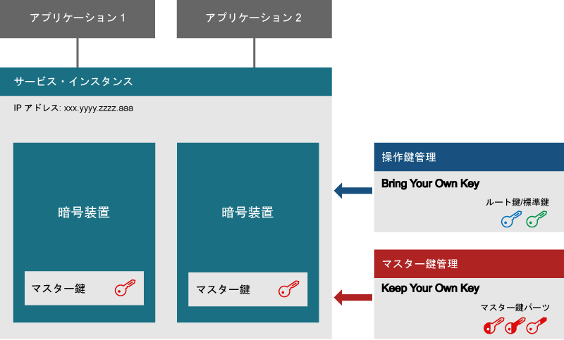
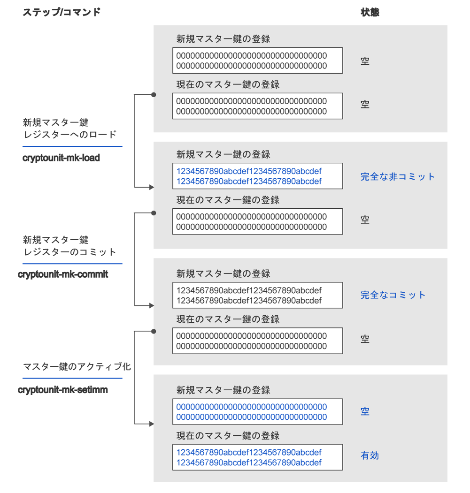

---

copyright:
  years: 2018, 2019
lastupdated: "2019-03-21"

Keywords: hsm, Trusted Key Entry plug-in, service instance, imprint mode

subcollection: hs-crypto

---

{:new_window: target="_blank"}
{:shortdesc: .shortdesc}
{:screen: .screen}
{:codeblock: .codeblock}
{:pre: .pre}
{:important: .important}

# サービス・インスタンス初期化の概要
{: #introduce-service}

{{site.data.keyword.hscrypto}} のサービス・インスタンスを初期化する前に、まず基本的な概念とプロセス・ロジックを理解しておくとよいでしょう。  
{:shortdesc}

{{site.data.keyword.hscrypto}} インスタンス (略してサービス・インスタンス) は、IBM Cloud ユーザー・アカウントに割り当てられている暗号装置のグループです。サービス・インスタンスには最大 6 つの暗号装置を設定できます。実稼働環境をセットアップしている場合は、高可用性を実現するために 1 つのサービス・インスタンスに対して少なくとも 2 つの暗号装置を割り当てることをお勧めします。暗号装置は、別々の物理ハードウェア・セキュリティー・モジュール (HSM) に配置する必要があります。1 つのサービス・インスタンスに属するすべての暗号装置は、同じ構成内容にする必要があります。IBM クラウドの一部にアクセスできない場合は、サービス・インスタンス内の暗号装置を代わりに使用できます。暗号装置には、鍵ストレージのコンテンツを暗号化するマスター鍵が含まれています。Keep Your Own Keys テクノロジーを利用すると、サービス・インスタンス管理者だけがマスター鍵にアクセスできるようにすることができます。

次の図は、2 つの暗号装置を持つサービス・インスタンスを示しています。

*図 1. サービス・インスタンスのコンポーネント*

## ハードウェア・セキュリティー・モジュール
{: #introduce-HSM}

ハードウェア・セキュリティー・モジュール (HSM) は、強力な認証のためにデジタル鍵を保護および管理し、暗号化処理を提供する物理デバイスです。{{site.data.keyword.cloud_notm}} {{site.data.keyword.hscrypto}} の HSM は FIPS 140-2 レベル 4 認証です。これは、暗号化ハードウェアのセキュリティーの最高レベルです。このセキュリティー・レベルでは、すべての不正な物理アクセスの試行を検出して対応するという目的で、物理的セキュリティー・メカニズムにより暗号モジュールの周りに完全な保護エンベロープが提供されます。

## 暗号装置
{: #introduce-crypto-unit}

暗号単位は、HSM とそれに対応する HSM 専用のソフトウェア・スタックを表す単一の装置です。各暗号装置は、最大 5000 のデジタル鍵を管理できます。サービス・インスタンスには最大 6 つの暗号装置を設定できます。実稼働環境をセットアップしている場合は、高可用性を実現するために 1 つのサービス・インスタンスに対して少なくとも 2 つの暗号装置を割り当てることをお勧めします。1 つのサービス・インスタンスに属するすべての暗号装置は、同じ構成内容にする必要があります。IBM クラウドの一部にアクセスできない場合は、サービス・インスタンス内の暗号装置を代わりに使用できます。

## Trusted Key Entry プラグイン
{: #introduce-TKE}

Trusted Key Entry プラグインを使用して、{{site.data.keyword.cloud}} ユーザー・アカウントにあるサービス・インスタンスのマスター鍵レジスターに、選択した制御対象となる値をロードできます。 Trusted Key Entry プラグインにより、{{site.data.keyword.cloud_notm}} ユーザー・アカウントに割り当てられた暗号装置を管理するための限定的な機能セットが提供されます。このプラグインを使用してマスター鍵の値をロードすることができます。

## 管理者
{: #introduce-administrators}

暗号装置にコマンドを発行するために、管理者をターゲット暗号装置に追加できます。各管理者は 1 つの秘密署名鍵を所有します。署名鍵が生成された後、署名鍵を持つ管理者をターゲット暗号装置に追加する必要があります。

## 署名鍵
{: #introduce-signature-keys}

管理者は、暗号装置に対して発行されたすべてのコマンドに署名する必要があります。署名鍵ファイルの秘密パーツは、署名を作成するために使用されます。公開パーツは、暗号装置管理者を定義するためにターゲット暗号装置にインストールされた証明書に配置されます。 インプリント・モードで発行されたコマンドは署名する必要はありません。

## インプリント・モード
{: #introduce-imprint-mode}

IBM Cloud ユーザーに割り当てられている暗号装置は、インプリント・モードと呼ばれるクリアな状態で開始します。インプリント・モードの暗号装置はセキュアではありません。マスター鍵レジスターは、インプリント・モードではロードできません。暗号化装置管理者をセットアップし、インプリント・モードで暗号化装置をクリアすることのみが可能です。インプリント・モードで暗号装置に発行されたコマンドは署名する必要がありません。ただし、インプリント・モードを終了するコマンドには、追加済みのいずれかの暗号装置管理者が署名鍵を使用して署名する必要があります。

## マスター鍵
{: #introduce-master-key}

マスター鍵は、鍵ストレージ用のサービス・インスタンスを暗号化するときに使用します。マスター鍵を使用することによって、お客様はルート鍵や標準鍵などの鍵のチェーン全体を暗号化する Root of Trust (信頼の基点) を所有します。 IBM では、マスター鍵をバックアップしたり関与したりすることはなく、別のマシンやデータ・センターにコピーしたりリストアしたりする手段はありません。 1 つのサービス・インスタンスで設定できるマスター鍵は 1 つだけです。 サービス・インスタンスのマスター鍵を削除すると、そのサービスで管理されている鍵で暗号化されたすべてのデータの暗号破棄作業を効率的に行うことができます。

{{site.data.keyword.hscrypto}} で管理する鍵のタイプについて詳しくは、[鍵の概要](/docs/services/hs-crypto/keys_intro.html#introduce-keys)を参照してください。

## マスター鍵パーツ
{: #introduce-key-parts}

新規マスター鍵レジスターは、複数のマスター鍵パーツを使用してロードされます。Trusted Key Entry プラグインでは、各マスター鍵パーツはマスター鍵パーツ・ファイルに保存されます。新規マスター鍵レジスターをロードするために 2 つか 3 つのマスター鍵パーツを使用することができます。セキュリティーを考慮して、別々の人が各鍵パーツを所有することができます。鍵パーツの所有者は、鍵パーツ・ファイルに関連付けられたパスワードを知る唯一の人にする必要があります。

## マスター鍵レジスター
{: #introduce-key-registers}

各暗号装置には新規マスター鍵レジスターと現在のマスター鍵レジスターの 2 つのマスター鍵レジスターがあります。現在のマスター鍵レジスターの値は、ユーザーの鍵ストレージの内容を暗号化します。新規マスター鍵レジスターは、現在のマスター鍵レジスターの値を変更するために使用されます。現在のマスター鍵レジスターの値を変更するときは、鍵ストレージの内容を新しいマスター鍵の値で再暗号化する必要があります。これを行うには、現在のマスター鍵の値と新規マスター鍵の値の両方が必要です。鍵ストレージ内の鍵の値は、現在のマスター鍵レジスターの値を使用して復号され、その後、新しいマスター鍵レジスターの値を使用して再暗号化されます。再暗号化は HSM 内で行われるため、安全です。鍵ストレージのすべての内容が再暗号化された後、新規マスター鍵レジスターの値を現在のマスター鍵レジスターに移動することができます。

次の図は、マスター鍵レジスターの状態がどのように変化するか、およびマスター鍵がどのようにロードされるかを示しています。

*図 1. マスター鍵のロード*  
