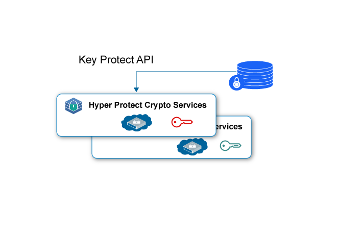
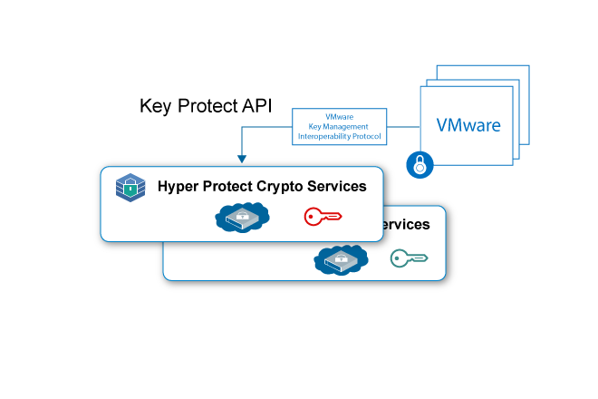

---

copyright:
  years: 2018, 2019
lastupdated: "2019-01-15"

Keywords: Hyper Protect Crypto Services, Keep Your Own Keys, VMware

subcollection: hs-crypto

---

{:new_window: target="_blank"}
{:shortdesc: .shortdesc}
{:screen: .screen}
{:codeblock: .codeblock}
{:pre: .pre}

# {{site.data.keyword.hscrypto}} のユース・ケース
{: #use-cases}

このページでは、{{site.data.keyword.hscrypto}} に現在含まれているユース・ケースについて記載します。 これらのユース・ケースは、今後のリリースで引き続き進化し続けてゆきます。
{:shortdesc}

## Keep Your Own Keys による Data at Rest の暗号化
{: #data-at-rest-encryption}

{{site.data.keyword.hscrypto}} を使用すると、自分が所有する鍵を使って最高のセキュリティー・レベルで Data at Rest (保存されたデータ) を暗号化できます。 {{site.data.keyword.hscrypto}} には、{{site.data.keyword.keymanagementservicefull_notm}} API を使用して鍵を生成して管理するための、鍵管理機能が用意されています。

{{site.data.keyword.hscrypto}} を使用して Data at Rest を保護するためのいくつかの特長を以下に説明します。

 * {{site.data.keyword.hscrypto}} により、クラウド・データとストレージ・サービスにおける Data at Rest 暗号化が可能になります。
 * {{site.data.keyword.hscrypto}} は Keep Your Own Keys (KYOK: 自分の鍵の保持) をサポートしているので、持ち込み、制御、管理を行える暗号鍵を使用して、データに対する制御権と権限をさらに強化することができます。
 * {{site.data.keyword.keymanagementservicefull_notm}} API は、鍵の生成と保護を行うために統合されています。
 * 鍵は最高のセキュリティーである FIPS 140-2 レベル 4 認証テクノロジーで保護されます。
 * 鍵はお客様が管理する専用の HSM によって保護されるので、自分のデータにアクセスできるのは自分だけになります。

*図 1. KYOK による Data at Rest 暗号化*

## Keep Your Own Keys による VMware イメージの保護
{: #vmware-image-protection}

Data at Rest 保護と同様に、{{site.data.keyword.hscrypto}} も、VMware Key Management Interoperability Protocol によって暗号化と復号を行う対象として保存されている VMware イメージを保護することができます。

{{site.data.keyword.hscrypto}} は、単一テナント・サービスとして、VMware イメージのハードウェア・セキュリティー・モジュールに対する専用の制御をお客様ごとに提供します。 {{site.data.keyword.hscrypto}} は、{{site.data.keyword.cloud_notm}} での鍵管理サービスのファミリーを、専用のハードウェア機密制御機能によって単一テナント・インスタンスに拡張します。

*図 2. KYOK による VMware イメージの保護*
