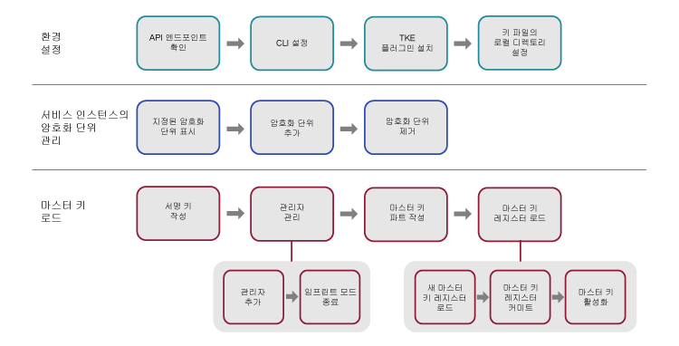

---

copyright:
  years: 2018, 2019
lastupdated: "2019-03-21"

Keywords: key storage, HSM, hardware security module

subcollection: hs-crypto

---

{:new_window: target="_blank"}
{:shortdesc: .shortdesc}
{:screen: .screen}
{:codeblock: .codeblock}
{:pre: .pre}
{:important: .important}
{:tip: .tip}

# 서비스 인스턴스 초기화
{: #initialize-hsm}

{{site.data.keyword.hscrypto}} 인스턴스(줄여서 서비스 인스턴스)를 사용하기 전에 Trusted Key Entry 플러그인을 사용하여 마스터 키 레지스터를 로드해야 합니다.
{:shortdesc}

서비스 인스턴스를 초기화하려면 Trusted Key Entry 플러그인을 사용하여 마스터 키를 키 스토리지인 서비스 인스턴스에 먼저 로드해야 합니다. Trusted Key Entry 플러그인을 사용하여 마스터 키 값을 로드할 수 있습니다.

서비스 인스턴스 초기화 및 기타 개념에 대한 소개는 [서비스 인스턴스 초기화 소개](/docs/services/hs-crypto/service_instance_concepts.html#introduce-service)를 참조하십시오.

다음 다이어그램은 서비스 인스턴스를 초기화하기 위해 수행해야 하는 단계의 개요를 제공합니다. 자세한 지시사항은 다이어그램의 각 단계를 클릭하십시오.


<map name="home_map1" id="home_map1">
<area href="/docs/services/hs-crypto?topic=hs-crypto-initialize-hsm#initialize-crypto-prerequisites" alt="API 엔드포인트 확인" title="API 엔드포인트 확인" shape="rect" coords="151, 20, 241, 78" />
<area href="/docs/services/hs-crypto?topic=hs-crypto-initialize-hsm#initialize-crypto-prerequisites" alt="CLI 설정" title="CLI 설정" shape="rect" coords="276, 20, 365, 78" />
<area href="/docs/services/hs-crypto?topic=hs-crypto-initialize-hsm#initialize-crypto-prerequisites4" alt="TKE 플러그인 설치" title="TKE 플러그인 설치" shape="rect" coords="401, 20, 493, 78" />
<area href="/docs/services/hs-crypto?topic=hs-crypto-initialize-hsm#initialize-crypto-prerequisites4" alt="키 파일의 로컬 디렉토리 설정" title="키 파일의 로컬 디렉토리 설정" shape="rect" coords="528, 20, 619, 78" />

<area href="/docs/services/hs-crypto?topic=hs-crypto-initialize-hsm#Identify_crypto_units" alt="지정된 암호화 단위 표시" title="지정된 암호화 단위 표시" shape="rect" coords="148, 111, 241, 171" />
<area href="/docs/services/hs-crypto?topic=hs-crypto-initialize-hsm#Identify_crypto_units1" alt="암호화 단위 추가" title="암호화 단위 추가" shape="rect" coords="276, 111, 366, 171" />
<area href="/docs/services/hs-crypto?topic=hs-crypto-initialize-hsm#Identify_crypto_units2" alt="암호화 단위 제거" title="암호화 단위 제거" shape="rect" coords="402, 111, 493, 171" />

<area href="/docs/services/hs-crypto?topic=hs-crypto-initialize-hsm#step1-create-signature-keys" alt="하나 이상의 서명 키 작성" title="서명 키 작성" shape="rect" coords="149, 206, 242, 264" />
<area href="/docs/services/hs-crypto?topic=hs-crypto-initialize-hsm#step2-load-admin" alt="암호화 단위 관리자 관리" title="암호화 단위 관리자 관리" shape="rect" coords="281, 206, 366, 264" />
<area href="/docs/services/hs-crypto?topic=hs-crypto-initialize-hsm#step2-load-admin" alt="대상 암호화 단위에 하나 이상의 관리자 추가" title="암호화 단위 관리자 추가" shape="rect" coords="242, 296, 312, 358" />
<area href="/docs/services/hs-crypto?topic=hs-crypto-initialize-hsm#step3-exit-imprint-mode" alt="대상 암호화 단위에서 임프린트 모드 종료" title="임프린트 모드 종료" shape="rect" coords="328, 301, 396, 359" />
<area href="/docs/services/hs-crypto?topic=hs-crypto-initialize-hsm#step4-create-master-key" alt="사용할 마스터 키 파트 세트 작성" title="마스터 키 파트 작성" shape="rect" coords="401, 208, 493, 266" />
<area href="/docs/services/hs-crypto?topic=hs-crypto-initialize-hsm#step5-load-master-key" alt="마스터 키 레지스터 로드" title="마스터 키 레지스터 로드" shape="rect" coords="525, 207, 620, 264" />
<area href="/docs/services/hs-crypto?topic=hs-crypto-initialize-hsm#step5-load-master-key" alt="새 마스터 키 레지스터 로드" title="새 마스터 키 레지스터 로드" shape="rect" coords="455, 297, 525, 358" />
<area href="/docs/services/hs-crypto?topic=hs-crypto-initialize-hsm#step6-commit-master-key" alt="새 마스터 키 레지스터 커미트" title="새 마스터 키 레지스터 커미트" shape="rect" coords="539, 297, 610, 358" />
<area href="/docs/services/hs-crypto?topic=hs-crypto-initialize-hsm#step7-activate-master-key" alt="마스터 키 활성화" title="마스터 키 레지스터 활성화" shape="rect" coords="619, 297, 689, 358" />
</map>

*그림 1. 서비스 인스턴스 초기화 태스크 플로우*

이 태스크를 완료하는 데 20 - 30분이 걸릴 수 있습니다.

## 시작하기 전에
{: #initialize-crypto-prerequisites}

1. 다음 명령을 실행하여 올바른 API 엔드포인트에 로그인했는지 확인하십시오.

  ```
  ibmcloud api https://api.ng.bluemix.net
  ```
  {: pre}

2. {{site.data.keyword.keymanagementservicefull}} 플러그인을 설치하십시오. 자세한 단계는 [CLI 설정](/docs/services/hs-crypto/set-up-cli.html)을 참조하십시오. [{{site.data.keyword.cloud_notm}} CLI](/docs/cli/index.html#overview)에 로그인할 때 업데이트가 사용 가능한 경우 알림을 받습니다. Trusted Key Entry CLI 플러그인에 사용 가능한 명령 및 플래그를 사용할 수 있도록 {{site.data.keyword.keymanagementservicefull}} 플러그인을 최신 상태로 유지하십시오.
{: #initialize-crypto-prerequisites2}

3. 다음 명령을 사용하여 최신 Trusted Key Entry 플러그인을 설치하십시오.
{: #initialize-crypto-prerequisites3}

  ```
  ibmcloud plugin install tke
  ```
  {: pre}

  **중요:** {{site.data.keyword.hscrypto}}의 베타 인스턴스를 사용하는 경우 'ibmcloud plugin install tke -v 0.0.4'를 실행하여 Trusted Key Entry 플러그인의 최신 베타 버전을 가져오십시오. Trusted Key Entry 플러그인의 최신 버전을 설치하지 마십시오.

4. 워크스테이션에서 환경 변수 CLOUDTKEFILES를 설정하십시오. 마스터 키 파트 파일 및 서명 키 파트 파일을 작성하고 저장할 디렉터리를 지정하십시오. 아직 존재하지 않는 경우 디렉토리를 작성하십시오.
{: #initialize-crypto-prerequisites4}

  * Linux 또는 MacOS에서 `.bash_profile` 파일에 다음 행을 추가하십시오.
     ```
     export CLOUDTKEFILES=<path>
     ```
     {: pre}
     예를 들면 *경로*를 `/Users/tke-files`로 지정할 수 있습니다.
  * Windows의 경우, **제어판**에서 검색 상자에 `환경 변수`를 입력하여 환경 변수 창을 찾으십시오. CLOUDTKEFILES 환경 변수를 작성하고 해당 값을 키 파일의 경로로 설정하십시오. 예: `C:\users\tke-files`.

## 사용자 계정에 지정된 암호화 단위 추가 또는 제거
{: #Identify_crypto_units}

{{site.data.keyword.cloud_notm}} 사용자 계정에 지정된 암호화 단위는 *서비스 인스턴스*라고 하는 그룹에 있습니다. 서비스 인스턴스에는 최대 6개의 암호화 단위가 있을 수 있습니다. 서비스 인스턴스의 모든 암호화 단위는 동일하게 구성해야 합니다. {{site.data.keyword.cloud_notm}}의 한 파트에 액세스할 수 없는 경우 로드 밸런싱 또는 가용성을 위해 서비스 인스턴스의 암호화 단위를 서로 교환해서 사용할 수 있습니다.

{{site.data.keyword.cloud_notm}} 사용자에게 지정된 암호화 단위는 *임프린트 모드*로 알려진 해제된 상태에서 시작합니다.

단일 서비스의 모든 암호화 단위에 있는 마스터 키 레지스터는 동일하게 설정되어야 합니다. 동일한 관리자 세트가 모든 암호화 단위에 추가되어야 하고 모든 암호화 단위가 동시에 임프린트 모드를 종료해야 합니다.

* 사용자 계정에 지정된 서비스 인스턴스 및 암호화 단위를 표시하려면 다음 명령을 사용하십시오.
  {: #Identify_crypto_units1}
  ```
  ibmcloud tke cryptounits
  ```
  {: pre}

  다음은 표시된 샘플 출력입니다. 출력 테이블의 SELECTED 열은 Trusted Key Entry 플러그인에서 실행되는 후속 관리 명령에 의해 대상으로 지정될 암호화 단위를 식별합니다.

  ```
  SERVICE INSTANCE: 482cf2ce-a06c-4265-9819-0b4acf54f2ba
  CRYPTO UNIT NUM   SELECTED   LOCATION
  1                 true       [미국 남부].[AZ3-CS3].[02].[03]
  2                 true       [미국 남부].[AZ2-CS2].[02].[03]

  SERVICE INSTANCE: 96fe3f8d-9792-45bc-a9fb-2594222deaf2
  CRYPTO UNIT NUM   SELECTED   LOCATION
  3                 true       [미국 남부].[AZ1-CS4].[00].[03]
  4                 true       [미국 남부].[AZ2-CS5].[03].[03]
  ```
  {: screen}

* 선택한 암호화 단위 목록에 추가 암호화 단위를 추가하려면 다음 명령을 사용하십시오.
  {: #Identify_crypto_units2}
  ```
  ibmcloud tke cryptounit-add
  ```
  {: pre}

  현재 사용자 계정에 지정된 암호화 단위 목록이 표시됩니다. 프롬프트가 표시되면 선택한 암호화 단위 목록에 추가할 암호화 단위 번호 목록을 입력하십시오.

* 선택한 암호화 단위 목록에서 암호화 단위를 제거하려면 다음 명령을 사용하십시오.
  {: #Identify_crypto_units3}
  ```
  ibmcloud tke cryptounit-rm
  ```
  {: pre}

  현재 사용자 계정에 지정된 암호화 단위 목록이 표시됩니다. 프롬프트가 표시되면 선택한 암호화 단위 목록에서 제거할 암호화 단위 번호 목록을 입력하십시오.

  **팁:** 일반적으로 서비스 인스턴스의 모든 암호화 단위를 선택하거나 암호화 단위를 모두 선택하지 않습니다. 이렇게 하면 후속 관리 명령에서 서비스 인스턴스의 모든 암호화 단위를 일관되게 업데이트합니다. 그러나 서비스 인스턴스의 암호화 단위가 다르게 구성되는 경우 서비스 인스턴스의 모든 암호화 단위에 일관된 구성을 복원하려면 암호화 단위를 개별적으로 선택하고 작업해야 합니다.

  다음 명령을 사용하여 선택한 암호화 단위 세트의 구성 설정을 비교할 수 있습니다.
  ```
  ibmcloud tke cryptounit-compare
  ```
  {: pre}

## 마스터 키 로드
{: #load-master-keys}

<!-- A service instance is implemented as one or more crypto units on IBM cryptographic coprocessors. -->

새 마스터 키 레지스터를 로드하기 전에 대상 암호화 단위에 하나 이상의 관리자를 추가하고 임프린트 모드를 종료하십시오.

새 마스터 키 레지스터를 로드하려면 {{site.data.keyword.cloud_notm}} CLI 플러그인을 사용하여 다음 태스크를 완료하십시오.

### 1단계: 하나 이상의 서명 키 작성
{: #step1-create-signature-keys}

새 마스터 키 레지스터를 로드하려면 암호화 단위 관리자가 고유한 서명 키로 명령에 서명해야 합니다. 첫 번째 단계는 워크스테이션에서 서명 키가 포함된 하나 이상의 서명 키 파일을 작성하는 것입니다. <!-- The private part of the signature key file is used to create signatures. The public part is placed in a certificate that is installed in a target crypto unit to define a crypto unit administrator. -->

**중요**: 보안상의 이유로 서명 키 소유자가 마스터 키 파트 소유자와 다른 사람일 수 있습니다. 서명 키 소유자는 서명 키 파일과 연관된 비밀번호를 알고 있는 유일한 사용자여야 합니다.

* 워크스테이션에 있는 기존 서명 키를 표시하려면 다음 명령을 사용하십시오.
  ```
  ibmcloud tke sigkeys
  ```
  {: pre}

* 워크스테이션에서 새 서명 키를 작성하고 저장하려면 다음 명령을 사용하십시오.
  ```
  ibmcloud tke sigkey-add
  ```
  {: pre}

  프롬프트가 표시되면 관리자 이름과 서명 키 파일을 보호하기 위한 비밀번호를 입력하십시오. 비밀번호를 기억해야 합니다. 비밀번호가 유실되면 서명 키를 사용할 수 없습니다.

* 향후 명령에 서명할 관리자를 선택하려면 다음 명령을 사용하십시오.
  ```
  ibmcloud tke sigkey-sel
  ```
  {: pre}

  워크스테이션에서 찾은 서명 키 파일의 목록이 표시됩니다. 프롬프트가 표시되면 서명 키 파일의 키 번호를 입력하여 후속 관리 명령에 서명하도록 선택하십시오. <!--If a signature key file is already selected for signing administrative commands, this is indicated when the list of signature key files is displayed. -->

  <!-- **Tip**: Before you run the `cryptounit-exit-impr` command to exit imprint mode, the command needs to be signed by a crypto unit administrator using the signature key. After the crypto unit exits imprint mode, all commands to the crypto unit must be signed. -->

### 2단계: 대상 암호화 단위에 하나 이상의 관리자 추가
{: #step2-load-admin}

<!-- After a crypto unit exits imprint mode, all administrative commands sent to the crypto unit must be signed by an administrator that is added to the crypto unit. -->

* 암호화 단위의 기존 관리자를 표시하려면 다음 명령을 사용하십시오.
  ```
  ibmcloud tke cryptounit-admins
  ```
  {: pre}

* 새 관리자를 추가하려면 다음 명령을 사용하십시오.
  ```
  ibmcloud tke cryptounit-admin-add
  ```
  {: pre}

  워크스테이션에서 찾은 서명 키 파일의 목록이 표시됩니다.

  프롬프트가 표시되면 추가될 암호화 단위 관리자와 연관된 서명 키 파일을 선택하십시오. 그런 다음 선택한 서명 키 파일의 비밀번호를 입력하십시오.

  필요한 경우 명령을 반복하여 추가 암호화 단위 관리자를 추가할 수 있습니다. 관리자는 독립적으로 암호화 단위에서 명령을 실행할 수 있습니다.

  임프린트 모드에서는 암호화 단위 관리자를 추가하는 명령이 서명될 필요가 없습니다. 임프린트 모드를 종료한 후에도 암호화 단위 관리자를 추가하려면 사용되는 명령에 이미 암호화 단위에 추가된 암호화 단위 관리자가 서명해야 합니다.

### 3단계: 대상 암호화 단위에서 임프린트 모드 종료
{: #step3-exit-imprint-mode}

임프린트 모드의 암호화 단위는 안전한 것으로 간주되지 않습니다. 임프린트 모드에서는 새 마스터 키 레지스터 로드와 같은 대부분의 관리 명령을 실행할 수 없습니다.

하나 이상의 암호화 단위 관리자를 추가한 후 다음 명령을 사용하여 임프린트 모드를 종료하십시오.

  ```
  ibmcloud tke cryptounit-exit-impr
  ```
  {: pre}

  **중요:** 임프린트 모드를 종료하는 명령은 서명 키를 사용하여 추가된 암호화 단위 관리자 중 한 명이 서명해야 합니다. 암호화 단위가 임프린트 모드를 종료한 후에는 암호화 단위에 대한 모든 명령이 서명되어야 합니다.

### 4단계: 사용할 마스터 키 파트 세트 작성
{: #step4-create-master-key}

각 마스터 키 파트는 워크스테이션의 비밀번호로 보호된 파일에 저장됩니다.

**중요**: 두 개 이상의 마스터 키 파트를 작성해야 합니다. 보안상의 이유로 세 개의 마스터 키 파트를 사용하고 서로 다른 사용자가 각 키 파트를 소유할 수 있습니다. 키 파트 소유자는 키 파트 파일과 연관된 비밀번호를 알고 있는 유일한 사용자여야 합니다.

* 워크스테이션에 있는 기존 마스터 키 파트를 표시하려면 다음 명령을 사용하십시오.
  ```
  ibmcloud tke mks
  ```
  {: pre}

* 워크스테이션에 랜덤 마스터 키 파트를 작성하고 저장하려면 다음 명령을 사용하십시오.
  ```
  ibmcloud tke mk-add --random
  ```
  {: pre}

  프롬프트가 표시되면 키 파트에 대한 설명과 키 파트 파일을 보호하기 위한 비밀번호를 입력하십시오. 비밀번호를 기억해야 합니다. 비밀번호가 유실되면 키 파트를 사용할 수 없습니다.

* 알려진 키 파트 값을 입력하고 워크스테이션의 파일에 저장하려면 다음 명령을 사용하십시오.
  ```
  ibmcloud tke mk-add --value
  ```
  {: pre}

  프롬프트가 표시되면 키 파트 값을 32바이트 키 파트에 대한 16진 문자열로 입력하십시오. 그런 다음 키 파트에 대한 설명과 키 파트 파일을 보호하기 위한 비밀번호를 입력하십시오.

### 5단계: 새 마스터 키 레지스터 로드
{: #step5-load-master-key}

**중요**: 마스터 키 레지스터를 로드하려면 모든 마스터 키 파트 파일과 서명 키 파일이 공통 워크스테이션에 있어야 합니다. 파일이 별도의 워크스테이션에서 작성된 경우 충돌을 피하기 위해 파일 이름이 서로 다른지 확인하십시오. 마스터 키 파트 파일 소유자와 서명 키 파일 소유자는 마스터 키 레지스터가 공통 워크스테이션에 로드될 때 파일 비밀번호를 입력해야 합니다.

마스터 키가 로드되는 방법에 대한 정보는 [마스터 키 레지스터](/docs/services/hs-crypto/service_instance_concepts.html#introduce-key-registers)에서 상세한 설명을 참조하십시오.

새 마스터 키 레지스터를 로드하려면 다음 명령을 사용하십시오.
```
ibmcloud tke cryptounit-mk-load
```
{: pre}

워크스테이션에서 찾은 마스터 키 파트의 목록이 표시됩니다.

프롬프트가 표시되면 새 마스터 키 레지스터에 로드할 키 파트를 입력하십시오. 또한 각각의 선택한 키 파트 파일의 비밀번호를 입력하십시오.

### 6단계: 새 마스터 키 레지스터 커미트
{: #step6-commit-master-key}

새 마스터 키 레지스터를 로드하면 새 마스터 키 레지스터가 전체 커미트되지 않은 상태에 배치됩니다. 새 마스터 키 레지스터를 사용하여 키 스토리지를 초기화하거나 다시 암호화하기 전에 새 마스터 키 레지스터를 커미트된 상태에 두십시오. 마스터 키가 로드되는 방법에 대한 정보는 [마스터 키 레지스터](/docs/services/hs-crypto/service_instance_concepts.html#introduce-key-registers)에서 상세한 설명을 참조하십시오.

새 마스터 키 레지스터를 커미트하려면 다음 명령을 사용하십시오.
```
ibmcloud tke cryptounit-mk-commit
```
{: pre}

### 7단계: 마스터 키 활성화
{: #step7-activate-master-key}

다음 명령을 통해 마스터 키를 현재 마스터 키 레지스터로 이동하여 마스터 키를 활성화하십시오.

```
ibmcloud tke cryptounit-mk-setimm
```
{: pre}

## 다음에 수행할 작업
{: #initialize-crypto-next}

관리되는 {{site.data.keyword.hscrypto}} 대시보드의 **관리** 탭으로 이동하여 루트 키 및 표준 키를 관리하십시오.

Trusted Key Entry 플러그인 명령의 기타 옵션에 대한 자세한 세부사항은 CLI에서 다음 명령을 실행하십시오.

```
ibmcloud tke help
```
{: pre}

<!--
## Reference: Other Trusted Key Entry plug-in commands
{: #initialize-crypto-reference}

The following list describes the remaining commands implemented by the plug-in and discusses when they would be used.

* **ibmcloud tke mk-rm**

  This command removes a file that contains a master key part from the workstation.

  After you enter the command, a list of master key parts that are found on the workstation is displayed. When prompted, enter the key number of the key part that is to be removed.

  After a key part is removed from the local workstation, it can no longer be used.

* **ibmcloud tke sigkey-rm**

  This command removes a file that contains a signature key from the workstation.

  After you enter the command, a list of signature keys found on the workstation is displayed. When prompted, enter the key number of the signature key file that is to be removed.

  Be cautious of removing a signature key from the workstation. If any crypto units that are assigned to the user account exit imprint mode, and if the signature key being removed from the workstation is the only added administrator for the crypto unit, executing new administrative functions in the crypto unit is not possible after you remove the signature key. If no backup of the signature key file exists, the only way for recovery is to contact {{site.data.keyword.cloud_notm}} support to clear the crypto unit and place it in imprint mode.

* **ibmcloud tke cryptounit-admin-rm**

  This command removes an administrator from the selected crypto units.

  When this command is issued for a crypto unit in imprint mode, this command does not need to be signed. After the crypto unit exits imprint mode, this command must be signed by an existing crypto unit administrator.

  For a crypto unit not in imprint mode, the command fails if the administrator being removed is the last administrator defined for the crypto unit.


* **ibmcloud tke cryptounit-zeroize**

  This command clears the selected crypto units and places them back in imprint mode.  All crypto unit administrators are removed, and the new and current master key registers are cleared.

  When this command is issued for a crypto unit in imprint mode, this command does not need to be signed. After the crypto unit exits imprint mode, this command must be signed by an existing crypto unit administrator.

  When this command is issued to a group of crypto units, the current signature key must be recognized as a crypto unit administrator by all crypto units not in imprint mode in order for the command to be accepted.


* **ibmcloud tke cryptounit-mk**

  This command displays the status and verification pattern for the new and current master key registers for the selected crypto units.

* **ibmcloud tke cryptounit-mk-clrcur**

  This command clears the current master key register in the selected crypto units.

  This command cannot be executed in imprint mode.

  Clearing the current master key register makes any key storage protected by the current master key unusable.

* **ibmcloud tke cryptounit-mk-clrnew**

  This command clears the new master key register in the selected crypto units.

  This command cannot be executed in imprint mode.

* **ibmcloud tke cryptounit-mk-setimm**

  This command moves the value of the new master key register to the current master key register, and clears the new master key register in the selected crypto units.

  This command cannot be executed in imprint mode.

  This command does not initialize or re-encipher key storage and should be used only when key storage in the target LPARs is prepared to accept the new master key value. If in doubt, do not use this command, because it can cause keys in existing key storage to become unusable.

The following is a full list of plug-in commands. You can also find the commands by using the plug-in help function:
```
NAME:
   ibmcloud tke - A CLI plug-in to manage crypto module cryptounits in the IBM Cloud
USAGE:
   ibmcloud tke command [arguments...] [command options]

COMMANDS:
   mks                Lists master key parts stored on this workstation.
   mk-add             Creates and saves a new master key part.
   mk-rm              Removes a master key part from this workstation.
   sigkeys            Lists the signature keys stored on this workstation.
   sigkey-add         Generates and saves a new signature key.
   sigkey-rm          Removes a signature key from this workstation.
   sigkey-sel         Selects the signature key to use to sign commands.
   cryptounits            Displays the cryptounits for the current resource group.
   cryptounit-add         Adds cryptounits to the set of cryptounits to work with.
   cryptounit-rm          Removes cryptounits from the set of cryptounits to work with.
   cryptounit-admins      Lists administrators added in the selected cryptounits.
   cryptounit-admin-add   Add a cryptounit administrator to the selected cryptounits.
   cryptounit-admin-rm    Removes a cryptounit administrator from the selected cryptounits.
   cryptounit-compare     Compares configuration settings of the selected cryptounits.
   cryptounit-exit-impr   Exits imprint mode in the selected cryptounits.
   cryptounit-zeroize     Zeroizes the selected cryptounits.
   cryptounit-mk          Displays master key registers for the selected cryptounits.
   cryptounit-mk-clrcur   Clears the current master key register.
   cryptounit-mk-clrnew   Clears the new master key register.
   cryptounit-mk-commit   Commits the new master key register.
   cryptounit-mk-setimm   Does set immediate on the master key registers.
   cryptounit-mk-load     Loads the new master key register.
   help, h            Show help
   ```
-->
