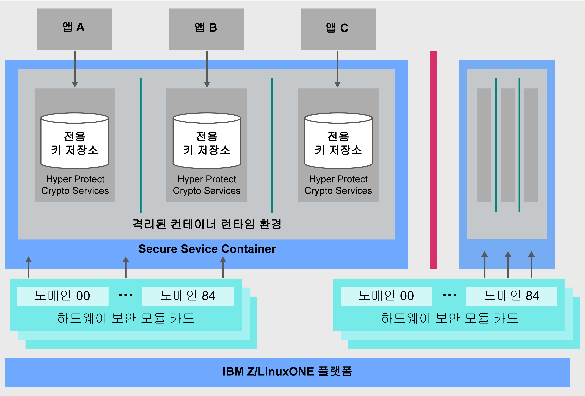

---

copyright:
  years: 2018, 2019
lastupdated: "2019-02-05"

Keywords: IBM Key, data security, Hyper Protect Crypto Services, HSM

subcollection: hs-crypto

---

{:new_window: target="_blank"}
{:shortdesc: .shortdesc}
{:screen: .screen}
{:codeblock: .codeblock}
{:pre: .pre}
{:important: .important}

# {{site.data.keyword.cloud_notm}} {{site.data.keyword.hscrypto}} 개요
{: #overview}

데이터 및 정보 보안은 IT 환경에 매우 중요하며 필수적입니다. 점점 더 많은 데이터가 클라우드로 이동함에 따라 데이터를 보호하는 것은 간단하지 않은 문제가 되고 있습니다.  {{site.data.keyword.cloud}} {{site.data.keyword.hscrypto}}는 데이터를 보호하기 위해 업계 최고의 보안 레벨을 달성한 기술을 사용하는 암호화를 제공합니다.
{: shortdesc}

## {{site.data.keyword.cloud_notm}} {{site.data.keyword.hscrypto}}를 선택해야 하는 이유

IBM LinuxONE 기술에 기반하여 빌드된 {{site.data.keyword.hscrypto}}는 사용자만 사용자 키에 액세스할 수 있도록 보장합니다. 데디케이티드 고객 제어 HSM이 제공하는 키 저장 기능이 있는 단일 테넌트 키 관리 서비스는 암호화 키를 쉽게 작성할 수 있도록 도와줍니다. 또는 사용자 고유의 암호화 키를 가져와 관리할 수도 있습니다. 관리되는 클라우드 HSM은 산업 표준을 지원하므로 <!-- such as PKCS #11,--> 애플리케이션은 디지털 서명 및 유효성 검증과 같은 암호화 오퍼레이션을 통합할 수 있습니다.

<!-- via PKCS#11 application programming interfaces (APIs). You can access {{site.data.keyword.hscrypto}} with several popular programming languages such as Java, JavaScript, and Swift. -->

{{site.data.keyword.hscrypto}}는 {{site.data.keyword.blockchainfull_notm}} Platform이 빌드되는 암호화합니다. 이 암호화 메커니즘은 Blockchain 네트워크가 고도로 보호되고 격리된 환경에서 실행 중인지 확인하고 네트워크에서 해싱, 서명/확인 오퍼레이션 및 노드 간 통신을 가속화합니다. {{site.data.keyword.blockchainfull_notm}} Platform의 성공은 {{site.data.keyword.hscrypto}}의 기능과 가치를 증명합니다.

## {{site.data.keyword.hscrypto}} 작동 방법
{: #architecture}

다음 아키텍처 다이어그램은 {{site.data.keyword.hscrypto}}가 작동하는 방법을 보여줍니다.

*그림 1. {{site.data.keyword.hscrypto}} 아키텍처*  

다음은 {{site.data.keyword.hscrypto}} 아키텍처의 몇 가지 중점사항입니다.

<!-- * Applications connect to {{site.data.keyword.hscrypto}} through PKCS#11 APIs. -->

- 데이터 격리 및 보안을 보장하기 위해 {{site.data.keyword.hscrypto}}의 전용 키 저장소가 제공됩니다. 시스템 관리자 및 루트 사용자 인증 정보의 악의적인 사용으로부터 보호하기 위해 권한 있는 사용자가 잠겨 있습니다.  
- SSC(Secure Service Container)는 엔터프라이즈 고객이 IBM Z 기술에서 기대하는 엔터프라이즈 레벨의 보안 및 견고성을 제공합니다.  
- 본인확인정보의 가장 높은 물리적 보호를 위해 FIPS 140-2 레벨 4 준수 클라우드 HSM이 사용됩니다.  

## 주요 기능
{: #key-features}

다음은 {{site.data.keyword.hscrypto}}의 주요 기능입니다.

### 고객 제어 클라우드 HSM을 통해 암호화 키를 사용하여 {{site.data.keyword.cloud_notm}} 데이터 서비스 보호
{: #key-feature-1}

{{site.data.keyword.hscrypto}}는 보존, 제어 및 관리할 수 있는 암호화 키를 사용하여 데이터에 대한 제어 및 권한을 더 강화할 수 있도록 KYOK(Keep Your Own Key)를 지원합니다. 고객 제어 클라우드 하드웨어 보안 모듈(HSM)에 사용 가능한 지원을 통해 디지털 키가 {{site.data.keyword.cloud_notm}}의 산업 규정에 따라 보호되고 고객만 디지털 키에 액세스할 수 있습니다.<!-- The HSM provides PKCS#11 APIs, which makes {{site.data.keyword.hscrypto}} accessible by several popular programming languages such as Java, JavaScript, and Swift.-->

### FIPS 140-2 레벨 4 인증 기술이 제공됨
{: #key-feature-2}

{{site.data.keyword.hscrypto}}는 암호화 하드웨어에 대해 달성 가능한 최고 보안 레벨인 FIPS 140-2 레벨 4 인증 기술에 대한 액세스를 제공합니다. <!-- Industries, such as financial sector services, require this level of security to protect their data.--> 이 보안 레벨에서 물리적 보안 메커니즘은 물리적 액세스 시 권한 없는 모든 시도를 발견하고 이에 응답할 목적으로 암호화 모듈 주위에 완벽한 보호 엔벨로프를 제공합니다.

### 키 및 데이터에 대한 권한 있는 사용자 액세스가 없음
{: #key-feature-3}

{{site.data.keyword.hscrypto}}는 IBM Z의 고유 데이터 보호 기능을 {{site.data.keyword.cloud_notm}}로 가져옵니다. {{site.data.keyword.hscrypto}}는 엔터프라이즈 고객이 IBM Z 기술에서 기대하는 엔터프라이즈 레벨의 보안 및 견고성을 제공하는 SSC에서 데이터를 보호합니다. 하드웨어 가상화가 격리된 환경에서 데이터를 보호하는 데 사용됩니다. 이 방식으로 서비스 인스턴스별로 전용 서비스가 제공되므로 클라우드 관리자와 같은 권한 있는 사용자를 포함하여 데이터에 대한 외부 액세스가 허용되지 않습니다. 따라서 내부자 위협에 대한 데이터 손상 위험이 감소합니다.

### {{site.data.keyword.cloud_notm}} 데이터 및 스토리지 서비스 보안을 위한 {{site.data.keyword.keymanagementservicefull_notm}} 통합
{: #key-feature-4}

키를 생성하고 보호하기 위해 {{site.data.keyword.keymanagementservicefull_notm}} API가 {{site.data.keyword.hscrypto}}에 통합되었습니다. {{site.data.keyword.hscrypto}}가 이러한 키를 보호하고 업계 최고의 보안 레벨에서 인증된 기술로 데이터를 보호하는 IBM Z의 고도로 보호되고 격리된 환경에 저장합니다.

<!-- {{site.data.keyword.hscrypto}} also leverages the **IBM Advanced Crypto Service Provider (ACSP)** solution that enables remote access to the IBM’s cryptographic coprocessors. ACSP allows for utilization of strong hardware-based cryptography as a service in distributed environments where data security cannot be guaranteed. {{site.data.keyword.hscrypto}} utilizes ACSP as a *network hardware security module (NetHSM)* that provides access to HSM via PKCS#11 standard APIs.-->

<!-- With {{site.data.keyword.hscrypto}}, your **SSL keys are offloaded** to a {{site.data.keyword.hscrypto}} to ensure security and protection of those sensitive keys.  Besides, the certificate lifecycle management gets common approach to manage certificates and offers the visibility to certificate expiration.-->

## 역할 및 책임
{: #roles-responsibilities}

다음 표에는 {{site.data.keyword.hscrypto}}가 지원하는 역할이 표시되어 있습니다.

<table>
  <tr>
    <th>역할</th>
    <th>책임</th>
  </tr>
  <tr>
    <td>암호화 단위 관리자</td>
    <td>
      다른 암호화 단위 관리자 설치 등을 위해 관리 명령에 서명하고 서명 키를 제공합니다.
    </td>
  </tr>
  <tr>
    <td>키 소유자</td>
    <td>서비스 인스턴스를 초기화하기 위한 마스터 키 파트를 제공합니다.</td>
  </tr>
  <tr>
    <td>서비스 사용자</td>
    <td>사용자 인터페이스 및 API를 통해 루트 키와 표준 키를 저장, 검색 및 생성합니다.</td>
  </tr>
  <caption style="caption-side:bottom;">표 1. 역할 및 책임</caption>
</table>
