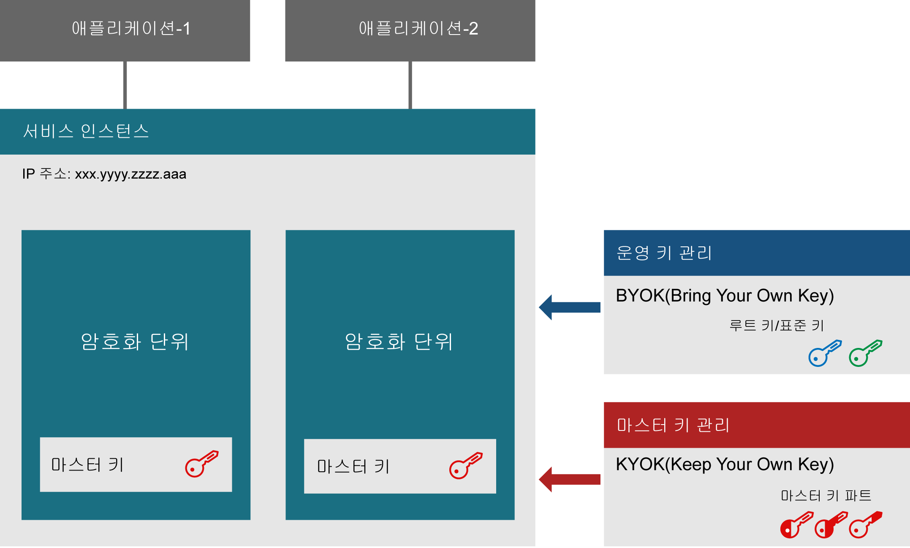
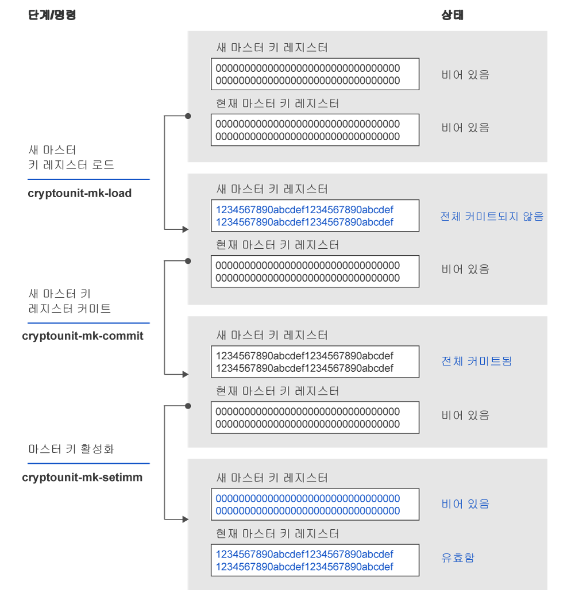

---

copyright:
  years: 2018, 2019
lastupdated: "2019-03-21"

Keywords: hsm, Trusted Key Entry plug-in, service instance, imprint mode

subcollection: hs-crypto

---

{:new_window: target="_blank"}
{:shortdesc: .shortdesc}
{:screen: .screen}
{:codeblock: .codeblock}
{:pre: .pre}
{:important: .important}

# 서비스 인스턴스 초기화 소개
{: #introduce-service}

{{site.data.keyword.hscrypto}}의 서비스 인스턴스를 초기화하기 전에 먼저 기본 개념과 처리 로직을 알아보고자 할 수 있습니다.  
{:shortdesc}

{{site.data.keyword.hscrypto}} 인스턴스(줄여서 서비스 인스턴스)는 IBM Cloud 사용자 계정에 지정된 암호화 단위 그룹입니다. 서비스 인스턴스에는 최대 6개의 암호화 단위가 있을 수 있습니다. 프로덕션 환경을 설정하는 경우 고가용성을 위해 두 개 이상의 암호화 단위를 지정하는 것이 좋습니다. 암호화 단위는 서로 다른 물리적 하드웨어 보안 모듈(HSM)에 있어야 합니다. 서비스 인스턴스의 모든 암호화 단위는 동일하게 구성해야 합니다. IBM Cloud의 한 파트에 액세스할 수 없는 경우 서비스 인스턴스의 암호화 단위를 서로 교환해서 사용할 수 있습니다.마스터 단위에는 키 스토리지의 컨텐츠를 암호화하는 마스터 키가 포함되어 있습니다. KYOK(Keep You Own Keys) 기술을 사용하면 서비스 인스턴스 관리자만 마스터 키에 액세스할 수 있습니다.

다음 다이어그램에서는 두 개의 암호화 단위가 있는 서비스 인스턴스에 대해 설명합니다.

*그림 1. 서비스 인스턴스 컴포넌트*

## 하드웨어 보안 모듈
{: #introduce-HSM}

하드웨어 보안 모듈(HSM)은 강력한 인증을 위해 디지털 키를 보호하고 관리하며 암호화 처리를 제공하는 물리적 디바이스입니다. {{site.data.keyword.cloud_notm}} {{site.data.keyword.hscrypto}}의 HSM은 암호화 하드웨어에 대해 최고 보안 레벨인 FIPS 140-2 레벨 4로 인증됩니다. 이 보안 레벨에서 물리적 보안 메커니즘은 물리적 액세스 시 권한 없는 모든 시도를 발견하고 이에 응답할 목적으로 암호화 모듈 주위에 완벽한 보호 엔벨로프를 제공합니다.

## 암호화 단위
{: #introduce-crypto-unit}

암호화 단위는 HSM을 표시하는 단일 단위이며 HSM 전용 소프트웨어 스택입니다. 각 암호화 단위는 최대 5000개의 디지털 키를 관리할 수 있습니다. 서비스 인스턴스에는 최대 6개의 암호화 단위가 있을 수 있습니다. 프로덕션 환경을 설정하는 경우 고가용성을 위해 두 개 이상의 암호화 단위를 지정하는 것이 좋습니다. 서비스 인스턴스의 모든 암호화 단위는 동일하게 구성해야 합니다. IBM Cloud의 한 파트에 액세스할 수 없는 경우 서비스 인스턴스의 암호화 단위를 서로 교환해서 사용할 수 있습니다.

## Trusted Key Entry 플러그인
{: #introduce-TKE}

Trusted Key Entry 플러그인을 사용하면 서비스 인스턴스의 마스터 키 레지스터를 사용자가 선택하고 제어하는 값이 있는 {{site.data.keyword.cloud}} 사용자 계정에 로드할 수 있습니다. Trusted Key Entry 플러그인은 {{site.data.keyword.cloud_notm}} 사용자 계정에 지정된 암호화 단위를 관리하기 위한 기능 세트를 제공합니다. 이 플러그인을 사용하여 마스터 키 값을 로드할 수 있습니다.

## 관리자
{: #introduce-administrators}

암호화 단위에 명령을 실행하기 위해 관리자를 대상 암호화 단위에 추가할 수 있습니다. 관리자는 하나의 개인용 서명 키를 소유합니다. 서명 키가 생성되면 서명 키를 사용하여 관리자를 대상 암호화 단위에 추가해야 합니다.

## 서명 키
{: #introduce-signature-keys}

관리자는 서명을 사용하여 암호화 단위에 실행되는 모든 명령에 서명해야 합니다. 서명 키 파일의 개인용 파트는 서명을 작성하는 데 사용됩니다. 공용 파트는 암호화 단위 관리자를 정의하기 위해 대상 암호화 단위에 설치된 인증서에 배치됩니다. 임프린트 모드로 실행된 명령은 서명할 필요가 없습니다.

## 임프린트 모드
{: #introduce-imprint-mode}

IBM Cloud 사용자에게 지정된 암호화 단위는 임프린트 모드로 알려진 해제된 상태에서 시작합니다. 임프린트 모드의 암호화 단위는 안전하지 않습니다. 마스터 키 레지스터는 임프린트 모드로 로드할 수 없습니다. 암호화 단위 관리자만 설정할 수 있고 임프린트 모드로 암호화 단위를 해제할 수 있습니다. 임프린트 모드로 암호화 단위에 실행된 명령은 서명할 필요가 없습니다. 그러나 임프린트 모드를 종료하는 명령은 서명 키를 사용하여 추가된 암호화 단위 관리자 중 한 명이 서명해야 합니다.

## 마스터 키
{: #introduce-master-key}

마스터 키는 키 스토리지의 서비스 인스턴스를 암호화하는 데 사용됩니다. 마스터 키가 있으면 루트 키 및 표준 키를 포함하여 키의 전체 체인을 암호화하는 신뢰점을 소유합니다. IBM에서는 마스터 키를 백업하거나 수정하지 않으며 마스터 키를 복사하거나 다른 시스템 또는 데이터 센터에 복원할 방법이 없습니다. 하나의 서비스 인스턴스에는 하나의 마스터 키만 있을 수 있습니다. 서비스 인스턴스의 마스터 키를 삭제하면 서비스에서 관리되는 키로 암호화된 모든 데이터의 암호를 효과적으로 제거할 수 있습니다.

{{site.data.keyword.hscrypto}}가 관리하는 키 유형에 대한 자세한 정보는 [키 소개](/docs/services/hs-crypto/keys_intro.html#introduce-keys)를 참조하십시오.

## 마스터 키 관리
{: #introduce-key-parts}

새 마스터 키 레지스터는 여러 개의 마스터 키 파트를 사용하여 로드됩니다. ITrusted Key Entry 플러그인에서 각 마스터 키 파트는 마스터 키 파트 파일에 저장됩니다. 두 개 또는 세 개의 마스터 키 파트가 새 마스터 키 레지스터를 로드하는 데 사용될 수 있습니다. 보안상의 이유로 서로 다른 사용자가 각 키 파트를 소유할 수 있습니다. 키 파트 소유자는 키 파트 파일과 연관된 비밀번호를 알고 있는 유일한 사용자여야 합니다.

## 마스터 키 레지스터
{: #introduce-key-registers}

각 암호화 단위에는 두 개의 마스터 키 레지스터(새 마스터 키 레지스터 및 현재 마스터 키 레지스터)가 있습니다. 현재 마스터 키 레지스터의 값은 사용자의 키 스토리지의 컨텐츠를 암호화합니다. 새 마스터 키 레지스터는 현재 마스터 키 레지스터에서 값을 변경하는 데 사용됩니다. 현재 마스터 키 레지스터에서 값을 변경하면 키 스토리지의 컨텐츠는 새 마스터 키 값으로 다시 암호화되어야 합니다. 이 작업을 수행하려면 현재 마스터 키 값과 새 마스터 키 값이 모두 필요합니다. 키 스토리지의 키 값은 현재 마스터 키 레지스터의 값을 사용하여 해독된 다음 새 마스터 키 레지스터의 값을 사용하여 다시 암호화됩니다. 재암호화는 HSM 내부에서 이루어지므로 안전합니다. 키 스토리지의 전체 컨텐츠를 다시 암호화한 후 새 마스터 키 레지스터의 값은 현재 마스터 키 레지스터로 이동될 수 있습니다.

다음 다이어그램에서는 마스터 키 레지스터 상태가 변경되는 방법과 마스터 키가 로드되는 방법에 대해 설명합니다.

*그림 1. 마스터 키 로드*  
