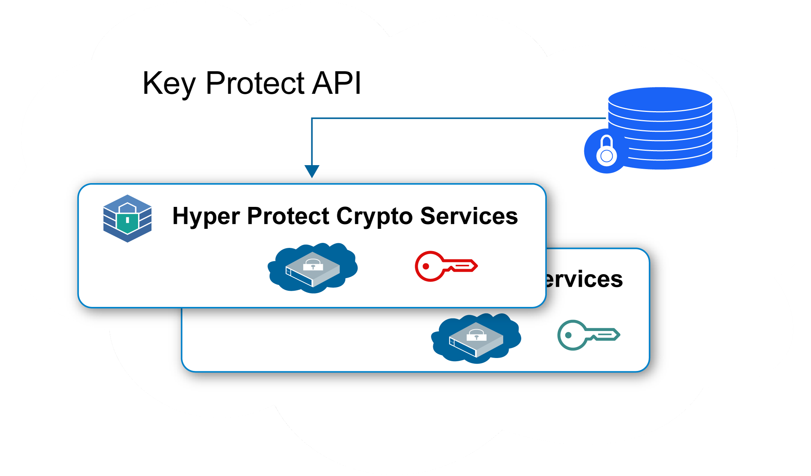
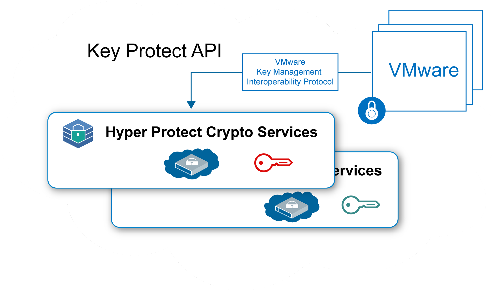

---

copyright:
  years: 2018, 2019
lastupdated: "2019-01-15"

Keywords: Hyper Protect Crypto Services, Keep Your Own Keys, VMware

subcollection: hs-crypto

---

{:new_window: target="_blank"}
{:shortdesc: .shortdesc}
{:screen: .screen}
{:codeblock: .codeblock}
{:pre: .pre}

# {{site.data.keyword.hscrypto}} 유스 케이스
{: #use-cases}

이 페이지에는 현재 {{site.data.keyword.hscrypto}}에 포함된 유스 케이스가 들어 있습니다. 이러한 유스 케이스는 이후 릴리스에서 지속적으로 발전할 것입니다.
{:shortdesc}

## KYOK(Keep Your Own Keys)를 사용하여 저장 데이터 암호화

{{site.data.keyword.hscrypto}}를 사용하면 고유 키를 통해 가장 높은 보안 레벨에서 저장 데이터를 암호화할 수 있습니다. {{site.data.keyword.hscrypto}}는 {{site.data.keyword.keymanagementservicefull_notm}} API를 사용하여 키를 생성하고 관리하는 키 관리 기능을 제공합니다.

다음은 {{site.data.keyword.hscrypto}}를 사용하여 저장 데이터를 보호하는 경우의 몇 가지 중점사항입니다.

 * {{site.data.keyword.hscrypto}}를 사용하여 클라우드 데이터 및 스토리지 서비스에 대한 저장 데이터 암호화를 수행할 수 있습니다.
 * {{site.data.keyword.hscrypto}}는 가져오고, 제어하고, 관리할 수 있는 암호화 키로 데이터에 대한 제어 및 권한을 더 강화할 수 있도록 KYOK(Keep Your Own Key)를 지원합니다.
 * 키 생성 및 보호를 위해 {{site.data.keyword.keymanagementservicefull_notm}} API가 통합됩니다.
 * 키가 가장 높은 보안인 FIPS 140-2 레벨 4 인증 기술로 보호됩니다.
 * 키가 고객이 관리하는 데디케이티드 HSM으로 보호됩니다. 즉, 해당 사용자만 자신의 데이터에 액세스할 수 있습니다.

*그림 1. KYOK를 사용한 저장 데이터 암호화*

## KYOK(Keep Your Own Key)를 사용하여 VMware 이미지 보호

저장 데이터 보호와 마찬가지로 {{site.data.keyword.hscrypto}}는 VMware KMIP(Key Management Interoperability Protocol)를 통해 암호화 및 복호화를 위해 VMware 저장 이미지를 보호할 수도 있습니다.

단일 테넌트 서비스인 {{site.data.keyword.hscrypto}}는 고객별로 VMware용 HSM(Hardware Security Module) 이미지에 대한 전용 제어를 제공합니다. {{site.data.keyword.hscrypto}}는 {{site.data.keyword.cloud_notm}}의 키 관리 서비스 제품군을 전용 하드웨어 시크릿 제어가 있는 단일 테넌트 인스턴스로 확장합니다.

*그림 2. KYOK를 사용한 VMware 이미지 보호*
