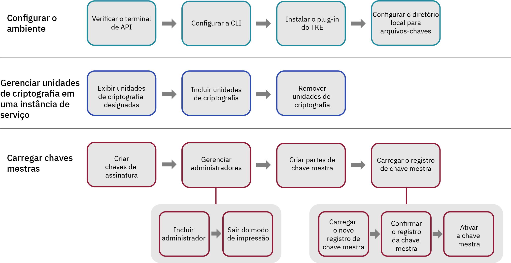

---

copyright:
  years: 2018, 2019
lastupdated: "2019-03-21"

Keywords: key storage, HSM, hardware security module

subcollection: hs-crypto

---

{:new_window: target="_blank"}
{:shortdesc: .shortdesc}
{:screen: .screen}
{:codeblock: .codeblock}
{:pre: .pre}
{:important: .important}
{:tip: .tip}

# Inicializando instâncias de serviço
{: #initialize-hsm}

Antes de usar a instância do {{site.data.keyword.hscrypto}} (instância de serviço para abreviação), é necessário carregar os registros de chave mestra usando o plug-in Trusted Key Entry.
{:shortdesc}

Para inicializar as instâncias de serviço, é necessário carregar a chave mestra com o plug-in Trusted Key Entry em seu armazenamento de chave, sua instância de serviço primeiro. O plug-in Trusted Key Entry permite que você carregue os seus valores de chave mestra.

Para obter uma introdução à inicialização da instância de serviço e outros conceitos, consulte [Introdução à inicialização da instância de serviço](/docs/services/hs-crypto/service_instance_concepts.html#introduce-service).

O diagrama a seguir dá a você uma visão geral das etapas que você precisa executar para inicializar a instância de serviço. Clique em cada etapa no diagrama para obter instruções detalhadas.


<map name="home_map1" id="home_map1">
<area href="/docs/services/hs-crypto?topic=hs-crypto-initialize-hsm#initialize-crypto-prerequisites" alt="Verificar terminal da API" title="Verificar terminal da API" shape="rect" coords="151, 20, 241, 78" />
<area href="/docs/services/hs-crypto?topic=hs-crypto-initialize-hsm#initialize-crypto-prerequisites" alt="Configurar CLI" title="Configurar CLI" shape="rect" coords="276, 20, 365, 78" />
<area href="/docs/services/hs-crypto?topic=hs-crypto-initialize-hsm#initialize-crypto-prerequisites4" alt="Instalar plug-in do TKE" title="Instalar plug-in do TKE" shape="rect" coords="401, 20, 493, 78" />
<area href="/docs/services/hs-crypto?topic=hs-crypto-initialize-hsm#initialize-crypto-prerequisites4" alt="Configurar diretório local para arquivos-chaves" title="Configurar diretório local para arquivos-chaves" shape="rect" coords="528, 20, 619, 78" />

<area href="/docs/services/hs-crypto?topic=hs-crypto-initialize-hsm#Identify_crypto_units" alt="Exibir unidades de criptografia designadas" title="Exibir unidades de criptografia designadas" shape="rect" coords="148, 111, 241, 171" />
<area href="/docs/services/hs-crypto?topic=hs-crypto-initialize-hsm#Identify_crypto_units1" alt="Incluir unidades de criptografia" title="Incluir unidades de criptografia" shape="rect" coords="276, 111, 366, 171" />
<area href="/docs/services/hs-crypto?topic=hs-crypto-initialize-hsm#Identify_crypto_units2" alt="Remover unidades de criptografia" title="Remover unidades de criptografia" shape="rect" coords="402, 111, 493, 171" />

<area href="/docs/services/hs-crypto?topic=hs-crypto-initialize-hsm#step1-create-signature-keys" alt="Criar uma ou mais chaves de assinatura" title="Criar chaves de assinatura" shape="rect" coords="149, 206, 242, 264" />
<area href="/docs/services/hs-crypto?topic=hs-crypto-initialize-hsm#step2-load-admin" alt="Gerenciar administradores de unidade de criptografia" title="Gerenciar administradores de unidade de criptografia" shape="rect" coords="281, 206, 366, 264" />
<area href="/docs/services/hs-crypto?topic=hs-crypto-initialize-hsm#step2-load-admin" alt="Incluir um ou mais administradores na unidade de criptografia de destino" title="Incluir administradores de unidade de criptografia" shape="rect" coords="242, 296, 312, 358" />
<area href="/docs/services/hs-crypto?topic=hs-crypto-initialize-hsm#step3-exit-imprint-mode" alt="Sair do modo de impressão na unidade de criptografia de destino" title="Sair do modo de impressão" shape="rect" coords="328, 301, 396, 359" />
<area href="/docs/services/hs-crypto?topic=hs-crypto-initialize-hsm#step4-create-master-key" alt="Criar um conjunto de partes de chave mestra para usar" title="Criar partes de chave mestra" shape="rect" coords="401, 208, 493, 266" />
<area href="/docs/services/hs-crypto?topic=hs-crypto-initialize-hsm#step5-load-master-key" alt="Carregar registros de chave mestra" title="Carregar registro de chave mestra" shape="rect" coords="525, 207, 620, 264" />
<area href="/docs/services/hs-crypto?topic=hs-crypto-initialize-hsm#step5-load-master-key" alt="Carregar novos registros de chave mestra" title="Carregar novo registro de chave mestra" shape="rect" coords="455, 297, 525, 358" />
<area href="/docs/services/hs-crypto?topic=hs-crypto-initialize-hsm#step6-commit-master-key" alt="Confirmar o novo registro de chave mestra" title="Confirmar o novo registro de chave mestra" shape="rect" coords="539, 297, 610, 358" />
<area href="/docs/services/hs-crypto?topic=hs-crypto-initialize-hsm#step7-activate-master-key" alt="Ativar a chave mestra" title="Ativar o registro de chave mestra" shape="rect" coords="619, 297, 689, 358" />
</map>

*Figura 1. Fluxo de tarefas de inicialização da instância de serviço*

Pode levar de 20 a 30 minutos para você concluir essa tarefa.

## Antes de Começar
{: #initialize-crypto-prerequisites}

1. Execute o comando a seguir para certificar-se de estar com login efetuado no terminal de API correto:

  ```
  Ibmcloud api https://api.ng.bluemix.net
  ```
  {: pre}

2. Instale o plug-in do {{site.data.keyword.keymanagementservicefull}}. Para obter as etapas detalhadas, consulte [Configurando a CLI](/docs/services/hs-crypto/set-up-cli.html). Ao efetuar login na [CLI do {{site.data.keyword.cloud_notm}}](/docs/cli/index.html#overview), você será notificado quando as atualizações estiverem disponíveis. Certifique-se de manter o seu plug-in do {{site.data.keyword.keymanagementservicefull}} atualizado para que seja possível usar os comandos e as sinalizações que estão disponíveis para o plug-in da CLI Trusted Key Entry.
{: #initialize-crypto-prerequisites2}

3. Instale o plug-in Trusted Key Entry mais recente com o comando a seguir:
{: #initialize-crypto-prerequisites3}

  ```
  Ibmcloud plugin install tke
  ```
  {: pre}

  **Importante:** se você estiver usando a instância Beta de ({{site.data.keyword.hscrypto}}), execute o comando 'ibmcloud plugin install tke -v 0.0.4' para obter a versão beta mais recente do plug-in Trusted Key Entry. Não instale versões mais recentes do plug-in Trusted Key Entry.

4. Configure a variável de ambiente CLOUDTKEFILES em sua estação de trabalho. Especifique um diretório no qual você deseja que os arquivos de partes de chave mestra e os arquivos de partes de chave de assinatura sejam criados e salvos. Crie o diretório se ele ainda não existir.
{: #initialize-crypto-prerequisites4}

  * No Linux ou MacOS, inclua a linha a seguir no arquivo `.bash_profile`:
     ```
     export CLOUDTKEFILES=<path>
     ```
     {: pre}
     Por exemplo, é possível especificar o *caminho* para `/Users/tke-files`.
  * No Windows, em **Painel de controle**, digite `environment variable` na caixa de procura para localizar a janela Variáveis de ambiente. Crie uma variável de ambiente CLOUDTKEFILES e configure o valor para o caminho para os arquivos-chaves. Por exemplo, `C:\users\tke-files`.

## Incluindo ou removendo as unidades de criptografia que são designadas para uma conta do usuário
{: #Identify_crypto_units}

As unidades de criptografia que são designadas para uma conta do usuário do {{site.data.keyword.cloud_notm}} estão em um grupo conhecido como *uma instância de serviço*. Uma instância de serviço pode ter até seis unidades de criptografia. Todas as unidades de criptografia em uma instância de serviço devem ser configuradas da mesma forma. Se uma parte do {{site.data.keyword.cloud_notm}} não puder ser acessada, as unidades de criptografia em uma instância de serviço poderão ser usadas de forma intercambiável para balanceamento de carga ou para disponibilidade.

As unidades de criptografia que são designadas para um usuário do {{site.data.keyword.cloud_notm}} iniciam em um estado limpo conhecido como *modo de impressão*.

Os registros de chave mestra em todas as unidades de criptografia em uma única instância de serviço devem ser configurados da mesma forma. O mesmo conjunto de administradores deve ser incluído em todas as unidades de criptografia e todas as unidades de criptografia devem sair do modo de impressão ao mesmo tempo.

* Para exibir as instâncias de serviço e as unidades de criptografia designadas para uma conta do usuário, use o comando a seguir:
  {: #Identify_crypto_units1}
  ```
  ibmcloud tke cryptounits
  ```
  {: pre}

  A seguir está uma saída de amostra que é exibida. A coluna SELECTED na tabela de saída identifica as unidades de criptografia que são destinadas por comandos administrativos subsequentes que são emitidos pelo plug-in Trusted Key Entry.

  ```
  SERVICE INSTANCE: 482cf2ce-a06c-4265-9819-0b4acf54f2ba
  CRYPTO UNIT NUM   SELECTED   LOCATION
  1                 true       [us-south].[AZ3-CS3].[02].[03]
  2                 true       [us-south].[AZ2-CS2].[02].[03]

  SERVICE INSTANCE: 96fe3f8d-9792-45bc-a9fb-2594222deaf2
  CRYPTO UNIT NUM   SELECTED   LOCATION
  3                 true       [us-south].[AZ1-CS4].[00].[03]
  4                 true       [us-south].[AZ2-CS5].[03].[03]
  ```
  {: screen}

* Para incluir unidades de criptografia adicionais na lista de unidades de criptografia selecionadas, use o comando a seguir:
  {: #Identify_crypto_units2}
  ```
  ibmcloud tke cryptounit-add
  ```
  {: pre}

  Um lista de unidades de criptografia que são designadas para a conta do usuário atual é exibida. Quando solicitado, insira uma lista de números de unidades de criptografia a serem incluídos na lista de unidades de criptografia selecionadas.

* Para remover unidades de criptografia da lista de unidades de criptografia selecionadas, use o comando a seguir:
  {: #Identify_crypto_units3}
  ```
  ibmcloud tke cryptounit-rm
  ```
  {: pre}

  Uma lista de unidades de criptografia que são designadas para a conta do usuário atual é exibida. Quando solicitado, insira uma lista de números de unidades de criptografia a serem removidos da lista de unidades de criptografia selecionadas.

  **Dica:** em geral, todas as unidades de criptografia ou nenhuma das unidades de criptografia em uma instância de serviço são selecionadas. Isso faz com que os comandos administrativos subsequentes atualizem todas as unidades de criptografia de uma instância de serviço de forma consistente. No entanto, se as unidades de criptografia de uma instância de serviço se tornarem configuradas de forma diferente, você precisará selecionar e trabalhar com as unidades de criptografia individualmente para restaurar uma configuração consistente para todas as unidades de criptografia em uma instância de serviço.

  É possível comparar as definições de configuração das unidades de criptografia selecionadas com o comando a seguir:
  ```
  ibmcloud tke cryptounit-compare
  ```
  {: pre}

## Carregando chaves mestra
{: #load-master-keys}

<!-- A service instance is implemented as one or more crypto units on IBM cryptographic coprocessors. -->

Antes que o novo registro de chave mestra possa ser carregado, inclua um ou mais administradores nas unidades de criptografia de destino e saia do modo de impressão.

Para carregar o novo registro de chave mestra, conclua as tarefas a seguir usando o plug-in da CLI do {{site.data.keyword.cloud_notm}}:

### Etapa 1: Criar uma ou mais chaves de assinatura
{: #step1-create-signature-keys}

Para carregar o novo registro de chave mestra, um administrador de unidade de criptografia deve assinar o comando com uma chave de assinatura exclusiva. A primeira etapa é criar um ou mais arquivos de chave de assinatura que contenham chaves de assinatura em sua estação de trabalho. <!-- The private part of the signature key file is used to create signatures. The public part is placed in a certificate that is installed in a target crypto unit to define a crypto unit administrator. -->

**Importante**: por considerações de segurança, o proprietário da chave de assinatura pode ser uma pessoa diferente dos proprietários da parte de chave mestra. O proprietário da chave de assinatura deve ser a única pessoa que sabe a senha associada ao arquivo-chave de assinatura.

* Para exibir as chaves de assinatura existentes na estação de trabalho, use o comando a seguir:
  ```
  ibmcloud tke sigkeys
  ```
  {: pre}

* Para criar e salvar uma nova chave de assinatura na estação de trabalho, use o comando a seguir:
  ```
  ibmcloud tke sigkey-add
  ```
  {: pre}

  Quando solicitado, insira um nome do administrador e uma senha para proteger o arquivo-chave de assinatura. Você deve se lembrar da senha. Se a senha for perdida, a chave de assinatura não poderá ser usada.

* Para selecionar o administrador para assinar comandos futuros, use o comando:
  ```
  ibmcloud tke sigkey-sel
  ```
  {: pre}

  Uma lista de arquivos-chave de assinatura localizados na estação de trabalho é exibida. Quando solicitado, insira o número da chave do arquivo de chave de assinatura para selecionar a assinatura de comandos administrativos subsequentes. <!--If a signature key file is already selected for signing administrative commands, this is indicated when the list of signature key files is displayed. -->

  <!-- **Tip**: Before you run the `cryptounit-exit-impr` command to exit imprint mode, the command needs to be signed by a crypto unit administrator using the signature key. After the crypto unit exits imprint mode, all commands to the crypto unit must be signed. -->

### Etapa 2: Incluir um ou mais administradores na unidade de criptografia de destino
{: #step2-load-admin}

<!-- After a crypto unit exits imprint mode, all administrative commands sent to the crypto unit must be signed by an administrator that is added to the crypto unit. -->

* Para exibir os administradores existentes para uma unidade de criptografia, use o comando a seguir:
  ```
  ibmcloud tke cryptounit-admins
  ```
  {: pre}

* Para incluir um novo administrador, use o comando a seguir:
  ```
  ibmcloud tke cryptounit-admin-add
  ```
  {: pre}

  Uma lista dos arquivos-chave de assinatura localizados na estação de trabalho é exibida.

  Quando solicitado, selecione o arquivo-chave de assinatura que está associado com o administrador de unidade de criptografia a ser incluído. Em seguida, insira a senha para o arquivo-chave de assinatura selecionado.

  Será possível repetir o comando para incluir administradores de unidade de criptografia adicional, se necessário. Qualquer administrador pode executar comandos independentemente na unidade de criptografia.

  No modo de impressão, o comando para incluir um administrador de unidade de criptografia não precisa ser assinado. Após deixar o modo de impressão, para incluir administradores de unidade de criptografia, o comando a ser usado deve ser assinado por um administrador de unidade de criptografia que já foi incluído na unidade de criptografia.

### Etapa 3: Sair do modo de impressão na unidade de criptografia de destino
{: #step3-exit-imprint-mode}

Uma unidade de criptografia em modo de impressão não é considerada segura. Não é possível executar a maioria dos comandos administrativos, como carregar o novo registro de chave mestra, no modo de impressão.

Após você incluir um ou mais administradores de unidade de criptografia, saia do modo de impressão usando o comando:

  ```
  ibmcloud tke cryptounit-exit-impr
  ```
  {: pre}

  ** Importante:** o comando para sair do modo de impressão deve ser assinado por um dos administradores de unidade de criptografia incluídos usando a chave de assinatura. Após a unidade de criptografia sair do modo de impressão, todos os comandos para a unidade de criptografia devem ser assinados.

### Etapa 4: Criar um conjunto de partes de chave mestra para usar
{: #step4-create-master-key}

Cada parte de chave mestra é salva em um arquivo protegido por senha na estação de trabalho.

**Importante**: deve-se criar pelo menos duas partes de chave mestra. Por considerações de segurança, três partes de chave mestra podem ser usadas e cada parte de chave pode ser de propriedade de uma pessoa diferente. O proprietário da parte de chave deve ser a única pessoa que sabe a senha associada ao arquivo de parte de chave.

* Para exibir as partes de chave mestra existentes na estação de trabalho, use o comando a seguir:
  ```
  ibmcloud tke mks
  ```
  {: pre}

* Para criar e salvar uma parte de chave mestra aleatória na estação de trabalho, use o comando:
  ```
  ibmcloud tke mk-add -- random
  ```
  {: pre}

  Quando solicitado, insira uma descrição para a parte de chave e uma senha para proteger o arquivo de parte de chave. Você deve se lembrar da senha. Se a senha for perdida, não será possível usar a parte de chave.

* Para inserir um valor de parte de chave conhecido e salvá-lo em um arquivo na estação de trabalho, use o comando a seguir:
  ```
  ibmcloud tke mk-add -- value
  ```
  {: pre}

  Quando solicitado, insira o valor de parte de chave como uma sequência hexadecimal para a parte de chave de 32 bytes. Em seguida, insira uma descrição para a parte de chave e uma senha para proteger o arquivo de parte de chave.

### Etapa 5: Carregar o novo registro de chave mestra
{: #step5-load-master-key}

**Importante**: para carregar um registro de chave mestra, todos os arquivos de parte de chave mestra e o arquivo de chave de assinatura devem estar presentes em uma estação de trabalho comum. Se os arquivos foram criados em estações de trabalho separadas, certifique-se de que os nomes de arquivo sejam diferentes para evitar confronto. Os proprietários do arquivo de parte de chave mestra e o proprietário do arquivo-chave de assinatura precisarão inserir as senhas do arquivo quando o registro de chave mestra for carregado na estação de trabalho comum.

Para obter informações sobre como a chave mestra é carregada, consulte as ilustrações detalhadas em [Registros de chave mestra](/docs/services/hs-crypto/service_instance_concepts.html#introduce-key-registers).

Para carregar o novo registro de chave mestra, use o comando a seguir:
```
ibmcloud tke cryptounit-mk-load
```
{: pre}

Uma lista das partes de chave mestra localizadas na estação de trabalho é exibida.

Quando solicitado, insira as partes de chave a serem carregadas no novo registro de chave mestra. E insira a senha para cada arquivo de parte de chave selecionado.

### Etapa 6: Confirmar o novo registro de chave mestra
{: #step6-commit-master-key}

Carregar o novo registro de chave mestra coloca-o no estado integral não confirmado. Antes de poder usar o novo registro de chave mestra para inicializar ou recodificar o armazenamento de chave, coloque o novo registro de chave mestra no estado confirmado. Para obter informações sobre como a chave mestra é carregada, consulte as ilustrações detalhadas em [Registros de chave mestra](/docs/services/hs-crypto/service_instance_concepts.html#introduce-key-registers).

Para confirmar o novo registro de chave mestra, use o comando a seguir:
```
ibmcloud tke cryptounit-mk-commit
```
{: pre}

### Etapa 7: ativar a chave mestra
{: #step7-activate-master-key}

Ative a chave mestra movendo-a para o registro de chave mestra atual com o comando a seguir:

```
ibmcloud tke cryptounit-mk-setimm
```
{: pre}

## O que vem a seguir
{: #initialize-crypto-next}

Acesse a guia **Gerenciar** de seu painel gerenciado do {{site.data.keyword.hscrypto}} para gerenciar as chaves raiz e as chaves padrão.

Para obter mais detalhes sobre outras opções dos comandos de plug-in Trusted Key Entry, execute o comando a seguir na CLI:

```
ibmcloud tke help
```
{: pre}

<!--
## Reference: Other Trusted Key Entry plug-in commands
{: #initialize-crypto-reference}

The following list describes the remaining commands implemented by the plug-in and discusses when they would be used.

* **ibmcloud tke mk-rm**

  This command removes a file that contains a master key part from the workstation.

  After you enter the command, a list of master key parts that are found on the workstation is displayed. When prompted, enter the key number of the key part that is to be removed.

  After a key part is removed from the local workstation, it can no longer be used.

* **ibmcloud tke sigkey-rm**

  This command removes a file that contains a signature key from the workstation.

  After you enter the command, a list of signature keys found on the workstation is displayed. When prompted, enter the key number of the signature key file that is to be removed.

  Be cautious of removing a signature key from the workstation. If any crypto units that are assigned to the user account exit imprint mode, and if the signature key being removed from the workstation is the only added administrator for the crypto unit, executing new administrative functions in the crypto unit is not possible after you remove the signature key. If no backup of the signature key file exists, the only way for recovery is to contact {{site.data.keyword.cloud_notm}} support to clear the crypto unit and place it in imprint mode.

* **ibmcloud tke cryptounit-admin-rm**

  This command removes an administrator from the selected crypto units.

  When this command is issued for a crypto unit in imprint mode, this command does not need to be signed. After the crypto unit exits imprint mode, this command must be signed by an existing crypto unit administrator.

  For a crypto unit not in imprint mode, the command fails if the administrator being removed is the last administrator defined for the crypto unit.


* **ibmcloud tke cryptounit-zeroize**

  This command clears the selected crypto units and places them back in imprint mode.  All crypto unit administrators are removed, and the new and current master key registers are cleared.

  When this command is issued for a crypto unit in imprint mode, this command does not need to be signed. After the crypto unit exits imprint mode, this command must be signed by an existing crypto unit administrator.

  When this command is issued to a group of crypto units, the current signature key must be recognized as a crypto unit administrator by all crypto units not in imprint mode in order for the command to be accepted.


* **ibmcloud tke cryptounit-mk**

  This command displays the status and verification pattern for the new and current master key registers for the selected crypto units.

* **ibmcloud tke cryptounit-mk-clrcur**

  This command clears the current master key register in the selected crypto units.

  This command cannot be executed in imprint mode.

  Clearing the current master key register makes any key storage protected by the current master key unusable.

* **ibmcloud tke cryptounit-mk-clrnew**

  This command clears the new master key register in the selected crypto units.

  This command cannot be executed in imprint mode.

* **ibmcloud tke cryptounit-mk-setimm**

  This command moves the value of the new master key register to the current master key register, and clears the new master key register in the selected crypto units.

  This command cannot be executed in imprint mode.

  This command does not initialize or re-encipher key storage and should be used only when key storage in the target LPARs is prepared to accept the new master key value. If in doubt, do not use this command, because it can cause keys in existing key storage to become unusable.

The following is a full list of plug-in commands. You can also find the commands by using the plug-in help function:
```
NAME:
   ibmcloud tke - A CLI plug-in to manage crypto module cryptounits in the IBM Cloud
USAGE:
   ibmcloud tke command [arguments...] [command options]

COMMANDS:
   mks                Lists master key parts stored on this workstation.
   mk-add             Creates and saves a new master key part.
   mk-rm              Removes a master key part from this workstation.
   sigkeys            Lists the signature keys stored on this workstation.
   sigkey-add         Generates and saves a new signature key.
   sigkey-rm          Removes a signature key from this workstation.
   sigkey-sel         Selects the signature key to use to sign commands.
   cryptounits            Displays the cryptounits for the current resource group.
   cryptounit-add         Adds cryptounits to the set of cryptounits to work with.
   cryptounit-rm          Removes cryptounits from the set of cryptounits to work with.
   cryptounit-admins      Lists administrators added in the selected cryptounits.
   cryptounit-admin-add   Add a cryptounit administrator to the selected cryptounits.
   cryptounit-admin-rm    Removes a cryptounit administrator from the selected cryptounits.
   cryptounit-compare     Compares configuration settings of the selected cryptounits.
   cryptounit-exit-impr   Exits imprint mode in the selected cryptounits.
   cryptounit-zeroize     Zeroizes the selected cryptounits.
   cryptounit-mk          Displays master key registers for the selected cryptounits.
   cryptounit-mk-clrcur   Clears the current master key register.
   cryptounit-mk-clrnew   Clears the new master key register.
   cryptounit-mk-commit   Commits the new master key register.
   cryptounit-mk-setimm   Does set immediate on the master key registers.
   cryptounit-mk-load     Loads the new master key register.
   help, h            Show help
   ```
-->
