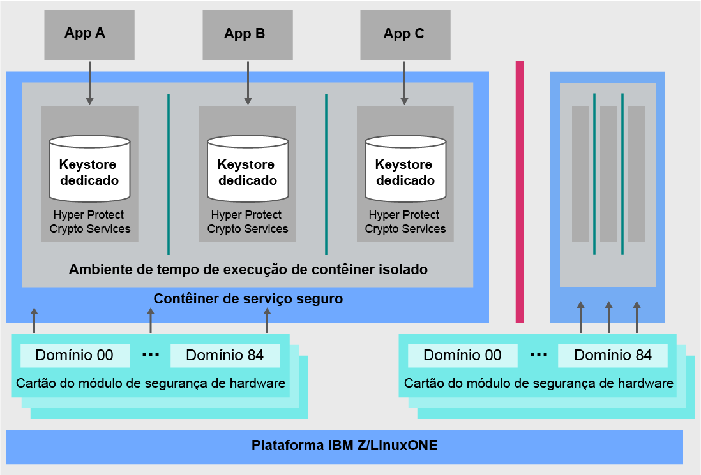

---

copyright:
  years: 2018, 2019
lastupdated: "2019-02-05"

Keywords: IBM Key, data security, Hyper Protect Crypto Services, HSM

subcollection: hs-crypto
---

{:new_window: target="_blank"}
{:shortdesc: .shortdesc}
{:screen: .screen}
{:codeblock: .codeblock}
{:pre: .pre}
{:important: .important}

# Visão Geral do {{site.data.keyword.cloud_notm}}  {{site.data.keyword.hscrypto}}
{: #overview}

<!-- {{site.data.keyword.cloud}} {{site.data.keyword.hscrypto}} is in the BETA phase and is for tryout and test purpose only. To prevent data loss, use only test data in the current service. This restriction also applies to using {{site.data.keyword.hscrypto}} with other  {{site.data.keyword.cloud_notm}} services.
{:important} -->

A segurança de dados e informações é crucial e essencial para ambientes de TI. À medida que mais dados se movem para a nuvem, a manutenção da proteção dos dados torna-se um desafio não trivial.  O {{site.data.keyword.cloud}} {{site.data.keyword.hscrypto}} oferece criptografia com a tecnologia que atingiu o nível de segurança mais alto da indústria para proteger seus dados.
{: shortdesc}

## Por que o  {{site.data.keyword.cloud_notm}}  {{site.data.keyword.hscrypto}}?

O {{site.data.keyword.hscrypto}} traz a segurança e a integridade do IBM Z para a nuvem. A mesma tecnologia criptográfica de ponta da qual os bancos e os serviços financeiros dependem é agora oferecida aos usuários da nuvem por meio do {{site.data.keyword.cloud_notm}}. <!-- With {{site.data.keyword.hscrypto}}, you can protect your data at rest, in use, and in transit.--> O {{site.data.keyword.hscrypto}} também se integra às APIs do {{site.data.keyword.keymanagementservicefull_notm}} para proteger suas chaves em um ambiente hiperprotegido no IBM Z.

Atrás da nuvem, o {{site.data.keyword.hscrypto}} oferece módulos de segurança de hardware (HSMs) da nuvem para fornecer criptografia.<!-- via PKCS#11 application programming interfaces (APIs). You can access {{site.data.keyword.hscrypto}} with several popular programming languages such as Java, JavaScript, and Swift. -->

{{site.data.keyword.hscrypto}} é a criptografia com a qual o {{site.data.keyword.blockchainfull_notm}} Platform é desenvolvido. Esse mecanismo de criptografia assegura que a rede de blockchain esteja em execução em um ambiente altamente protegido e isolado e acelera o hashing, as operações de assinatura/verificação e as comunicações de nó para nó na rede. O sucesso do {{site.data.keyword.blockchainfull_notm}} Platform prova a capacidade e o valor do {{site.data.keyword.hscrypto}}

## Como o  {{site.data.keyword.hscrypto}}  funciona?

O diagrama arquitetônico a seguir mostra como o {{site.data.keyword.hscrypto}} funciona.

*Figura 1. {{site.data.keyword.hscrypto}} arquitetura*  

A seguir estão alguns destaques da arquitetura do {{site.data.keyword.hscrypto}}:

<!-- * Applications connect to {{site.data.keyword.hscrypto}} through PKCS#11 APIs. -->

- O KeyStore dedicado no {{site.data.keyword.hscrypto}} é fornecido para assegurar o isolamento e a segurança de dados. Os usuários privilegiados são bloqueados para proteção contra o uso abusivo de credenciais do administrador do sistema ou do usuário raiz.  
- O Secure Service Container (SSC) fornece o nível corporativo de segurança e impregnabilidade que os clientes corporativos esperam da tecnologia IBM Z.  
- O HSM de nuvem compatível com o FIPS 140-2 Nível 4 está ativado para maior proteção física de segredos.  

## Recursos-chave  

A seguir estão os recursos-chave do {{site.data.keyword.hscrypto}}:

### Proteção de serviços de dados do {{site.data.keyword.cloud_notm}} usando chaves de criptografia com HSMs de nuvem controlados pelo cliente

O {{site.data.keyword.hscrypto}} suporta a função Keep Your Own Keys (KYOK) para que você tenha mais controle e autoridade sobre seus dados com chaves de criptografia que podem ser mantidas, controladas e gerenciadas. O suporte disponível para os módulos de segurança de hardware (HSM) da nuvem controlados pelo cliente permite que as chaves digitais sejam protegidas de acordo com as regulamentações da indústria no {{site.data.keyword.cloud_notm}} e para serem acessadas somente pelo cliente.<!-- The HSM provides PKCS#11 APIs, which makes {{site.data.keyword.hscrypto}} accessible by several popular programming languages such as Java, JavaScript, and Swift.-->

### Tecnologia fornecida certificada pelo FIPS 140-2 Nível 4

O {{site.data.keyword.hscrypto}} fornece acesso à tecnologia certificada pelo FIPS 140-2 Nível 4, o mais alto nível de segurança de segurança para o hardware criptográfico. <!-- Industries, such as financial sector services, require this level of security to protect their data.--> Nesse nível de segurança, os mecanismos de segurança física fornecem um envelope completo de proteção ao redor do módulo de criptografia com a intenção de detectar e responder a todas as tentativas não autorizadas no acesso físico.

### Nenhum acesso de usuário privilegiado a suas chaves e dados

O {{site.data.keyword.hscrypto}} traz os recursos exclusivos de proteção de dados do IBM Z para o {{site.data.keyword.cloud_notm}}. O {{site.data.keyword.hscrypto}} protege seus dados no SSC que fornece o nível corporativo de segurança e impregnabilidade que os clientes corporativos esperam da tecnologia IBM Z. A virtualização de hardware é usada para proteger seus dados em um ambiente isolado. Dessa maneira, é fornecido um serviço dedicado por instância de criptografia, portanto, nenhum acesso externo é permitido, incluindo usuários privilegiados, como administradores de nuvem, a seus dados. Desse modo, o risco de comprometimento de dados com relação a ameaças internas é reduzido.

### Integração do {{site.data.keyword.keymanagementservicefull_notm}} para proteger dados e serviços de armazenamento do {{site.data.keyword.cloud_notm}}

As APIs do {{site.data.keyword.keymanagementservicefull_notm}} são integradas ao {{site.data.keyword.hscrypto}} para gerar e proteger chaves. O {{site.data.keyword.hscrypto}} protege essas chaves e as armazena em um ambiente altamente protegido e isolado no IBM Z, protegendo seus dados com a tecnologia certificada no nível de segurança mais alto da indústria.

<!-- {{site.data.keyword.hscrypto}} also leverages the **IBM Advanced Crypto Service Provider (ACSP)** solution that enables remote access to the IBM’s cryptographic coprocessors. ACSP allows for utilization of strong hardware-based cryptography as a service in distributed environments where data security cannot be guaranteed. {{site.data.keyword.hscrypto}} utilizes ACSP as a *network hardware security module (NetHSM)* that provides access to HSM via PKCS#11 standard APIs.-->

<!-- With {{site.data.keyword.hscrypto}}, your **SSL keys are offloaded** to a {{site.data.keyword.hscrypto}} to ensure security and protection of those sensitive keys.  Besides, the certificate lifecycle management gets common approach to manage certificates and offers the visibility to certificate expiration.-->

## Funções e Responsabilidades

A tabela a seguir mostra as funções suportadas pelo {{site.data.keyword.hscrypto}}.

<table>
  <tr>
    <th>Papéis</th>
    <th>Responsabilidades</th>
  </tr>
  <tr>
    <td>Administrador do HSM (domínio)</td>
    <td>
      Assina comandos administrativos, como para instalar outro administrador de domínio, e fornece chaves de assinatura.
    </td>
  </tr>
  <tr>
    <td>Proprietário da chave</td>
    <td>Fornece partes de chave mestra para inicializar uma instância de criptografia.</td>
  </tr>
  <tr>
    <td>Usuário do serviço</td>
    <td>Armazena, recupera e gera chaves raiz e chaves padrão por meio da interface com o usuário e de APIs.</td>
  </tr>
  <caption style="caption-side:bottom;">Tabela 1. Funções e Responsabilidades</caption>
</table>
