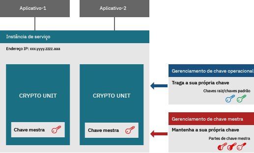
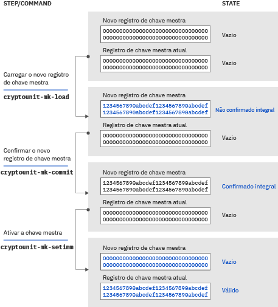

---

copyright:
  years: 2018, 2019
lastupdated: "2019-03-21"

Keywords: hsm, Trusted Key Entry plug-in, service instance, imprint mode

subcollection: hs-crypto

---

{:new_window: target="_blank"}
{:shortdesc: .shortdesc}
{:screen: .screen}
{:codeblock: .codeblock}
{:pre: .pre}
{:important: .important}

# Introdução à inicialização da instância de serviço
{: #introduce-service}

Antes de começar a inicializar a instância de serviço do {{site.data.keyword.hscrypto}}, talvez você queira entender os conceitos básicos e a lógica de processo primeiro.  
{:shortdesc}

Uma instância do {{site.data.keyword.hscrypto}} (instância de serviço para abreviação) é um grupo de unidades de criptografia que são designadas a uma conta do usuário do IBM Cloud. Uma instância de serviço pode ter até seis unidades de criptografia. Se você estiver configurando um ambiente de produção, sugere-se designar pelo menos duas unidades de criptografia por instância de serviço para alta disponibilidade. As unidades de criptografia devem estar em Módulos de segurança de hardware (HSMs) físicos diferentes. Todas as unidades de criptografia em uma instância de serviço devem ser configuradas da mesma forma. Se uma parte do IBM Cloud não puder ser acessada, as unidades de criptografia em uma instância de serviço poderão ser usadas de forma intercambiável. As unidades de criptografia contêm chaves mestras que criptografam os conteúdos do armazenamento de chave. Com a tecnologia Keep You Own Keys, os administradores da instância de serviço são a única pessoa que pode acessar a chave mestra.

O diagrama a seguir ilustra uma instância de serviços com duas unidades de criptografia.

*Figura 1. Componentes da instância de serviço*

## Módulo de Segurança de Hardware
{: #introduce-HSM}

O módulo de segurança de hardware (HSM) é um dispositivo físico que protege e gerencia chaves digitais para autenticação forte e fornece o processamento de criptografia. HSMs do {{site.data.keyword.cloud_notm}} {{site.data.keyword.hscrypto}} são certificados pelo FIPS 140-2 Nível 4, que é o nível mais alto de segurança para o hardware de criptografia. Nesse nível de segurança, os mecanismos de segurança física fornecem um envelope completo de proteção ao redor do módulo de criptografia com a intenção de detectar e responder a todas as tentativas não autorizadas no acesso físico.

## Unidade de criptografia
{: #introduce-crypto-unit}

Uma unidade de criptografia é a única unidade que representa um HSM e a pilha de software correspondente dedicada ao HSM. Cada unidade de criptografia pode gerenciar até 5000 chaves digitais. Uma instância de serviço pode ter até seis unidades de criptografia. Se você estiver configurando um ambiente de produção, sugere-se designar pelo menos duas unidades de criptografia por instância de serviço para alta disponibilidade. Todas as unidades de criptografia em uma instância de serviço devem ser configuradas da mesma forma. Se uma parte do IBM Cloud não puder ser acessada, as unidades de criptografia em uma instância de serviço poderão ser usadas de forma intercambiável.

## Plug-in Trusted Key Entry
{: #introduce-TKE}

Usando o plug-in Trusted Key Entry, é possível carregar os registros de chave mestra de instâncias de serviço em sua conta do usuário do {{site.data.keyword.cloud}} com valores que você escolhe e controla. O plug-in Trusted Key Entry fornece um conjunto de funções para gerenciar as unidades de criptografia designadas a uma conta do usuário do {{site.data.keyword.cloud_notm}}. O plug-in permite carregar os valores da chave mestra.

## Administradores
{: #introduce-administrators}

Os administradores podem ser incluídos nas unidades de criptografia de destino para emitir comandos para as unidades de criptografia. Um administrador possui uma chave de assinatura privada. Após as chaves de assinatura serem geradas, será necessário incluir os administradores com as chaves de assinatura na unidade de criptografia de destino.

## Chaves de assinatura
{: #introduce-signature-keys}

Um administrador deve assinar qualquer comando emitido para a unidade de criptografia com uma assinatura. A parte privada do arquivo de chave de assinatura é usada para criar assinaturas. A parte pública é colocada em um certificado que é instalado em uma unidade de criptografia de destino para definir um administrador de unidade de criptografia. Os comandos emitidos no modo de impressão não precisam ser assinados.

## Modo de impressão
{: #introduce-imprint-mode}

As unidades de criptografia que são designadas a um usuário do IBM Cloud iniciam em um estado limpo conhecido como modo de impressão. Uma unidade de criptografia em modo de impressão não é segura. Os registros de chave mestra não podem ser carregados no modo de impressão. Só é possível configurar administradores de unidade de criptografia e limpar a unidade de criptografia no modo de impressão. Os comandos emitidos para uma unidade de criptografia no modo de impressão não precisam ser assinados. No entanto, o comando para sair do modo de impressão deve ser assinado por um dos administradores de unidade de criptografia incluídos usando a chave de assinatura.

## Chaves mestras
{: #introduce-master-key}

As chaves mestras são usadas para criptografar a instância de serviço para armazenamento de chave. Com a chave mestra, você possui a raiz de confiança que criptografa a cadeia inteira de chaves, incluindo as chaves raiz e as chaves padrão. A IBM não faz backup da chave mestra nem toca nela e não tem como copiá-la ou restaurá-la para uma máquina ou um data center diferente. Uma instância de serviço pode ter apenas uma chave mestra. Se você excluir a chave mestra da instância de serviço, será possível fragmentar por criptografia efetivamente todos os dados que foram criptografados com as chaves gerenciadas no serviço.

Para obter mais informações sobre os tipos de chave que o {{site.data.keyword.hscrypto}} gerencia, consulte [Introdução às chaves](/docs/services/hs-crypto/keys_intro.html#introduce-keys).

## Partes de chave mestra
{: #introduce-key-parts}

O novo registro de chave mestra é carregado usando múltiplas partes de chave mestra. No plug-in Trusted Key Entry, cada parte de chave mestra é armazenada em um arquivo de parte de chave mestra. Duas ou três partes de chave mestra podem ser usadas para carregar o novo registro de chave mestra. Por considerações de segurança, cada parte de chave pode ser de propriedade de uma pessoa diferente. O proprietário da parte de chave deve ser a única pessoa que sabe a senha associada ao arquivo de parte de chave.

## Registros da chave mestra
{: #introduce-key-registers}

Cada unidade de criptografia tem dois registros de chave mestra: um novo registro de chave mestra e um registro de chave mestra atual. O valor no registro de chave mestra atual criptografa os conteúdos do armazenamento de chave do usuário. O novo registro de chave mestra é usado para mudar o valor no registro de chave mestra atual. Ao mudar o valor no registro de chave mestra atual, os conteúdos do armazenamento de chave precisam ser recodificados com o novo valor da chave mestra. Tanto o valor da chave mestra atual quanto o novo valor da chave mestra são necessários para fazer isso. Os valores da chave no armazenamento de chave são decodificados usando o valor no registro de chave mestra atual e, em seguida, recodificados usando o valor no novo registro de chave mestra. A recodificação ocorre dentro do HSM; portanto, ela é segura. Após os conteúdos integrais do armazenamento de chave terem sido recodificados, o valor no novo registro de chave mestra poderá ser movido para o registro de chave mestra atual.

O diagrama a seguir ilustra como o estado do registro da chave mestra muda e como a chave mestra é carregada.

*Figura 1. Carregando chaves mestras*  
