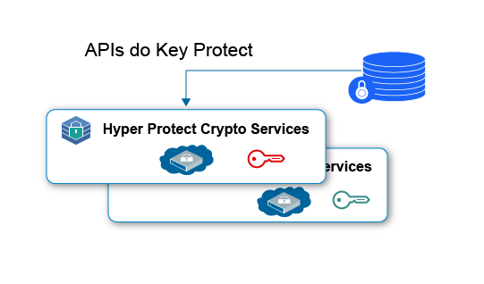
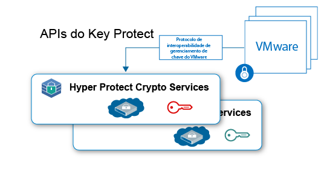

---

copyright:
  years: 2018, 2019
lastupdated: "2019-01-15"

Keywords: Hyper Protect Crypto Services, Keep Your Own Keys, VMware

subcollection: hs-crypto

---

{:new_window: target="_blank"}
{:shortdesc: .shortdesc}
{:screen: .screen}
{:codeblock: .codeblock}
{:pre: .pre}

# {{site.data.keyword.hscrypto}}  casos de uso
{: #use-cases}

Esta página inclui os casos de uso atualmente incluídos no {{site.data.keyword.hscrypto}}. Esses casos de uso estarão sendo continuamente desenvolvidos em liberações mais recentes.
{:shortdesc}

## Criptografia de dados em repouso com Keep Your Own Keys
{: #data-at-rest-encryption}

É possível usar o {{site.data.keyword.hscrypto}} para criptografar seus dados em repouso no nível de segurança mais alto com suas próprias chaves. O {{site.data.keyword.hscrypto}} fornece os recursos de gerenciamento de chave para gerar e gerenciar suas chaves usando APIs do {{site.data.keyword.keymanagementservicefull_notm}}.

A seguir estão alguns destaques do uso do {{site.data.keyword.hscrypto}} para proteger os dados em repouso:

 * O {{site.data.keyword.hscrypto}} permite a criptografia de dados em repouso para dados de nuvem e serviços de armazenamento.
 * O {{site.data.keyword.hscrypto}} suporta a função Keep Your Own Keys (KYOK) para que você tenha mais controle e autoridade sobre seus dados com chaves de criptografia que podem ser trazidas, controladas e gerenciadas.
 * As APIs do {{site.data.keyword.keymanagementservicefull_notm}} são integradas para geração e proteção da chave.
 * Suas chaves são protegidas na segurança mais alta, a tecnologia certificada FIPS 140-2 Nível 4.
 * As chaves são protegidas por HSMs dedicados gerenciados pelo cliente, o que significa que somente você tem acesso a seus dados.

*Figura 1. Criptografia de dados em repouso com KYOK*

## Proteção da imagem do VMware com keep Your Own Keys
{: #vmware-image-protection}

Semelhante à proteção de dados em repouso, o {{site.data.keyword.hscrypto}} também pode proteger a imagem do VMware em repouso para criptografia e decriptografia por meio do VMware Key Management Interoperability Protocol.

Como um serviço de único locatário, o {{site.data.keyword.hscrypto}} oferece controle dedicado do Hardware Security Module para imagens do VMware por cliente. O {{site.data.keyword.hscrypto}} amplia a família de serviços de gerenciamento de chave no {{site.data.keyword.cloud_notm}} para instâncias de único locatário com controle de segredo de hardware dedicado.

*Figura 2. Proteção de imagem do VMware com KYOK*
