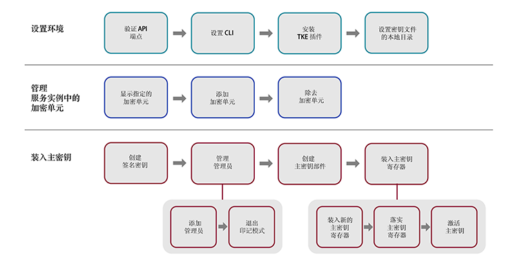

---

copyright:
  years: 2018, 2019
lastupdated: "2019-03-21"

Keywords: key storage, HSM, hardware security module

subcollection: hs-crypto

---

{:new_window: target="_blank"}
{:shortdesc: .shortdesc}
{:screen: .screen}
{:codeblock: .codeblock}
{:pre: .pre}
{:important: .important}
{:tip: .tip}

# 初始化服务实例
{: #initialize-hsm}

使用 {{site.data.keyword.hscrypto}} 实例（简称服务实例）之前，您需要使用 Trusted Key Entry 插件装入主密钥寄存器。
{:shortdesc}

要初始化服务实例，您首先需要使用 Trusted Key Entry 插件将主密钥装入密钥存储器及服务实例。Trusted Key Entry 插件允许装入主密钥值。

有关服务实例初始化和其他概念的简介，请参阅[服务实例初始化简介](/docs/services/hs-crypto/service_instance_concepts.html#introduce-service)。

下图概述了初始化服务实例所需执行的步骤。单击图上的每个步骤可获取详细指示信息。


<map name="home_map1" id="home_map1">
<area href="/docs/services/hs-crypto?topic=hs-crypto-initialize-hsm#initialize-crypto-prerequisites" alt="验证 API 端点" title="验证 API 端点" shape="rect" coords="151, 20, 241, 78" />
<area href="/docs/services/hs-crypto?topic=hs-crypto-initialize-hsm#initialize-crypto-prerequisites" alt="设置 CLI" title="设置 CLI" shape="rect" coords="276, 20, 365, 78" />
<area href="/docs/services/hs-crypto?topic=hs-crypto-initialize-hsm#initialize-crypto-prerequisites4" alt="安装 TKE 插件" title="安装 TKE 插件" shape="rect" coords="401, 20, 493, 78" />
<area href="/docs/services/hs-crypto?topic=hs-crypto-initialize-hsm#initialize-crypto-prerequisites4" alt="设置密钥文件的本地目录" title="设置密钥文件的本地目录" shape="rect" coords="528, 20, 619, 78" />

<area href="/docs/services/hs-crypto?topic=hs-crypto-initialize-hsm#Identify_crypto_units" alt="显示指定的加密单元" title="显示指定的加密单元" shape="rect" coords="148, 111, 241, 171" />
<area href="/docs/services/hs-crypto?topic=hs-crypto-initialize-hsm#Identify_crypto_units1" alt="添加加密单元" title="添加加密单元" shape="rect" coords="276, 111, 366, 171" />
<area href="/docs/services/hs-crypto?topic=hs-crypto-initialize-hsm#Identify_crypto_units2" alt="除去加密单元" title="除去加密单元" shape="rect" coords="402, 111, 493, 171" />

<area href="/docs/services/hs-crypto?topic=hs-crypto-initialize-hsm#step1-create-signature-keys" alt="创建一个或多个签名密钥" title="创建签名密钥" shape="rect" coords="149, 206, 242, 264" />
<area href="/docs/services/hs-crypto?topic=hs-crypto-initialize-hsm#step2-load-admin" alt="管理加密单元管理员" title="管理加密单元管理员" shape="rect" coords="281, 206, 366, 264" />
<area href="/docs/services/hs-crypto?topic=hs-crypto-initialize-hsm#step2-load-admin" alt="在目标加密单元中添加一个或多个管理员" title="添加加密单元管理员" shape="rect" coords="242, 296, 312, 358" />
<area href="/docs/services/hs-crypto?topic=hs-crypto-initialize-hsm#step3-exit-imprint-mode" alt="退出目标加密单元的印记模式" title="退出印记模式" shape="rect" coords="328, 301, 396, 359" />
<area href="/docs/services/hs-crypto?topic=hs-crypto-initialize-hsm#step4-create-master-key" alt="创建一组要使用的主密钥部件" title="创建主密钥部件" shape="rect" coords="401, 208, 493, 266" />
<area href="/docs/services/hs-crypto?topic=hs-crypto-initialize-hsm#step5-load-master-key" alt="装入主密钥寄存器" title="装入主密钥寄存器" shape="rect" coords="525, 207, 620, 264" />
<area href="/docs/services/hs-crypto?topic=hs-crypto-initialize-hsm#step5-load-master-key" alt="装入新的主密钥寄存器" title="装入新的主密钥寄存器" shape="rect" coords="455, 297, 525, 358" />
<area href="/docs/services/hs-crypto?topic=hs-crypto-initialize-hsm#step6-commit-master-key" alt="落实新的主密钥寄存器" title="落实新的主密钥寄存器" shape="rect" coords="539, 297, 610, 358" />
<area href="/docs/services/hs-crypto?topic=hs-crypto-initialize-hsm#step7-activate-master-key" alt="激活主密钥" title="激活主密钥寄存器" shape="rect" coords="619, 297, 689, 358" />
</map>

*图 1. 服务实例初始化的任务流程*

完成此任务可能需要 20-30 分钟。

## 开始之前
{: #initialize-crypto-prerequisites}

1. 运行以下命令，以确保已登录到正确的 API 端点：

  ```
  ibmcloud api https://api.ng.bluemix.net
  ```
  {: pre}

2. 安装 {{site.data.keyword.keymanagementservicefull}} 插件。有关详细步骤，请参阅[设置 CLI](/docs/services/hs-crypto/set-up-cli.html)。登录到 [{{site.data.keyword.cloud_notm}} CLI](/docs/cli/index.html#overview) 后，您会收到有关更新可用的通知。请确保使 {{site.data.keyword.keymanagementservicefull}} 插件保持最新，以便可以使用可用于 Trusted Key Entry CLI 插件的命令和标志。
{: #initialize-crypto-prerequisites2}

3. 使用以下命令来安装最新的 Trusted Key Entry 插件：
{: #initialize-crypto-prerequisites3}

  ```
  ibmcloud plugin install tke
  ```
  {: pre}

  **重要信息：**如果使用 {{site.data.keyword.hscrypto}} 的 Beta 实例，请运行 'ibmcloud plugin install tke -v 0.0.4' 来获取 Trusted Key Entry 插件的最新 Beta 版本。请勿安装 Trusted Key Entry 插件的更高版本。

4. 在工作站上设置环境变量 CLOUDTKEFILES。指定要在其中创建并保存主密钥部件文件和签名密钥部件文件的目录。如果该目录尚不存在，请先创建。
{: #initialize-crypto-prerequisites4}

  * 对于 Linux 或 MacOS，在 `.bash_profile` 文件中添加以下行：
     ```
     export CLOUDTKEFILES=<path>
     ```
     {: pre}
     例如，您可以将 *path* 指定为 `/Users/tke-files`。
  * 对于 Windows，在**控制面板**的搜索框中输入`环境变量`，以找到“环境变量”窗口。创建 CLOUDTKEFILES 环境变量，并将值设置为密钥文件的路径。例如，`C:\users\tke-files`。

## 添加或除去指定给用户帐户的加密单元。
{: #Identify_crypto_units}

指定给 {{site.data.keyword.cloud_notm}} 用户帐户的加密单元属于称为*服务实例*的组。服务实例最多可具有 6 个加密单元。服务实例中的所有加密单元应进行相同的配置。如果无法访问 {{site.data.keyword.cloud_notm}} 的某个部分，那么服务实例中的加密单元能够以可互换的方式实现负载均衡或提供可用性。

指定给 {{site.data.keyword.cloud_notm}} 用户的加密单元开始时处于已清除状态，称为*印记模式*。

单个服务实例中所有加密单元中的主密钥寄存器必须按相同方式进行设置。必须在所有加密单元中添加同一组管理员，并且所有加密单元必须同时退出印记模式。

* 要显示已指定给用户帐户的服务实例和加密单元，请使用以下命令：
  {: #Identify_crypto_units1}
  ```
  ibmcloud tke cryptounits
  ```
  {: pre}

  下面是显示的样本输出。输出表中的 SELECTED 列标识哪些加密单元会作为 Trusted Key Entry 插件发出的后续管理命令的目标。

  ```
  SERVICE INSTANCE: 482cf2ce-a06c-4265-9819-0b4acf54f2ba
  CRYPTO UNIT NUM   SELECTED   LOCATION
  1                 true       [us-south].[AZ3-CS3].[02].[03]
  2                 true       [us-south].[AZ2-CS2].[02].[03]

  SERVICE INSTANCE: 96fe3f8d-9792-45bc-a9fb-2594222deaf2
  CRYPTO UNIT NUM   SELECTED   LOCATION
  3                 true       [us-south].[AZ1-CS4].[00].[03]
  4                 true       [us-south].[AZ2-CS5].[03].[03]
  ```
  {: screen}

* 要将其他加密单元添加到选定加密单元列表中，请使用以下命令：
  {: #Identify_crypto_units2}
  ```
  ibmcloud tke cryptounit-add
  ```
  {: pre}

  将显示已指定给当前用户帐户的加密单元的列表。在系统提示时，输入要添加到选定加密单元列表中的加密单元编号的列表。

* 要从选定加密单元列表中除去加密单元，请使用以下命令：
  {: #Identify_crypto_units3}
  ```
  ibmcloud tke cryptounit-rm
  ```
  {: pre}

  将显示已指定给当前用户帐户的加密单元的列表。在系统提示时，输入要从选定加密单元列表中除去的加密单元编号的列表。

  **提示：**通常一个服务实例中的加密单元会全部选择或全部不选。这会导致后续管理命令以一致的方式更新服务实例的所有加密单元。但是，如果服务实例的加密单元变为有不同的配置，就需要逐个选择并使用加密单元以将一致的配置复原到服务实例中的所有加密单元。

  您可以使用以下命令比较选定加密单元的配置设置：
  ```
  ibmcloud tke cryptounit-compare
  ```
  {: pre}

## 装入主密钥
{: #load-master-keys}

<!-- A service instance is implemented as one or more crypto units on IBM cryptographic coprocessors. -->

要能够装入新的主密钥寄存器，请先在目标加密单元中添加一个或多个管理员，然后退出印记模式。

要装入新的主密钥寄存器，请使用 {{site.data.keyword.cloud_notm}} CLI 插件完成下列任务：

### 第 1 步：创建一个或多个签名密钥
{: #step1-create-signature-keys}

要装入新的主密钥寄存器，加密单元管理员必须使用唯一签名密钥来对命令签名。第一步是创建一个或多个签名密钥文件，在其中包含工作站上的签名密钥。<!-- The private part of the signature key file is used to create signatures. The public part is placed in a certificate that is installed in a target crypto unit to define a crypto unit administrator. -->

**重要信息**：出于安全性考虑，签名密钥所有者与主密钥部件所有者可以是不同的人员。签名密钥所有者应是唯一知道与签名密钥文件关联的密码的人员。

* 要显示工作站上的现有签名密钥，请使用以下命令：
  ```
  ibmcloud tke sigkeys
  ```
  {: pre}

* 要在工作站上创建并保存新的签名密钥，请使用以下命令：
  ```
  ibmcloud tke sigkey-add
  ```
  {: pre}

  在系统提示时，输入用于保护签名密钥文件的管理员名称和密码。您必须记住密码。如果密码丢失，那么将无法使用签名密钥。

* 要选择将对未来命令签名的管理员，请使用命令：
  ```
  ibmcloud tke sigkey-sel
  ```
  {: pre}

  将显示在工作站上找到的签名密钥文件的列表。在系统提示时，输入要选择用于对后续管理命令签名的签名密钥文件的密钥编号。<!--If a signature key file is already selected for signing administrative commands, this is indicated when the list of signature key files is displayed. -->

  <!-- **Tip**: Before you run the `cryptounit-exit-impr` command to exit imprint mode, the command needs to be signed by a crypto unit administrator using the signature key. After the crypto unit exits imprint mode, all commands to the crypto unit must be signed. -->

### 第 2 步：在目标加密单元中添加一个或多个管理员
{: #step2-load-admin}

<!-- After a crypto unit exits imprint mode, all administrative commands sent to the crypto unit must be signed by an administrator that is added to the crypto unit. -->

* 要显示加密单元的现有管理员，请使用以下命令：
  ```
  ibmcloud tke cryptounit-admins
  ```
  {: pre}

* 要添加新管理员，请使用以下命令：
  ```
  ibmcloud tke cryptounit-admin-add
  ```
  {: pre}

  将显示在工作站上找到的签名密钥文件的列表。

  在系统提示时，选择与要添加的加密单元管理员关联的签名密钥文件。然后输入选定的签名密钥文件的密码。

  如果需要，可以重复该命令以添加其他加密单元管理员。任何管理员都可以在加密单元中独立运行命令。

  在印记模式下，用于添加加密单元管理员的命令不需要签名。在退出印记模式之后，要添加加密单元管理员，使用的命令必须由该加密单元中已添加的加密单元管理员签名。

### 第 3 步：在目标加密单元中退出印记模式
{: #step3-exit-imprint-mode}

加密单元在印记模式下并不安全。在印记模式下，大部分管理命令都无法运行，如装入新的主密钥寄存器。

在添加一个或多个加密单元管理员之后，使用以下命令退出印记模式：

  ```
  ibmcloud tke cryptounit-exit-impr
  ```
  {: pre}

  **重要信息：**退出印记模式的命令必须由某个已添加的加密单元管理员使用签名密钥进行签名。在加密单元退出印记模式后，对该加密单元的所有命令都必须是已签名的。

### 第 4 步：创建一组要使用的主密钥部件
{: #step4-create-master-key}

在工作站上，每个主密钥部件都保存在密码保护的文件中。

**重要信息**：必须创建至少两个主密钥部件。出于安全性考虑，可以使用三个主密钥部件，每个密钥部件可以由不同的人员拥有。密钥部件所有者应是唯一知道与密钥部件文件关联的密码的人员。

* 要显示工作站上的现有主密钥部件，请使用以下命令：
  ```
  ibmcloud tke mks
  ```
  {: pre}

* 要在工作站上创建并保存随机主密钥部件，请使用命令：
  ```
  ibmcloud tke mk-add --random
  ```
  {: pre}

  在系统提示时，输入对密钥部件的描述以及用于保护密钥部件文件的密码。您必须记住密码。如果密码丢失，那么将无法使用密钥部件。

* 要输入已知的密钥部件值并将其保存在工作站的文件中，请使用以下命令：
  ```
  ibmcloud tke mk-add --value
  ```
  {: pre}

  在系统提示时，为 32 字节密钥部件输入十六进制字符串形式的密钥部件值。然后输入对密钥部件的描述和用于保护密钥部件文件的密码。

### 第 5 步：装入新的主密钥寄存器
{: #step5-load-master-key}

**重要信息**：要装入主密钥寄存器，所有主密钥部件文件和签名密钥文件都必须存在于共同的工作站中。如果这些文件是在不同的工作站中创建的，请确保使用不同的文件名以避免冲突。将主密钥寄存器装入共同工作站时，主密钥部件文件所有者和签名密钥文件所有者需要输入文件密码。

有关如何装入主密钥的信息，请参阅[主密钥寄存器](/docs/services/hs-crypto/service_instance_concepts.html#introduce-key-registers)中的详细插图。

要装入新的主密钥寄存器，请使用以下命令：
```
ibmcloud tke cryptounit-mk-load
```
{: pre}

将显示在工作站上找到的主密钥部件的列表。

在系统提示时，请输入要装入到新的主密钥寄存器中的密钥部件。然后输入每个选定的密钥部件文件的密码。

### 第 6 步：落实新的主密钥寄存器
{: #step6-commit-master-key}

装入新的主密钥寄存器时，会将新的主密钥寄存器置于完全未落实状态。要能够使用新的主密钥寄存器来初始化或重新加密密钥存储器，请先将新的主密钥寄存器置于已落实状态。有关如何装入主密钥的信息，请参阅[主密钥寄存器](/docs/services/hs-crypto/service_instance_concepts.html#introduce-key-registers)中的详细插图。

要落实新的主密钥寄存器，请使用以下命令：
```
ibmcloud tke cryptounit-mk-commit
```
{: pre}

### 第 7 步：激活主密钥
{: #step7-activate-master-key}

使用以下命令将主密钥移动到当前主密钥寄存器，以激活主密钥：

```
ibmcloud tke cryptounit-mk-setimm
```
{: pre}

## 后续工作
{: #initialize-crypto-next}

转至受管 {{site.data.keyword.hscrypto}} 仪表板的**管理**选项卡，以管理根密钥和标准密钥。

有关 Trusted Key Entry 插件命令的其他选项的更多详细信息，请在 CLI 中运行以下命令：

```
ibmcloud tke help
```
{: pre}

<!--
## Reference: Other Trusted Key Entry plug-in commands
{: #initialize-crypto-reference}

The following list describes the remaining commands implemented by the plug-in and discusses when they would be used.

* **ibmcloud tke mk-rm**

  This command removes a file that contains a master key part from the workstation.

  After you enter the command, a list of master key parts that are found on the workstation is displayed. When prompted, enter the key number of the key part that is to be removed.

  After a key part is removed from the local workstation, it can no longer be used.

* **ibmcloud tke sigkey-rm**

  This command removes a file that contains a signature key from the workstation.

  After you enter the command, a list of signature keys found on the workstation is displayed. When prompted, enter the key number of the signature key file that is to be removed.

  Be cautious of removing a signature key from the workstation. If any crypto units that are assigned to the user account exit imprint mode, and if the signature key being removed from the workstation is the only added administrator for the crypto unit, executing new administrative functions in the crypto unit is not possible after you remove the signature key. If no backup of the signature key file exists, the only way for recovery is to contact {{site.data.keyword.cloud_notm}} support to clear the crypto unit and place it in imprint mode.

* **ibmcloud tke cryptounit-admin-rm**

  This command removes an administrator from the selected crypto units.

  When this command is issued for a crypto unit in imprint mode, this command does not need to be signed. After the crypto unit exits imprint mode, this command must be signed by an existing crypto unit administrator.

  For a crypto unit not in imprint mode, the command fails if the administrator being removed is the last administrator defined for the crypto unit.


* **ibmcloud tke cryptounit-zeroize**

  This command clears the selected crypto units and places them back in imprint mode.  All crypto unit administrators are removed, and the new and current master key registers are cleared.

  When this command is issued for a crypto unit in imprint mode, this command does not need to be signed. After the crypto unit exits imprint mode, this command must be signed by an existing crypto unit administrator.

  When this command is issued to a group of crypto units, the current signature key must be recognized as a crypto unit administrator by all crypto units not in imprint mode in order for the command to be accepted.


* **ibmcloud tke cryptounit-mk**

  This command displays the status and verification pattern for the new and current master key registers for the selected crypto units.

* **ibmcloud tke cryptounit-mk-clrcur**

  This command clears the current master key register in the selected crypto units.

  This command cannot be executed in imprint mode.

  Clearing the current master key register makes any key storage protected by the current master key unusable.

* **ibmcloud tke cryptounit-mk-clrnew**

  This command clears the new master key register in the selected crypto units.

  This command cannot be executed in imprint mode.

* **ibmcloud tke cryptounit-mk-setimm**

  This command moves the value of the new master key register to the current master key register, and clears the new master key register in the selected crypto units.

  This command cannot be executed in imprint mode.

  This command does not initialize or re-encipher key storage and should be used only when key storage in the target LPARs is prepared to accept the new master key value. If in doubt, do not use this command, because it can cause keys in existing key storage to become unusable.

The following is a full list of plug-in commands. You can also find the commands by using the plug-in help function:
```
NAME:
   ibmcloud tke - A CLI plug-in to manage crypto module cryptounits in the IBM Cloud
USAGE:
   ibmcloud tke command [arguments...] [command options]

COMMANDS:
   mks                Lists master key parts stored on this workstation.
   mk-add             Creates and saves a new master key part.
   mk-rm              Removes a master key part from this workstation.
   sigkeys            Lists the signature keys stored on this workstation.
   sigkey-add         Generates and saves a new signature key.
   sigkey-rm          Removes a signature key from this workstation.
   sigkey-sel         Selects the signature key to use to sign commands.
   cryptounits            Displays the cryptounits for the current resource group.
   cryptounit-add         Adds cryptounits to the set of cryptounits to work with.
   cryptounit-rm          Removes cryptounits from the set of cryptounits to work with.
   cryptounit-admins      Lists administrators added in the selected cryptounits.
   cryptounit-admin-add   Add a cryptounit administrator to the selected cryptounits.
   cryptounit-admin-rm    Removes a cryptounit administrator from the selected cryptounits.
   cryptounit-compare     Compares configuration settings of the selected cryptounits.
   cryptounit-exit-impr   Exits imprint mode in the selected cryptounits.
   cryptounit-zeroize     Zeroizes the selected cryptounits.
   cryptounit-mk          Displays master key registers for the selected cryptounits.
   cryptounit-mk-clrcur   Clears the current master key register.
   cryptounit-mk-clrnew   Clears the new master key register.
   cryptounit-mk-commit   Commits the new master key register.
   cryptounit-mk-setimm   Does set immediate on the master key registers.
   cryptounit-mk-load     Loads the new master key register.
   help, h            Show help
   ```
-->
