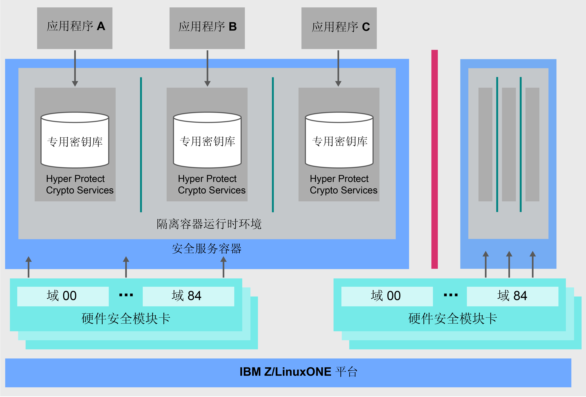

---

copyright:
  years: 2018, 2019
lastupdated: "2019-02-05"

Keywords: IBM Key, data security, Hyper Protect Crypto Services, HSM

subcollection: hs-crypto

---

{:new_window: target="_blank"}
{:shortdesc: .shortdesc}
{:screen: .screen}
{:codeblock: .codeblock}
{:pre: .pre}
{:important: .important}

# {{site.data.keyword.cloud_notm}} {{site.data.keyword.hscrypto}} 概述
{: #overview}

数据和信息安全对 IT 环境来说必不可少、至关重要。随着越来越多的数据移动到云中，让数据持续受到保护已经成为重要的挑战。{{site.data.keyword.cloud}} {{site.data.keyword.hscrypto}} 提供的加密所使用的技术达到了保护数据的行业最高安全级别。
{: shortdesc}

## 为什么选择 {{site.data.keyword.cloud_notm}} {{site.data.keyword.hscrypto}}？

{{site.data.keyword.hscrypto}} 基于 IBM LinuxONE 技术进行构建，可帮助确保只有您可以访问您的密钥。单租户密钥管理服务使用客户控制的专用 HSM 所提供的密钥保险库，可帮助您轻松创建加密密钥。或者，您可以自带加密密钥进行管理。受管云 HSM 支持行业标准，<!-- such as PKCS #11,-->因此您的应用程序可与加密操作（如数字签名和验证）集成。

<!-- via PKCS#11 application programming interfaces (APIs). You can access {{site.data.keyword.hscrypto}} with several popular programming languages such as Java, JavaScript, and Swift. -->

{{site.data.keyword.hscrypto}} 是构建 {{site.data.keyword.blockchainfull_notm}} Platform 所使用的密码术。此密码术机制可确保区块链网络在受到高度保护的隔离环境中运行，并可加快网络中散列、签名/验证操作和节点到节点通信的速度。{{site.data.keyword.blockchainfull_notm}} Platform 的成功证明了 {{site.data.keyword.hscrypto}} 的能力和价值

## {{site.data.keyword.hscrypto}} 如何工作？
{: #architecture}

下面的体系结构图显示了 {{site.data.keyword.hscrypto}} 的工作原理。

*图 1. {{site.data.keyword.hscrypto}} 体系结构*  

下面是 {{site.data.keyword.hscrypto}} 体系结构的一些亮点：

<!-- * Applications connect to {{site.data.keyword.hscrypto}} through PKCS#11 APIs. -->

- {{site.data.keyword.hscrypto}} 中提供专用密钥库是为了确保数据隔离和安全性。特权用户被锁定在外，以保护系统管理员或 root 用户凭证不被滥用。  
- Secure Service Container (SSC) 提供企业客户期待 IBM Z 技术能够实现的企业级安全性和牢固性。  
- 支持符合 FIPS 140-2 4 级的云 HSM，可实现对保密信息的最高级别物理保护。  

## 主要功能
{: #key-features}

以下是 {{site.data.keyword.hscrypto}} 的主要功能：

### {{site.data.keyword.cloud_notm}} 数据服务保护，将加密密钥用于客户控制的云 HSM
{: #key-feature-1}

{{site.data.keyword.hscrypto}} 支持“保管自己的密钥”(KYOK)，这样您就可以利用您可以保管、控制和管理的加密密钥实现对数据更高的控制和权限。客户控制的云硬件安全模块 (HSM) 的可用支持根据 {{site.data.keyword.cloud_notm}} 中的行业监管来保护数字密钥，并且只能由客户访问数字密钥。<!-- The HSM provides PKCS#11 APIs, which makes {{site.data.keyword.hscrypto}} accessible by several popular programming languages such as Java, JavaScript, and Swift.-->

### 提供了 FIPS 140-2 4 级认证技术
{: #key-feature-2}

{{site.data.keyword.hscrypto}} 提供对 FIPS 140-2 4 级认证技术的访问，这是加密硬件可实现的最高级别安全性。<!-- Industries, such as financial sector services, require this level of security to protect their data.-->在此安全级别，物理安全性机制围绕加密模块提供完整的保护边界，旨在检测所有未授权的物理访问尝试并对其做出响应。

### 任何特权用户都不能访问您的密钥和数据
{: #key-feature-3}

{{site.data.keyword.hscrypto}} 将 IBM Z 中独特的数据保护功能引入了 {{site.data.keyword.cloud_notm}}。{{site.data.keyword.hscrypto}} 在 SSC 中保护您的数据，提供企业客户期待 IBM Z 技术能够实现的企业级安全性和牢固性。硬件虚拟化用于在隔离环境中保护数据。在此方式下，按服务实例提供专用服务，因此不允许对您数据的任何外部访问，包括云管理员等特权用户在内。这样就降低了源于内部威胁的数据泄露风险。

### {{site.data.keyword.keymanagementservicefull_notm}} 集成可保护 {{site.data.keyword.cloud_notm}} 数据和存储服务安全
{: #key-feature-4}

{{site.data.keyword.keymanagementservicefull_notm}} API 集成到 {{site.data.keyword.hscrypto}} 中以生成密钥并保护密钥。{{site.data.keyword.hscrypto}} 保护这些密钥并将其存储在 IBM Z 上高度受保护的隔离环境中，可使用通过行业最高安全级别认证的技术来保护您的数据。

<!-- {{site.data.keyword.hscrypto}} also leverages the **IBM Advanced Crypto Service Provider (ACSP)** solution that enables remote access to the IBM’s cryptographic coprocessors. ACSP allows for utilization of strong hardware-based cryptography as a service in distributed environments where data security cannot be guaranteed. {{site.data.keyword.hscrypto}} utilizes ACSP as a *network hardware security module (NetHSM)* that provides access to HSM via PKCS#11 standard APIs.-->

<!-- With {{site.data.keyword.hscrypto}}, your **SSL keys are offloaded** to a {{site.data.keyword.hscrypto}} to ensure security and protection of those sensitive keys.  Besides, the certificate lifecycle management gets common approach to manage certificates and offers the visibility to certificate expiration.-->

## 角色和职责
{: #roles-responsibilities}

下表显示了 {{site.data.keyword.hscrypto}} 支持的角色。

<table>
  <tr>
    <th>角色</th>
    <th>职责</th>
  </tr>
  <tr>
    <td>加密单元管理员</td>
    <td>
      对管理命令（如用于安装其他加密单元管理员的命令）进行签名，并提供签名密钥。
</td>
  </tr>
  <tr>
    <td>密钥所有者</td>
    <td>提供用于初始化服务实例的主密钥部件。</td>
  </tr>
  <tr>
    <td>服务用户</td>
    <td>通过用户界面和 API 存储、检索并生成根密钥和标准密钥。</td>
  </tr>
  <caption style="caption-side:bottom;">表 1. 角色和职责</caption>
</table>
