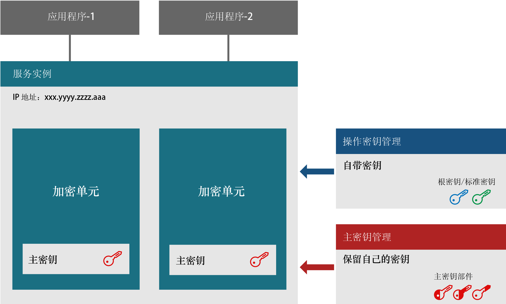
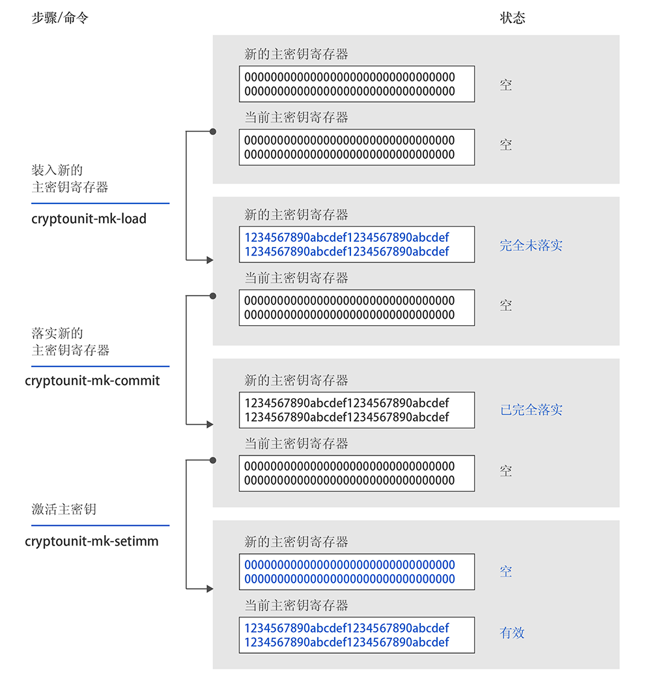

---

copyright:
  years: 2018, 2019
lastupdated: "2019-03-21"

Keywords: hsm, Trusted Key Entry plug-in, service instance, imprint mode

subcollection: hs-crypto

---

{:new_window: target="_blank"}
{:shortdesc: .shortdesc}
{:screen: .screen}
{:codeblock: .codeblock}
{:pre: .pre}
{:important: .important}

# 服务实例初始化简介
{: #introduce-service}

开始初始化 {{site.data.keyword.hscrypto}} 的服务实例之前，您可能希望先了解基本概念和流程逻辑。  
{:shortdesc}

{{site.data.keyword.hscrypto}} 实例（简称服务实例）是指定给某个 IBM Cloud 用户帐户的一组加密单元。服务实例最多可具有 6 个加密单元。如果要设置生产环境，建议为每个服务实例指定至少两个加密单元，以支持高可用性。加密单元应位于不同的物理硬件安全模块 (HSM) 上。服务实例中的所有加密单元应进行相同的配置。如果无法访问 IBM Cloud 的某个部分，那么服务实例中的加密单元能够以可互换的方式使用。加密单元包含用于加密密钥存储器内容的主密钥。使用“保管自己的密钥”技术，服务实例管理员是可访问主密钥的唯一人员。

下图说明了具有两个加密单元的服务实例。

*图 1. 服务实例组件*

## 硬件安全模块
{: #introduce-HSM}

硬件安全模块 (HSM) 是物理设备，可保护和管理数字密钥以进行高强度认证，并提供加密处理。{{site.data.keyword.cloud_notm}} {{site.data.keyword.hscrypto}} 的 HSM 已进行 FIPS 140-2 4 级认证，这是加密硬件的最高级别安全性。在此安全级别，物理安全性机制围绕加密模块提供完整的保护边界，旨在检测所有未授权的物理访问尝试并对其做出响应。

## 加密单元
{: #introduce-crypto-unit}

加密单元是代表 HSM 和专用于 HSM 的相应软件堆栈的单个单元。每个加密单元最多可管理 5000 个数字密钥。服务实例最多可具有 6 个加密单元。如果要设置生产环境，建议为每个服务实例指定至少两个加密单元，以支持高可用性。服务实例中的所有加密单元应进行相同的配置。如果无法访问 IBM Cloud 的某个部分，那么服务实例中的加密单元能够以可互换的方式使用。

## Trusted Key Entry 插件
{: #introduce-TKE}

使用 Trusted Key Entry 插件，可以在 {{site.data.keyword.cloud}} 用户帐户中使用由您选择并控制的值来装入服务实例的主密钥寄存器。Trusted Key Entry 插件提供一组功能，用于管理指定给 {{site.data.keyword.cloud_notm}} 用户帐户的加密单元。该插件允许装入主密钥值。

## 管理员
{: #introduce-administrators}

可将管理员添加到目标加密单元中，以向加密单元发出命令。管理员拥有一个专用签名密钥。生成签名密钥之后，您需要将具有签名密钥的管理员添加到目标加密单元中。

## 签名密钥
{: #introduce-signature-keys}

管理员必须使用签名对向加密单元发出的任何命令进行签名。签名密钥文件的专用部分用于创建签名。公共部分置于安装在目标加密单元中的证书中，以定义加密单元管理员。以印记模式发出的命令无需签名。

## 印记模式
{: #introduce-imprint-mode}

指定给 IBM Cloud 用户的加密单元开始时处于已清除状态，称为印记模式。加密单元在印记模式下并不安全。主密钥寄存器无法以印记模式装入。您只能设置加密单元管理员，并清除印记模式的加密单元。以印记模式向加密单元发出的命令无需签名。但是，退出印记模式的命令必须由某个已添加的加密单元管理员使用签名密钥进行签名。

## 主密钥
{: #introduce-master-key}

主密钥用于对密钥存储器的服务实例进行加密。使用主密钥，您即拥有对包括根密钥和标准密钥在内的整个密钥链进行加密的信任根。IBM 不会备份或改动主密钥，而且无法将其复制或复原到其他机器或数据中心。一个服务实例只能有一个主密钥。如果删除服务实例的主密钥，就可以有效地对所有已使用服务中管理的密钥加密过的数据进行密码粉碎。

有关 {{site.data.keyword.hscrypto}} 管理的密钥类型的更多信息，请参阅[密钥简介](/docs/services/hs-crypto/keys_intro.html#introduce-keys)。

## 主密钥部件
{: #introduce-key-parts}

新的主密钥寄存器使用多个主密钥部件装入。在 Trusted Key Entry 插件中，每个主密钥部件都存储在主密钥部件文件中。使用两个或三个主密钥部件可装入新的主密钥寄存器。出于安全性考虑，每个密钥部件可以由不同的人员拥有。密钥部件所有者应是唯一知道与密钥部件文件关联的密码的人员。

## 主密钥寄存器
{: #introduce-key-registers}

每个加密单元具有两个主密钥寄存器：新的主密钥寄存器与当前主密钥寄存器。当前主密钥寄存器中的值用于加密用户密钥存储器的内容。新的主密钥寄存器用于更改当前主密钥寄存器中的值。更改当前主密钥寄存器中的值时，密钥存储器的内容需要使用新的主密钥值重新加密。当前主密钥值和新的主密钥值都需要执行此操作。密钥存储器中的密钥值使用当前主密钥寄存器中的值进行解码，然后使用新的主密钥寄存器中的值重新加密。重新加密是在 HSM 内进行的，因此很安全。对密钥存储器的完整内容重新加密之后，新的主密钥寄存器中的值可移入当前主密钥寄存器。

下图说明了主密钥寄存器的状态如何变化以及如何装入主密钥。

*图 1. 装入主密钥*  
