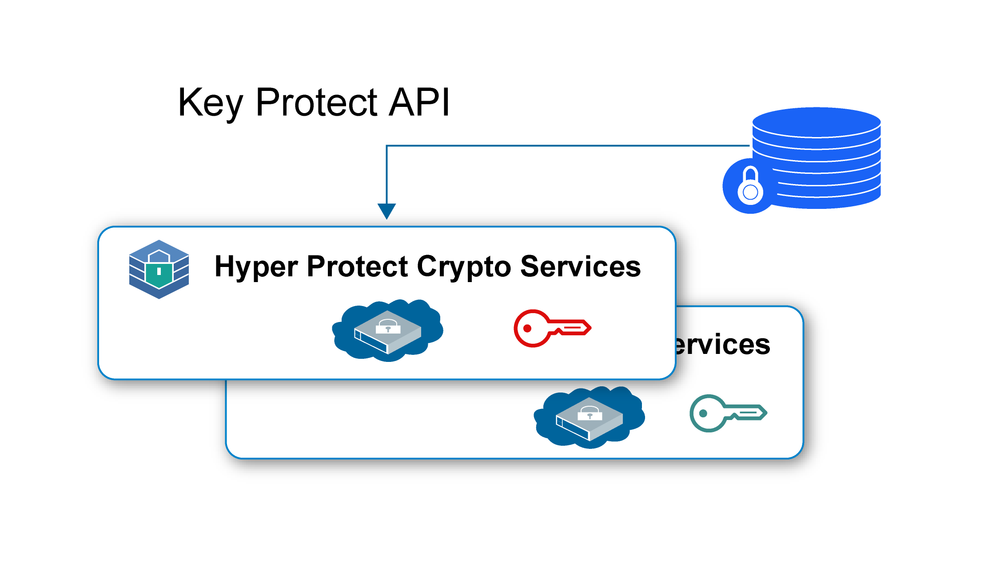
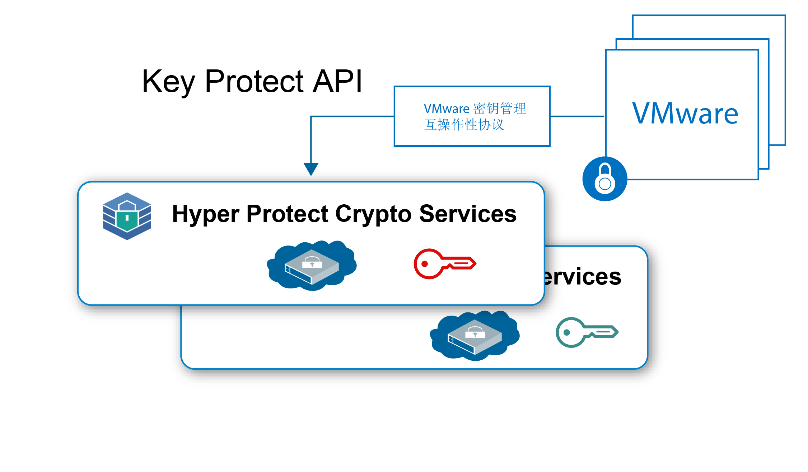

---

copyright:
  years: 2018, 2019
lastupdated: "2019-01-15"

Keywords: Hyper Protect Crypto Services, Keep Your Own Keys, VMware

subcollection: hs-crypto

---

{:new_window: target="_blank"}
{:shortdesc: .shortdesc}
{:screen: .screen}
{:codeblock: .codeblock}
{:pre: .pre}

# {{site.data.keyword.hscrypto}} 用例
{: #use-cases}

此页面包含 {{site.data.keyword.hscrypto}} 中当前包含的用例。这些用例在后续发行版中会持续改进。
{:shortdesc}

## 使用“保管自己的密钥”进行静态数据加密

您可以使用 {{site.data.keyword.hscrypto}}，通过自己的密钥以最高安全级别加密静态数据。{{site.data.keyword.hscrypto}} 提供密钥管理功能，可使用 {{site.data.keyword.keymanagementservicefull_notm}} API 生成并管理密钥。

下面是使用 {{site.data.keyword.hscrypto}} 来保护静态数据的一些亮点：

 * {{site.data.keyword.hscrypto}} 支持对云数据和存储服务进行静态数据加密。
 * {{site.data.keyword.hscrypto}} 支持“保管自己的密钥”(KYOK)，这样您就可以利用您可以引入、控制和管理的加密密钥实现对数据更高的控制和权限。
 * 集成了 {{site.data.keyword.keymanagementservicefull_notm}} API 以生成和保护密钥。
 * 您的密钥以最高安全性（FIPS 140-2 4 级认证技术）受到保护。
 * 密钥由客户管理的专用 HSM 进行保护，也就是说，只有您能访问您的数据。

*图 1. 使用 KYOK 加密静态数据*

## 使用“保管自己的密钥”保护 VMware 映像

{{site.data.keyword.hscrypto}} 与静态数据保护类似，也可以保护静态 VMware 映像以通过 VMware Key Management Interoperability 协议进行加密和解密。

作为单租户服务，{{site.data.keyword.hscrypto}} 按客户为 VMware 映像提供硬件安全模块的专用控制。{{site.data.keyword.hscrypto}} 使用专用硬件私钥控制将 {{site.data.keyword.cloud_notm}} 中的密钥管理服务系列扩展到单租户实例。

*图 2. 使用 KYOK 保护 VMware 映像*
