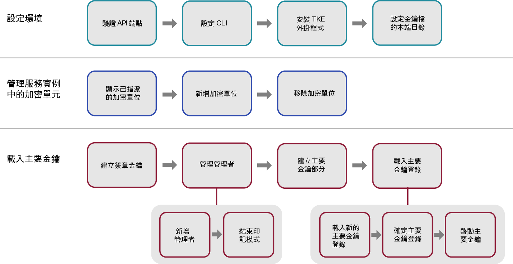

---

copyright:
  years: 2018, 2019
lastupdated: "2019-03-21"

Keywords: key storage, HSM, hardware security module

subcollection: hs-crypto

---

{:new_window: target="_blank"}
{:shortdesc: .shortdesc}
{:screen: .screen}
{:codeblock: .codeblock}
{:pre: .pre}
{:important: .important}
{:tip: .tip}

# 起始設定服務實例
{: #initialize-hsm}

在使用 {{site.data.keyword.hscrypto}} 實例（簡稱為服務實例）之前，您需要先使用「授信金鑰登錄」外掛程式來載入主要金鑰登錄。
{:shortdesc}

若要起始設定服務實例，您需要先使用「授信金鑰登錄」外掛程式，將主要金鑰載入至您的金鑰儲存空間/服務實例。「授信金鑰登錄」外掛程式可讓您載入主要金鑰值。

如需服務實例起始設定及其他概念的簡介，請參閱[服務實例起始設定簡介](/docs/services/hs-crypto/service_instance_concepts.html#introduce-service)。

下列圖表提供您起始設定服務實例所需採取的步驟概觀。請按一下圖表上的每一個步驟以取得詳細指示。


<map name="home_map1" id="home_map1">
<area href="/docs/services/hs-crypto?topic=hs-crypto-initialize-hsm#initialize-crypto-prerequisites" alt="驗證 API 端點" title="驗證 API 端點" shape="rect" coords="151, 20, 241, 78" />
<area href="/docs/services/hs-crypto?topic=hs-crypto-initialize-hsm#initialize-crypto-prerequisites" alt="設定 CLI" title="設定 CLI" shape="rect" coords="276, 20, 365, 78" />
<area href="/docs/services/hs-crypto?topic=hs-crypto-initialize-hsm#initialize-crypto-prerequisites4" alt="安裝 TKE 外掛程式" title="安裝 TKE 外掛程式" shape="rect" coords="401, 20, 493, 78" />
<area href="/docs/services/hs-crypto?topic=hs-crypto-initialize-hsm#initialize-crypto-prerequisites4" alt="設定金鑰檔的本端目錄" title="設定金鑰檔的本端目錄" shape="rect" coords="528, 20, 619, 78" />

<area href="/docs/services/hs-crypto?topic=hs-crypto-initialize-hsm#Identify_crypto_units" alt="顯示已指派的加密單位" title="顯示已指派的加密單位" shape="rect" coords="148, 111, 241, 171" />
<area href="/docs/services/hs-crypto?topic=hs-crypto-initialize-hsm#Identify_crypto_units1" alt="新增加密單位" title="新增加密單位" shape="rect" coords="276, 111, 366, 171" />
<area href="/docs/services/hs-crypto?topic=hs-crypto-initialize-hsm#Identify_crypto_units2" alt="移除加密單位" title="移除加密單位" shape="rect" coords="402, 111, 493, 171" />

<area href="/docs/services/hs-crypto?topic=hs-crypto-initialize-hsm#step1-create-signature-keys" alt="建立一個以上簽章金鑰" title="建立簽章金鑰" shape="rect" coords="149, 206, 242, 264" />
<area href="/docs/services/hs-crypto?topic=hs-crypto-initialize-hsm#step2-load-admin" alt="管理加密單位管理者" title="管理加密單位管理者" shape="rect" coords="281, 206, 366, 264" />
<area href="/docs/services/hs-crypto?topic=hs-crypto-initialize-hsm#step2-load-admin" alt="在目標加密單位中新增一個以上管理者" title="新增加密單位管理者" shape="rect" coords="242, 296, 312, 358" />
<area href="/docs/services/hs-crypto?topic=hs-crypto-initialize-hsm#step3-exit-imprint-mode" alt="結束目標加密單位中的印記模式" title="結束印記模式" shape="rect" coords="328, 301, 396, 359" />
<area href="/docs/services/hs-crypto?topic=hs-crypto-initialize-hsm#step4-create-master-key" alt="建立要使用的主要金鑰部分集" title="建立主要金鑰部分" shape="rect" coords="401, 208, 493, 266" />
<area href="/docs/services/hs-crypto?topic=hs-crypto-initialize-hsm#step5-load-master-key" alt="載入主要金鑰登錄" title="載入主要金鑰登錄" shape="rect" coords="525, 207, 620, 264" />
<area href="/docs/services/hs-crypto?topic=hs-crypto-initialize-hsm#step5-load-master-key" alt="載入新的主要金鑰登錄" title="載入新的主要金鑰登錄" shape="rect" coords="455, 297, 525, 358" />
<area href="/docs/services/hs-crypto?topic=hs-crypto-initialize-hsm#step6-commit-master-key" alt="確定新的主要金鑰登錄" title="確定新的主要金鑰登錄" shape="rect" coords="539, 297, 610, 358" />
<area href="/docs/services/hs-crypto?topic=hs-crypto-initialize-hsm#step7-activate-master-key" alt="啟動主要金鑰" title="啟動主要金鑰登錄" shape="rect" coords="619, 297, 689, 358" />
</map>

*圖 1. 服務實例起始設定的作業流程*

您可能需要 20-30 分鐘的時間才能完成此作業。

## 在開始之前
{: #initialize-crypto-prerequisites}

1. 執行下列指令以確定您已登入至正確的 API 端點：

  ```
  ibmcloud api https://api.ng.bluemix.net
  ```
  {: pre}

2. 安裝 {{site.data.keyword.keymanagementservicefull}} 外掛程式。如需詳細步驟，請參閱[設定 CLI](/docs/services/hs-crypto/set-up-cli.html)。當您登入 [{{site.data.keyword.cloud_notm}} CLI](/docs/cli/index.html#overview) 時，會在有更新可供使用時收到通知。請務必使 {{site.data.keyword.keymanagementservicefull}} 外掛程式保持最新狀態，以便您能夠使用可用於「授信金鑰登錄 CLI」外掛程式的指令及旗標。
{: #initialize-crypto-prerequisites2}

3. 使用下列指令安裝最新的「授信金鑰登錄」外掛程式。
{: #initialize-crypto-prerequisites3}

  ```
  ibmcloud plugin install tke
  ```
  {: pre}

  **重要事項：**如果您使用 {{site.data.keyword.hscrypto}} 測試版實例，則請執行 'ibmcloud plugin install tke -v 0.0.4' 以取得最新測試版的「授信金鑰登錄」外掛程式。請不要安裝之後的「授信金鑰登錄」外掛程式版本。

4. 設定您工作站上的 CLOUDTKEFILES 環境變數。指定您想要建立並儲存主要金鑰部分檔案及簽章金鑰部分檔案所在的目錄。如果目錄不存在，則請建立它。
{: #initialize-crypto-prerequisites4}

  * 在 Linux 或 MacOS 上，將下列行新增至 `.bash_profile` 檔案：
     ```
     export CLOUDTKEFILES=<path>
     ```
     {: pre}
     例如，您可以將 *path* 指定為 `/Users/tke-files`。
  * 在 Windows 上，在**控制台**的搜尋方框中鍵入 `environment variable` 來搜尋「環境變數」視窗。建立 CLOUDTKEFILES 環境變數並設定金鑰檔路徑的值。例如，`C:\users\tke-files`。

## 新增或移除指派給使用者帳戶的加密單位
{: #Identify_crypto_units}

指派給 {{site.data.keyword.cloud_notm}} 使用者帳戶的加密單位位於稱為*服務實例* 的群組中。服務實例最多可以具有 6 個加密單位。在一個服務實例中的所有加密單元應該有相同的配置。如果無法存取 {{site.data.keyword.cloud_notm}} 的某個部分，服務實例中的加密單位可交換使用以實現負載平衡或取得可用性。

指派給 {{site.data.keyword.cloud_notm}} 使用者的加密單位以稱為*印記模式* 的全新狀態啟動。

單一服務實例的所有加密單位中主要金鑰登錄的設定都必須相同。同一組管理者必須新增至所有加密單位中，而所有加密單位必須同時結束印記模式。

* 若要顯示指派給使用者帳戶的服務實例及加密單位，請使用下列指令：{: #Identify_crypto_units1}
  ```
  ibmcloud tke cryptounits
  ```
  {: pre}

  以下是顯示的範例輸出。輸出表格中的 SELECTED 直欄可識別由「授信金鑰登錄」外掛程式所發出的後續管理指令設為目標的加密單位。

  ```
  SERVICE INSTANCE: 482cf2ce-a06c-4265-9819-0b4acf54f2ba
  CRYPTO UNIT NUM   SELECTED   LOCATION
  1                 true       [us-south].[AZ3-CS3].[02].[03]
  2                 true       [us-south].[AZ2-CS2].[02].[03]

  SERVICE INSTANCE: 96fe3f8d-9792-45bc-a9fb-2594222deaf2
  CRYPTO UNIT NUM   SELECTED   LOCATION
  3                 true       [us-south].[AZ1-CS4].[00].[03]
  4                 true       [us-south].[AZ2-CS5].[03].[03]
  ```
  {: screen}

* 若要將其他加密單位新增至選取的加密單位清單中，請使用下列指令：
  {: #Identify_crypto_units2}
  ```
  ibmcloud tke cryptounit-add
  ```
  {: pre}

  即會顯示指派給現行使用者帳戶的加密單位清單。收到提示時，請輸入要新增至所選取加密單位清單的加密單位編號清單。

* 若要從選取的加密單位清單中移除加密單位，請使用下列指令：
  {: #Identify_crypto_units3}
  ```
  ibmcloud tke cryptounit-rm
  ```
  {: pre}

  即會顯示指派給現行使用者帳戶的加密單位清單。收到提示時，請輸入要從所選取加密單位清單中移除的加密單位編號清單。

  **提示：**，對於所選取服務實例中的加密單位，一般而言會全選或是都不選。這會使後續管理指令一致地更新服務實例的所有加密單位。不過，如果服務實例的加密單位是以不同方式配置，您必須個別選取及使用這些加密單位，以將一致的配置還原到服務實例中的所有加密單位。

  若要比較所選取加密單位的配置設定，請使用下列指令：
  ```
  ibmcloud tke cryptounit-compare
  ```
  {: pre}

## 載入主要金鑰
{: #load-master-keys}

<!-- A service instance is implemented as one or more crypto units on IBM cryptographic coprocessors. -->

在可以載入新的主要金鑰登錄之前，請在目標加密單位中新增一個以上的管理者並結束印記模式。

若要載入新的主要金鑰登錄，請使用 {{site.data.keyword.cloud_notm}} CLI 外掛程式完成下列作業：

### 步驟 1：建立一個以上的簽章金鑰
{: #step1-create-signature-keys}

若要載入新的主要金鑰登錄，則加密單位管理者必須使用唯一的簽章金鑰來簽署指令。首要步驟為建立一個以上簽章金鑰檔，其包含您的工作站上的簽章金鑰。<!-- The private part of the signature key file is used to create signatures. The public part is placed in a certificate that is installed in a target crypto unit to define a crypto unit administrator. -->

**重要事項**：為了安全考量，簽章金鑰擁有者可以是與主要金鑰部分擁有者不同的人員。簽章金鑰擁有者應該是知道簽章金鑰檔相關聯密碼的唯一人員。

* 若要在工作站上顯示現有的簽章金鑰，請使用下列指令：
  ```
  ibmcloud tke sigkeys
  ```
  {: pre}

* 若要在工作站上建立並儲存新的簽章金鑰，請使用下列指令：
  ```
  ibmcloud tke sigkey-add
  ```
  {: pre}

  收到提示時，請輸入管理者名稱及密碼以保護簽章金鑰檔。您必須記住密碼。如果遺失密碼，就無法使用簽章金鑰。

* 若要選取管理者來簽署未來的指令，請使用下列指令：
  ```
  ibmcloud tke sigkey-sel
  ```
  {: pre}

  即會顯示工作站上找到的簽章金鑰檔清單。收到提示時，請輸入要選取以用來簽署後續管理指令之簽章金鑰檔的金鑰編號。

  <!-- **Tip**: Before you run the `cryptounit-exit-impr` command to exit imprint mode, the command needs to be signed by a crypto unit administrator using the signature key. After the crypto unit exits imprint mode, all commands to the crypto unit must be signed. -->

### 步驟 2：在目標加密單位中新增一個以上的管理者
{: #step2-load-admin}

<!-- After a crypto unit exits imprint mode, all administrative commands sent to the crypto unit must be signed by an administrator that is added to the crypto unit. -->

* 若要顯示加密單位的現有管理者，請使用下列指令：
  ```
  ibmcloud tke cryptounit-admins
  ```
  {: pre}

* 若要新增新的管理者，請使用下列指令：
  ```
  ibmcloud tke cryptounit-admin-add
  ```
  {: pre}

  即會顯示工作站上找到的簽章金鑰檔清單。

  收到提示時，請選取與要新增之加密單位管理者相關聯的的簽章金鑰檔。然後，輸入所選取簽章金鑰檔的密碼。

  必要的話，您可以重複此指令以新增其他的加密單位管理者。任何管理者都能在加密單位中個別執行指令。

  在印記模式中，用來新增加密單位管理者的指令不需經過簽署。離開印記模式之後，若要新增加密單位管理者，則要使用的指令必須由已新增至加密單位中的加密單位管理者進行簽署。

### 步驟 3：在目標加密單位中結束印記模式
{: #step3-exit-imprint-mode}

處於印記模式的加密單位不被視為安全。您無法在印記模式中執行大部分的管理指令，例如載入新的主要金鑰登錄。

當您新增一個以上的加密單位管理者之後，請使用下列指令來結束印記模式：

  ```
  ibmcloud tke cryptounit-exit-impr
  ```
  {: pre}

  **重要事項：**結束印記模式的指令必須經由已新增的其中一個使用簽章金鑰的加密單位管理者簽署。當加密單位結束印記模式之後，加密單位的所有指令都必須經過簽署。

### 步驟 4：建立一組要使用的主要金鑰部分
{: #step4-create-master-key}

每個主要金鑰部分都儲存在工作站上受密碼保護的檔案中。

**重要事項**：您必須建立至少兩個主要金鑰部分。為了安全考量，可以使用三個主要金鑰部分，而每個金鑰部分可由不同的人員擁有。金鑰部分擁有者應該是知道金鑰部分檔案相關聯密碼的唯一人員。

* 若要在工作站上顯示現有的主要金鑰部分，請使用下列指令：
  ```
  ibmcloud tke mks
  ```
  {: pre}

* 若要在工作站上建立並儲存隨機主要金鑰部分，請使用下列指令：
  ```
  ibmcloud tke mk-add --random
  ```
  {: pre}

  收到提示時，請輸入金鑰部分的說明及用來保護金鑰部分檔案的密碼。您必須記住密碼。如果遺失密碼，您就無法使用金鑰部分。

* 若要輸入已知的金鑰部分值，並將其儲存在工作站的檔案中，請使用下列指令：
  ```
  ibmcloud tke mk-add --value
  ```
  {: pre}

  收到提示時，請針對 32 位元組金鑰部分以十六進位字串輸入金鑰部分值。然後，輸入金鑰部分的說明及用來保護金鑰部分檔案的密碼。

### 步驟 5：載入新的主要金鑰登錄
{: #step5-load-master-key}

**重要事項**：若要載入主要金鑰登錄，共用工作站必須具有所有主要金鑰部分檔案及簽章金鑰檔。如果是在個別的工作站上建立這些檔案，請確定檔名不同以避免衝突。在共用工作站上載入主要金鑰登錄時，主要金鑰部分檔案擁有者及簽章金鑰檔擁有者需要輸入檔案密碼。

如需如何載入主要金鑰的相關資訊，請參閱[主要金鑰登錄](/docs/services/hs-crypto/service_instance_concepts.html#introduce-key-registers)中的詳細說明。

若要載入新的主要金鑰登錄，請使用下列指令：
```
ibmcloud tke cryptounit-mk-load
```
{: pre}

即會顯示工作站上找到的主要金鑰部分清單。

收到提示時，請輸入要載入到新主要金鑰登錄的金鑰部分。然後，輸入每個所選取金鑰部分檔案的密碼。

### 步驟 6：確定新的主要金鑰登錄
{: #step6-commit-master-key}

載入新的主要金鑰登錄會將新的主要金鑰登錄置於完全未確定的狀態。在您可以使用新的主要金鑰登錄來起始設定或重新加密金鑰儲存空間之前，請將新的主要金鑰登錄置於已確定的狀態。如需如何載入主要金鑰的相關資訊，請參閱[主要金鑰登錄](/docs/services/hs-crypto/service_instance_concepts.html#introduce-key-registers)中的詳細說明。

若要確定新的主要金鑰登錄，請使用下列指令：
```
ibmcloud tke cryptounit-mk-commit
```
{: pre}

### 步驟 7：啟動主要金鑰
{: #step7-activate-master-key}

使用下列指令，將主要金鑰移至現行的主要金鑰登錄來啟動主要金鑰：

```
ibmcloud tke cryptounit-mk-setimm
```
{: pre}

## 下一步為何？
{: #initialize-crypto-next}

請移至您的受管理 {{site.data.keyword.hscrypto}} 儀表板的**管理**標籤，以管理根金鑰及標準金鑰。

如需「授信金鑰登錄」外掛程式指令的詳細資料，請在 CLI 中執行下列指令：

```
ibmcloud tke help
```
{: pre}

<!--
## Reference: Other Trusted Key Entry plug-in commands
{: #initialize-crypto-reference}

The following list describes the remaining commands implemented by the plug-in and discusses when they would be used.

* **ibmcloud tke mk-rm**

  This command removes a file that contains a master key part from the workstation.

  After you enter the command, a list of master key parts that are found on the workstation is displayed. When prompted, enter the key number of the key part that is to be removed.

  After a key part is removed from the local workstation, it can no longer be used.

* **ibmcloud tke sigkey-rm**

  This command removes a file that contains a signature key from the workstation.

  After you enter the command, a list of signature keys found on the workstation is displayed. When prompted, enter the key number of the signature key file that is to be removed.

  Be cautious of removing a signature key from the workstation. If any crypto units that are assigned to the user account exit imprint mode, and if the signature key being removed from the workstation is the only added administrator for the crypto unit, executing new administrative functions in the crypto unit is not possible after you remove the signature key. If no backup of the signature key file exists, the only way for recovery is to contact {{site.data.keyword.cloud_notm}} support to clear the crypto unit and place it in imprint mode.

* **ibmcloud tke cryptounit-admin-rm**

  This command removes an administrator from the selected crypto units.

  When this command is issued for a crypto unit in imprint mode, this command does not need to be signed. After the crypto unit exits imprint mode, this command must be signed by an existing crypto unit administrator.

  For a crypto unit not in imprint mode, the command fails if the administrator being removed is the last administrator defined for the crypto unit.


* **ibmcloud tke cryptounit-zeroize**

  This command clears the selected crypto units and places them back in imprint mode.  All crypto unit administrators are removed, and the new and current master key registers are cleared.

  When this command is issued for a crypto unit in imprint mode, this command does not need to be signed. After the crypto unit exits imprint mode, this command must be signed by an existing crypto unit administrator.

  When this command is issued to a group of crypto units, the current signature key must be recognized as a crypto unit administrator by all crypto units not in imprint mode in order for the command to be accepted.


* **ibmcloud tke cryptounit-mk**

  This command displays the status and verification pattern for the new and current master key registers for the selected crypto units.

* **ibmcloud tke cryptounit-mk-clrcur**

  This command clears the current master key register in the selected crypto units.

  This command cannot be executed in imprint mode.

  Clearing the current master key register makes any key storage protected by the current master key unusable.

* **ibmcloud tke cryptounit-mk-clrnew**

  This command clears the new master key register in the selected crypto units.

  This command cannot be executed in imprint mode.

* **ibmcloud tke cryptounit-mk-setimm**

  This command moves the value of the new master key register to the current master key register, and clears the new master key register in the selected crypto units.

  This command cannot be executed in imprint mode.

  This command does not initialize or re-encipher key storage and should be used only when key storage in the target LPARs is prepared to accept the new master key value. If in doubt, do not use this command, because it can cause keys in existing key storage to become unusable.

The following is a full list of plug-in commands. You can also find the commands by using the plug-in help function:
```
NAME:
   ibmcloud tke - A CLI plug-in to manage crypto module cryptounits in the IBM Cloud
USAGE:
   ibmcloud tke command [arguments...] [command options]

COMMANDS:
   mks                Lists master key parts stored on this workstation.
   mk-add             Creates and saves a new master key part.
   mk-rm              Removes a master key part from this workstation.
   sigkeys            Lists the signature keys stored on this workstation.
   sigkey-add         Generates and saves a new signature key.
   sigkey-rm          Removes a signature key from this workstation.
   sigkey-sel         Selects the signature key to use to sign commands.
   cryptounits            Displays the cryptounits for the current resource group.
   cryptounit-add         Adds cryptounits to the set of cryptounits to work with.
   cryptounit-rm          Removes cryptounits from the set of cryptounits to work with.
   cryptounit-admins      Lists administrators added in the selected cryptounits.
   cryptounit-admin-add   Add a cryptounit administrator to the selected cryptounits.
   cryptounit-admin-rm    Removes a cryptounit administrator from the selected cryptounits.
   cryptounit-compare     Compares configuration settings of the selected cryptounits.
   cryptounit-exit-impr   Exits imprint mode in the selected cryptounits.
   cryptounit-zeroize     Zeroizes the selected cryptounits.
   cryptounit-mk          Displays master key registers for the selected cryptounits.
   cryptounit-mk-clrcur   Clears the current master key register.
   cryptounit-mk-clrnew   Clears the new master key register.
   cryptounit-mk-commit   Commits the new master key register.
   cryptounit-mk-setimm   Does set immediate on the master key registers.
   cryptounit-mk-load     Loads the new master key register.
   help, h            Show help
   ```
-->
