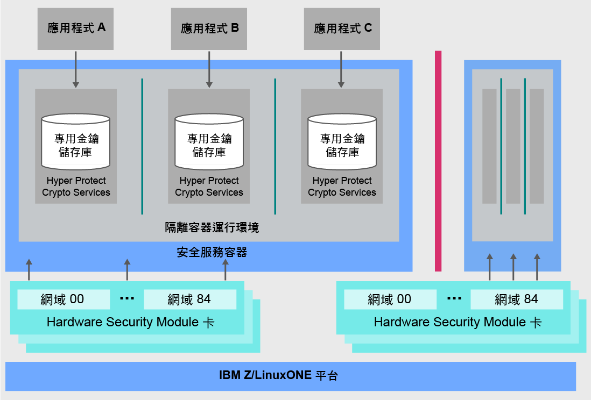

---

copyright:
  years: 2018, 2019
lastupdated: "2019-02-05"

Keywords: IBM Key, data security, Hyper Protect Crypto Services, HSM

subcollection: hs-crypto

---

{:new_window: target="_blank"}
{:shortdesc: .shortdesc}
{:screen: .screen}
{:codeblock: .codeblock}
{:pre: .pre}
{:important: .important}

# {{site.data.keyword.cloud_notm}} {{site.data.keyword.hscrypto}} 概觀
{: #overview}

資料及資訊安全對於 IT 環境而言極其重要。隨著越來越多的資料移至雲端，持續保護資料變成一項重要挑戰。{{site.data.keyword.cloud}} {{site.data.keyword.hscrypto}} 提供技術已達業界最高安全層次的加密法來保護您的資料。
{: shortdesc}

## 為何選擇 {{site.data.keyword.cloud_notm}} {{site.data.keyword.hscrypto}}？

以 IBM LinuxONE 技術為建置基礎，{{site.data.keyword.hscrypto}} 可協助確保只有您可以存取您的金鑰。專用客戶控制的 HSM 提供具有金鑰加密配置檔的單一承租戶金鑰管理服務，可協助您輕鬆建立加密金鑰。或者，您可以自帶加密金鑰以便管理。受管理雲端 HSM 支援業界標準，因此您的應用程式可以與加密作業（如數位的簽署及驗證）進行整合。

<!-- via PKCS#11 application programming interfaces (APIs). You can access {{site.data.keyword.hscrypto}} with several popular programming languages such as Java, JavaScript, and Swift. -->

{{site.data.keyword.hscrypto}} 是用來建置 {{site.data.keyword.blockchainfull_notm}} Platform 的加密。這種加密機制可確保區塊鏈網路是在高度受保護且隔離的環境中執行，並加速網路中的雜湊、簽署/驗證作業，以及節點對節點的通訊。{{site.data.keyword.blockchainfull_notm}} Platform 的成功，證明了 {{site.data.keyword.hscrypto}} 的功能與價值。

## {{site.data.keyword.hscrypto}} 如何運作？
{: #architecture}

下列架構圖顯示了 {{site.data.keyword.hscrypto}} 的運作方式。

*圖 1. {{site.data.keyword.hscrypto}} 架構*  

以下是 {{site.data.keyword.hscrypto}} 架構的一些重點：

<!-- * Applications connect to {{site.data.keyword.hscrypto}} through PKCS#11 APIs. -->

- 提供了 {{site.data.keyword.hscrypto}} 的專用金鑰儲存庫來確保資料隔離及安全。已鎖定特許使用者，以防止濫用系統管理者或 root 使用者認證。  
- Secure Service Container (SSC) 提供企業客戶預期從 IBM Z 技術獲得的企業層級安全及可靠性。  
- 我們啟用了符合 FIPS 140-2 Level 4 標準的雲端 HSM，以達到密碼的最高實體保護。  

## 主要特性
{: #key-features}

以下是 {{site.data.keyword.hscrypto}} 的主要特性：

### 搭配使用加密金鑰與客戶控制的雲端 HSM 進行 {{site.data.keyword.cloud_notm}} 資料服務保護
{: #key-feature-1}

{{site.data.keyword.hscrypto}} 支援「自管金鑰 (KYOK)」，讓您能夠利用可保留、控制及管理的加密金鑰，進一步加強對資料的控制和權限。客戶控制之雲端硬體安全模組 (HSM) 的可用支援能夠讓數位金鑰在 {{site.data.keyword.cloud_notm}} 中依據行業法規進行保護，並且只能由客戶進行存取。<!-- The HSM provides PKCS#11 APIs, which makes {{site.data.keyword.hscrypto}} accessible by several popular programming languages such as Java, JavaScript, and Swift.-->

### 提供的 FIPS 140-2 Level 4 認證技術
{: #key-feature-2}

{{site.data.keyword.hscrypto}} 可讓您存取 FIPS 140-2 Level 4 認證技術，這是加密硬體可達到的最高安全層次。<!-- Industries, such as financial sector services, require this level of security to protect their data.-->在這個安全層次上，實體安全機制會在加密模組周圍提供完整的保護封套，其目的在於偵測及回應實體存取的所有未獲授權嘗試。

### 沒有任何特許使用者可存取金鑰及資料
{: #key-feature-3}

{{site.data.keyword.hscrypto}} 將來自 IBM Z 的獨特資料保護功能帶入 {{site.data.keyword.cloud_notm}}。{{site.data.keyword.hscrypto}} 以 SSC 保護您的資料，SSC 可提供企業客戶預期從 IBM Z 技術獲得的企業層級安全及可靠性。硬體虛擬化則用來保護您在隔離環境中的資料。如此一來，便會提供每個服務實例的專用服務，所以不容許對資料進行外部存取，包括特許使用者（例如雲端管理者）。因此，降低了針對內部威脅的資料洩露風險。

### 可保護 {{site.data.keyword.cloud_notm}} 資料及儲存空間服務安全的 {{site.data.keyword.keymanagementservicefull_notm}} 整合
{: #key-feature-4}

{{site.data.keyword.keymanagementservicefull_notm}} API 會整合到 {{site.data.keyword.hscrypto}}，用來產生及保護金鑰。{{site.data.keyword.hscrypto}} 會保護這些金鑰並將其儲存在 IBM Z 高度保護且隔離的環境中，而該環境會以通過業界最高安全層次認證的技術保護您的資料。

<!-- {{site.data.keyword.hscrypto}} also leverages the **IBM Advanced Crypto Service Provider (ACSP)** solution that enables remote access to the IBM’s cryptographic coprocessors. ACSP allows for utilization of strong hardware-based cryptography as a service in distributed environments where data security cannot be guaranteed. {{site.data.keyword.hscrypto}} utilizes ACSP as a *network hardware security module (NetHSM)* that provides access to HSM via PKCS#11 standard APIs.-->

<!-- With {{site.data.keyword.hscrypto}}, your **SSL keys are offloaded** to a {{site.data.keyword.hscrypto}} to ensure security and protection of those sensitive keys.  Besides, the certificate lifecycle management gets common approach to manage certificates and offers the visibility to certificate expiration.-->

## 角色及責任
{: #roles-responsibilities}

下表顯示 {{site.data.keyword.hscrypto}} 支援的角色。

<table>
  <tr>
    <th>角色</th>
    <th>責任</th>
  </tr>
  <tr>
    <td>加密單位管理者</td>
    <td>
      簽署管理指令（例如，用於安裝另一個加密單位管理者），並提供簽章金鑰。
    </td>
  </tr>
  <tr>
    <td>金鑰擁有者</td>
    <td>提供用於起始設定服務實例的主要金鑰部分。</td>
  </tr>
  <tr>
    <td>服務使用者</td>
    <td>透過使用者介面和 API 儲存、擷取及產生根金鑰與標準金鑰。</td>
  </tr>
  <caption style="caption-side:bottom;">表 1. 角色與責任</caption>
</table>
