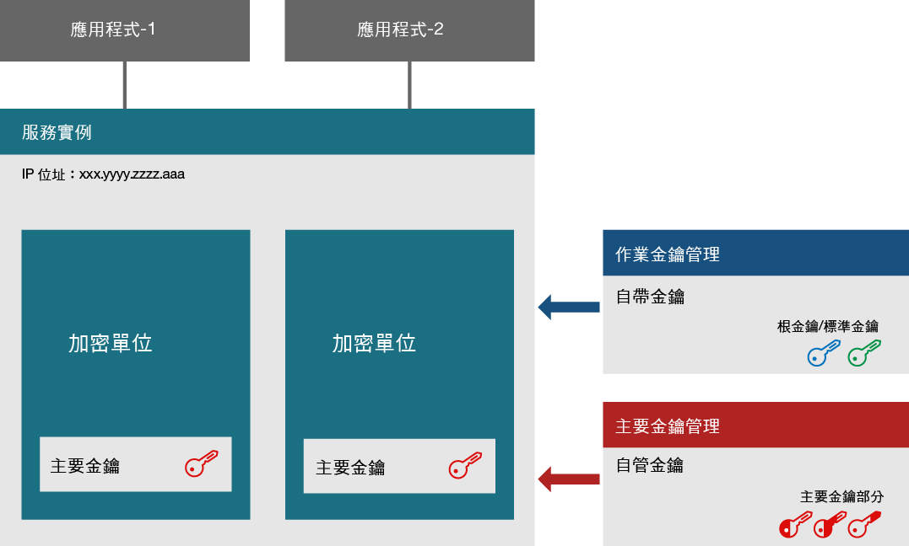
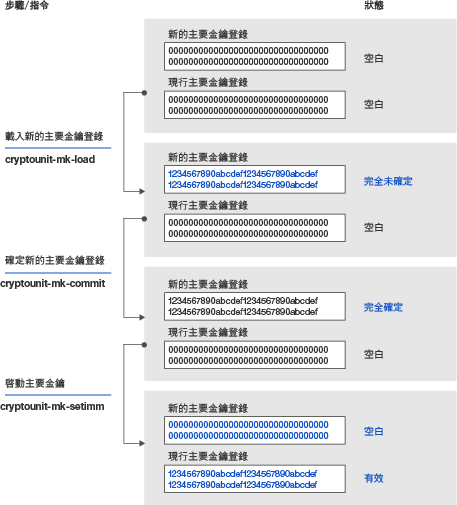

---

copyright:
  years: 2018, 2019
lastupdated: "2019-03-21"

Keywords: hsm, Trusted Key Entry plug-in, service instance, imprint mode

subcollection: hs-crypto

---

{:new_window: target="_blank"}
{:shortdesc: .shortdesc}
{:screen: .screen}
{:codeblock: .codeblock}
{:pre: .pre}
{:important: .important}

# 服務實例起始設定簡介
{: #introduce-service}

您必須先瞭解基本觀念和處理程序邏輯後，才能開始起始設定 {{site.data.keyword.hscrypto}} 的服務實例。  
{:shortdesc}

一個 {{site.data.keyword.hscrypto}} 實例（簡稱為服務實例）是一組指派給 IBM Cloud 使用者帳戶的加密單位。服務實例最多可以具有 6 個加密單位。如果您要設定正式作業環境，建議您每個服務實例至少要指派兩個加密單位，以實現高可用性。這些加密單位應該位於不同的實體 Hardware Security Module (HSM) 上。在一個服務實例中的所有加密單元應該有相同的配置。如果無法存取 IBM Cloud 的某個部分，則可交換使用服務實例中的加密單位。加密單位包含用於加密金鑰儲存空間內容的主要金鑰。採用「自行保管金鑰」技術，僅服務實例管理者可以存取主要金鑰。

下列圖表說明具有兩個加密單位的服務實例。

*圖 1. 服務實例元件*

## Hardware Security Module
{: #introduce-HSM}

Hardware Security Module (HSM) 是一種實體裝置，用於保護及管理強型態鑑別的數位金鑰並提供加密處理。{{site.data.keyword.cloud_notm}} {{site.data.keyword.hscrypto}} 的 HSM 具有 FIPS 140-2 層次 4 認證，此為加密硬體的最高安全等級。在這個安全層次上，實體安全機制會在加密模組周圍提供完整的保護封套，其目的在於偵測及回應實體存取的所有未獲授權嘗試。

## 加密單位
{: #introduce-crypto-unit}

加密單位是代表某個 HSM 及專用於 HSM 的對應軟體堆疊。每一個加密單位可以管理最多為 5000 個數位金鑰。服務實例最多可以具有 6 個加密單位。如果您要設定正式作業環境，建議您每個服務實例至少要指派兩個加密單位，以實現高可用性。在一個服務實例中的所有加密單元應該有相同的配置。如果無法存取 IBM Cloud 的某個部分，則可交換使用服務實例中的加密單位。

## 授信金鑰登錄外掛程式
{: #introduce-TKE}

利用「授信金鑰登錄」外掛程式，您可以使用所選擇及控制的值在 {{site.data.keyword.cloud}} 使用者帳戶中載入服務實例的主要金鑰登錄。「授信金鑰登錄」外掛程式提供了一組功能，用來管理指派給 {{site.data.keyword.cloud_notm}} 使用者帳戶的加密單位。此外掛程式可讓您載入主要金鑰值。

## 管理者
{: #introduce-administrators}

可以將管理者新增至目標加密單位，以便發出指令至加密單位。管理者擁有一個專用簽章金鑰。產生簽章金鑰之後，您還需要將管理者與簽章金鑰新增至目標加密單位中。

## 簽章金鑰
{: #introduce-signature-keys}

管理者必須使用簽章，來簽署任何要發出至加密單位的指令。簽章金鑰檔的專用部分是用於建立簽章。公用部分則放置於安裝在目標加密單位的憑證中，以定義加密單位管理者。在印記模式中發出的指令不需要進行簽署。

## 印記模式
{: #introduce-imprint-mode}

指派給 IBM Cloud 使用者的加密單位以稱為印記模式的全新狀態啟動。處於印記模式的加密單位不安全。在印記模式中無法載入主要金鑰登錄。在印記模式中您只能設定加密單位管理者及清除加密單位。在印記模式中發出至加密單位的指令不需要進行簽署。不過，結束印記模式的指令必須經由已新增的其中一個使用簽章金鑰的加密單位管理者簽署。

## 主要金鑰
{: #introduce-master-key}

主要金鑰用來加密金鑰儲存空間的服務實例。有了主要金鑰，您即擁有加密整個金鑰（包括根金鑰及標準金鑰）鏈的信任根源。IBM 不會備份或接觸主要金鑰，也無法將其複製或還原到不同的機器或資料中心。一個服務實例只能有一個主要金鑰。如果您刪除服務實例的主要金鑰，則可以對使用服務所管理金鑰加密的所有資料有效率地進行加密-清除。

如需 {{site.data.keyword.hscrypto}} 管理的金鑰類型相關資訊，請參閱[金鑰簡介](/docs/services/hs-crypto/keys_intro.html#introduce-keys)。

## 主要金鑰部分
{: #introduce-key-parts}

已使用多個主要金鑰部分載入新的主要金鑰登錄。「授信金鑰登錄」外掛程式中，每一個主要金鑰部分都儲存在主要金鑰部分檔案中。可以使用 2 個或 3 個主要金鑰部分來載入新的主要金鑰登錄。為了安全考量，每個金鑰部分可由不同的人員擁有。金鑰部分擁有者應該是知道金鑰部分檔案相關聯密碼的唯一人員。

## 主要金鑰登錄
{: #introduce-key-registers}

每一個加密單位具有兩個主要金鑰登錄：新的主要金鑰登錄和現行主要金鑰登錄。現行主要金鑰登錄中的值用於加密使用者的金鑰儲存空間內容。新的主要金鑰登錄則用於變更現行主要金鑰登錄中的值。變更現行主要金鑰登錄中的值時，金鑰儲存空間的內容需要使用新的主要金鑰值進行重新加密。現行主要金鑰值和新的主要金鑰值都需要進行此步驟。使用現行主要金鑰登錄中的值來解密金鑰儲存空間中的金鑰值，然後使用新的主要金鑰登錄中的值重新加密。重新加密作業是在 HSM 中所進行，因此是安全的。當金鑰儲存空間的完整內容都重新加密後，即可將新的主要金鑰登錄中的值移動到現行主要金鑰登錄中。

下列圖表說明主要金鑰登錄狀態如何變更，以及主要金鑰的載入方式。

*圖 1. 載入主要金鑰*  
