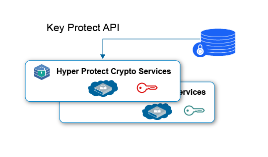
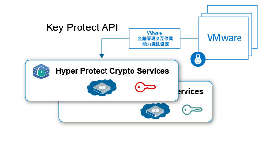

---

copyright:
  years: 2018, 2019
lastupdated: "2019-01-15"

Keywords: Hyper Protect Crypto Services, Keep Your Own Keys, VMware

subcollection: hs-crypto

---

{:new_window: target="_blank"}
{:shortdesc: .shortdesc}
{:screen: .screen}
{:codeblock: .codeblock}
{:pre: .pre}

# {{site.data.keyword.hscrypto}} 使用案例
{: #use-cases}

這個頁面包括 {{site.data.keyword.hscrypto}} 目前所包含的使用案例。這些使用案例將在之後的版本中不斷演進。
{:shortdesc}

## 使用自管金鑰 (KYOK) 進行靜態資料加密
{: #data-at-rest-encryption}

您可以使用 {{site.data.keyword.hscrypto}}，利用自己的金鑰以最高的安全層次將靜態資料加密。{{site.data.keyword.hscrypto}} 提供金鑰管理功能，可使用 {{site.data.keyword.keymanagementservicefull_notm}} API 來產生及管理金鑰。

以下是使用 {{site.data.keyword.hscrypto}} 來保護靜態資料的一些重點：

 * {{site.data.keyword.hscrypto}} 可針對雲端資料及儲存空間服務啟用靜態資料加密。
 * {{site.data.keyword.hscrypto}} 支援「自管金鑰 (KYOK)」，讓您能夠利用可帶來、控制及管理的加密金鑰，進一步加強對資料的控制和權限。
 * {{site.data.keyword.keymanagementservicefull_notm}} API 會整合以用於產生及保護金鑰。
 * 您的金鑰是以最高的安全層次（即 FIPS 140-2 Level 4 認證技術）進行保護。
 * 金鑰是由客戶管理的專用 HSM 進行保護，這表示只有您才能存取您的資料。

*圖 1. 使用 KYOK 進行靜態資料加密*

## 使用自管金鑰 (KYOK) 進行 VMware 映像檔保護
{: #vmware-image-protection}

與靜態資料保護類似，{{site.data.keyword.hscrypto}} 也可以透過「VMware 金鑰管理交互作業能力通訊協定」來保護要加密及解密的靜態 VMware 映像檔。

{{site.data.keyword.hscrypto}} 作為單一承租戶服務，其可為每個客戶的 Hardware Security Module for VMware 映像檔提供專用控制。{{site.data.keyword.hscrypto}} 會將 {{site.data.keyword.cloud_notm}} 中的金鑰管理服務系列擴展到具有硬體機密控制的單一承租戶實例。

*圖 2. 使用 KYOK 進行 VMware 映像檔保護*
