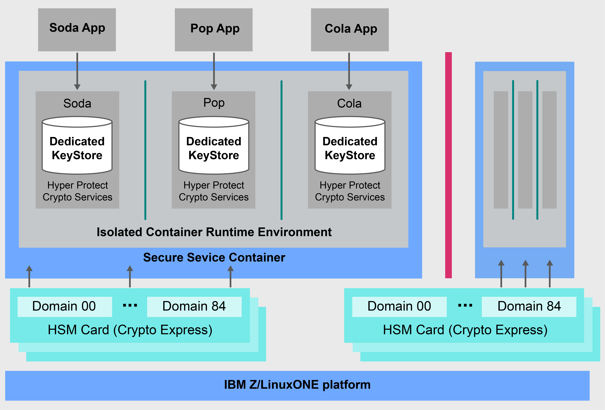

---

copyright:
  years: 2018, 2019
lastupdated: "2019-01-16"

---

{:new_window: target="_blank"}
{:shortdesc: .shortdesc}
{:screen: .screen}
{:codeblock: .codeblock}
{:pre: .pre}

# {{site.data.keyword.cloud_notm}} {{site.data.keyword.hscrypto}} overview

<!-- ***Disclaimer: {{site.data.keyword.cloud}} {{site.data.keyword.hscrypto}} is in the BETA phase and is for tryout and test purpose only. To prevent data loss, use only test data in the current service. This restriction also applies to using {{site.data.keyword.hscrypto}} with other  {{site.data.keyword.cloud_notm}} services. *** -->

Data and information security is crucial and essential for IT environments. As more and more data moves to the cloud, keeping data protected becomes a non-trivial challenge.  {{site.data.keyword.cloud}} {{site.data.keyword.hscrypto}} offers cryptography with technology that has attained industry's highest security level to protect your data.
{: shortdesc}

## Why {{site.data.keyword.cloud_notm}} {{site.data.keyword.hscrypto}}?

{{site.data.keyword.hscrypto}} brings the security and integrity of IBM Z to the cloud. The same state-of-the-art cryptographic technology that banks and financial services rely on is now offered to cloud users via {{site.data.keyword.cloud_notm}}. <!-- With {{site.data.keyword.hscrypto}}, you can protect your data at rest, in use, and in transit.--> {{site.data.keyword.hscrypto}} also integrates with {{site.data.keyword.keymanagementservicefull_notm}} APIs to protect your keys in a hyper protected environment on IBM Z.

Behind the cloud, {{site.data.keyword.hscrypto}} offers cloud hardware security modules (HSMs) to provide cryptography.<!-- via PKCS#11 application programming interfaces (APIs). You can access {{site.data.keyword.hscrypto}} with several popular programming languages such as Java, JavaScript, and Swift. -->

{{site.data.keyword.hscrypto}} is the cryptography that {{site.data.keyword.blockchainfull_notm}} Platform is built with. This cryptography mechanism ensures that the blockchain network is running in a highly protected and isolated environment, and accelerates hashing, sign/verify operations, and node-to-node communications in the network. The success of {{site.data.keyword.blockchainfull_notm}} Platform proves the capability and value of {{site.data.keyword.hscrypto}}

## How does {{site.data.keyword.hscrypto}} work?

The following architectural diagram shows how {{site.data.keyword.hscrypto}} works.

*Figure 1. {{site.data.keyword.hscrypto}} architecture*  

Below are a few highlights of the {{site.data.keyword.hscrypto}} architecture:

<!-- * Applications connect to {{site.data.keyword.hscrypto}} through PKCS#11 APIs. -->

- Dedicated KeyStore in {{site.data.keyword.hscrypto}} is provided to ensure data isolation and security. Privileged users are locked out for protection against abusive use of system administrator or root user credentials.  
- Secure Service Container (SSC) provides the enterprise-level of security and impregnability that enterprise customers have come to expect from IBM Z technology.  
- FIPS 140-2 Level 4 compliant cloud HSM is enabled for highest physical protection of secrets.  

## Key features  

The following are the key features of {{site.data.keyword.hscrypto}}:

**{{site.data.keyword.cloud_notm}} data services protection using encryption keys with customer-controlled cloud HSMs**  
{{site.data.keyword.hscrypto}} supports Keep Your Own Keys (KYOK) so that you have more control and authority over your data with encryption keys that you can keep, control, and manage. The available support for customer-controlled cloud hardware security modules (HSM) allows for digital keys to be protected in accordance with industry regulations in {{site.data.keyword.cloud_notm}} and to be access only by the customer.<!-- The HSM provides PKCS#11 APIs, which makes {{site.data.keyword.hscrypto}} accessible by several popular programming languages such as Java, JavaScript, and Swift.-->

**FIPS 140-2 Level 4 certified technology provided**  
{{site.data.keyword.hscrypto}} provides access to the FIPS 140-2 Level 4 certified technology, highest level attainable of security for cryptographic hardware. <!-- Industries, such as financial sector services, require this level of security to protect their data.--> At this security level, the physical security mechanisms provide a complete envelope of protection around the cryptographic module with the intent of detecting and responding to all unauthorized attempts at physical access.

**No privileged user access to your keys and data**  
{{site.data.keyword.hscrypto}} brings the unique capabilities of data protection from IBM Z to {{site.data.keyword.cloud_notm}}. {{site.data.keyword.hscrypto}} protects your data in SSC that provides the enterprise-level of security and impregnability that enterprise customers have come to expect from IBM Z technology. Hardware virtualisation is used to protect your data in an isolated environment. In this way, dedicated service per crypto instance is provided, so no external access is allowed, including privileged users such as cloud administrators, to your data. Thus, data compromise risk against insider threats is reduced.

**{{site.data.keyword.keymanagementservicefull_notm}} integration to secure {{site.data.keyword.cloud_notm}} data and storage services**  
{{site.data.keyword.keymanagementservicefull_notm}} APIs is integrated into {{site.data.keyword.hscrypto}} to generate and protect keys. {{site.data.keyword.hscrypto}} protects these keys and stores them in a highly protected and isolated environment on IBM Z, which protects your data with technology that is certified at industry's highest security level.

<!-- {{site.data.keyword.hscrypto}} also leverages the **IBM Advanced Crypto Service Provider (ACSP)** solution that enables remote access to the IBM’s cryptographic coprocessors. ACSP allows for utilization of strong hardware-based cryptography as a service in distributed environments where data security cannot be guaranteed. {{site.data.keyword.hscrypto}} utilizes ACSP as a *network hardware security module (NetHSM)* that provides access to HSM via PKCS#11 standard APIs.-->

<!-- With {{site.data.keyword.hscrypto}}, your **SSL keys are offloaded** to a {{site.data.keyword.hscrypto}} to ensure security and protection of those sensitive keys.  Besides, the certificate lifecycle management gets common approach to manage certtificates and offers the visibility to certificate expiration.-->

## Roles and responsibilities

The following table shows the roles that {{site.data.keyword.hscrypto}} supports.

<table>
  <tr>
    <th>Roles</th>
    <th>Responsibilities</th>
  </tr>
  <tr>
    <td>HSM (domain) administrator</td>
    <td>
      Signs administrative commands such as for installing another domain administrator, and provides signature keys.
    </td>
  </tr>
  <tr>
    <td>Key owner</td>
    <td>Provides master key parts for initializing a crypto instance.</td>
  </tr>
  <tr>
    <td>Service user</td>
    <td>Stores, retrieves, and generates root keys and standard keys through user interface and APIs.</td>
  </tr>
  <caption style="caption-side:bottom;">Table 1. Roles and responsibilities</caption>
</table>
