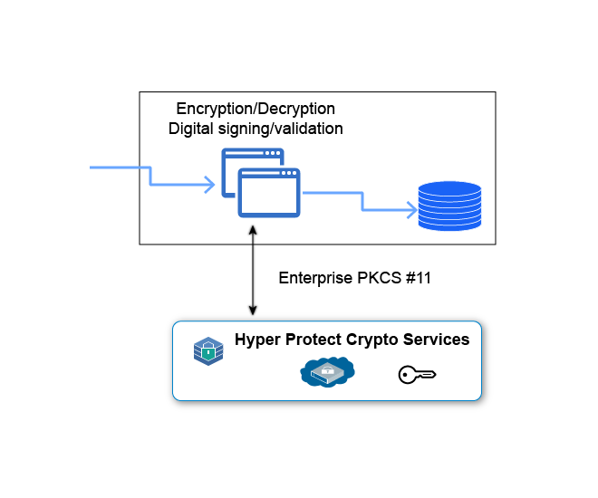

---

copyright:
  years: 2018
lastupdated: "2018-11-11"

---

{:new_window: target="_blank"}
{:shortdesc: .shortdesc}
{:screen: .screen}
{:codeblock: .codeblock}
{:pre: .pre}

# Exploiting PKCS#11
{: #pkcs11}

***Need to verrify whether the section included is needed.***

{{site.data.keyword.hscrypto}} offers network addressable hardware security modules (HSMs) and is accessible via PKCS#11 application programming interfaces (APIs) with several popular programming languages such as Java, JavaScript, and Swift. The provided API is [PKCS#11 ](http://docs.oasis-open.org/pkcs11/pkcs11-base/v2.40/os/pkcs11-base-v2.40-os.html){:new_window}.
{:shortdesc}

Applications that support PKCS#11, like openssl, can be used directly with the installed ACSP dynamic library.

End-users can use tools around pkcs11 (like ```pkcs11-tool```) to do key management, crypto operations, and keystore management.

The following diagram shows how {{site.data.keyword.hscrypto}} works with PKCS#11 APIs to secure applications.


*Figure 1. {{site.data.keyword.hscrypto}} interfaces for application driven security*

The following sections explains some PKCS11 terminology.

## Slots, Tokens, PINs
When creating an instance of **{{site.data.keyword.hscrypto}}** the keystore that
is provided can be further separated into logical spaces, called *slots* in
PKCS11 terminology. For the available Lite Plan there are 10 slots you can make
use of. You can use the slots to separate different applications or departments.

A *token* is a logical representation of a crypto device, belonging to one slot.
In PKCS11, a token must be present in the slot. That is, the slot must
be initialized before usage. When the service instance is created, the slots are
already initialized.

For access to any private key the user must use a user PIN, which is unique per
slot.
To get the service exploited quickly for testing purposes, in this stage, there is a default
user PIN setup already: `98765432`

<!-- It is highly recommended to change the default PKCS11 user PIN for each used slot. For more information, see [Changing User PIN and SO PIN](/docs/services/hs-crypto/change_PIN.html).-->
