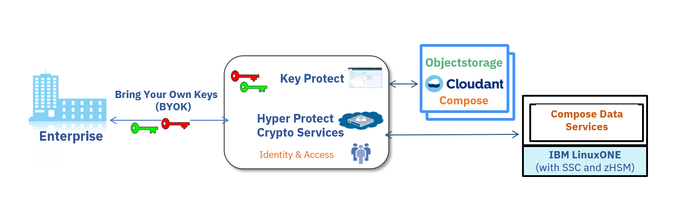
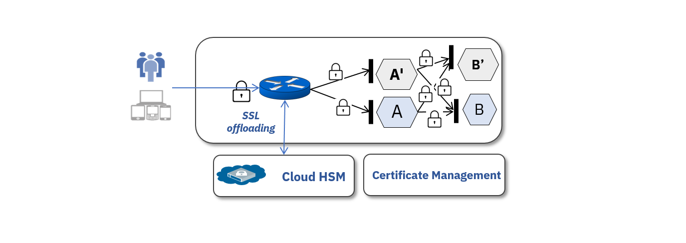

---

copyright:
  years: 2018
lastupdated: "2018-10-30"

---

{:new_window: target="_blank"}
{:shortdesc: .shortdesc}
{:screen: .screen}
{:codeblock: .codeblock}
{:pre: .pre}

# Protecting data

<!-- **Disclaimer: At the current stage, {{site.data.keyword.hscrypto}} provides only self-signed certificates.**-->

You can use {{site.data.keyword.hscrypto}} to protect your data at rest, in use, or in transition.
{:shortdesc}

## Protecting data at rest and in use

No matter you store your data in your own data center or in {{site.data.keyword.cloud_notm}} storage, you can use {{site.data.keyword.hscrypto}} to encrypt your data at the highest security level.

{{site.data.keyword.hscrypto}} binds the [{{site.data.keyword.keymanagementservicefull_notm}} ](https://console.bluemix.net/docs/services/keymgmt/keyprotect_about.html){:new_window} service, which can generate and manage your keys. {{site.data.keyword.hscrypto}} protects these keys and stores them in a highly protected and isolated environment on IBM Z, which protects your data with technology that is certified at industry's highest security level.

If you store your data in cloud consuming Database-as-a-Service (DBaaS), your data is protected even when it is in use. [{{site.data.keyword.cloud_notm}} Hyper Protect DBaaS ](https://console.bluemix.net/docs/services/keymgmt/keyprotect_about.html){:new_window} leverages HSM and the SSC technology on IBM Z to provide high security and data protection. Data is protected in an isolated LPAR with no external access including privileged users.

*Figure 1. Protecting data at rest and in use*

## Protecting data in transit

{{site.data.keyword.hscrypto}} protects sensitive transactions to ensure security of data while in transit.

Customers can terminate TLS connections for their applications at the front door. {{site.data.keyword.hscrypto}} also protects all communications between micro services inside a container cluster. You can enable this function through policies.

{{site.data.keyword.hscrypto}} offloads SSL/TLS keys to a Hardware Security Module (HSM) in cloud and protects those sensitive keys. {{site.data.keyword.hscrypto}} manages certificate lifecycle from start to end and ensures the visibility to certificate expiration.

*Figure 2. Protecting data in transit*
