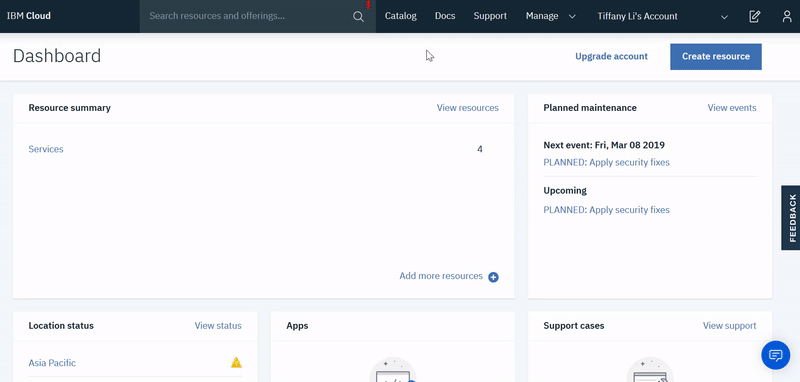

---

copyright:
  years: 2018, 2019
lastupdated: "2019-05-16"

Keywords: provision, instance of Hyper Protect Crypto Services

subcollection: hs-crypto

---

{:shortdesc: .shortdesc}
{:codeblock: .codeblock}
{:screen: .screen}
{:new_window: target="_blank"}
{:pre: .pre}
{:tip: .tip}
{:important: .important}
{:gif: data-image-type='gif'}

# Provisioning the service
{: #provision}

You can create an instance of {{site.data.keyword.cloud_notm}} {{site.data.keyword.hscrypto}} by using the {{site.data.keyword.cloud_notm}} console or the {{site.data.keyword.cloud_notm}} CLI.
{: shortdesc}

## Provisioning from the {{site.data.keyword.cloud_notm}} console
{: #provision-gui}

To provision an instance of {{site.data.keyword.hscrypto}} from the {{site.data.keyword.cloud_notm}} console, complete the following steps:

1. [Log in to your {{site.data.keyword.cloud_notm}} account ](https://cloud.ibm.com/){: new_window}.
2. Click **Catalog** to view the list of services that are available on {{site.data.keyword.cloud_notm}}.
3. From the All Categories navigation pane, click the **Security and Identity** category.
4. From the list of services, click the **{{site.data.keyword.hscrypto}}** tile.
5. **Optional**: In the **Tags** field, add tags to organize your resources. If your tags are billing related, consider writing tags as key:value pairs to help group related tags, such as `costctr:124`. For more information on tags, see [Working with tags](/docs/resources?topic=resources-tag#tag).
6. Under **Number of crypto units**, select the number of  crypto units that meets your performance needs.

  In a production environment, it is recommended to select at least two crypto units to enable high availability. If you select three or more crypto units, these crypto units are distributed among three supported availability zones in the selected region.
  {: important}
7. Click **Create** to provision an instance of {{site.data.keyword.hscrypto}} in the account, region, and resource group where you are logged in.


{: gif}

*Figure 1. Provisioning the service*

<!-- ## Provisioning from the {{site.data.keyword.cloud_notm}} CLI
{: #provision-cli}

To provision an instance of {{site.data.keyword.hscrypto}} using the {{site.data.keyword.cloud_notm}} CLI, complete the following steps:

1. Download and install the [{{site.data.keyword.cloud_notm}} CLI](/docs/cli/index.html#overview){: new_window} with the following command:

    ```sh
    curl -sl https://ibm.biz/idt-installer | bash
    ```
    {: pre}

    **Notes:** For more information about the {{site.data.keyword.cloud_notm}} CLI, see [Getting started with the {{site.data.keyword.cloud_notm}} CLI](/docs/cli/index.html#overview){: new_window}.

2. Log in to {{site.data.keyword.cloud_notm}} through the {{site.data.keyword.cloud_notm}} CLI with the following command:

    ```sh
    ibmcloud login
    ```
    {: pre}

    **Notes:** If the login fails, run the `ibmcloud login --sso` command to try again. The `--sso` parameter is required when you log in with a federated ID. If this option is used, go to the link listed in the CLI output to generate a one-time passcode. -->

<!-- ### Creating a service instance within your account
{: #provision-acct-lvl}

To simplify access to your encryption keys with [{{site.data.keyword.iamlong}} roles](/docs/iam/users_roles.html#iamusermanrol), you can create one or more instances of the {{site.data.keyword.hscrypto}} service within an account, without needing to specify an org and space.

1. Log in to {{site.data.keyword.cloud_notm}} through the [{{site.data.keyword.cloud_notm}} CLI](/docs/cli/index.html#overview){: new_window}.

    ```sh
    ibmcloud login
    ```
    {: pre}
    **Notes:** If the login fails, run the `ibmcloud login --sso` command to try again. The `--sso` parameter is required when you log in with a federated ID. If this option is used, go to the link listed in the CLI output to generate a one-time passcode.

2. Select the account, region, and resource group where you would like to create a {{site.data.keyword.hscrypto}} service instance.

    You can use the following command to set your target region and resource group.

    ```sh
    ibmcloud target -r <region_name> -g <resource_group_name>
    ```
    {: pre}

3. Provision an instance of {{site.data.keyword.hscrypto}} within that account and resource group.

    ```sh
    ibmcloud resource service-instance-create <instance_name> kms tiered-pricing
    ```
    {: pre}

    Replace `<instance_name>` with a unique alias for your service instance.

4. Optional: Verify that the service instance was created successfully.

    ```sh
    ibmcloud resource service-instances
    ```
    {: pre}

### Creating a service instance within an org and space
{: #provision-space-lvl}

To manage access to your encryption keys with [Cloud Foundry roles](/docs/iam/cfaccess.html), you can create an instance of the {{site.data.keyword.hscrypto}} service within a specified organization and space.  

1. Log in to {{site.data.keyword.cloud_notm}} through the [{{site.data.keyword.cloud_notm}} CLI](/docs/cli/index.html#overview){: new_window}.

    ```sh
    ibmcloud login
    ```
    {: pre}
    **Note:** If the login fails, run the `ibmcloud login --sso` command to try again. The `--sso` parameter is required when you log in with a federated ID. If this option is used, go to the link listed in the CLI output to generate a one-time passcode.

2. Select the account, region, organization, and space where you would like to create a {{site.data.keyword.hscrypto}} service instance.

    You can use the following command to set your target region, org, and space.

    ```sh
    ibmcloud target -r <region> -o <organization_name> -s <space_name>
    ```
    {: pre}

3. Provision an instance of {{site.data.keyword.hscrypto}} within that account, region, organization, and space.

    ```sh
    ibmcloud service create kms tiered-pricing <instance_name>
    ```
    {: pre}

    Replace `<instance_name>` with a unique alias for your service instance.

4. Optional: Verify that the service instance was created successfully.

    ```sh
    ibmcloud service list
    ```
    {: pre}
-->

### What's next
{: #provision-next}

Find out more about programmatically managing your keys, [check out the {{site.data.keyword.hscrypto}} API reference doc ](https://{DomainName}/apidocs/hs-crypto){: new_window}.
