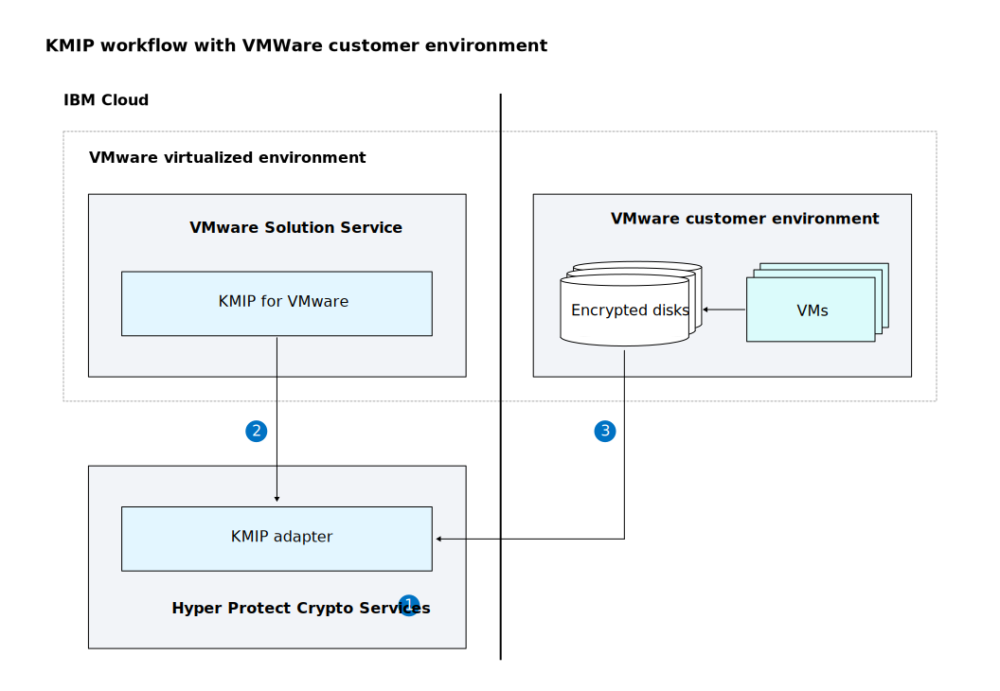

---

copyright:
  years:  2021, 2022
lastupdated: "2022-03-22"

keywords: VMWare encryption, KMIP, Key management and distribution, Data appliance encryption, Netapp, vSphere, vSAN encryption

subcollection: hs-crypto

content-type: tutorial
services: hs-crypto
account-plan: paid
completion-time: 2h

---

{:shortdesc: .shortdesc}
{:screen: .screen}
{:pre: .pre}
{:table: .aria-labeledby="caption"}
{:external: target="_blank" .external}
{:codeblock: .codeblock}
{:tip: .tip}
{:note: .note}
{:important: .important}
{:step: data-tutorial-type='step'}
{:video: .video}

# Tutorial: Configuring KMIP in {{site.data.keyword.hscrypto}} for key management and distribution
{: #tutorial-kmip-vmware}
{: toc-content-type="tutorial"}
{: toc-services="hs-crypto"}
{: toc-completion-time="2h"}

Key Management Interoperability Protocol (KMIP) is a communication protocol for the storage and maintenance of key, certificate, and secret objects. The standard is governed by the Organization for the Advancement of Structured Information Standards (OASIS). {{site.data.keyword.hscrypto}} provides a dedicated single-tenant KMIP adapter so that VMware vCenter server instances can use {{site.data.keyword.hscrypto}} as the Key Management Service (KMS) for VMware vSphere encryption and vSAN encryption.
{: shortdesc}

The following diagram illustrates the overall workflow of how the KMIP adapter that is provided in the {{site.data.keyword.hscrypto}} instance works with a VMWare customer environment.

{: caption="Figure 1. KMIP workflow with VMWare customer environment" caption-side="bottom"}

The overall workflow includes the following steps:
1. Create a {{site.data.keyword.hscrypto}} service instance and your root key.
2. Configure the VMWare Solution Service **KMIP for VMWare** with the {{site.data.keyword.hscrypto}} service instance. The **KMIP for VMware** service manages the lifecycle of the KMIP adapter and KMIP client certificates.
3. Connect your VMware vCenter server to KMIP and enable vSphere encryption or vSAN encryption.

## Objectives
{: #tutorial-kmip-objectives}

This tutorial shows how you can configure KMIP with VMWare solution in IBM Cloud.

## Before you begin
{: #tutorial-kmip-prerequisites}

To complete this tutorial, you need to meet the following prerequisites:

- [Sign up an {{site.data.keyword.cloud_notm}} account](/docs/vmwaresolutions?topic=vmwaresolutions-signing_required_accounts#signing_required_accounts-cloud).
- [Provision a {{site.data.keyword.hscrypto}} instance](/docs/hs-crypto?topic=hs-crypto-provision).
- [Initialize your {{site.data.keyword.hscrypto}} instance](/docs/hs-crypto?topic=hs-crypto-initialize-hsm#initialize-hsm).
- [Create your {{site.data.keyword.hscrypto}} root key](/docs/hs-crypto?topic=hs-crypto-get-started#manage-keys).
- [Order a KMIP for VMware® instance](/docs/vmwaresolutions?topic=vmwaresolutions-kmip_standalone_ordering).

## Task flow
{: #tutorial-kmip-steps}

To complete this solution, we'll walk through the following steps:

1. [Grant the service-to-service authorization in IAM](#tutorial-kmip-s2s).
2. [Configure KMIP for VMWare with {{site.data.keyword.hscrypto}} instance](#tutorial-kmip-configure).
3. [Configure a trusted connection between the vCenter Server and KMIP adapter](#tutorial-kmip-verify).

Let's start with the service authorization process.

## Grant the service-to-service authorization in IAM
{: #tutorial-kmip-s2s}
{: step}

1. Click **Manage>Access(IAM)** on the menu after you log in to IBM Cloud.

2. Select **Authorizations** on the left navigation pane.

3. Click the **Create** button.

4. On the **Grant a service authorization** page, fill in the following information:

   * Under the **Source service** drop-down list, select **VMWare Solutions**, and then select the KMIP for VMWare service instance ID.
   * Under the **Target service** drop-down list, select **{{site.data.keyword.hscrypto}} services**, and then select the {{site.data.keyword.hscrypto}} instance ID.
   * In the **Platform access** pane, select the **Viewer** option.
   * In the **Service Access** pane, select the **VMWare KMIP Manager** option.

6. Click the **Authorize** button to complete the service to service authorization.

## Configure KMIP for VMWare with {{site.data.keyword.hscrypto}} instance
{: #tutorial-vmware-configure}
{: step}

1. In the **IBM Cloud for VMware Solutions** console, click **Resources** from the left navigation pane.

2. Scroll down to the **KMIP for VMware Instances** table, click the instance that you want to configure the {{site.data.keyword.hscrypto}} with. The status of the KMIP for VMware instance is *Inactive* because it is not configured yet.

3. Select **Getting started** from the left navigation pane on the next page.

4. Select the **Initialize service instance** option and **Hyper Protect** as the key management type.

    - Select the {{site.data.keyword.hscrypto}} instance ID that stores your root key and key encryption key. You can click the **Retrieve** button to get a list of {{site.data.keyword.hscrypto}} instances under your IBM Cloud account.
    
        Only IDs of {{site.data.keyword.hscrypto}} instances that contain at least one root key are to be listed. Make sure to [create a root key](/docs/hs-crypto?topic=hs-crypto-get-started#manage-keys) first.
        {: note}
    - Select the customer root key to wrap the key encryption key for your data encryption key. You can click the **Retrieve** button to get a list of root keys stored on the selected {{site.data.keyword.hscrypto}} instance.

5. Click **Configure** to complete the configuration. Optionally, you can add client certificates if you have an existing VMWare or vCenter environment that you like to reuse.

6. Click **Refresh** and ensure that the status of the KMIP for VMware instance is *Installed*.

7. Identify the KMIP server endpoints information for the next step. For example, `kmip.private.us-south.hs-crypto.cloud.ibm.com:10073`.

## Configure a trusted connection between the vCenter Server and KMIP adapter
{: #tutorial-kmip-verify}
{: step}

1. In your vSphere client console, complete the following steps:

    a. Add the KMS to your vCenter Server by using the KMIP server address and port information from the previous step during the configuration.

    b. Configure the appropriate trust method between the KMS instance and your vCenter Server, and download the generated certificate.

2. On the **KMIP for VMware instance** page, add the certificate from the vCenter Server.

3. Verify the connection status of the KMS for your vCenter server is **Connected**.

4. Optional: Create an encrypted virtual machine to check that the encryption key from the KMS is used.

In this tutorial, you learned how to configure VMWare with KMIP in {{site.data.keyword.hscrypto}}.

- Learn more about [KMIP](http://www.oasis-open.org/committees/tc_home.php?wg_abbrev=kmip){: external}.
- Learn more about [KMIP for VMWare service](/docs/vmwaresolutions?topic=vmwaresolutions-kmip_standalone_considerations)
- Learn more about [Using Encryption in Your vSphere Environment](https://docs.vmware.com/en/VMware-vSphere/7.0/com.vmware.vsphere.security.doc/GUID-A29066CD-8EF8-4A4E-9FC9-8628E05FC859.html){: external}.

## What's next
{: #tutorial-kmip-next}

The following demo video is for you to better understand the process.

{: video output="iframe" data-script="none" id="mediacenterplayer" frameborder="0" width="560" height="315" allowfullscreen webkitallowfullscreen mozAllowFullScreen}
