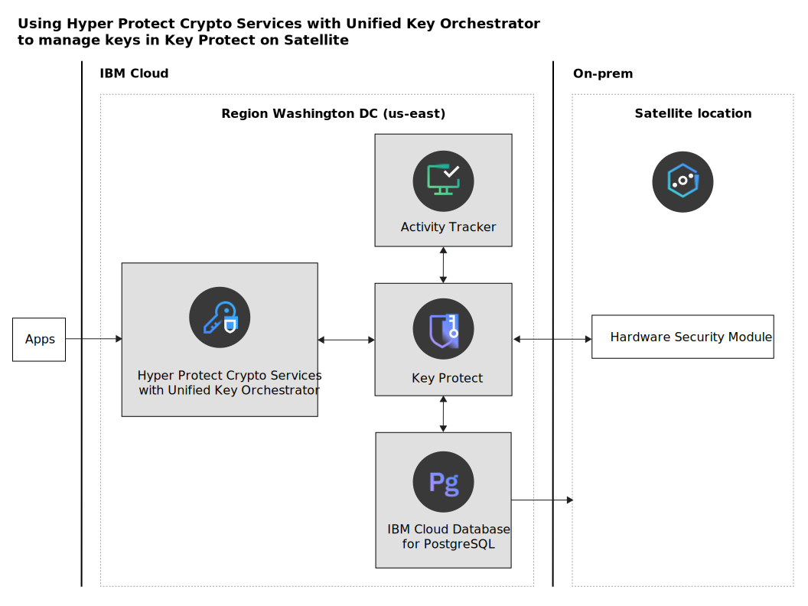

---

copyright:
  years: 2022
lastupdated: "2022-07-01"

keywords: key management with satellite, uko satellite, hpcs satellite, kp satellite

subcollection: hs-crypto

content-type: tutorial
services: hs-crypto
account-plan: paid
completion-time: 2h

---

{:shortdesc: .shortdesc}
{:screen: .screen}
{:pre: .pre}
{:table: .aria-labeledby="caption"}
{:external: target="_blank" .external}
{:codeblock: .codeblock}
{:tip: .tip}
{:note: .note}
{:important: .important}
{:step: data-tutorial-type='step'}

# Using {{site.data.keyword.hscrypto}} with {{site.data.keyword.uko_full_notm}} to manage keys in {{site.data.keyword.keymanagementserviceshort}} on Satellite
{: #tutorial-uko-satellite}
{: toc-content-type="tutorial"}
{: toc-services="hs-crypto"}
{: toc-completion-time="2h"}

[{{site.data.keyword.cloud_notm}} Satellite](/docs/satellite?topic=satellite-getting-started) provides you with flexibility and scalability to bring your own infrastructures to {{site.data.keyword.cloud_notm}}. You can run {{site.data.keyword.cloud_notm}} services anywhere including on your on-prem data centers and other cloud providers. With {{site.data.keyword.cloud_notm}} Satellite, you can connect your multiple environments to implement distributed cloud solutions to help your enterprise hybrid cloud transformation. {{site.data.keyword.keymanagementserviceshort}} on Satellite allows you to fully control your encryption keys by using your on-prem hardware security module (HSM). {{site.data.keyword.hscrypto}} with {{site.data.keyword.uko_full_notm}} enables you to manage keys in various key management systems, including {{site.data.keyword.keymanagementserviceshort}} on Satellite, from a single pane of glass.
{: shortdesc}

In this topic, references to {{site.data.keyword.uko_full_notm}} refer to {{site.data.keyword.hscrypto}} with {{site.data.keyword.uko_full_notm}} service.
{: note}

## Objectives
{: #tutorial-uko-satellite-objectives}

This tutorial shows how you can keep complete and exclusive control of your encryption keys by deploying {{site.data.keyword.keymanagementserviceshort}} in a Satellite location and how you can manage your distributed keys with a unified view by connecting {{site.data.keyword.uko_full_notm}} to {{site.data.keyword.keymanagementserviceshort}} on Satellite.

The following diagram illustrates the architecture:

{: caption="Figure 1. Unified Key Orchestrator connects to Key Protect on Satellite" caption-side="bottom"}

## Before you begin
{: #tutorial-uko-satellite-prerequisites}

To complete this tutorial, you need to meet the following prerequisites:

Currently, {{site.data.keyword.keymanagementserviceshort}} supports user-owned on-prem Satellite locations associated with the {{site.data.keyword.cloud_notm}} `us-east` region only. In this tutorial, to reduce network latency, we create other {{site.data.keyword.cloud_notm}} services needed also in the `us-east` region.
{: note}

- [Create an on-prem Satellite location](/docs/satellite?topic=satellite-locations) in `us-east`. 
- [Create an {{site.data.keyword.cloud_notm}} Database for PostgreSQL instance](/docs/cloud-databases?topic=cloud-databases-satellite-on-prem) in `us-east` and deploy it in your Satellite location.
- [Set up two on-prem HSMs](/docs/key-protect?topic=key-protect-satellite-hsm-deploy) to work with {{site.data.keyword.keymanagementserviceshort}} and gather the [information needed](/docs/key-protect?topic=key-protect-satellite-hsm-deploy#satellite-hsm-ui-values) for {{site.data.keyword.keymanagementserviceshort}} on Satellite.
- [Create an {{site.data.keyword.at_full_notm}} instance](/docs/key-protect?topic=key-protect-satellite-about#satellite-about-before-begin-activity) in `us-east` for activity logging. You also need to pass the ingestion key to {{site.data.keyword.keymanagementserviceshort}} during the deployment.
- [Create a {{site.data.keyword.hscrypto}} with {{site.data.keyword.uko_full_notm}} instance](/docs/hs-crypto?topic=hs-crypto-provision&interface=ui#provision-uko) in `us-east`.

## Task flow
{: #tutorial-uko-satellite-steps}

To complete this solution, let's walk through the following steps:

1. [Deploy {{site.data.keyword.keymanagementserviceshort}} on Satellite](#tutorial-uko-satellite-deploy-kp).
2. [Connect {{site.data.keyword.uko_full_notm}} to {{site.data.keyword.keymanagementserviceshort}} on Satellite](#tutorial-uko-satellite-connect-uko-kp).
3. [Manage {{site.data.keyword.keymanagementserviceshort}} keys through {{site.data.keyword.uko_full_notm}}](#tutorial-uko-satellite-manage-kp-keys).

Let's start with the deployment of {{site.data.keyword.keymanagementserviceshort}} on Satellite.

## Deploy {{site.data.keyword.keymanagementserviceshort}} on Satellite
{: #tutorial-uko-satellite-deploy-kp}
{: step}

### 1. Provision a {{site.data.keyword.keymanagementserviceshort}} instance
{: #tutorial-uko-satellite-provision-kp}

To deploy {{site.data.keyword.keymanagementserviceshort}} on Satellite, you must be added to the allowlist. [Contact IBM](https://www.ibm.com/contact/us/en/){: external} to learn more.
{: important}

To provision a {{site.data.keyword.keymanagementserviceshort}} instance, complete the following steps:

1. [Log in to your {{site.data.keyword.cloud_notm}} account](/login/){: external}.
2. Click **Catalog** in the menu to view the list of services that are available on {{site.data.keyword.cloud_notm}}.
3. Type **key protect** in the search box and click the **{{site.data.keyword.keymanagementserviceshort}}** tile.
4. In the **Select a location** section, select **Washington DC (us-east)**.
5. In the **Configure your resource** section:

    - Under **Service name**, enter your instance name that is relevant to the usage you plan for the service. For example, `{{site.data.keyword.keymanagementserviceshort}} - DB Encryption`.
    - Under **Select a resource group**, select the resource group where you want to organize and manage your service instance. You can select the initial resource group that is named `Default` or other groups that you create.
    - (Optional) Under **Tags**, add tags to organize your resources. For example, `project: tiger`.
    - (Optional) Under **Access management tags**, add tags to categorize resources by access policies. For example, `access: dev`.

6. Provide the information for the two HSMs that you have gathered in the [prerequisite step](#tutorial-uko-satellite-prerequisites).

    _Question: Where to input this information?_

7. Click **Create**. It may take more than an hour to complete the provision.

### 2. Connect your on-prem HSMs with {{site.data.keyword.keymanagementserviceshort}}
{: #tutorial-uko-satellite-connect-hsm-kp}

After you successfully create a {{site.data.keyword.keymanagementserviceshort}} instance, you need to create an NTLs (Network Trust Links) connection between your on-prem HSMs and {{site.data.keyword.keymanagementserviceshort}} to ensure secure communications.

1. Get the client certificate from {{site.data.keyword.keymanagementserviceshort}} by [opening a service ticket](/docs/get-support){: external} with {{site.data.keyword.keymanagementserviceshort}}.

    _Question: How to get the certificate?_

2. Register the client certificate with your HSMs.

    _Question: How to do it?_

3. Restart your Transport Layer Security (TLS) service with the following command:

    ```
    service restart ntls
    ```
    {: pre}

    _Question: How to set up the TLS service?_

## Connect {{site.data.keyword.uko_full_notm}} to {{site.data.keyword.keymanagementserviceshort}} on Satellite
{: #tutorial-uko-satellite-connect-uko-kp}
{: step}

After you deploy {{site.data.keyword.keymanagementserviceshort}} on Satellite, you can now connect {{site.data.keyword.uko_full_notm}} to {{site.data.keyword.keymanagementserviceshort}} to have a unified key management experience.

1. [Log in to the {{site.data.keyword.hscrypto}} instance](https://cloud.ibm.com/login){: external}.
2. Click **Target keystores** from the navigation and click **Add keystore**.
3. Under **Vault**, select a vault for the keystore for access control, and click **Next**. 

    If you want to assign the keystore to a new vault, click **Create vault**. For more instructions, see [Creating vaults](/docs/hs-crypto?topic=hs-crypto-create-vaults).

4. Under **Keystore type**, select **{{site.data.keyword.keymanagementserviceshort}}** and click **Next**.
5. Under **Keystore properties**, specify the details:

    |           Property	      |                         Description                       |
    |-----------------------------|-----------------------------------------------------------|
    | Keystore name               | A unique, human-readable name for easy identification of your keystore, with 1 - 100 characters in length. The first character must be a letter (case-sensitive) or digit (0-9). The rest can also be symbols (.-_) or spaces. For example, `kp-satellite-tiger` |
    | Description                 | (Optional) An extended description for your keystore, with up to 200 characters in length. For example, `KP on satellite for project Tiger DB encryption.` |
    | {{site.data.keyword.keymanagementserviceshort}} API endpoint  | The service endpoint of your {{site.data.keyword.keymanagementserviceshort}} on Satellite in the format of `https://<your-satellite-location>.kms.cloud.ibm.com`. For more information, see [Obtaining the {{site.data.keyword.keymanagementserviceshort}} endpoint](/docs/key-protect?topic=key-protect-satellite-about#satellite-about-before-begin-endpoint). |
    | {{site.data.keyword.cloud_notm}} Identity and Access Management endpoint  |  The endpoint of IAM, which is `https://iam.cloud.ibm.com`.  |
    | Service instance ID on {{site.data.keyword.cloud_notm}}   | The unique identifier that is assigned to your {{site.data.keyword.keymanagementserviceshort}} service instance. For more information, see [Retrieving your instance ID and cloud resource name](/docs/key-protect?topic=key-protect-retrieve-instance-ID).  |
    | Service ID API key          | A unique code that is passed to an API to identify the calling application. For more information, see [Managing service ID API keys](/docs/account?topic=account-serviceidapikeys). |
    {: caption="Table 1. Key store properties" caption-side="bottom"}

6. Optionally, click **Test connection** to test the connection to the external keystore that you configure. When completed, click **Next** to continue.

    **Test connection** is an optional step. You can complete the subsequent steps even if the test fails. To adjust the connection settings in case of a connection failure, check and adjust the connection properties.
    {: tip}

7. Under **Summary**, view the summary of your {{site.data.keyword.keymanagementserviceshort}} instance and the total estimated cost.
8. After you confirm the keystore details, click  **Connect to keystore** to connect to the keystore.

## Manage {{site.data.keyword.keymanagementserviceshort}} keys through {{site.data.keyword.uko_full_notm}}
{: #tutorial-uko-satellite-manage-kp-keys}
{: step}

Now you can use {{site.data.keyword.uko_full_notm}} to create and install keys for {{site.data.keyword.keymanagementserviceshort}} on Satellite to use. With the Keep Your Own Key (KYOK) feature, these keys are protected by master key within the FIPS 140-2 Level 4 HSM boundary and IBM cannot access your keys with technical assurance.

1. [Log in to the {{site.data.keyword.hscrypto}} instance](https://cloud.ibm.com/login){: external}.
2. Click **Managed keys** from the navigation and click **Create key**.
4. Under **Vault**, select a vault for the key for access control, and click **Next**. 
   
   If you want to assign the key to a new vault, click **Create vault**. For more instructions, see [Creating vaults](/docs/hs-crypto?topic=hs-crypto-create-vaults). 

5. Under **General**, select **IBM {{site.data.keyword.keymanagementserviceshort}}** and click **Next**.
6. Under **Key properties**, specify the following details of the key. Click **Next** to continue when you are done.

    |       Property	      |                         Description                       |
    |----------------------|-----------------------------------------------------------|
    | Key name             | A unique, human-readable name for easy identification of your key. For {{site.data.keyword.keymanagementserviceshort}} keys, it must be 2-50 characters in length. The characters can be letters (case-sensitive), digits (0-9), or spaces. For example, `kp satellite tiger key`. |
    | Description          | (Optional) An extended description for your key, with up to 200 characters in length. For example, `KP on satellite keys for project Tiger DB encryption`|
    | Algorithm            | The encryption algorithm to encrypt data for the key. For example, `AES`.   |
    | Length               | The number of bits that represents the encryption strength of the key. For example, `256`.  |
    | State                | _Pre-active_ keys are not to be installed in target keystores until you manually activate them. _Active_ keys are to be automatically installed in the target keystores. Select `Active` for installation to {{site.data.keyword.keymanagementserviceshort}} on Satellite.For more information about key states, see [Monitoring the lifecycle of encryption keys in {{site.data.keyword.uko_full_notm}}](/docs/hs-crypto?topic=hs-crypto-uko-key-states). |
    | Activation date      | Plan a date to activate the _Pre-active_ key. No automatic state change is triggered. For this tutorial, you don't need to specify this property as the `Active` state is selected previously. The key will be activated immediately upon its creation. |
    | Expiration date      | Plan a date to deactivate the key. No automatic state change is triggered. |
    | Key tags             | (Optional) Add pairs of names and values to identify your key. For example, `project: tiger`. |
    {: caption="Table 2. Key properties" caption-side="bottom"}

7. Under **Target keystores**, select the {{site.data.keyword.keymanagementserviceshort}} on Satellite keystore that you create in the previous step.
8. Under **Summary**, view the summary of your key, and then click **Create key** to confirm.

_Question: Is this step appropriate for this tutorial?_

## Next steps
{: #tutorial-uko-satellite-next-step}

Now your {{site.data.keyword.keymanagementserviceshort}} instance is running in an on-prem Satellite location where encryption keys are protected by your local HSMs. You have exclusive control of your keys and can orchestrate these keys across multiple clouds with {{site.data.keyword.uko_full_notm}}. 

- Learn more about {{site.data.keyword.uko_full_notm}}, see [Overview - {{site.data.keyword.hscrypto}} with {{site.data.keyword.uko_full_notm}}](/docs/hs-crypto?topic=hs-crypto-uko-overview).
- Learn more about {{site.data.keyword.uko_full_notm}} API, see [{{site.data.keyword.uko_full_notm}} API reference](/apidocs/uko){: external}.


