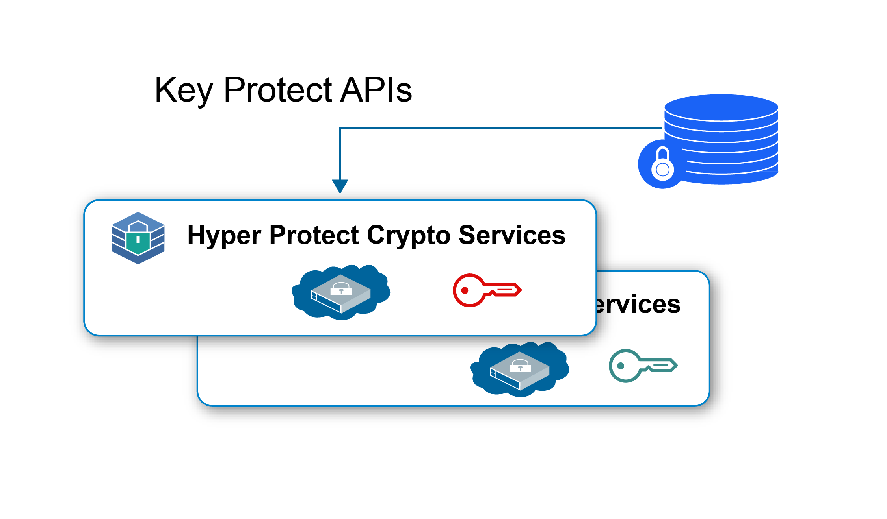
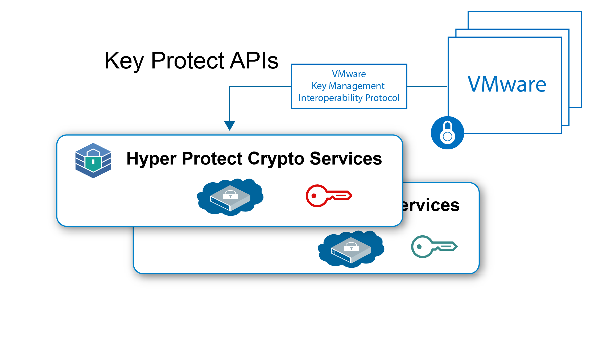

---

copyright:
  years: 2018, 2019
lastupdated: "2019-01-15"

---

{:new_window: target="_blank"}
{:shortdesc: .shortdesc}
{:screen: .screen}
{:codeblock: .codeblock}
{:pre: .pre}

# {{site.data.keyword.hscrypto}} use cases

This page includes the use cases that are currently included in {{site.data.keyword.hscrypto}}. These use cases will be continuously evolving in later releases.
{:shortdesc}

## Data at rest encryption with Keep Your Own Keys

You can use {{site.data.keyword.hscrypto}} to encrypt your data at rest in the highest security level with your own keys. {{site.data.keyword.hscrypto}} provides the key management capabilities to generate and manage your keys using {{site.data.keyword.keymanagementservicefull_notm}} APIs.

The following are a few highlights of using {{site.data.keyword.hscrypto}} to protect data at rest:

 * {{site.data.keyword.hscrypto}} enables data at rest encryption for cloud data and storage services.
 * {{site.data.keyword.hscrypto}} support Keep Your Own Keys (KYOK) so that you have more control and authority over your data with encryption keys that you can bring, control, and manage.
 * {{site.data.keyword.keymanagementservicefull_notm}} APIs are integrated for key generation and protection.
 * Your keys are protected in the highest security, the FIPS 140-2 Level 4 certified technology.
 * Keys are protected by customer-managed dedicated HSMs, which means, only you have access to your data.

*Figure 1. Data at rest encryption with KYOK*

## VMware image protection with Keep Your Own Keys

Similar to data at rest protection, {{site.data.keyword.hscrypto}} can also protect VMware image at rest for encryption and decryption through VMware Key Management Interoperability Protocol.

As a single-tenant service, {{site.data.keyword.hscrypto}} offers dedicated control of the Hardware Security Module for VMware images per customer. {{site.data.keyword.hscrypto}} extends the family of key management services in the {{site.data.keyword.cloud_notm}} towards single-tenant instances with dedicated hardware secret control.

*Figure 2. VMware image protection with KYOK*
